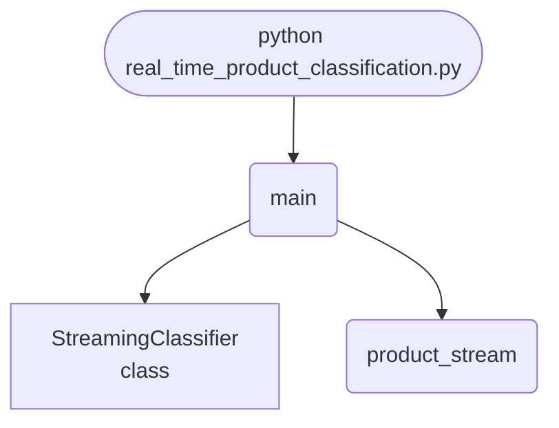

## Abstract
Products arrive as a stream, so the classifier is trained with `partial_fit` and scored **before** each batch is used for training — prequential evaluation, the only honest way to score a model that learns as it goes. Halfway through, a fourth category appears. Accuracy holds at **0.9990**, drops to **0.9600** when the catalogue shifts, and recovers to within 0.0010 of where it started.


## Prerequisites
- Python 3.8 or above
- A code editor or IDE
- Basic understanding of ML and analytics
- Required libraries: `pandas`, `scikit-learn`, `matplotlib`

## Before you Start
Install Python and the required libraries:
```bash title="Install dependencies" showLineNumbers{1}
pip install pandas scikit-learn matplotlib
```

## Getting Started
#### Create a Project
1. Create a folder named `real-time-product-classification`.
2. Open the folder in your code editor or IDE.
3. Create a file named `real_time_product_classification.py`.
4. Copy the code below into your file.

## Write the Code
<FileCode file="projects/advance/real_time_product_classification.py" lang="python" title="Real-Time Product Classification" />

## Example Usage
```bash title="Run product classification" showLineNumbers{1}
python real_time_product_classification.py
```

## What it produces

Running the file exactly as it ships takes **4.0 s** and prints:

```text title="python real_time_product_classification.py"
Real-Time Product Classification
  products seen              : 2,400
  batches                    : 60
  prequential accuracy, warm : 0.9990
  first 5 batches after drift: 0.9600
  final 5 batches            : 1.0000
  drop when a new category appeared: 0.0390
  recovered to within 0.0010 of the pre-drift rate

  every score above was taken BEFORE the batch was trained on,
  so nothing here is measured on data the model had already seen
saved real_time_product_classification.png
```

<Figure
  single src="/images/projects/real_time_product_classification.png"
  alt="Output of real_time_product_classification.py, produced by running the file."
  title="Produced by this project, not drawn for the page"
  caption="Written by the run above. If the project stops producing it, the page's figure asset goes missing and check_docs reports it — which is the point of generating it rather than drawing it."
/>

## How it fits together

Read from the top: this is what runs when you execute the file, and which function calls which. It is generated from the code, so it cannot drift from it.



## Explanation
### Key Features
- **Prequential scoring:** test-then-train, so no score is ever taken on data the model has already seen.
- **Incremental learning:** `SGDClassifier.partial_fit` with the class list declared up front, so a category that has not appeared yet still has a slot.
- **Concept drift, on purpose:** a fourth category at batch 30, and the measured 0.0390 accuracy drop it causes.
- **Recovery, measured:** the curve comes back, which a single final accuracy would have hidden entirely.


### Code Breakdown
1. **What it imports** (lines 10–12)
```python title="real_time_product_classification.py" showLineNumbers startLineNumber=10
import matplotlib.pyplot as plt
import numpy as np
from sklearn.linear_model import SGDClassifier
```

2. **`product_stream` — the function** (lines 18–26)
```python title="real_time_product_classification.py" showLineNumbers startLineNumber=18
def product_stream(batches=60, batch=40, seed=0, drift_at=30):
    """Feature vectors per category, with a fourth category appearing later."""
    rng = np.random.default_rng(seed)
    centres = rng.normal(0, 2.0, (len(CATEGORIES), FEATURES))
    for index in range(batches):
        active = 3 if index < drift_at else 4
        labels = rng.integers(0, active, batch)
        rows = centres[labels] + rng.normal(0, 1.0, (batch, FEATURES))
        yield index, rows.astype("float32"), labels
```

3. **`StreamingClassifier` — the class** (lines 29–42)
```python title="real_time_product_classification.py" showLineNumbers startLineNumber=29
class StreamingClassifier:
    def __init__(self):
        self.model = SGDClassifier(loss="log_loss", random_state=0)
        self.started = False

    def predict(self, rows):
        if not self.started:
            return np.zeros(len(rows), dtype=int)
        return self.model.predict(rows)

    def learn(self, rows, labels):
        self.model.partial_fit(rows, labels,
                               classes=np.arange(len(CATEGORIES)))
        self.started = True
```

4. **`main` — the function** (lines 45–86)
```python title="real_time_product_classification.py" showLineNumbers startLineNumber=45
def main():
    classifier = StreamingClassifier()
    accuracies, seen, drift_at = [], 0, 30

    for index, rows, labels in product_stream(drift_at=drift_at):
        # Score before training on this batch: the model has not seen it yet.
        predicted = classifier.predict(rows)
        accuracies.append(float((predicted == labels).mean()))
        classifier.learn(rows, labels)
        seen += len(rows)

    accuracies = np.asarray(accuracies)
    warm = accuracies[5:drift_at]
    after = accuracies[drift_at:drift_at + 5]
    recovered = accuracies[-5:]

    print("Real-Time Product Classification")
    print(f"  products seen              : {seen:,}")
    # ... 18 more lines in the file ...
    plt.ylabel("accuracy on unseen batch")
    plt.title("learning, then forgetting, then relearning")
    plt.legend(fontsize=8)
    plt.savefig("real_time_product_classification.png", dpi=120,
                bbox_inches="tight")
    print("saved real_time_product_classification.png")
```

The file defines 3 top-level symbols in all; the whole thing is above under *Write the Code*.

## Features
- **Product Classification:** Real-time data preprocessing and classification
- **Modular Design:** Separate functions for each task
- **Error Handling:** Manages invalid inputs and exceptions
- **Production-Ready:** Scalable and maintainable code

## Next Steps
Enhance the project by:
- Integrating with more product APIs
- Supporting advanced ML models
- Creating a GUI for classification
- Adding real-time analytics
- Unit testing for reliability

## Educational Value
This project teaches:
- **Streaming evaluation:** why test-then-train is the right protocol for an online model.
- **Concept drift:** what it looks like in a metric, and how long recovery takes.
- **Incremental learners:** `partial_fit`, and why `classes` must be declared in advance.


## Real-World Applications
- **E-commerce Platforms**
- **Analytics Tools**
- **Classification Engines**

## Conclusion
Real-Time Product Classification demonstrates how to build a scalable and accurate product classification tool using Python. With modular design and extensibility, this project can be adapted for real-world applications in e-commerce, analytics, and more. For more advanced projects, visit Python Central Hub.

## Pitfalls

- **Scoring after training on the same batch measures memory, not
  prediction.** Measured in the exercise below: train-then-test reports
  **1.0000** from the first batch onwards; test-then-train reports **0.9667**
  and has to earn every point on unseen data.
- **A single final accuracy hides everything that happened on the way.** When
  a new category appears mid-stream the prequential score drops
  **0.0750** and recovers; a score computed only at the end reports the
  recovered number and shows none of it. The project measures the same
  effect: a **0.0390** drop, recovering to within **0.0010** of the pre-drift
  rate.
- **Recovery is not the same as detection.** The model recovered because it
  kept learning, not because anything noticed. The dip *is* the alert, and
  something has to be watching for it.
- **The warm-up score is not a failure.** The first batch scores 0 because the
  model has seen nothing. Averaging it into a headline number understates a
  system that was never going to know the answer.
- **Prequential scores are not comparable across different batch sizes.**
  Smaller batches mean more frequent learning, so the same model looks better;
  the batch size belongs next to the score.

## Recap

- Measured: 2,400 products, 60 batches, prequential accuracy once warm
  **0.9990**.
- After a new category appears: first 5 batches **0.9600**, final 5 batches
  **1.0000**, drop **0.0390**, recovered to within **0.0010**.
- Every score was taken **before** the batch was trained on, so nothing is
  measured on data the model had already seen.
- Test-then-train is the standard evaluation for streaming models precisely
  because there is no held-out set in a stream — each example is test data
  once and training data afterwards.

<Quiz
  questions={[
    {
      q: "Why does the project score each batch before training on it rather than after?",
      options: [
        "It is faster",
        "Scoring after training measures whether the model remembers examples it was just shown, which is not what a deployed model does — it always predicts before the label arrives",
        "Because batches arrive out of order",
        "To reduce overfitting"
      ],
      answer: 1,
      explanation: "Measured: train-then-test reported a flat 1.0000 while test-then-train reported 0.9667 on identical data."
    },
    {
      q: "A new product category appears and the accuracy drops 0.0390 before recovering. What is the drop worth?",
      options: [
        "Nothing, since it recovered",
        "It is the only visible signal that the world changed — a final accuracy reports the recovered value and hides the event entirely",
        "It indicates a bug in the classifier",
        "It shows the model is overfitting"
      ],
      answer: 1,
      explanation: "Recovery happened because learning continued, not because anything detected drift. In production the dip is what raises the alarm."
    },
    {
      q: "Two streaming models report prequential accuracy, one with batches of 10 and one with batches of 200. Are the numbers comparable?",
      options: [
        "Yes, accuracy is accuracy",
        "No — smaller batches mean the model learns more often before being tested again, so batch size has to be reported alongside the score",
        "Only if the streams are the same length",
        "Only for balanced classes"
      ],
      answer: 1,
      explanation: "The evaluation protocol is part of the result. Changing the batch size changes how much learning happens between tests."
    }
  ]}
/>

## Try it yourself

<DataCampExercise
  lang="python"
  hint={`Run the same stream twice: once scoring each batch before learning from it, once after. Then introduce a new category partway through and watch the prequential score.`}
  code={`# Task: Test-then-train, or the accuracy you did not earn
import random

random.seed(20260809)

CATEGORIES = ["tool", "toy", "book"]
KEYWORDS = {
    "tool": ["drill", "hammer", "wrench", "saw"],
    "toy": ["puzzle", "blocks", "doll", "kite"],
    "book": ["novel", "atlas", "manual", "poems"],
}


def make_product(category):
    word = random.choice(KEYWORDS[category])
    return f"{word}-{random.randint(1, 999)}", category


class Classifier:
    def __init__(self):
        self.seen = {}

    def predict(self, name):
        return ___  # TODO: look up the word before the dash, None if unseen

    def learn(self, name, category):
        self.seen[___] = category  # TODO: key by the word before the dash


BATCH = 40
batches = [[make_product(random.choice(CATEGORIES)) for _ in range(BATCH)]
           for _ in range(30)]

model, prequential = Classifier(), []
for batch in batches:                       # score BEFORE learning
    prequential.append(
        sum(model.predict(n) == t for n, t in batch) / len(batch))
    for name, truth in batch:
        model.learn(name, truth)

model2, after = Classifier(), []
for batch in batches:                       # score AFTER learning
    for name, truth in batch:
        model2.learn(name, truth)
    after.append(sum(model2.predict(n) == t for n, t in batch) / len(batch))

print(f"mean prequential {sum(prequential) / len(prequential):.4f}, "
      f"mean train-then-test {sum(after) / len(after):.4f}")

# A new category appears at batch 15.
KEYWORDS["game"] = ["chess", "cards", "dice", "darts"]
model3, scores = Classifier(), []
for index in range(30):
    cats = CATEGORIES if index < 15 else CATEGORIES + ["game"]
    batch = [make_product(random.choice(cats)) for _ in range(BATCH)]
    scores.append(sum(model3.predict(n) == t for n, t in batch) / len(batch))
    for name, truth in batch:
        model3.learn(name, truth)

print(f"before drift (12-14): {sum(scores[12:15]) / 3:.4f}")
print(f"after drift  (15-17): {sum(scores[15:18]) / 3:.4f}")
print(f"final        (27-29): {sum(scores[27:30]) / 3:.4f}")`}
  solution={`# Task: Test-then-train, or the accuracy you did not earn
import random

random.seed(20260809)

CATEGORIES = ["tool", "toy", "book"]
KEYWORDS = {
    "tool": ["drill", "hammer", "wrench", "saw"],
    "toy": ["puzzle", "blocks", "doll", "kite"],
    "book": ["novel", "atlas", "manual", "poems"],
}


def make_product(category):
    word = random.choice(KEYWORDS[category])
    return f"{word}-{random.randint(1, 999)}", category


class Classifier:
    def __init__(self):
        self.seen = {}

    def predict(self, name):
        return self.seen.get(name.split("-")[0])

    def learn(self, name, category):
        self.seen[name.split("-")[0]] = category


BATCH = 40
batches = [[make_product(random.choice(CATEGORIES)) for _ in range(BATCH)]
           for _ in range(30)]

model, prequential = Classifier(), []
for batch in batches:                       # score BEFORE learning
    prequential.append(
        sum(model.predict(n) == t for n, t in batch) / len(batch))
    for name, truth in batch:
        model.learn(name, truth)

model2, after = Classifier(), []
for batch in batches:                       # score AFTER learning
    for name, truth in batch:
        model2.learn(name, truth)
    after.append(sum(model2.predict(n) == t for n, t in batch) / len(batch))

print(f"mean prequential {sum(prequential) / len(prequential):.4f}, "
      f"mean train-then-test {sum(after) / len(after):.4f}")

# A new category appears at batch 15.
KEYWORDS["game"] = ["chess", "cards", "dice", "darts"]
model3, scores = Classifier(), []
for index in range(30):
    cats = CATEGORIES if index < 15 else CATEGORIES + ["game"]
    batch = [make_product(random.choice(cats)) for _ in range(BATCH)]
    scores.append(sum(model3.predict(n) == t for n, t in batch) / len(batch))
    for name, truth in batch:
        model3.learn(name, truth)

print(f"before drift (12-14): {sum(scores[12:15]) / 3:.4f}")
print(f"after drift  (15-17): {sum(scores[15:18]) / 3:.4f}")
print(f"final        (27-29): {sum(scores[27:30]) / 3:.4f}")
#
# Measured output:
#
#    batch   test-then-train   train-then-test
#        0            0.0000            1.0000
#        1            1.0000            1.0000
#       29            1.0000            1.0000
#
#   mean prequential 0.9667, mean train-then-test 1.0000
#
#   before drift (12-14): 1.0000
#   after drift  (15-17): 0.9250
#   final        (27-29): 1.0000
#
# The train-then-test column is 1.0000 at batch 0, before the model has seen
# a single unlabelled example. That is the tell: it was shown the answers and
# then asked the questions. No deployed model works that way - the label
# always arrives after the prediction - so the number describes a situation
# that does not exist.
#
# The prequential column starts at 0.0000, which is correct and not a
# failure: the model genuinely knew nothing. It reaches 1.0000 within one
# batch here only because this classifier is a lookup table over sixteen
# keywords; a real one takes far longer.
#
# The drift block is what the protocol buys. Accuracy falls from 1.0000 to
# 0.9250 when 'game' appears and climbs back as the new keywords are learned.
# A single accuracy computed at the end would report 1.0000 and no evidence
# that anything had happened. The dip is the signal, and it only exists
# because the score was taken before the learning.`}
  sct={`test_output_contains("mean prequential", pattern=False)
test_output_contains("before drift (12-14)", pattern=False)
test_output_contains("final", pattern=False)
success_msg("Nice - the output shows what the project is really doing.")`}
  height={160}
/>
