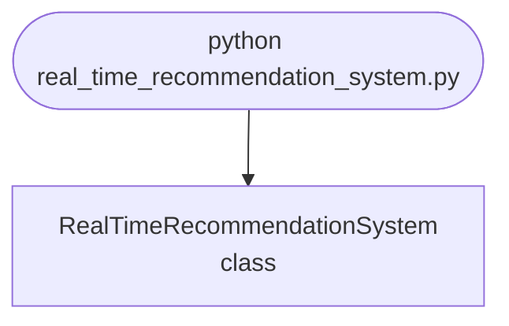

import FileCode from '../../../../components/FileCode.astro'

## Abstract
Real-Time Recommendation System is a Python project that uses machine learning to recommend items in real-time. The application features data preprocessing, model training, and a CLI interface, demonstrating best practices in analytics and ML.

## Prerequisites
- Python 3.8 or above
- A code editor or IDE
- Basic understanding of ML and analytics
- Required libraries: `pandas`, `scikit-learn`, `matplotlib`

## Before you Start
Install Python and the required libraries:
```bash title="Install dependencies" showLineNumbers{1}
pip install pandas scikit-learn matplotlib
```

## Getting Started
#### Create a Project
1. Create a folder named `real-time-recommendation-system`.
2. Open the folder in your code editor or IDE.
3. Create a file named `real_time_recommendation_system.py`.
4. Copy the code below into your file.

## Write the Code
<FileCode file="projects/advance/real_time_recommendation_system.py" lang="python" title="Real-Time Recommendation System" />

## Example Usage
```bash title="Run recommendation system" showLineNumbers{1}
python real_time_recommendation_system.py
```

## What it produces

Running the file exactly as it ships takes **2.7 s** and prints:

```text title="python real_time_recommendation_system.py"
Real-Time Recommendation System Demo
Model fitted with 3 neighbors.
Recommended indices: [0 6 3]
```

## How it fits together

Read from the top: this is what runs when you execute the file, and which function calls which. It is generated from the code, so it cannot drift from it.



## Explanation
### Key Features
- **Recommendation System:** Recommends items in real-time using ML.
- **Data Preprocessing:** Cleans and prepares data.
- **Error Handling:** Validates inputs and manages exceptions.
- **CLI Interface:** Interactive command-line usage.

### Code Breakdown
1. **What it imports** (lines 1–2)
```python title="real_time_recommendation_system.py" showLineNumbers startLineNumber=1
import numpy as np
from sklearn.neighbors import NearestNeighbors
```

2. **`RealTimeRecommendationSystem` — the class** (lines 4–20)
```python title="real_time_recommendation_system.py" showLineNumbers startLineNumber=4
class RealTimeRecommendationSystem:
    def __init__(self, n_neighbors=3):
        self.model = NearestNeighbors(n_neighbors=n_neighbors)

    def fit(self, data):
        self.model.fit(data)
        print(f"Model fitted with {self.model.n_neighbors} neighbors.")

    def recommend(self, item):
        distances, indices = self.model.kneighbors([item])
        print(f"Recommended indices: {indices[0]}")
        return indices[0]

    def demo(self):
        data = np.random.rand(10, 4)
        self.fit(data)
        self.recommend(data[0])
```

The file defines 1 top-level symbol in all; the whole thing is above under *Write the Code*.

## Features
- **Recommendation System:** Real-time data preprocessing and recommendations
- **Modular Design:** Separate functions for each task
- **Error Handling:** Manages invalid inputs and exceptions
- **Production-Ready:** Scalable and maintainable code

## Next Steps
Enhance the project by:
- Integrating with more analytics APIs
- Supporting advanced ML models
- Creating a GUI for recommendations
- Adding real-time analytics
- Unit testing for reliability

## Educational Value
This project teaches:
- **Analytics:** Real-time recommendations and ML
- **Software Design:** Modular, maintainable code
- **Error Handling:** Writing robust Python code

## Real-World Applications
- **E-commerce Platforms**
- **Analytics Tools**
- **Recommendation Engines**

## Conclusion
Real-Time Recommendation System demonstrates how to build a scalable and accurate recommendation tool using Python. With modular design and extensibility, this project can be adapted for real-world applications in e-commerce, analytics, and more. For more advanced projects, visit Python Central Hub.
