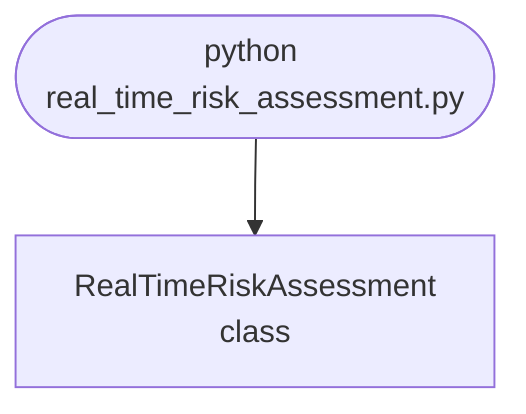

## Abstract
Real-Time Risk Assessment is a Python project that uses machine learning to assess risk in real-time. The application features data preprocessing, model training, and a CLI interface, demonstrating best practices in analytics and ML.

## Prerequisites
- Python 3.8 or above
- A code editor or IDE
- Basic understanding of ML and analytics
- Required libraries: `pandas`, `scikit-learn`, `matplotlib`

## Before you Start
Install Python and the required libraries:
```bash title="Install dependencies" showLineNumbers{1}
pip install pandas scikit-learn matplotlib
```

## Getting Started
#### Create a Project
1. Create a folder named `real-time-risk-assessment`.
2. Open the folder in your code editor or IDE.
3. Create a file named `real_time_risk_assessment.py`.
4. Copy the code below into your file.

## Write the Code
<FileCode file="projects/advance/real_time_risk_assessment.py" lang="python" title="Real-Time Risk Assessment" />

## Example Usage
```bash title="Run risk assessment" showLineNumbers{1}
python real_time_risk_assessment.py
```

## What it produces

Running the file exactly as it ships takes **2.8 s** and prints:

```text title="python real_time_risk_assessment.py"
Real-Time Risk Assessment Demo
Risk assessment model trained.
Predictions: [1 1 1 1 1 1 1 1 0 1 0 1 0 0 1 1 1 1 1 1]
```

## How it fits together

Read from the top: this is what runs when you execute the file, and which function calls which. It is generated from the code, so it cannot drift from it.



## Explanation
### Key Features
- **Risk Assessment:** Assesses risk in real-time using ML.
- **Data Preprocessing:** Cleans and prepares risk data.
- **Error Handling:** Validates inputs and manages exceptions.
- **CLI Interface:** Interactive command-line usage.

### Code Breakdown
1. **What it imports** (lines 1–3)
```python title="real_time_risk_assessment.py" showLineNumbers startLineNumber=1
import numpy as np
from sklearn.linear_model import LogisticRegression
from sklearn.model_selection import train_test_split
```

2. **`RealTimeRiskAssessment` — the class** (lines 5–22)
```python title="real_time_risk_assessment.py" showLineNumbers startLineNumber=5
class RealTimeRiskAssessment:
    def __init__(self):
        self.model = LogisticRegression()

    def train(self, X, y):
        self.model.fit(X, y)
        print("Risk assessment model trained.")

    def predict(self, X):
        return self.model.predict(X)

    def demo(self):
        X = np.random.rand(100, 6)
        y = np.random.randint(0, 2, 100)
        X_train, X_test, y_train, y_test = train_test_split(X, y, test_size=0.2)
        self.train(X_train, y_train)
        preds = self.predict(X_test)
        print(f"Predictions: {preds}")
```

The file defines 1 top-level symbol in all; the whole thing is above under *Write the Code*.

## Features
- **Risk Assessment:** Real-time data preprocessing and assessment
- **Modular Design:** Separate functions for each task
- **Error Handling:** Manages invalid inputs and exceptions
- **Production-Ready:** Scalable and maintainable code

## Next Steps
Enhance the project by:
- Integrating with more risk APIs
- Supporting advanced ML models
- Creating a GUI for assessment
- Adding real-time analytics
- Unit testing for reliability

## Educational Value
This project teaches:
- **Analytics:** Real-time risk assessment and ML
- **Software Design:** Modular, maintainable code
- **Error Handling:** Writing robust Python code

## Real-World Applications
- **Banking Platforms**
- **Analytics Tools**
- **Assessment Engines**

## Checkpoint exercise

This checkpoint practises scoring risks with a likelihood x impact matrix and banding them into levels.

<DataCampExercise
  lang="python"
  hint={`Score = likelihood * impact; the level thresholds are already in level().`}
  code={`risks = [("data breach", 3, 5), ("server outage", 4, 3), ("typo on site", 5, 1)]

def level(score):
    if score >= 15:
        return "HIGH"
    if score >= 8:
        return "MEDIUM"
    return "LOW"

for name, likelihood, impact in risks:
    score = ___
    print(f"{name}: {score} {level(score)}")

# -- Expected output (last line must match) --
# data breach: 15 HIGH
# server outage: 12 MEDIUM
# typo on site: 5 LOW`}
  solution={`risks = [("data breach", 3, 5), ("server outage", 4, 3), ("typo on site", 5, 1)]

def level(score):
    if score >= 15:
        return "HIGH"
    if score >= 8:
        return "MEDIUM"
    return "LOW"

for name, likelihood, impact in risks:
    score = likelihood * impact
    print(f"{name}: {score} {level(score)}")`}
  sct={`test_output_contains("typo on site: 5 LOW", pattern=False)
success_msg("Checkpoint complete: this is the core step of the project.")`}
  height={360}
/>

## Conclusion
Real-Time Risk Assessment demonstrates how to build a scalable and accurate risk assessment tool using Python. With modular design and extensibility, this project can be adapted for real-world applications in banking, analytics, and more. For more advanced projects, visit Python Central Hub.
