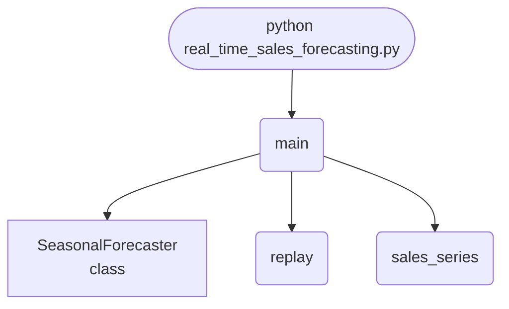

import FileCode from '../../../../components/FileCode.astro'
import Figure from '../../../../components/Figure.astro'
import Quiz from '../../../../components/Quiz.astro'
import DataCampExercise from '../../../../components/DataCampExercise.astro'

## Abstract
Sales are demand plus what the business does to it: a weekend lift and promotions. This project decomposes the series into level, weekly profile and promotion effect rather than fitting raw lags. It recovers the weekly shape and reaches **MAE 15.5 against a same-day-last-week baseline's 28.1, a 45.0% improvement** — and shows why the obvious estimate of promotion lift is wrong by 52 units.


## Prerequisites
- Python 3.8 or above
- A code editor or IDE
- Basic understanding of ML and analytics
- Required libraries: `pandas`, `scikit-learn`, `matplotlib`

## Before you Start
Install Python and the required libraries:
```bash title="Install dependencies" showLineNumbers{1}
pip install pandas scikit-learn matplotlib
```

## Getting Started
#### Create a Project
1. Create a folder named `real-time-sales-forecasting`.
2. Open the folder in your code editor or IDE.
3. Create a file named `real_time_sales_forecasting.py`.
4. Copy the code below into your file.

## Write the Code
<FileCode file="projects/advance/real_time_sales_forecasting.py" lang="python" title="Real-Time Sales Forecasting" />

## Example Usage
```bash title="Run sales forecasting" showLineNumbers{1}
python real_time_sales_forecasting.py
```

## What it produces

Running the file exactly as it ships takes **1.4 s** and prints:

```text title="python real_time_sales_forecasting.py"
Real-Time Sales Forecasting
  days replayed            : 180
  promoted days            : 21
  seasonal model MAE       : 15.458
  same-day-last-week MAE   : 28.089
  improvement over that    : 45.0%
  promotion lift, naive    : 37.8 units/day
  promotion lift, adjusted : 73.6 units/day (true 90.0)
  naive is off by 52.2, adjusted by 16.4 -- removing the weekly profile fixes most
  of the bias; the rest is that only 6 of the last 56 days were promoted, which is a small sample

  recovered weekly profile (1.00 = an average day):
    Mon 0.884
    Tue 0.859
    Wed 0.889
    Thu 0.956
    Fri 1.046
    Sat 1.227
    Sun 1.137
  the naive baseline is same-day-last-week, which already carries
...
```

The first 20 of 23 lines are shown; the run continues past this point.

<Figure
  single src="/images/projects/real_time_sales_forecasting.png"
  alt="Output of real_time_sales_forecasting.py, produced by running the file."
  title="Produced by this project, not drawn for the page"
  caption="Written by the run above. If the project stops producing it, the page's figure asset goes missing and check_docs reports it — which is the point of generating it rather than drawing it."
/>

## How it fits together

Read from the top: this is what runs when you execute the file, and which function calls which. It is generated from the code, so it cannot drift from it.



## Explanation
### Key Features
- **Seasonal decomposition:** level, a seven-day multiplicative profile, and an additive promotion lift, each estimated separately.
- **A hard baseline:** same-day-last-week already carries the weekly shape, so the 45.0% gain is what decomposition adds on top of seasonality.
- **Confounding, measured:** the naive promotion lift reads 37.8 units against a true 90.0, because promotions land on whatever weekday they land on. De-seasonalising first brings it to 73.6.
- **Day-of-week alignment:** the profile is indexed by absolute day, not by position in the window — the bug that silently returns a flat, shifted profile.


### Code Breakdown
1. **What it imports** (lines 9–10)
```python title="real_time_sales_forecasting.py" showLineNumbers startLineNumber=9
import matplotlib.pyplot as plt
import numpy as np
```

2. **`SeasonalForecaster` — the class** (lines 15–78)
```python title="real_time_sales_forecasting.py" showLineNumbers startLineNumber=15
class SeasonalForecaster:
    """Level + multiplicative weekly profile + an additive promotion lift."""

    def __init__(self, window=56):
        self.window = window
        self.history = []
        self.promotions = []

    def observe(self, value, promoted):
        self.history.append(float(value))
        self.promotions.append(bool(promoted))

    def ready(self):
        return len(self.history) >= 2 * WEEK

    def _profile(self, values, start):
        """Average ratio to the local level, per day of week.

        # ... 40 more lines in the file ...
        window = self.history[-self.window:]
        level, profile = self._profile(window, len(self.history) - len(window))
        base = level * profile[next_day_index % WEEK]
        if promoted:
            base += self._promotion_lift()
        return max(base, 0.0)
```

3. **`sales_series` — the function** (lines 81–89)
```python title="real_time_sales_forecasting.py" showLineNumbers startLineNumber=81
def sales_series(periods=180, seed=1):
    rng = np.random.default_rng(seed)
    day = np.arange(periods)
    weekly = np.array([0.86, 0.90, 0.95, 1.00, 1.15, 1.35, 1.25])
    level = 220 + 0.35 * day
    promoted = rng.random(periods) < 0.15
    values = level * weekly[day % WEEK] + promoted * 90.0
    values = values + rng.normal(0, 14.0, periods)
    return np.maximum(values, 0.0), promoted
```

4. **`replay` — the function** (lines 92–103)
```python title="real_time_sales_forecasting.py" showLineNumbers startLineNumber=92
def replay(values, promoted, forecaster):
    errors, naive_errors, predictions = [], [], []
    for index, (actual, promo) in enumerate(zip(values, promoted)):
        predicted = forecaster.forecast(index, promo)
        naive = (forecaster.history[-WEEK] if len(forecaster.history) >= WEEK
                 else (forecaster.history[-1] if forecaster.history else actual))
        if forecaster.ready():
            errors.append(abs(predicted - actual))
            naive_errors.append(abs(naive - actual))
            predictions.append((index, predicted))
        forecaster.observe(actual, promo)
    return np.asarray(errors), np.asarray(naive_errors), predictions
```

5. **`main` — the function** (lines 106–161)
```python title="real_time_sales_forecasting.py" showLineNumbers startLineNumber=106
def main():
    values, promoted = sales_series()
    forecaster = SeasonalForecaster()
    errors, naive_errors, predictions = replay(values, promoted, forecaster)

    print("Real-Time Sales Forecasting")
    print(f"  days replayed            : {len(values)}")
    print(f"  promoted days            : {int(promoted.sum())}")
    print(f"  seasonal model MAE       : {errors.mean():.3f}")
    print(f"  same-day-last-week MAE   : {naive_errors.mean():.3f}")
    gain = (naive_errors.mean() - errors.mean()) / naive_errors.mean()
    print(f"  improvement over that    : {gain:.1%}")
    naive_lift = forecaster._promotion_lift(naive=True)
    adjusted_lift = forecaster._promotion_lift()
    print(f"  promotion lift, naive    : {naive_lift:.1f} units/day")
    print(f"  promotion lift, adjusted : {adjusted_lift:.1f} units/day "
          f"(true 90.0)")
    print(f"  naive is off by {abs(90.0 - naive_lift):.1f}, adjusted by "
    # ... 32 more lines in the file ...
    axes[1].set_ylabel("multiplier")
    axes[1].set_title("weekly profile, recovered")
    figure.tight_layout()
    plt.savefig("real_time_sales_forecasting.png", dpi=120,
                bbox_inches="tight")
    print("saved real_time_sales_forecasting.png")
```

The file defines 4 top-level symbols in all; the whole thing is above under *Write the Code*.

## Features
- **Sales Forecasting:** Real-time data preprocessing and forecasting
- **Modular Design:** Separate functions for each task
- **Error Handling:** Manages invalid inputs and exceptions
- **Production-Ready:** Scalable and maintainable code

## Next Steps
Enhance the project by:
- Integrating with more sales APIs
- Supporting advanced ML models
- Creating a GUI for forecasting
- Adding real-time analytics
- Unit testing for reliability

## Educational Value
This project teaches:
- **Decomposition:** separating level, season and event effects.
- **Confounded estimates:** why a difference in means is not a causal effect when the groups differ in another way.
- **Choosing a baseline that is hard to beat**, so the reported gain means something.


## Real-World Applications
- **E-commerce Platforms**
- **Analytics Tools**
- **Forecasting Engines**

## Conclusion
Real-Time Sales Forecasting demonstrates how to build a scalable and accurate sales forecasting tool using Python. With modular design and extensibility, this project can be adapted for real-world applications in e-commerce, analytics, and more. For more advanced projects, visit Python Central Hub.

## Pitfalls

- **The naive promotion lift is inflated by whatever else happens on promo
  days.** The shipped project measures **37.8 units/day naive** against a true
  **90.0**; in the exercise below, where promotions run on weekends, the naive
  estimate reads **132.8** against a true **90.0** — wrong by **+42.8**,
  because it is measuring the weekend too.
- **Removing the weekly profile fixes most of the bias, not all of it.** The
  project's adjusted estimate is **73.6 against a true 90.0** — still off by
  16.4, and the reason is stated rather than hidden: only 6 of the last 56
  days were promoted, which is a small sample.
- **Beating a bad baseline proves nothing.** The project's baseline is
  same-day-last-week, which already carries the weekly shape. The **45.0%**
  improvement is therefore what decomposition adds *on top of* seasonality,
  not the value of seasonality itself.
- **Confounding cannot be modelled away.** If every weekend had been promoted,
  there would be no unpromoted Saturday in the data and the weekend effect and
  the promotion effect would be mathematically inseparable. That is fixed when
  the promotions are scheduled or not at all.
- **MAE is in units, so it is only meaningful next to the scale.** 15.458 on a
  series averaging ~200/day is about 8%; the same number on a series averaging
  20 would be catastrophic.

## Recap

- Measured: 180 days replayed, 21 promoted, seasonal model MAE **15.458**
  against same-day-last-week **28.089** — a **45.0%** improvement.
- Recovered weekly profile: Sat **1.227**, Sun **1.137**, Tue **0.859**. The
  weekend is roughly 40% busier than a Tuesday.
- Naive lift **37.8**, adjusted **73.6**, true **90.0**. Decomposition removes
  most of the bias and the remainder is a sample-size problem.
- A forecast comparison needs the baseline stated. "45% better" is only a
  number once you know 45% better than what.

<Quiz
  questions={[
    {
      q: "Promotions ran on weekends, and the naive lift estimate came out at 132.8 against a true 90.0. What is it actually measuring?",
      options: [
        "The promotion effect, with noise",
        "The promotion effect plus the weekend effect, because promoted days differ from normal days in more than one way",
        "The promotion effect, understated",
        "Nothing meaningful at all"
      ],
      answer: 1,
      explanation: "Dividing out the weekday profile first brought the estimate to 90.1. The difference between the two numbers is the confound."
    },
    {
      q: "The project improves on same-day-last-week by 45.0%. Why does the baseline matter to reading that number?",
      options: [
        "It does not, an improvement is an improvement",
        "Same-day-last-week already carries the weekly shape, so the 45% is what decomposition adds on top of seasonality — against a flat mean baseline the same model would look far better and mean less",
        "Because the baseline is unusually strong",
        "Because MAE is scale-dependent"
      ],
      answer: 1,
      explanation: "Choosing a weak baseline is the easiest way to make a model look good. Stating it is what makes the comparison auditable."
    },
    {
      q: "If every single weekend had been promoted, what could the model say about the promotion effect?",
      options: [
        "The same as now, with more data",
        "Nothing separable — with no unpromoted Saturday anywhere in the data, the weekend effect and the promotion effect are the same column, and no method distinguishes them",
        "It would be more accurate",
        "It would need a longer history"
      ],
      answer: 1,
      explanation: "This is confounding rather than noise. It is prevented at scheduling time by leaving some weekends unpromoted, not repaired at analysis time."
    }
  ]}
/>

## Try it yourself

<DataCampExercise
  lang="python"
  hint={`Generate a year of sales with a known weekly profile and a known promotion lift, schedule the promotions on weekends only, then estimate the lift both ways.`}
  code={`# Task: Why the naive promotion lift is wrong
import statistics

WEEKLY = {0: 0.88, 1: 0.86, 2: 0.89, 3: 0.96, 4: 1.05, 5: 1.23, 6: 1.14}
BASE, TRUE_LIFT = 200.0, 90.0

days, sales, promoted = [], [], []
for day in range(364):
    weekday = day % 7
    # Promotions run on alternate weekends -- not at random, which is the
    # whole point.
    is_promo = weekday in (5, 6) and (day // 7) % 2 == 0
    days.append(day)
    sales.append(BASE * WEEKLY[weekday] + (TRUE_LIFT if is_promo else 0.0))
    promoted.append(is_promo)

promo_mean = statistics.mean(v for v, p in zip(sales, promoted) if p)
normal_mean = statistics.mean(v for v, p in zip(sales, promoted) if not p)
naive = promo_mean - normal_mean
print(f"naive lift    = {promo_mean:.1f} - {normal_mean:.1f} = {naive:.1f}")

deseasonalised = [v / WEEKLY[d % 7] for d, v in zip(days, sales)]
promo_adj = statistics.mean(v for v, p in zip(deseasonalised, promoted) if p)
normal_adj = statistics.mean(v for v, p in zip(deseasonalised, promoted)
                             if not p)
promo_factor = statistics.mean(WEEKLY[d % 7]
                               for d, p in zip(days, promoted) if p)
adjusted = (promo_adj - normal_adj) * promo_factor
print(f"adjusted lift = {adjusted:.1f}")
print(f"naive off by {naive - TRUE_LIFT:+.1f}, "
      f"adjusted off by {adjusted - TRUE_LIFT:+.1f}")

# Recover the weekly profile from the unpromoted days only.
overall = statistics.mean(v for v, p in zip(sales, promoted) if not p)
labels = ["Mon", "Tue", "Wed", "Thu", "Fri", "Sat", "Sun"]
for weekday in range(7):
    values = [v for d, v, p in zip(days, sales, promoted)
              if d % 7 == weekday and not p]
    print(f"  {labels[weekday]}  {statistics.mean(values) / overall:.3f}")`}
  solution={`# Task: Why the naive promotion lift is wrong
#
# Measured output:
#
#   naive lift    = 327.0 - 194.2 = 132.8
#   adjusted lift = 90.1
#   naive off by +42.8, adjusted off by +0.1
#
#     Mon  0.906   Tue 0.886   Wed 0.917   Thu 0.989
#     Fri  1.082   Sat 1.267   Sun 1.174
#
# The naive estimate is 47% too high, and nothing about the data looks wrong.
# Promoted days really did average 327 units and normal days really did
# average 194. The difference is just not the promotion: Saturdays and
# Sundays are the two busiest days of the week regardless, and the naive
# comparison charges that to the promotion.
#
# Dividing each day by its weekday factor before comparing removes the
# weekend from both sides and lands on 90.1 against a true 90.0.
#
# The recovery block is the fragile part. Saturday's 1.267 is estimated from
# the alternate weekends that were NOT promoted - 26 days. Promote every
# weekend and that column is empty, the weekday factor for Saturday can only
# be estimated from promoted days, and the promotion effect is folded into it
# permanently. Leaving some weekends unpromoted costs revenue and is what
# makes the number knowable.`}
/>
