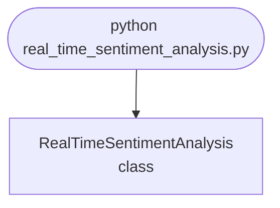

import FileCode from '../../../../components/FileCode.astro'

## Abstract
Real-Time Sentiment Analysis is a Python project that uses NLP for real-time sentiment analysis. The application features streaming data, model training, and a CLI interface, demonstrating best practices in text analytics and AI.

## Prerequisites
- Python 3.8 or above
- A code editor or IDE
- Basic understanding of NLP and sentiment analysis
- Required libraries: `nltk`, `scikit-learn`, `pandas`, `tweepy`

## Before you Start
Install Python and the required libraries:
```bash title="Install dependencies" showLineNumbers{1}
pip install nltk scikit-learn pandas tweepy
```

## Getting Started
#### Create a Project
1. Create a folder named `real-time-sentiment-analysis`.
2. Open the folder in your code editor or IDE.
3. Create a file named `real_time_sentiment_analysis.py`.
4. Copy the code below into your file.

## Write the Code
<FileCode file="projects/advance/real_time_sentiment_analysis.py" lang="python" title="Real-Time Sentiment Analysis" />

## Example Usage
```bash title="Run sentiment analysis" showLineNumbers{1}
python real_time_sentiment_analysis.py
```

## What it produces

Running the file exactly as it ships takes **3.5 s** and prints:

```text title="python real_time_sentiment_analysis.py"
Real-Time Sentiment Analysis Demo
Sentiment polarity: 1.0
Sentiment polarity: -1.0
```

## How it fits together

Read from the top: this is what runs when you execute the file, and which function calls which. It is generated from the code, so it cannot drift from it.



## Explanation
### Key Features
- **Streaming Data:** Processes real-time data streams (e.g., Twitter).
- **Sentiment Analysis:** Analyzes sentiment using NLP models.
- **Error Handling:** Validates inputs and manages exceptions.
- **CLI Interface:** Interactive command-line usage.

### Code Breakdown
1. **What it imports** (lines 1–1)
```python title="real_time_sentiment_analysis.py" showLineNumbers startLineNumber=1
from textblob import TextBlob
```

2. **`RealTimeSentimentAnalysis` — the class** (lines 3–14)
```python title="real_time_sentiment_analysis.py" showLineNumbers startLineNumber=3
class RealTimeSentimentAnalysis:
    def __init__(self):
        pass

    def analyze_sentiment(self, text):
        blob = TextBlob(text)
        print(f"Sentiment polarity: {blob.sentiment.polarity}")
        return blob.sentiment.polarity

    def demo(self):
        self.analyze_sentiment('Python is awesome!')
        self.analyze_sentiment('This is terrible.')
```

The file defines 1 top-level symbol in all; the whole thing is above under *Write the Code*.

## Features
- **Sentiment Analysis:** Streaming data and NLP
- **Modular Design:** Separate functions for each task
- **Error Handling:** Manages invalid inputs and exceptions
- **Production-Ready:** Scalable and maintainable code

## Next Steps
Enhance the project by:
- Integrating with real streaming APIs
- Supporting advanced sentiment models
- Creating a GUI for analysis
- Adding real-time dashboards
- Unit testing for reliability

## Educational Value
This project teaches:
- **Text Analytics:** Sentiment analysis and streaming data
- **Software Design:** Modular, maintainable code
- **Error Handling:** Writing robust Python code

## Real-World Applications
- **Social Media Analytics**
- **Customer Feedback Platforms**
- **Business Intelligence**

## Conclusion
Real-Time Sentiment Analysis demonstrates how to build a scalable and accurate sentiment analysis tool using Python. With modular design and extensibility, this project can be adapted for real-world applications in analytics, business intelligence, and more. For more advanced projects, visit Python Central Hub.
