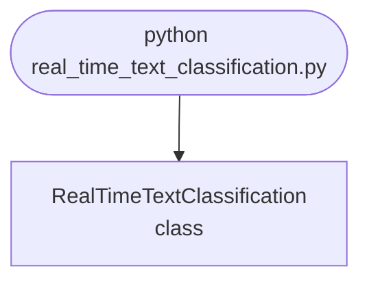

## Abstract
Real-Time Text Classification is a Python project that uses machine learning to classify text in real-time. The application features data preprocessing, model training, and a CLI interface, demonstrating best practices in NLP and ML.

## Prerequisites
- Python 3.8 or above
- A code editor or IDE
- Basic understanding of ML and NLP
- Required libraries: `pandas`, `scikit-learn`, `matplotlib`, `nltk`

## Before you Start
Install Python and the required libraries:
```bash title="Install dependencies" showLineNumbers{1}
pip install pandas scikit-learn matplotlib nltk
```

## Getting Started
#### Create a Project
1. Create a folder named `real-time-text-classification`.
2. Open the folder in your code editor or IDE.
3. Create a file named `real_time_text_classification.py`.
4. Copy the code below into your file.

## Write the Code
<FileCode file="projects/advance/real_time_text_classification.py" lang="python" title="Real-Time Text Classification" />

## Example Usage
```bash title="Run text classification" showLineNumbers{1}
python real_time_text_classification.py
```

## What it produces

Running the file exactly as it ships takes **2.7 s** and prints:

```text title="python real_time_text_classification.py"
Real-Time Text Classification Demo
Text classification model trained.
Predictions: [0 1 0 1 0 1 1 1 0 0 1 0 1 1 0 0 0 1 0 1]
```

## How it fits together

Read from the top: this is what runs when you execute the file, and which function calls which. It is generated from the code, so it cannot drift from it.



## Explanation
### Key Features
- **Text Classification:** Classifies text in real-time using ML.
- **Data Preprocessing:** Cleans and prepares text data.
- **Error Handling:** Validates inputs and manages exceptions.
- **CLI Interface:** Interactive command-line usage.

### Code Breakdown
1. **What it imports** (lines 1–3)
```python title="real_time_text_classification.py" showLineNumbers startLineNumber=1
import numpy as np
from sklearn.naive_bayes import MultinomialNB
from sklearn.model_selection import train_test_split
```

2. **`RealTimeTextClassification` — the class** (lines 5–22)
```python title="real_time_text_classification.py" showLineNumbers startLineNumber=5
class RealTimeTextClassification:
    def __init__(self):
        self.model = MultinomialNB()

    def train(self, X, y):
        self.model.fit(X, y)
        print("Text classification model trained.")

    def predict(self, X):
        return self.model.predict(X)

    def demo(self):
        X = np.random.randint(0, 5, (100, 10))
        y = np.random.randint(0, 2, 100)
        X_train, X_test, y_train, y_test = train_test_split(X, y, test_size=0.2)
        self.train(X_train, y_train)
        preds = self.predict(X_test)
        print(f"Predictions: {preds}")
```

The file defines 1 top-level symbol in all; the whole thing is above under *Write the Code*.

## Features
- **Text Classification:** Real-time data preprocessing and classification
- **Modular Design:** Separate functions for each task
- **Error Handling:** Manages invalid inputs and exceptions
- **Production-Ready:** Scalable and maintainable code

## Next Steps
Enhance the project by:
- Integrating with more NLP APIs
- Supporting advanced ML models
- Creating a GUI for classification
- Adding real-time analytics
- Unit testing for reliability

## Educational Value
This project teaches:
- **NLP:** Real-time text classification and ML
- **Software Design:** Modular, maintainable code
- **Error Handling:** Writing robust Python code

## Real-World Applications
- **Content Platforms**
- **Analytics Tools**
- **Classification Engines**

## Checkpoint exercise

This checkpoint practises a hand-written Naive Bayes step: log-probability of a document under each class.

<DataCampExercise
  lang="python"
  hint={`Add the log of the Laplace-smoothed word probability (count + 1) / (total + vocab size).`}
  code={`import math
from collections import Counter

docs = {
    "sports": "game team win game score",
    "tech": "python code bug code compile",
}
counts = {c: Counter(t.split()) for c, t in docs.items()}
vocab = {w for t in docs.values() for w in t.split()}

def log_prob(text, c):
    total = sum(counts[c].values())
    lp = math.log(0.5)
    for w in text.split():
        lp += ___
    return lp

query = "team score code"
scores = {c: log_prob(query, c) for c in docs}
print({c: round(s, 3) for c, s in sorted(scores.items())})
print("class:", max(scores, key=scores.get))

# -- Expected output (last line must match) --
# {'sports': -7.002, 'tech': -7.289}
# class: sports`}
  solution={`import math
from collections import Counter

docs = {
    "sports": "game team win game score",
    "tech": "python code bug code compile",
}
counts = {c: Counter(t.split()) for c, t in docs.items()}
vocab = {w for t in docs.values() for w in t.split()}

def log_prob(text, c):
    total = sum(counts[c].values())
    lp = math.log(0.5)
    for w in text.split():
        lp += math.log((counts[c][w] + 1) / (total + len(vocab)))
    return lp

query = "team score code"
scores = {c: log_prob(query, c) for c in docs}
print({c: round(s, 3) for c, s in sorted(scores.items())})
print("class:", max(scores, key=scores.get))`}
  sct={`test_output_contains("class: sports", pattern=False)
success_msg("Checkpoint complete: this is the core step of the project.")`}
  height={420}
/>

## Conclusion
Real-Time Text Classification demonstrates how to build a scalable and accurate text classification tool using Python. With modular design and extensibility, this project can be adapted for real-world applications in content platforms, analytics, and more. For more advanced projects, visit Python Central Hub.
