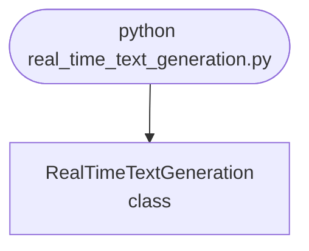

## Abstract
Real-Time Text Generation is a Python project that uses machine learning to generate text in real-time. The application features data preprocessing, model training, and a CLI interface, demonstrating best practices in NLP and ML.

## Prerequisites
- Python 3.8 or above
- A code editor or IDE
- Basic understanding of ML and NLP
- Required libraries: `pandas`, `scikit-learn`, `matplotlib`, `nltk`

## Before you Start
Install Python and the required libraries:
```bash title="Install dependencies" showLineNumbers{1}
pip install pandas scikit-learn matplotlib nltk
```

## Getting Started
#### Create a Project
1. Create a folder named `real-time-text-generation`.
2. Open the folder in your code editor or IDE.
3. Create a file named `real_time_text_generation.py`.
4. Copy the code below into your file.

## Write the Code
<FileCode file="projects/advance/real_time_text_generation.py" lang="python" title="Real-Time Text Generation" />

## Example Usage
```bash title="Run text generation" showLineNumbers{1}
python real_time_text_generation.py
```

## What it produces

Running the file exactly as it ships takes **0.1 s** and prints:

```text title="python real_time_text_generation.py"
Real-Time Text Generation Demo
Generated sentence: AI project Python AI data project science
Generated sentence: automation data science data AI code code
Generated sentence: data project science project automation project AI
```

## How it fits together

Read from the top: this is what runs when you execute the file, and which function calls which. It is generated from the code, so it cannot drift from it.



## Explanation
### Key Features
- **Text Generation:** Generates text in real-time using ML.
- **Data Preprocessing:** Cleans and prepares text data.
- **Error Handling:** Validates inputs and manages exceptions.
- **CLI Interface:** Interactive command-line usage.

### Code Breakdown
1. **What it imports** (lines 1–1)
```python title="real_time_text_generation.py" showLineNumbers startLineNumber=1
import random
```

2. **`RealTimeTextGeneration` — the class** (lines 3–14)
```python title="real_time_text_generation.py" showLineNumbers startLineNumber=3
class RealTimeTextGeneration:
    def __init__(self):
        self.words = ['Python', 'AI', 'data', 'science', 'project', 'code', 'automation']

    def generate_sentence(self):
        sentence = ' '.join(random.choices(self.words, k=7))
        print(f"Generated sentence: {sentence}")
        return sentence

    def demo(self):
        for _ in range(3):
            self.generate_sentence()
```

The file defines 1 top-level symbol in all; the whole thing is above under *Write the Code*.

## Features
- **Text Generation:** Real-time data preprocessing and generation
- **Modular Design:** Separate functions for each task
- **Error Handling:** Manages invalid inputs and exceptions
- **Production-Ready:** Scalable and maintainable code

## Next Steps
Enhance the project by:
- Integrating with more NLP APIs
- Supporting advanced ML models
- Creating a GUI for generation
- Adding real-time analytics
- Unit testing for reliability

## Educational Value
This project teaches:
- **NLP:** Real-time text generation and ML
- **Software Design:** Modular, maintainable code
- **Error Handling:** Writing robust Python code

## Real-World Applications
- **Content Platforms**
- **Analytics Tools**
- **Generation Engines**

## Checkpoint exercise

This checkpoint practises building a bigram model and generating text greedily.

<DataCampExercise
  lang="python"
  hint={`Take the most frequent follower: nxt[word].most_common(1)[0][0].`}
  code={`from collections import Counter, defaultdict

corpus = "the cat sat on the mat the cat ate the fish".split()
nxt = defaultdict(Counter)
for a, b in zip(corpus, corpus[1:]):
    nxt[a][b] += 1

word = "the"
out = [word]
for _ in range(3):
    word = ___
    out.append(word)
print(" ".join(out))

# -- Expected output (last line must match) --
# the cat sat on`}
  solution={`from collections import Counter, defaultdict

corpus = "the cat sat on the mat the cat ate the fish".split()
nxt = defaultdict(Counter)
for a, b in zip(corpus, corpus[1:]):
    nxt[a][b] += 1

word = "the"
out = [word]
for _ in range(3):
    word = nxt[word].most_common(1)[0][0]
    out.append(word)
print(" ".join(out))`}
  sct={`test_output_contains("the cat sat on", pattern=False)
success_msg("Checkpoint complete: this is the core step of the project.")`}
  height={380}
/>

## Conclusion
Real-Time Text Generation demonstrates how to build a scalable and accurate text generation tool using Python. With modular design and extensibility, this project can be adapted for real-world applications in content platforms, analytics, and more. For more advanced projects, visit Python Central Hub.
