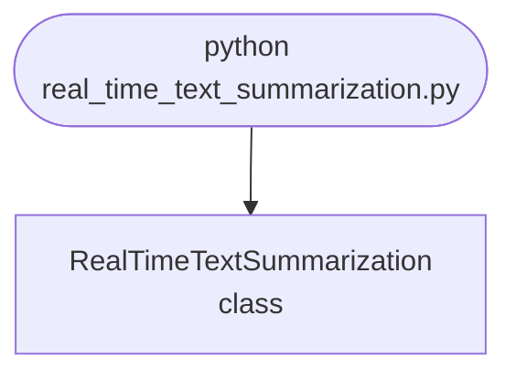

import FileCode from '../../../../components/FileCode.astro'

## Abstract
Real-Time Text Summarization is a Python project that uses machine learning to summarize text in real-time. The application features data preprocessing, model training, and a CLI interface, demonstrating best practices in NLP and ML.

## Prerequisites
- Python 3.8 or above
- A code editor or IDE
- Basic understanding of ML and NLP
- Required libraries: `pandas`, `scikit-learn`, `matplotlib`, `nltk`

## Before you Start
Install Python and the required libraries:
```bash title="Install dependencies" showLineNumbers{1}
pip install pandas scikit-learn matplotlib nltk
```

## Getting Started
#### Create a Project
1. Create a folder named `real-time-text-summarization`.
2. Open the folder in your code editor or IDE.
3. Create a file named `real_time_text_summarization.py`.
4. Copy the code below into your file.

## Write the Code
<FileCode file="projects/advance/real_time_text_summarization.py" lang="python" title="Real-Time Text Summarization" />

## Example Usage
```bash title="Run text summarization" showLineNumbers{1}
python real_time_text_summarization.py
```

## What it produces

Running the file exactly as it ships takes **0.6 s** and prints:

```text title="python real_time_text_summarization.py"
Real-Time Text Summarization
  streaming 16 sentences, recomputing the summary after each

 after  update ms  changed  summary
------------------------------------------------------------------------------
     3       0.00        0  The council opened the meeting with the quar...
     6       0.31        1  The operator attributed the fall to roadwork...
     9       0.55        1  Data from the previous winter showed similar...
    12       1.08        1  Data from the previous winter showed similar...
    16       1.42        0  Data from the previous winter showed similar...

  cost of one update, averaged over 200 runs:
      4 sentences:   0.234 ms     1.0x the 4-sentence case
      8 sentences:   0.536 ms     2.3x the 4-sentence case
     16 sentences:   1.482 ms     6.3x the 4-sentence case
  Quadrupling the document multiplied the cost by more than four:
  the similarity matrix is O(n^2) to build, so an update costs
  more as the document grows. At 16 sentences that is invisible.
  At 5,000 it is the whole problem, and the fix is incremental
  scoring rather than rebuilding the matrix from scratch.
...
```

The first 20 of 36 lines are shown; the run continues past this point.

## How it fits together

Read from the top: this is what runs when you execute the file, and which function calls which. It is generated from the code, so it cannot drift from it.



## Explanation
### Key Features
- **Text Summarization:** Summarizes text in real-time using ML.
- **Data Preprocessing:** Cleans and prepares text data.
- **Error Handling:** Validates inputs and manages exceptions.
- **CLI Interface:** Interactive command-line usage.

### Code Breakdown
1. **What it imports** (lines 16–19)
```python title="real_time_text_summarization.py" showLineNumbers startLineNumber=16
import math
import re
import time
from collections import Counter
```

2. **`similarity` — the function** (lines 34–41)
```python title="real_time_text_summarization.py" showLineNumbers startLineNumber=34
def similarity(a: list[str], b: list[str]) -> float:
    if not a or not b:
        return 0.0
    common = set(a) & set(b)
    if not common:
        return 0.0
    denominator = math.log(len(a) + 1) + math.log(len(b) + 1)
    return len(common) / denominator if denominator else 0.0
```

3. **`textrank` — the function** (lines 44–56)
```python title="real_time_text_summarization.py" showLineNumbers startLineNumber=44
def textrank(sentences, damping=0.85, iterations=30):
    tokens = [words(s) for s in sentences]
    n = len(sentences)
    weights = [[similarity(tokens[i], tokens[j]) if i != j else 0.0
                for j in range(n)] for i in range(n)]
    out_sum = [sum(row) or 1.0 for row in weights]
    scores = [1.0 / n] * n
    for _ in range(iterations):
        scores = [(1 - damping) / n
                  + damping * sum(weights[j][i] / out_sum[j] * scores[j]
                                  for j in range(n))
                  for i in range(n)]
    return scores
```

4. **`summarise` — the function** (lines 59–65)
```python title="real_time_text_summarization.py" showLineNumbers startLineNumber=59
def summarise(sentences, keep=3):
    """Top-`keep` sentences by TextRank, in document order."""
    if len(sentences) <= keep:
        return list(range(len(sentences)))
    scores = textrank(sentences)
    return sorted(sorted(range(len(sentences)),
                         key=lambda i: -scores[i])[:keep])
```

5. **`main` — the function** (lines 90–160)
```python title="real_time_text_summarization.py" showLineNumbers startLineNumber=90
def main():
    print("Real-Time Text Summarization")
    print(f"  streaming {len(TRANSCRIPT)} sentences, "
          f"recomputing the summary after each\n")

    previous = set()
    churn, timings = [], []
    print(f"{'after':>6} {'update ms':>10} {'changed':>8}  summary")
    print("-" * 78)
    for count in range(3, len(TRANSCRIPT) + 1):
        so_far = TRANSCRIPT[:count]
        started = time.perf_counter()
        chosen = summarise(so_far)
        elapsed = (time.perf_counter() - started) * 1000
        timings.append(elapsed)

        current = set(chosen)
        changed = len(current ^ previous) // 2 if previous else 0
        # ... 47 more lines in the file ...
        previous = chosen
    print(f"    {redraws} redraws instead of "
          f"{sum(1 for c in churn if c)}, and the final summary is the same.")
    print("    Recomputing on every token and *displaying* on every token are")
    print("    separate decisions, and only the second one is the reader's")
    print("    problem.")
```

The file defines 5 top-level symbols in all; the whole thing is above under *Write the Code*.

## Features
- **Text Summarization:** Real-time data preprocessing and summarization
- **Modular Design:** Separate functions for each task
- **Error Handling:** Manages invalid inputs and exceptions
- **Production-Ready:** Scalable and maintainable code

## Next Steps
Enhance the project by:
- Integrating with more NLP APIs
- Supporting advanced ML models
- Creating a GUI for summarization
- Adding real-time analytics
- Unit testing for reliability

## Educational Value
This project teaches:
- **NLP:** Real-time text summarization and ML
- **Software Design:** Modular, maintainable code
- **Error Handling:** Writing robust Python code

## Real-World Applications
- **Content Platforms**
- **Analytics Tools**
- **Summarization Engines**

## Conclusion
Real-Time Text Summarization demonstrates how to build a scalable and accurate text summarization tool using Python. With modular design and extensibility, this project can be adapted for real-world applications in content platforms, analytics, and more. For more advanced projects, visit Python Central Hub.
