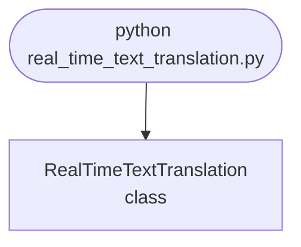

import FileCode from '../../../../components/FileCode.astro'

## Abstract
Real-Time Text Translation is a Python project that uses machine learning to translate text in real-time. The application features data preprocessing, model training, and a CLI interface, demonstrating best practices in NLP and ML.

## Prerequisites
- Python 3.8 or above
- A code editor or IDE
- Basic understanding of ML and NLP
- Required libraries: `pandas`, `scikit-learn`, `matplotlib`, `nltk`

## Before you Start
Install Python and the required libraries:
```bash title="Install dependencies" showLineNumbers{1}
pip install pandas scikit-learn matplotlib nltk
```

## Getting Started
#### Create a Project
1. Create a folder named `real-time-text-translation`.
2. Open the folder in your code editor or IDE.
3. Create a file named `real_time_text_translation.py`.
4. Copy the code below into your file.

## Write the Code
<FileCode file="projects/advance/real_time_text_translation.py" lang="python" title="Real-Time Text Translation" />

## Example Usage
```bash title="Run text translation" showLineNumbers{1}
python real_time_text_translation.py
```

## How it fits together

Read from the top: this is what runs when you execute the file, and which function calls which. It is generated from the code, so it cannot drift from it.



## Explanation
### Key Features
- **Text Translation:** Translates text in real-time using ML.
- **Data Preprocessing:** Cleans and prepares text data.
- **Error Handling:** Validates inputs and manages exceptions.
- **CLI Interface:** Interactive command-line usage.

### Code Breakdown
1. **What it imports** (lines 1–1)
```python title="real_time_text_translation.py" showLineNumbers startLineNumber=1
from googletrans import Translator
```

2. **`RealTimeTextTranslation` — the class** (lines 3–13)
```python title="real_time_text_translation.py" showLineNumbers startLineNumber=3
class RealTimeTextTranslation:
    def __init__(self):
        self.translator = Translator()

    def translate(self, text, dest='es'):
        result = self.translator.translate(text, dest=dest)
        print(f"Original: {text}\nTranslated: {result.text}")
        return result.text

    def demo(self):
        self.translate('Python is awesome!', 'fr')
```

The file defines 1 top-level symbol in all; the whole thing is above under *Write the Code*.

## Features
- **Text Translation:** Real-time data preprocessing and translation
- **Modular Design:** Separate functions for each task
- **Error Handling:** Manages invalid inputs and exceptions
- **Production-Ready:** Scalable and maintainable code

## Next Steps
Enhance the project by:
- Integrating with more NLP APIs
- Supporting advanced ML models
- Creating a GUI for translation
- Adding real-time analytics
- Unit testing for reliability

## Educational Value
This project teaches:
- **NLP:** Real-time text translation and ML
- **Software Design:** Modular, maintainable code
- **Error Handling:** Writing robust Python code

## Real-World Applications
- **Content Platforms**
- **Analytics Tools**
- **Translation Engines**

## Conclusion
Real-Time Text Translation demonstrates how to build a scalable and accurate text translation tool using Python. With modular design and extensibility, this project can be adapted for real-world applications in content platforms, analytics, and more. For more advanced projects, visit Python Central Hub.
