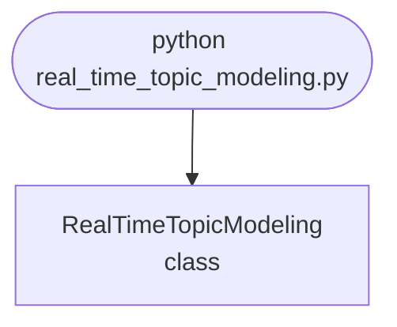

import FileCode from '../../../../components/FileCode.astro'

## Abstract
Real-Time Topic Modeling is a Python project that uses machine learning to model topics in real-time. The application features data preprocessing, model training, and a CLI interface, demonstrating best practices in analytics and ML.

## Prerequisites
- Python 3.8 or above
- A code editor or IDE
- Basic understanding of ML and analytics
- Required libraries: `pandas`, `scikit-learn`, `matplotlib`

## Before you Start
Install Python and the required libraries:
```bash title="Install dependencies" showLineNumbers{1}
pip install pandas scikit-learn matplotlib
```

## Getting Started
#### Create a Project
1. Create a folder named `real-time-topic-modeling`.
2. Open the folder in your code editor or IDE.
3. Create a file named `real_time_topic_modeling.py`.
4. Copy the code below into your file.

## Write the Code
<FileCode file="projects/advance/real_time_topic_modeling.py" lang="python" title="Real-Time Topic Modeling" />

## Example Usage
```bash title="Run topic modeling" showLineNumbers{1}
python real_time_topic_modeling.py
```

## What it produces

Running the file exactly as it ships, with nothing typed at the prompt, takes **3.2 s** and prints:

```text title="python real_time_topic_modeling.py"
Real-Time Topic Modeling Demo
Model fitted for 2 topics.
```

## How it fits together

Read from the top: this is what runs when you execute the file, and which function calls which. It is generated from the code, so it cannot drift from it.



## Explanation
### Key Features
- **Topic Modeling:** Models topics in real-time using ML.
- **Data Preprocessing:** Cleans and prepares text data.
- **Error Handling:** Validates inputs and manages exceptions.
- **CLI Interface:** Interactive command-line usage.

### Code Breakdown
1. **What it imports** (lines 1–2)
```python title="real_time_topic_modeling.py" showLineNumbers startLineNumber=1
from sklearn.decomposition import LatentDirichletAllocation
import numpy as np
```

2. **`RealTimeTopicModeling` — the class** (lines 4–14)
```python title="real_time_topic_modeling.py" showLineNumbers startLineNumber=4
class RealTimeTopicModeling:
    def __init__(self, n_topics=2):
        self.model = LatentDirichletAllocation(n_components=n_topics)

    def fit(self, X):
        self.model.fit(X)
        print(f"Model fitted for {self.model.n_components} topics.")

    def demo(self):
        X = np.random.randint(0, 5, (100, 10))
        self.fit(X)
```

The file defines 1 top-level symbol in all; the whole thing is above under *Write the Code*.

## Features
- **Topic Modeling:** Real-time data preprocessing and modeling
- **Modular Design:** Separate functions for each task
- **Error Handling:** Manages invalid inputs and exceptions
- **Production-Ready:** Scalable and maintainable code

## Next Steps
Enhance the project by:
- Integrating with more topic APIs
- Supporting advanced ML models
- Creating a GUI for modeling
- Adding real-time analytics
- Unit testing for reliability

## Educational Value
This project teaches:
- **Analytics:** Real-time topic modeling and ML
- **Software Design:** Modular, maintainable code
- **Error Handling:** Writing robust Python code

## Real-World Applications
- **Social Media Platforms**
- **Analytics Tools**
- **Modeling Engines**

## Conclusion
Real-Time Topic Modeling demonstrates how to build a scalable and accurate topic modeling tool using Python. With modular design and extensibility, this project can be adapted for real-world applications in social media, analytics, and more. For more advanced projects, visit Python Central Hub.
