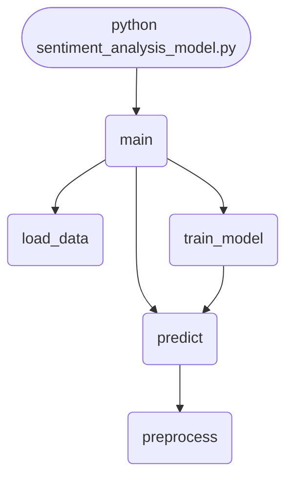

import FileCode from '../../../../components/FileCode.astro'

## Abstract
Sentiment Analysis Model is a Python project that uses NLP to analyze sentiment in text. The application features data preprocessing, model training, and evaluation, demonstrating best practices in text analytics and AI.

## Prerequisites
- Python 3.8 or above
- A code editor or IDE
- Basic understanding of NLP and sentiment analysis
- Required libraries: `nltk`, `scikit-learn`, `pandas`

## Before you Start
Install Python and the required libraries:
```bash title="Install dependencies" showLineNumbers{1}
pip install nltk scikit-learn pandas
```

## Getting Started
#### Create a Project
1. Create a folder named `sentiment-analysis-model`.
2. Open the folder in your code editor or IDE.
3. Create a file named `sentiment_analysis_model.py`.
4. Copy the code below into your file.

## Write the Code
<FileCode file="projects/advance/sentiment_analysis_model.py" lang="python" title="Sentiment Analysis Model" />

## Example Usage
```bash title="Run sentiment analysis" showLineNumbers{1}
python sentiment_analysis_model.py
```

## What it produces

Running the file exactly as it ships, with nothing typed at the prompt, takes **3.0 s** and prints:

```text title="python sentiment_analysis_model.py"
usage: sentiment_analysis_model.py [-h] [--data DATA] [--train]
                                   [--model MODEL] [--predict PREDICT]

Sentiment Analysis Model

options:
  -h, --help         show this help message and exit
  --data DATA        Path to CSV data file
  --train            Train model
  --model MODEL      Path to save/load model
  --predict PREDICT  Text to predict sentiment
```

## How it fits together

Read from the top: this is what runs when you execute the file, and which function calls which. It is generated from the code, so it cannot drift from it.



## Explanation
### Key Features
- **Sentiment Analysis:** Analyzes sentiment in text using NLP.
- **Data Preprocessing:** Cleans and prepares text data.
- **Model Training:** Trains a model for sentiment analysis.
- **Evaluation:** Assesses model performance.
- **Error Handling:** Validates inputs and manages exceptions.

### Code Breakdown
1. **What it imports** (lines 6–16)
```python title="sentiment_analysis_model.py" showLineNumbers startLineNumber=6
import pandas as pd
import numpy as np
import argparse
from sklearn.model_selection import train_test_split
from sklearn.feature_extraction.text import CountVectorizer
from sklearn.naive_bayes import MultinomialNB
from sklearn.metrics import classification_report
import joblib
import nltk
nltk.download('stopwords')
from nltk.corpus import stopwords
```

2. **`load_data` — the function** (lines 24–27)
```python title="sentiment_analysis_model.py" showLineNumbers startLineNumber=24
def load_data(csv_path):
    df = pd.read_csv(csv_path)
    df['text'] = df['text'].apply(preprocess)
    return df
```

3. **`train_model` — the function** (lines 29–42)
```python title="sentiment_analysis_model.py" showLineNumbers startLineNumber=29
def train_model(df, model_path=None):
    X = df['text']
    y = df['label']
    vectorizer = CountVectorizer()
    X_vec = vectorizer.fit_transform(X)
    X_train, X_test, y_train, y_test = train_test_split(X_vec, y, test_size=0.2, random_state=42)
    clf = MultinomialNB()
    clf.fit(X_train, y_train)
    y_pred = clf.predict(X_test)
    print(classification_report(y_test, y_pred))
    if model_path:
        joblib.dump((clf, vectorizer), model_path)
        print(f"Model saved to {model_path}")
    return clf, vectorizer
```

4. **`predict` — the function** (lines 44–48)
```python title="sentiment_analysis_model.py" showLineNumbers startLineNumber=44
def predict(model, vectorizer, texts):
    texts = [preprocess(t) for t in texts]
    X_vec = vectorizer.transform(texts)
    preds = model.predict(X_vec)
    return preds
```

5. **`main` — the function** (lines 50–69)
```python title="sentiment_analysis_model.py" showLineNumbers startLineNumber=50
def main():
    parser = argparse.ArgumentParser(description="Sentiment Analysis Model")
    parser.add_argument('--data', type=str, help='Path to CSV data file')
    parser.add_argument('--train', action='store_true', help='Train model')
    parser.add_argument('--model', type=str, default='sentiment_model.pkl', help='Path to save/load model')
    parser.add_argument('--predict', type=str, help='Text to predict sentiment')
    args = parser.parse_args()

    if args.train and args.data:
        df = load_data(args.data)
        train_model(df, args.model)
    elif args.predict:
        if not os.path.exists(args.model):
            print(f"Model file {args.model} not found. Train the model first.")
            return
        clf, vectorizer = joblib.load(args.model)
        result = predict(clf, vectorizer, [args.predict])
        print(f"Sentiment: {result[0]}")
    else:
        parser.print_help()
```

The file defines 5 top-level symbols in all; the whole thing is above under *Write the Code*.

## Features
- **Sentiment Analysis:** Data preprocessing, model training, and evaluation
- **Modular Design:** Separate functions for each task
- **Error Handling:** Manages invalid inputs and exceptions
- **Production-Ready:** Scalable and maintainable code

## Next Steps
Enhance the project by:
- Integrating with real sentiment datasets
- Supporting advanced NLP models
- Creating a GUI for analysis
- Adding real-time analytics
- Unit testing for reliability

## Educational Value
This project teaches:
- **Text Analytics:** Sentiment analysis and NLP
- **Software Design:** Modular, maintainable code
- **Error Handling:** Writing robust Python code

## Real-World Applications
- **Social Media Analytics**
- **Customer Feedback Platforms**
- **Business Intelligence**

## Conclusion
Sentiment Analysis Model demonstrates how to build a scalable and accurate sentiment analysis tool using Python. With modular design and extensibility, this project can be adapted for real-world applications in analytics, business intelligence, and more. For more advanced projects, visit Python Central Hub.
