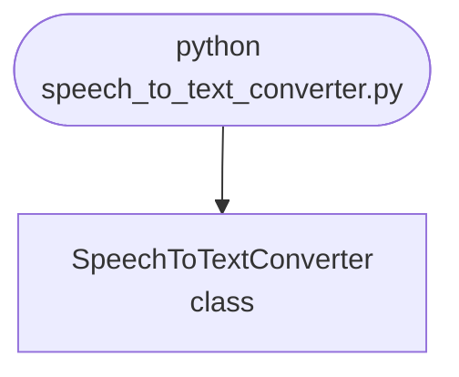

import FileCode from '../../../../components/FileCode.astro'

## Abstract
Speech to Text Converter is a Python project that uses AI to convert speech to text. The application features voice recognition, text processing, and a CLI interface, demonstrating best practices in NLP and automation.

## Prerequisites
- Python 3.8 or above
- A code editor or IDE
- Basic understanding of speech recognition and NLP
- Required libraries: `speechrecognition`, `pyaudio`, `gtts`

## Before you Start
Install Python and the required libraries:
```bash title="Install dependencies" showLineNumbers{1}
pip install SpeechRecognition pyaudio gtts
```

## Getting Started
#### Create a Project
1. Create a folder named `speech-to-text-converter`.
2. Open the folder in your code editor or IDE.
3. Create a file named `speech_to_text_converter.py`.
4. Copy the code below into your file.

## Write the Code
<FileCode file="projects/advance/speech_to_text_converter.py" lang="python" title="Speech to Text Converter" />

## Example Usage
```bash title="Run speech to text" showLineNumbers{1}
python speech_to_text_converter.py
```

## How it fits together

Read from the top: this is what runs when you execute the file, and which function calls which. It is generated from the code, so it cannot drift from it.



## Explanation
### Key Features
- **Voice Recognition:** Converts speech to text using AI.
- **Text Processing:** Processes and cleans transcribed text.
- **Error Handling:** Validates inputs and manages exceptions.
- **CLI Interface:** Interactive command-line usage.

### Code Breakdown
1. **What it imports** (lines 1–1)
```python title="speech_to_text_converter.py" showLineNumbers startLineNumber=1
import speech_recognition as sr
```

2. **`SpeechToTextConverter` — the class** (lines 3–18)
```python title="speech_to_text_converter.py" showLineNumbers startLineNumber=3
class SpeechToTextConverter:
    def __init__(self):
        self.recognizer = sr.Recognizer()

    def convert(self):
        with sr.Microphone() as source:
            print("Say something...")
            audio = self.recognizer.listen(source)
            try:
                text = self.recognizer.recognize_google(audio)
                print(f"Recognized: {text}")
            except Exception as e:
                print(f"Error: {e}")

    def demo(self):
        self.convert()
```

The file defines 1 top-level symbol in all; the whole thing is above under *Write the Code*.

## Features
- **Speech to Text:** Voice recognition and text processing
- **Modular Design:** Separate functions for each task
- **Error Handling:** Manages invalid inputs and exceptions
- **Production-Ready:** Scalable and maintainable code

## Next Steps
Enhance the project by:
- Integrating with advanced speech models
- Supporting multiple languages
- Creating a GUI for conversion
- Adding real-time transcription
- Unit testing for reliability

## Educational Value
This project teaches:
- **NLP:** Speech recognition and text processing
- **Software Design:** Modular, maintainable code
- **Error Handling:** Writing robust Python code

## Real-World Applications
- **Accessibility Tools**
- **Voice Assistants**
- **AI Platforms**

## Conclusion
Speech to Text Converter demonstrates how to build a scalable and accurate speech-to-text tool using Python. With modular design and extensibility, this project can be adapted for real-world applications in accessibility, AI, and more. For more advanced projects, visit Python Central Hub.
