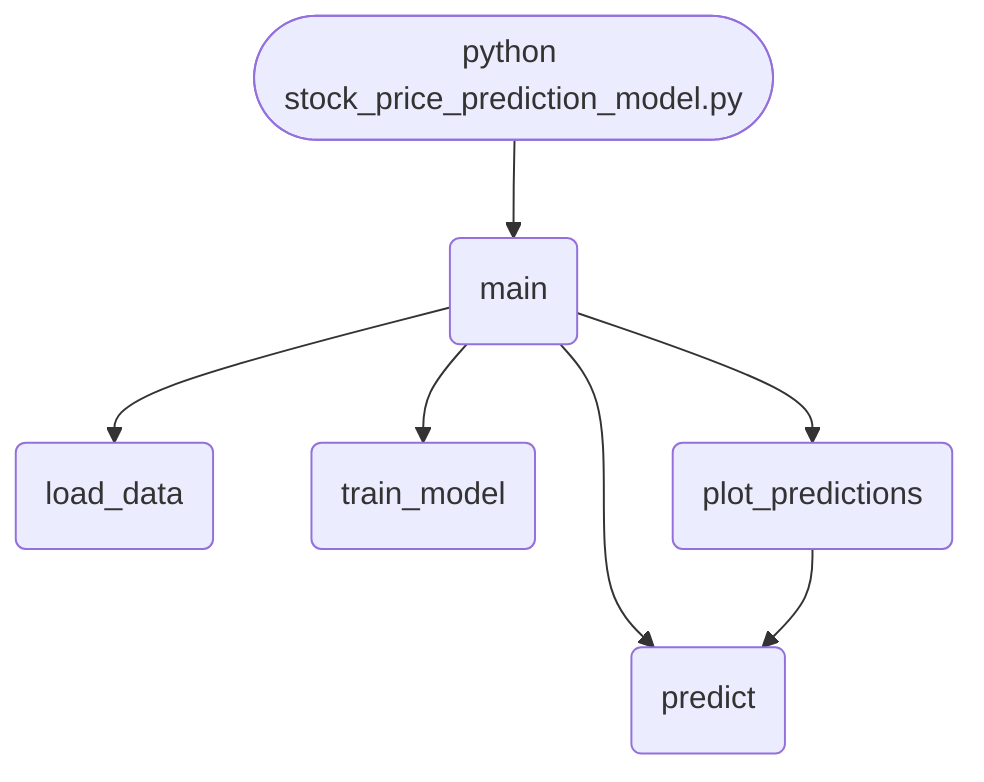

import FileCode from '../../../../components/FileCode.astro'

## Abstract
Stock Price Prediction Model is a Python project that uses machine learning to predict stock prices. The application features data preprocessing, model training, and evaluation, demonstrating best practices in financial analytics and ML.

## Prerequisites
- Python 3.8 or above
- A code editor or IDE
- Basic understanding of ML and finance
- Required libraries: `pandas`, `scikit-learn`, `matplotlib`, `yfinance`

## Before you Start
Install Python and the required libraries:
```bash title="Install dependencies" showLineNumbers{1}
pip install pandas scikit-learn matplotlib yfinance
```

## Getting Started
#### Create a Project
1. Create a folder named `stock-price-prediction-model`.
2. Open the folder in your code editor or IDE.
3. Create a file named `stock_price_prediction_model.py`.
4. Copy the code below into your file.

## Write the Code
<FileCode file="projects/advance/stock_price_prediction_model.py" lang="python" title="Stock Price Prediction Model" />

## Example Usage
```bash title="Run stock price prediction" showLineNumbers{1}
python stock_price_prediction_model.py
```

## What it produces

Running the file exactly as it ships takes **3.5 s** and prints:

```text title="python stock_price_prediction_model.py"
usage: stock_price_prediction_model.py [-h] [--data DATA] [--train]
                                       [--model MODEL] [--predict PREDICT]

Stock Price Prediction Model

options:
  -h, --help         show this help message and exit
  --data DATA        Path to CSV data file
  --train            Train model
  --model MODEL      Path to save/load model
  --predict PREDICT  Path to CSV file for prediction
```

## How it fits together

Read from the top: this is what runs when you execute the file, and which function calls which. It is generated from the code, so it cannot drift from it.



## Explanation
### Key Features
- **Data Preprocessing:** Cleans and prepares stock data.
- **Model Training:** Trains a ML model for prediction.
- **Evaluation:** Assesses model performance.
- **Error Handling:** Validates inputs and manages exceptions.

### Code Breakdown
1. **What it imports** (lines 6–12)
```python title="stock_price_prediction_model.py" showLineNumbers startLineNumber=6
import pandas as pd
from sklearn.model_selection import train_test_split
from sklearn.linear_model import LinearRegression
import matplotlib.pyplot as plt
import argparse
import joblib
import os
```

2. **`load_data` — the function** (lines 14–19)
```python title="stock_price_prediction_model.py" showLineNumbers startLineNumber=14
def load_data(csv_path):
    if not os.path.exists(csv_path):
        print(f"Error: File {csv_path} not found.")
        return None
    df = pd.read_csv(csv_path)
    return df
```

3. **`train_model` — the function** (lines 21–30)
```python title="stock_price_prediction_model.py" showLineNumbers startLineNumber=21
def train_model(df, model_path=None):
    X = df[['Open', 'High', 'Low', 'Volume']]
    y = df['Close']
    X_train, X_test, y_train, y_test = train_test_split(X, y, test_size=0.2, random_state=42)
    model = LinearRegression()
    model.fit(X_train, y_train)
    if model_path:
        joblib.dump(model, model_path)
        print(f"Model saved to {model_path}")
    return model, X_test, y_test
```

4. **`plot_predictions` — the function** (lines 32–43)
```python title="stock_price_prediction_model.py" showLineNumbers startLineNumber=32
def plot_predictions(model, X_test, y_test):
    predictions = model.predict(X_test)
    plt.figure(figsize=(10,5))
    plt.plot(y_test.values, label='Actual')
    plt.plot(predictions, label='Predicted')
    plt.xlabel('Sample')
    plt.ylabel('Stock Price')
    plt.title('Stock Price Prediction')
    plt.legend()
    plt.savefig("stock_price_prediction_model.png", dpi=120, bbox_inches="tight")
    print("saved stock_price_prediction_model.png")
    plt.show()
```

5. **`main` — the function** (lines 48–72)
```python title="stock_price_prediction_model.py" showLineNumbers startLineNumber=48
def main():
    parser = argparse.ArgumentParser(description="Stock Price Prediction Model")
    parser.add_argument('--data', type=str, help='Path to CSV data file')
    parser.add_argument('--train', action='store_true', help='Train model')
    parser.add_argument('--model', type=str, default='stock_model.pkl', help='Path to save/load model')
    parser.add_argument('--predict', type=str, help='Path to CSV file for prediction')
    args = parser.parse_args()

    if args.train and args.data:
        df = load_data(args.data)
        if df is not None:
            model, X_test, y_test = train_model(df, args.model)
            plot_predictions(model, X_test, y_test)
    elif args.predict:
        if not os.path.exists(args.model):
            print(f"Model file {args.model} not found. Train the model first.")
            return
        model = joblib.load(args.model)
        df = load_data(args.predict)
        if df is not None:
            X = df[['Open', 'High', 'Low', 'Volume']]
            preds = predict(model, X)
            print("Predictions:", preds)
    else:
        parser.print_help()
```

The file defines 5 top-level symbols in all; the whole thing is above under *Write the Code*.

## Features
- **Stock Prediction:** Data preprocessing, model training, and evaluation
- **Modular Design:** Separate functions for each task
- **Error Handling:** Manages invalid inputs and exceptions
- **Production-Ready:** Scalable and maintainable code

## Next Steps
Enhance the project by:
- Integrating with more financial APIs
- Supporting advanced ML models
- Creating a GUI for prediction
- Adding real-time analytics
- Unit testing for reliability

## Educational Value
This project teaches:
- **Financial Analytics:** Stock prediction and ML
- **Software Design:** Modular, maintainable code
- **Error Handling:** Writing robust Python code

## Real-World Applications
- **Trading Platforms**
- **Financial Analytics**
- **Forecasting Tools**

## Conclusion
Stock Price Prediction Model demonstrates how to build a scalable and accurate stock prediction tool using Python. With modular design and extensibility, this project can be adapted for real-world applications in finance, analytics, and more. For more advanced projects, visit Python Central Hub.
