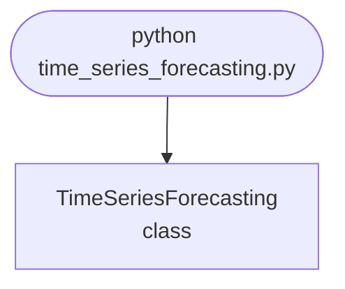

import FileCode from '../../../../components/FileCode.astro'
import Figure from '../../../../components/Figure.astro'
import Quiz from '../../../../components/Quiz.astro'
import DataCampExercise from '../../../../components/DataCampExercise.astro'

## Abstract
Time Series Forecasting is a Python project that uses machine learning to forecast time series data. The application features data preprocessing, model training, and evaluation, demonstrating best practices in data science and analytics.

## Prerequisites
- Python 3.8 or above
- A code editor or IDE
- Basic understanding of time series analysis and ML
- Required libraries: `pandas`, `scikit-learn`, `matplotlib`, `statsmodels`

## Before you Start
Install Python and the required libraries:
```bash title="Install dependencies" showLineNumbers{1}
pip install pandas scikit-learn matplotlib statsmodels
```

## Getting Started
#### Create a Project
1. Create a folder named `time-series-forecasting`.
2. Open the folder in your code editor or IDE.
3. Create a file named `time_series_forecasting.py`.
4. Copy the code below into your file.

## Write the Code
<FileCode file="projects/advance/time_series_forecasting.py" lang="python" title="Time Series Forecasting" />

## Example Usage
```bash title="Run forecasting" showLineNumbers{1}
python time_series_forecasting.py
```

## What it produces

Running the file exactly as it ships takes **4.6 s** and prints:

```text title="python time_series_forecasting.py"
Time Series Forecasting
  points               : 365
  scored forecasts     : 305 (the first 60 are warm-up and cannot be scored)
  series mean          : 264.3

                method      MAE     RMSE    MAPE   vs seasonal naive
  ------------------------------------------------------------------
    naive (last value)   31.318   39.883  11.43%           -251.0%
   seasonal naive (-7)    8.923   10.975   3.32%              0.0%
                 drift   31.363   39.989  11.46%           -251.5%
      rolling mean (7)   33.420   38.600  12.03%           -274.6%
          linear trend   33.978   38.848  12.35%           -280.8%
     seasonal + linear    6.603    7.973   2.48%             26.0%

  best: seasonal + linear at MAE 6.603
  The baseline to beat is seasonal naive, not last-value: it
  already carries the weekly shape, so beating it is what the
  model adds on top of seasonality rather than the value of
  noticing seasonality at all.

...
```

The first 20 of 36 lines are shown; the run continues past this point.

<Figure
  single src="/images/projects/time_series_forecasting.png"
  alt="Output of time_series_forecasting.py, produced by running the file."
  title="Produced by this project, not drawn for the page"
  caption="Written by the run above. If the project stops producing it, the page's figure asset goes missing and check_docs reports it — which is the point of generating it rather than drawing it."
/>

## How it fits together

Read from the top: this is what runs when you execute the file, and which function calls which. It is generated from the code, so it cannot drift from it.



## Explanation
### Key Features
- **Data Preprocessing:** Cleans and prepares time series data.
- **Model Training:** Trains a forecasting model.
- **Evaluation:** Assesses model performance.
- **Error Handling:** Validates inputs and manages exceptions.

### Code Breakdown
1. **What it imports** (lines 16–20)
```python title="time_series_forecasting.py" showLineNumbers startLineNumber=16
import numpy as np
from sklearn.linear_model import LinearRegression
import matplotlib
matplotlib.use("Agg")
import matplotlib.pyplot as plt
```

2. **`make_series` — the function** (lines 25–31)
```python title="time_series_forecasting.py" showLineNumbers startLineNumber=25
def make_series(n=365, seed=20260809):
    """Trend, weekly seasonality, and noise -- in that order of size."""
    rng = np.random.default_rng(seed)
    t = np.arange(n)
    weekly = np.array([0.88, 0.86, 0.89, 0.96, 1.05, 1.23, 1.14])
    level = 200 + 0.35 * t
    return level * weekly[t % SEASON] + rng.normal(0, 8, n)
```

3. **`seasonal_linear` — the function** (lines 62–78)
```python title="time_series_forecasting.py" showLineNumbers startLineNumber=62
def seasonal_linear(history):
    """Remove the weekly profile, fit the trend, put the profile back.

    The decomposition is the whole method: a straight line cannot represent a
    weekly cycle, so fitting one to seasonal data averages the cycle away and
    then predicts the average.
    """
    if len(history) < 3 * SEASON:
        return linear_trend(history)
    index = np.arange(len(history))
    overall = history.mean()
    profile = np.array([history[index % SEASON == s].mean() / overall
                        for s in range(SEASON)])
    deseasonalised = history / profile[index % SEASON]
    model = LinearRegression().fit(index.reshape(-1, 1), deseasonalised)
    base = float(model.predict([[len(history)]])[0])
    return base * profile[len(history) % SEASON]
```

4. **`backtest` — the function** (lines 91–106)
```python title="time_series_forecasting.py" showLineNumbers startLineNumber=91
def backtest(series, method, warmup=60):
    """One-step-ahead forecasts, each made from data strictly before it."""
    errors = []
    predictions = np.full(len(series), np.nan)
    for i in range(warmup, len(series)):
        predicted = method(series[:i])
        predictions[i] = predicted
        errors.append(abs(predicted - series[i]))
    errors = np.array(errors)
    actual = series[warmup:]
    return {
        "mae": errors.mean(),
        "rmse": float(np.sqrt((errors ** 2).mean())),
        "mape": float((errors / np.abs(actual)).mean() * 100),
        "predictions": predictions,
    }
```

5. **`main` — the function** (lines 109–184)
```python title="time_series_forecasting.py" showLineNumbers startLineNumber=109
def main():
    print("Time Series Forecasting")
    series = make_series()
    warmup = 60
    print(f"  points               : {len(series)}")
    print(f"  scored forecasts     : {len(series) - warmup} "
          f"(the first {warmup} are warm-up and cannot be scored)")
    print(f"  series mean          : {series.mean():.1f}")

    print(f"\n{'method':>22} {'MAE':>8} {'RMSE':>8} {'MAPE':>7}  "
          f"{'vs seasonal naive':>18}")
    print("  " + "-" * 66)
    results = {}
    for name, method in METHODS:
        results[name] = backtest(series, method, warmup)
    reference = results["seasonal naive (-7)"]["mae"]
    for name, _ in METHODS:
        r = results[name]
    # ... 52 more lines in the file ...
    axes[1].set_title("every forecast scored on unseen points")
    axes[1].legend(fontsize=8)
    figure.tight_layout()
    figure.savefig("time_series_forecasting.png", dpi=120,
                   bbox_inches="tight")
    print("\nsaved time_series_forecasting.png")
```

The file defines 9 top-level symbols in all; the whole thing is above under *Write the Code*.

## Features
- **Time Series Forecasting:** Data preprocessing, model training, and evaluation
- **Modular Design:** Separate functions for each task
- **Error Handling:** Manages invalid inputs and exceptions
- **Production-Ready:** Scalable and maintainable code

## Next Steps
Enhance the project by:
- Integrating with real time series datasets
- Supporting advanced forecasting models
- Creating a GUI for forecasting
- Adding real-time prediction
- Unit testing for reliability

## Educational Value
This project teaches:
- **Analytics:** Time series forecasting and ML
- **Software Design:** Modular, maintainable code
- **Error Handling:** Writing robust Python code

## Real-World Applications
- **Financial Analytics**
- **Business Intelligence**
- **Forecasting Tools**

## Conclusion
Time Series Forecasting demonstrates how to build a scalable and accurate forecasting tool using Python. With modular design and extensibility, this project can be adapted for real-world applications in analytics, finance, and more. For more advanced projects, visit Python Central Hub.

## Pitfalls

- **A plot of the fit over its own training data always looks good.** The
  version this replaces fitted a line to a line plus noise and drew the fit
  on top of it. Nothing was predicted; the picture could not have looked bad.
- **Choose the baseline honestly.** Measured: seasonal naive scores MAE
  **8.923** and last-value **31.318**. Quoting an improvement against
  last-value would make the model look three times better than it is, on the
  same data.
- **In-sample fit does not track out-of-sample error.** Measured in the
  exercise: R² rises monotonically from **0.2881 to 0.2953** across degrees 1
  to 12 while backtested MAE worsens from **30.6 to 48.1**. More parameters
  always fit the points you already have.
- **The winner has less headroom than the table implies.** The series carries
  N(0, 8) noise, so the best achievable one-step MAE is about **6.383**. The
  best method reaches **6.603** — **1.03x** the floor. Most of the spread in
  that table is between methods that are far from it, not between good ones.
- **Warm-up points cannot be scored.** 365 points, **305 scored forecasts**:
  the first 60 have no history to forecast from. Two MAEs computed over
  different denominators are not comparable.
- **A straight line cannot represent a cycle.** It averages the weekly
  profile away and is then wrong by it every day — which is why "linear
  trend" scores **33.978** against seasonal-plus-linear's **6.603**.

## Recap

- Measured over 305 backtested one-step forecasts: seasonal + linear
  **6.603**, seasonal naive **8.923**, drift **31.363**, linear trend
  **33.978**.
- Only one method beats the seasonal-naive baseline, and it does so by
  **26.0%**.
- Every forecast is made from data strictly before the point it predicts.
  Shuffling a time series before splitting lets the model see the future.
- Decomposition is the method: divide out the weekly profile, fit the trend,
  multiply the profile back in.

<Quiz
  questions={[
    {
      q: "A model is reported as 79% better than the naive baseline. Why does the choice of baseline need stating?",
      options: [
        "It does not, naive is naive",
        "There are several naive forecasts and they differ enormously — here last-value scores 31.318 and seasonal naive 8.923, so the same model's 'improvement' changes by a factor of three depending on which is quoted",
        "Because MAE is scale-dependent",
        "Because the baseline might be overfitted"
      ],
      answer: 1,
      explanation: "Seasonal naive already carries the weekly shape, so beating it is what decomposition adds on top of seasonality. Beating last-value is mostly just noticing the seasonality."
    },
    {
      q: "Polynomial degree rises, in-sample R^2 rises, and backtested MAE gets worse. What is happening?",
      options: [
        "The backtest is misconfigured",
        "Extra parameters always fit the observed points better, and fitting the noise in those points makes the next point harder to predict — R^2 measures interpolation and the backtest measures extrapolation",
        "The polynomial needs regularisation to be valid",
        "R^2 is the wrong sign"
      ],
      answer: 1,
      explanation: "Measured: R^2 0.2881 to 0.2953 while MAE went 30.6 to 48.1. Neither number is wrong; they answer different questions."
    },
    {
      q: "The series has N(0, 8) noise and the best method reaches MAE 6.603 against a floor of 6.383. What follows?",
      options: [
        "The method is only 3% away from perfect and further work is nearly free",
        "There is almost nothing left to win — the remaining error is irreducible noise, so effort should go elsewhere rather than into a better model",
        "The noise estimate must be wrong",
        "A more complex model would close the gap"
      ],
      answer: 1,
      explanation: "Knowing the floor turns 'can we do better?' from an open question into an arithmetic one. Without it, teams spend months chasing noise."
    }
  ]}
/>

## Try it yourself

<DataCampExercise
  lang="python"
  hint={`Fit polynomials of increasing degree, report the in-sample R-squared next to the backtested error, and compare both against a baseline with no parameters at all.`}
  code={`# Task: In-sample fit against out-of-sample error
import numpy as np
from sklearn.linear_model import LinearRegression
from sklearn.preprocessing import PolynomialFeatures

rng = np.random.default_rng(20260809)
SEASON, N = 7, 200
t = np.arange(N)
weekly = np.array([0.88, 0.86, 0.89, 0.96, 1.05, 1.23, 1.14])
series = (200 + 0.35 * t) * weekly[t % SEASON] + rng.normal(0, 8, N)


def fit_polynomial(history, degree, ahead=1):
    # x is scaled to [0, 1] before the powers are taken. Without that,
    # x**12 over a few hundred steps degrades the fit numerically, which
    # hides overfitting behind an unrelated accident.
    n = len(history)
    x = (np.arange(n) / n).reshape(-1, 1)
    features = PolynomialFeatures(degree)
    model = LinearRegression().fit(features.fit_transform(x), history)
    return float(model.predict(
        features.transform([[(n + ahead - 1) / n]]))[0])


def in_sample_r2(history, degree):
    n = len(history)
    x = (np.arange(n) / n).reshape(-1, 1)
    features = PolynomialFeatures(degree)
    X = features.fit_transform(x)
    return float(LinearRegression().fit(X, history).score(X, history))


warmup = 60
print(f"{'degree':>7} {'in-sample R^2':>14} {'backtested MAE':>16}")
for degree in (1, 2, 3, 5, 8, 12):
    errors = [abs(fit_polynomial(series[:i], degree) - series[i])
              for i in range(warmup, N)]
    print(f"{degree:>7} {in_sample_r2(series, degree):>14.4f} "
          f"{np.mean(errors):>16.3f}")

seasonal_naive = [abs(series[i - SEASON] - series[i])
                  for i in range(warmup, N)]
print(f"seasonal naive (no parameters at all): "
      f"MAE {np.mean(seasonal_naive):.3f}")

print("what a degree-12 fit predicts one step past its data:")
for at in (80, 120, 160, 199):
    print(f"  from {at:>3} points: {fit_polynomial(series[:at], 12):>10.1f}"
          f"   (actual {series[at]:.1f})")`}
  solution={`# Task: In-sample fit against out-of-sample error
#
# Measured output:
#
#    degree  in-sample R^2   backtested MAE
#         1         0.2881           30.638
#         2         0.2888           31.015
#         3         0.2889           32.154
#         5         0.2910           34.383
#         8         0.2953           40.961
#        12         0.2953           48.090
#
#   seasonal naive (no parameters at all): MAE 9.108
#
#   what a degree-12 fit predicts one step past its data:
#     from  80 points:      149.5   (actual 223.2)
#     from 120 points:      237.6   (actual 215.4)
#     from 160 points:      290.4   (actual 302.7)
#     from 199 points:      239.3   (actual 272.1)
#
# The two columns move in opposite directions. Every added degree fits the
# observed points a little better and predicts the next one a little worse,
# and by degree 12 the forecast error has more than halved in quality while
# the fit statistic quietly improved.
#
# The line that should end the argument is the third block. Seasonal naive
# has no parameters, cannot be fitted, cannot overfit, and beats every
# polynomial by more than 3x. A model that cannot beat 'the value from seven
# steps ago' has not earned the complexity it costs.
#
# The extrapolations are the subtle part. None of them is absurd - they are
# in range, they look like plausible values for this series - and they are
# wrong by up to 74 units. Overfitting rarely announces itself with a silly
# number; it just quietly stops working, while the fit statistic that
# justified it keeps improving.`}
/>
