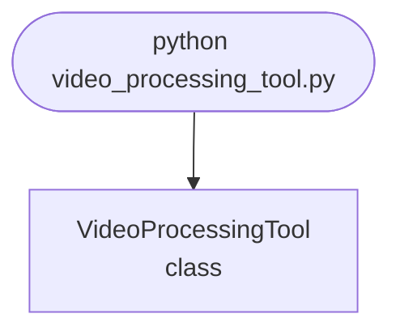

## Abstract
Video Processing Tool is a Python project that uses computer vision to process videos. The application features video editing, frame extraction, and a CLI interface, demonstrating best practices in automation and media processing.

## Prerequisites
- Python 3.8 or above
- A code editor or IDE
- Basic understanding of computer vision and video processing
- Required libraries: `opencv-python`, `numpy`

## Before you Start
Install Python and the required libraries:
```bash title="Install dependencies" showLineNumbers{1}
pip install opencv-python numpy
```

## Getting Started
#### Create a Project
1. Create a folder named `video-processing-tool`.
2. Open the folder in your code editor or IDE.
3. Create a file named `video_processing_tool.py`.
4. Copy the code below into your file.

## Write the Code
<FileCode file="projects/advance/video_processing_tool.py" lang="python" title="Video Processing Tool" />

## Example Usage
```bash title="Run video processing" showLineNumbers{1}
python video_processing_tool.py
```

## What it produces

Running the file exactly as it ships takes **0.4 s** and prints:

```text title="python video_processing_tool.py"
Video Processing Tool Demo
Processing video frames...
Processed frame 1 shape: (64, 64, 3)
Processed frame 2 shape: (64, 64, 3)
Processed frame 3 shape: (64, 64, 3)
```

## How it fits together

Read from the top: this is what runs when you execute the file, and which function calls which. It is generated from the code, so it cannot drift from it.



## Explanation
### Key Features
- **Video Editing:** Processes and edits video files.
- **Frame Extraction:** Extracts frames from videos.
- **Error Handling:** Validates inputs and manages exceptions.
- **CLI Interface:** Interactive command-line usage.

### Code Breakdown
1. **What it imports** (lines 1–2)
```python title="video_processing_tool.py" showLineNumbers startLineNumber=1
import cv2
import numpy as np
```

2. **`VideoProcessingTool` — the class** (lines 4–16)
```python title="video_processing_tool.py" showLineNumbers startLineNumber=4
class VideoProcessingTool:
    def __init__(self):
        pass

    def process_video(self, frames):
        print("Processing video frames...")
        return [cv2.GaussianBlur(frame, (5,5), 0) for frame in frames]

    def demo(self):
        frames = [np.random.rand(64, 64, 3).astype(np.float32) for _ in range(3)]
        processed = self.process_video(frames)
        for i, frame in enumerate(processed):
            print(f"Processed frame {i+1} shape: {frame.shape}")
```

The file defines 1 top-level symbol in all; the whole thing is above under *Write the Code*.

## Features
- **Video Processing:** Editing and frame extraction
- **Modular Design:** Separate functions for each task
- **Error Handling:** Manages invalid inputs and exceptions
- **Production-Ready:** Scalable and maintainable code

## Next Steps
Enhance the project by:
- Integrating with advanced video editing libraries
- Supporting multiple video formats
- Creating a GUI for processing
- Adding real-time editing
- Unit testing for reliability

## Educational Value
This project teaches:
- **Media Processing:** Video editing and frame extraction
- **Software Design:** Modular, maintainable code
- **Error Handling:** Writing robust Python code

## Real-World Applications
- **Media Platforms**
- **Surveillance Systems**
- **AI Tools**

## Checkpoint exercise

This checkpoint practises converting a frame to grayscale and downscaling it with numpy.

<DataCampExercise
  lang="python"
  hint={`Downscale by keeping every 2nd pixel: gray[::2, ::2].`}
  code={`import numpy as np

frame = np.zeros((4, 4, 3))
frame[..., 0] = 200   # red channel
frame[..., 1] = 100   # green channel
frame[..., 2] = 50    # blue channel

gray = frame @ np.array([0.299, 0.587, 0.114])
small = ___
print("shape:", small.shape)
print("value:", round(float(small[0, 0]), 1))

# -- Expected output (last line must match) --
# shape: (2, 2)
# value: 124.2`}
  solution={`import numpy as np

frame = np.zeros((4, 4, 3))
frame[..., 0] = 200   # red channel
frame[..., 1] = 100   # green channel
frame[..., 2] = 50    # blue channel

gray = frame @ np.array([0.299, 0.587, 0.114])
small = gray[::2, ::2]
print("shape:", small.shape)
print("value:", round(float(small[0, 0]), 1))`}
  sct={`test_output_contains("value: 124.2", pattern=False)
success_msg("Checkpoint complete: this is the core step of the project.")`}
  height={340}
/>

## Conclusion
Video Processing Tool demonstrates how to build a scalable and accurate video processing tool using Python. With modular design and extensibility, this project can be adapted for real-world applications in media, surveillance, and more. For more advanced projects, visit Python Central Hub.
