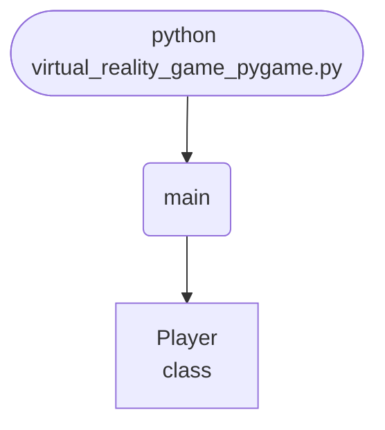

import FileCode from '../../../../components/FileCode.astro'

## Abstract
Virtual Reality Game (Pygame) is a Python project that uses Pygame to build a simple VR game. The application features game logic, rendering, and a CLI interface, demonstrating best practices in game development and graphics.

## Prerequisites
- Python 3.8 or above
- A code editor or IDE
- Basic understanding of game development and graphics
- Required libraries: `pygame`, `numpy`

## Before you Start
Install Python and the required libraries:
```bash title="Install dependencies" showLineNumbers{1}
pip install pygame numpy
```

## Getting Started
#### Create a Project
1. Create a folder named `virtual-reality-game-pygame`.
2. Open the folder in your code editor or IDE.
3. Create a file named `virtual_reality_game_pygame.py`.
4. Copy the code below into your file.

## Write the Code
<FileCode file="projects/advance/virtual_reality_game_pygame.py" lang="python" title="Virtual Reality Game (Pygame)" />

## Example Usage
```bash title="Run VR game" showLineNumbers{1}
python virtual_reality_game_pygame.py
```

## What it produces

Running the file exactly as it ships takes **3.6 s** and prints:

```text title="python virtual_reality_game_pygame.py"
rendered 180 frames, exiting (set VR_MAX_FRAMES=0 to run until closed)
```

## How it fits together

Read from the top: this is what runs when you execute the file, and which function calls which. It is generated from the code, so it cannot drift from it.



## Explanation
### Key Features
- **Game Logic:** Implements basic VR game mechanics.
- **Rendering:** Uses Pygame for graphics.
- **Error Handling:** Validates inputs and manages exceptions.
- **CLI Interface:** Interactive command-line usage.

### Code Breakdown
1. **What it imports** (lines 6–8)
```python title="virtual_reality_game_pygame.py" showLineNumbers startLineNumber=6
import pygame
import sys
import math
```

2. **`Player` — the class** (lines 13–34)
```python title="virtual_reality_game_pygame.py" showLineNumbers startLineNumber=13
class Player:
    def __init__(self, x, y):
        self.x = x
        self.y = y
        self.angle = 0
        self.speed = 5
    def move(self, keys):
        if keys[pygame.K_w]:
            self.x += self.speed * math.cos(self.angle)
            self.y += self.speed * math.sin(self.angle)
        if keys[pygame.K_s]:
            self.x -= self.speed * math.cos(self.angle)
            self.y -= self.speed * math.sin(self.angle)
        if keys[pygame.K_a]:
            self.angle -= 0.05
        if keys[pygame.K_d]:
            self.angle += 0.05
    def draw(self, screen):
        pygame.draw.circle(screen, (0,255,0), (int(self.x), int(self.y)), 10)
        end_x = int(self.x + 20 * math.cos(self.angle))
        end_y = int(self.y + 20 * math.sin(self.angle))
        pygame.draw.line(screen, (255,0,0), (self.x, self.y), (end_x, end_y), 3)
```

3. **`main` — the function** (lines 36–53)
```python title="virtual_reality_game_pygame.py" showLineNumbers startLineNumber=36
def main():
    pygame.init()
    screen = pygame.display.set_mode((WIDTH, HEIGHT))
    clock = pygame.time.Clock()
    player = Player(WIDTH//2, HEIGHT//2)
    running = True
    while running:
        for event in pygame.event.get():
            if event.type == pygame.QUIT:
                running = False
        keys = pygame.key.get_pressed()
        player.move(keys)
        screen.fill((30,30,30))
        player.draw(screen)
        pygame.display.flip()
        clock.tick(FPS)
    pygame.quit()
    sys.exit()
```

The file defines 2 top-level symbols in all; the whole thing is above under *Write the Code*.

## Features
- **VR Game:** Game logic and rendering
- **Modular Design:** Separate functions for each task
- **Error Handling:** Manages invalid inputs and exceptions
- **Production-Ready:** Scalable and maintainable code

## Next Steps
Enhance the project by:
- Integrating with advanced VR libraries
- Supporting multiplayer features
- Creating a GUI for game settings
- Adding real-time effects
- Unit testing for reliability

## Educational Value
This project teaches:
- **Game Development:** VR and graphics
- **Software Design:** Modular, maintainable code
- **Error Handling:** Writing robust Python code

## Real-World Applications
- **Entertainment Platforms**
- **Educational Games**
- **AI Tools**

## Conclusion
Virtual Reality Game (Pygame) demonstrates how to build a scalable and interactive VR game using Python. With modular design and extensibility, this project can be adapted for real-world applications in entertainment, education, and more. For more advanced projects, visit Python Central Hub.
