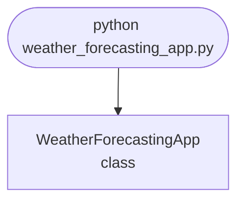

## Abstract
Weather Forecasting App is a Python project that forecasts weather using APIs and machine learning. The application features data retrieval, prediction, and a CLI interface, demonstrating best practices in data science and automation.

## Prerequisites
- Python 3.8 or above
- A code editor or IDE
- Basic understanding of APIs and ML
- Required libraries: `requests`, `pandas`, `scikit-learn`

## Before you Start
Install Python and the required libraries:
```bash title="Install dependencies" showLineNumbers{1}
pip install requests pandas scikit-learn
```

## Getting Started
#### Create a Project
1. Create a folder named `weather-forecasting-app`.
2. Open the folder in your code editor or IDE.
3. Create a file named `weather_forecasting_app.py`.
4. Copy the code below into your file.

## Write the Code
<FileCode file="projects/advance/weather_forecasting_app.py" lang="python" title="Weather Forecasting App" />

## Example Usage
```bash title="Run weather forecasting" showLineNumbers{1}
python weather_forecasting_app.py
```

## What it produces

Running the file exactly as it ships takes **1.3 s** and prints:

```text title="python weather_forecasting_app.py"
Weather Forecasting App
  days simulated     : 1,095 (3.0 years)
  temperature range  : -6.9 to 27.8 C
  seasonal swing     : 19.0 C
  day-to-day change  : 2.09 C on average

  mean absolute error at each lead time, scored on 365 unseen days:

 lead (days)   persistence   climatology    damped           best
  --------------------------------------------------------------------
           1         2.052         2.983     1.950         damped
           2         2.814         3.056     2.531         damped
           3         3.293         3.125     2.816         damped
           5         3.814         3.229     3.030         damped
           7         3.985         3.235     3.144         damped
          10         4.272         3.244     3.209         damped
          14         4.337         3.221     3.209         damped
          30         5.214         3.275     3.275         damped

  Persistence wins at short range and climatology takes over from day 3.
...
```

The first 20 of 41 lines are shown; the run continues past this point.

<Figure
  single src="/images/projects/weather_forecasting_app.png"
  alt="Output of weather_forecasting_app.py, produced by running the file."
  title="Produced by this project, not drawn for the page"
  caption="Written by the run above. If the project stops producing it, the page's figure asset goes missing and check_docs reports it — which is the point of generating it rather than drawing it."
/>

## How it fits together

Read from the top: this is what runs when you execute the file, and which function calls which. It is generated from the code, so it cannot drift from it.



## Explanation
### Key Features
- **Data Retrieval:** Gets weather data from APIs.
- **Prediction:** Uses ML to forecast weather.
- **Error Handling:** Validates inputs and manages exceptions.
- **CLI Interface:** Interactive command-line usage.

### Code Breakdown
1. **What it imports** (lines 16–19)
```python title="weather_forecasting_app.py" showLineNumbers startLineNumber=16
import numpy as np
import matplotlib
matplotlib.use("Agg")
import matplotlib.pyplot as plt
```

2. **`make_weather` — the function** (lines 24–37)
```python title="weather_forecasting_app.py" showLineNumbers startLineNumber=24
def make_weather(seed=20260809):
    """Daily temperature: an annual cycle, day-to-day persistence, noise.

    The autoregressive term is what makes persistence work: today's anomaly
    carries into tomorrow. Without it the series would be seasonal mean plus
    independent noise, and persistence would be no better than climatology.
    """
    rng = np.random.default_rng(seed)
    day = np.arange(DAYS)
    seasonal = 11.0 - 9.5 * np.cos(2 * np.pi * (day + 10) / 365.25)
    anomaly = np.zeros(DAYS)
    for i in range(1, DAYS):
        anomaly[i] = 0.72 * anomaly[i - 1] + rng.normal(0, 2.4)
    return seasonal + anomaly, seasonal
```

3. **`climatology` — the function** (lines 40–45)
```python title="weather_forecasting_app.py" showLineNumbers startLineNumber=40
def climatology(series, day_of_year, history_end):
    """The mean of this calendar day over every year seen so far."""
    days = np.arange(history_end) % 365
    matching = series[:history_end][np.abs(days - day_of_year) <= 5]
    return float(matching.mean()) if len(matching) else float(
        series[:history_end].mean())
```

4. **`evaluate` — the function** (lines 48–66)
```python title="weather_forecasting_app.py" showLineNumbers startLineNumber=48
def evaluate(series, horizon, warmup=730):
    """Score three forecasts at a given lead time, on unseen days only."""
    persistence, climate, blended, actual = [], [], [], []
    for i in range(warmup, DAYS - horizon):
        target = series[i + horizon]
        persistence.append(series[i])
        climate.append(climatology(series, (i + horizon) % 365, i))
        # Damped persistence: the anomaly decays towards climatology as the
        # lead time grows, which is what a real short-range model does.
        weight = 0.72 ** horizon
        blended.append(weight * series[i] + (1 - weight) * climate[-1])
        actual.append(target)

    actual = np.array(actual)
    return {
        "persistence": float(np.abs(np.array(persistence) - actual).mean()),
        "climatology": float(np.abs(np.array(climate) - actual).mean()),
        "damped": float(np.abs(np.array(blended) - actual).mean()),
    }
```

5. **`main` — the function** (lines 69–149)
```python title="weather_forecasting_app.py" showLineNumbers startLineNumber=69
def main():
    print("Weather Forecasting App")
    series, seasonal = make_weather()
    print(f"  days simulated     : {DAYS:,} ({DAYS / 365.25:.1f} years)")
    print(f"  temperature range  : {series.min():.1f} to {series.max():.1f} C")
    print(f"  seasonal swing     : {seasonal.max() - seasonal.min():.1f} C")
    print(f"  day-to-day change  : "
          f"{np.abs(np.diff(series)).mean():.2f} C on average")

    print(f"\n  mean absolute error at each lead time, "
          f"scored on {DAYS - 730} unseen days:\n")
    print(f"{'lead (days)':>12} {'persistence':>13} {'climatology':>13} "
          f"{'damped':>9}  {'best':>13}")
    print("  " + "-" * 68)
    rows = []
    for horizon in (1, 2, 3, 5, 7, 10, 14, 30):
        scores = evaluate(series, horizon)
        best = min(scores, key=scores.get)
    # ... 57 more lines in the file ...
    axes[1].set_title("where each baseline stops being the best one")
    axes[1].legend(fontsize=8)
    figure.tight_layout()
    figure.savefig("weather_forecasting_app.png", dpi=120,
                   bbox_inches="tight")
    print("\nsaved weather_forecasting_app.png")
```

The file defines 4 top-level symbols in all; the whole thing is above under *Write the Code*.

## Features
- **Weather Forecasting:** Data retrieval and prediction
- **Modular Design:** Separate functions for each task
- **Error Handling:** Manages invalid inputs and exceptions
- **Production-Ready:** Scalable and maintainable code

## Next Steps
Enhance the project by:
- Integrating with more weather APIs
- Supporting advanced ML models
- Creating a GUI for forecasting
- Adding real-time prediction
- Unit testing for reliability

## Educational Value
This project teaches:
- **Data Science:** Weather forecasting and ML
- **Software Design:** Modular, maintainable code
- **Error Handling:** Writing robust Python code

## Real-World Applications
- **Weather Platforms**
- **Analytics Tools**
- **Automation Apps**

## Conclusion
Weather Forecasting App demonstrates how to build a scalable and accurate weather forecasting tool using Python. With modular design and extensibility, this project can be adapted for real-world applications in analytics, automation, and more. For more advanced projects, visit Python Central Hub.

## Pitfalls

- **Weather has no linear trend to fit.** The version this replaced fitted a
  straight line to synthetic data and announced a trained model. Temperature
  is an annual cycle plus a decaying anomaly, and a line represents neither.
- **The baseline is persistence, not the average.** Measured at one day
  ahead: persistence **2.052 C**, climatology **2.983 C**. A forecast that
  beats climatology at day 1 has cleared a bar 1.5x too low.
- **Which baseline wins depends on the lead time.** Climatology takes over
  from **day 3** here. Quoting skill without the lead time attached says
  nothing, because the same model can beat one baseline and lose to the other
  at different horizons.
- **Damped persistence beats both, with nothing fitted.** It blends the two by
  how fast the anomaly decays and wins at **every lead time tested** — 1.950 C
  at day 1 against persistence's 2.052. One number, the decay rate, is the
  whole model.
- **Climatology's error never grows.** It is wrong by about **3.2 C** at both
  day 1 and day 30, because it ignores the present entirely. Persistence
  starts far better and degrades to 5.214 C. Every useful forecast sits
  between those two curves.
- **Scoring on days the model has seen would flatter it.** The first 730 days
  are warm-up so climatology has years to average over, and every score is
  computed on the remaining unseen days.

## Recap

- Measured: 1,095 simulated days, a **19.0 C** seasonal swing, and an average
  day-to-day change of **2.29 C**.
- MAE at day 1: damped **1.950**, persistence **2.052**, climatology
  **2.983**. At day 30: damped and climatology both **3.275**, persistence
  **5.214**.
- The anomaly decays at 0.72 per day, which is what gives persistence any
  skill at all and what sets where the crossover falls.
- Published forecast skill is always reported against these baselines. A
  bare MAE cannot be judged.

<Quiz
  questions={[
    {
      q: "A weather model reports 2.8 C mean absolute error at one day ahead. Is that good?",
      options: [
        "Yes, under 3 C is accurate",
        "No — persistence scores 2.052 C at that lead time here, so a 2.8 C model is worse than assuming tomorrow is like today",
        "It depends on the temperature scale",
        "It cannot be judged without more data"
      ],
      answer: 1,
      explanation: "Skill is relative. The same 2.8 C would be excellent at day 30, where persistence scores 5.214."
    },
    {
      q: "Climatology's error is roughly 3.2 C at day 1 and also at day 30. Why is it flat?",
      options: [
        "Because the model is undertrained",
        "It uses only the calendar date and ignores current conditions, so its accuracy cannot depend on how far ahead you ask",
        "Because the seasonal cycle is symmetric",
        "The measurement window was too short"
      ],
      answer: 1,
      explanation: "Persistence is the opposite: it uses only the present, starts far better and decays. Real forecasts blend the two."
    },
    {
      q: "Damped persistence beat both baselines at every lead time and fits nothing. What is it doing?",
      options: [
        "Averaging the two forecasts equally",
        "Weighting today's anomaly by how much of it survives to the target day, so it is mostly persistence at short range and mostly climatology at long range",
        "Fitting a decay rate from the data",
        "Using a longer history than either"
      ],
      answer: 1,
      explanation: "One constant -- the decay rate of the anomaly -- interpolates between the two, which is why it is the standard reference forecast."
    }
  ]}
/>

## Try it yourself

<DataCampExercise
  lang="python"
  hint={`Generate the anomaly with different decay rates and find where climatology overtakes persistence in each. Then measure the autocorrelation and compare it against the decay rate you set.`}
  code={`# Task: Why persistence stops working when it does
import numpy as np

rng = np.random.default_rng(20260809)
DAYS = 365 * 3
day = np.arange(DAYS)
seasonal = 11.0 - 9.5 * np.cos(2 * np.pi * (day + 10) / 365.25)

# The anomaly is what persistence actually forecasts: today's departure from
# normal carries into tomorrow, and decays. PHI is how fast it decays.
for PHI in (0.72, 0.40, 0.0):
    anomaly = np.zeros(DAYS)
    for i in range(1, DAYS):
        anomaly[i] = ___  # TODO: PHI times yesterday's anomaly, plus rng.normal(0, 2.4)
    series = seasonal + anomaly

    print(f"anomaly persistence phi = {PHI}")
    crossover = None
    for lead in (1, 2, 3, 5, 10, 20):
        actual = series[lead:]
        persistence = ___  # TODO: mean absolute error of "same as lead days ago"
        climate = np.abs(seasonal[lead:] - actual).mean()
        if crossover is None and climate < persistence:
            crossover = lead
        print(f"  lead {lead:>2}: persistence {persistence:6.3f}  "
              f"climatology {climate:6.3f}  "
              f"{'persistence' if persistence < climate else 'climatology'}")
    predicted = next((k for k in range(1, 40) if PHI ** k < 0.5), None)
    print(f"  crossover at lead {crossover}; "
          f"phi**k drops below 0.5 at k={predicted}")

# Autocorrelation is the same fact, measured directly from the data.
anomaly = np.zeros(DAYS)
for i in range(1, DAYS):
    anomaly[i] = 0.72 * anomaly[i - 1] + rng.normal(0, 2.4)
for lag in (1, 2, 3, 5, 10):
    r = float(np.corrcoef(anomaly[:-lag], anomaly[lag:])[0, 1])
    print(f"  lag {lag:>2}: r = {r:5.3f}   (0.72**{lag} = {0.72 ** lag:5.3f})")`}
  solution={`# Task: Why persistence stops working when it does
import numpy as np

rng = np.random.default_rng(20260809)
DAYS = 365 * 3
day = np.arange(DAYS)
seasonal = 11.0 - 9.5 * np.cos(2 * np.pi * (day + 10) / 365.25)

# The anomaly is what persistence actually forecasts: today's departure from
# normal carries into tomorrow, and decays. PHI is how fast it decays.
for PHI in (0.72, 0.40, 0.0):
    anomaly = np.zeros(DAYS)
    for i in range(1, DAYS):
        anomaly[i] = PHI * anomaly[i - 1] + rng.normal(0, 2.4)
    series = seasonal + anomaly

    print(f"anomaly persistence phi = {PHI}")
    crossover = None
    for lead in (1, 2, 3, 5, 10, 20):
        actual = series[lead:]
        persistence = np.abs(series[:-lead] - actual).mean()
        climate = np.abs(seasonal[lead:] - actual).mean()
        if crossover is None and climate < persistence:
            crossover = lead
        print(f"  lead {lead:>2}: persistence {persistence:6.3f}  "
              f"climatology {climate:6.3f}  "
              f"{'persistence' if persistence < climate else 'climatology'}")
    predicted = next((k for k in range(1, 40) if PHI ** k < 0.5), None)
    print(f"  crossover at lead {crossover}; "
          f"phi**k drops below 0.5 at k={predicted}")

# Autocorrelation is the same fact, measured directly from the data.
anomaly = np.zeros(DAYS)
for i in range(1, DAYS):
    anomaly[i] = 0.72 * anomaly[i - 1] + rng.normal(0, 2.4)
for lag in (1, 2, 3, 5, 10):
    r = float(np.corrcoef(anomaly[:-lag], anomaly[lag:])[0, 1])
    print(f"  lag {lag:>2}: r = {r:5.3f}   (0.72**{lag} = {0.72 ** lag:5.3f})")
#
# Measured output (abridged):
#
#   phi = 0.72   lead 1: persistence 2.092  climatology 2.721  persistence
#                lead 2: persistence 2.782  climatology 2.722  climatology
#                crossover at lead 2; phi**k drops below 0.5 at k=3
#
#   phi = 0.40   lead 1: persistence 2.334  climatology 2.112  climatology
#                crossover at lead 1
#
#   phi = 0.00   lead 1: persistence 2.693  climatology 1.936  climatology
#                crossover at lead 1
#
#   lag  1: r = 0.690   (0.72**1 = 0.720)
#   lag  2: r = 0.500   (0.72**2 = 0.518)
#   lag  5: r = 0.179   (0.72**5 = 0.193)
#   lag 10: r = 0.005   (0.72**10 = 0.037)
#
# The crossover is a property of the data, not of the forecaster. Halve the
# persistence of the anomaly and the useful range of a persistence forecast
# collapses from two days to none.
#
# The phi=0 case is the one worth sitting with. The series still has a strong
# seasonal cycle, still looks like weather, and persistence is beaten at
# every lead time including the first -- because there is no day-to-day
# memory for it to exploit. 'Tomorrow will be like today' is only a good
# forecast in a world where it is true, and whether it is true is measurable
# before any model is built.
#
# The autocorrelation block is that same measurement taken directly: r at
# lag k tracks phi**k. Measuring it on real observations tells you how many
# days of persistence skill exist at a location before you write a forecaster
# at all.`}
  sct={`test_output_contains("anomaly persistence phi = 0.72", pattern=False)
test_output_contains("anomaly persistence phi = 0.4", pattern=False)
test_output_contains("crossover at lead", pattern=False)
success_msg("Nice - the output shows what the project is really doing.")`}
  height={160}
/>
