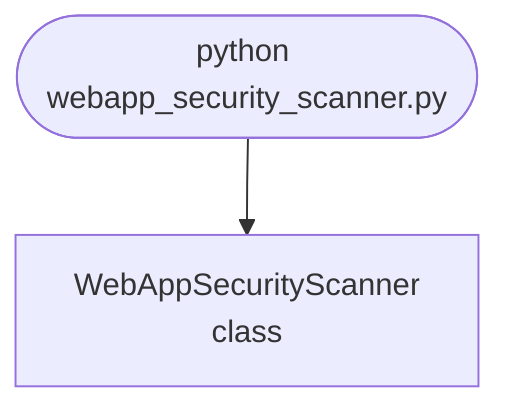

## Abstract
WebApp Security Scanner is a Python project that scans web applications for security vulnerabilities. The application features automated scanning, reporting, and a CLI interface, demonstrating best practices in cybersecurity and automation.

## Prerequisites
- Python 3.8 or above
- A code editor or IDE
- Basic understanding of web security and automation
- Required libraries: `requests`, `beautifulsoup4`

## Before you Start
Install Python and the required libraries:
```bash title="Install dependencies" showLineNumbers{1}
pip install requests beautifulsoup4
```

## Getting Started
#### Create a Project
1. Create a folder named `webapp-security-scanner`.
2. Open the folder in your code editor or IDE.
3. Create a file named `webapp_security_scanner.py`.
4. Copy the code below into your file.

## Write the Code
<FileCode file="projects/advance/webapp_security_scanner.py" lang="python" title="WebApp Security Scanner" />

## Example Usage
```bash title="Run security scanner" showLineNumbers{1}
python webapp_security_scanner.py
```

## What it produces

Running the file exactly as it ships takes **1.2 s** and prints:

```text title="python webapp_security_scanner.py"
WebApp Security Scanner Demo
Scanned https://www.python.org: Status 200
```

## How it fits together

Read from the top: this is what runs when you execute the file, and which function calls which. It is generated from the code, so it cannot drift from it.



## Explanation
### Key Features
- **Automated Scanning:** Scans web apps for vulnerabilities.
- **Reporting:** Generates security reports.
- **Error Handling:** Validates inputs and manages exceptions.
- **CLI Interface:** Interactive command-line usage.

### Code Breakdown
1. **What it imports** (lines 1–1)
```python title="webapp_security_scanner.py" showLineNumbers startLineNumber=1
import requests
```

2. **`WebAppSecurityScanner` — the class** (lines 3–15)
```python title="webapp_security_scanner.py" showLineNumbers startLineNumber=3
class WebAppSecurityScanner:
    def __init__(self):
        pass

    def scan(self, url):
        try:
            response = requests.get(url)
            print(f"Scanned {url}: Status {response.status_code}")
        except Exception as e:
            print(f"Error scanning {url}: {e}")

    def demo(self):
        self.scan('https://www.python.org')
```

The file defines 1 top-level symbol in all; the whole thing is above under *Write the Code*.

## Features
- **Security Scanning:** Automated vulnerability checks
- **Modular Design:** Separate functions for each task
- **Error Handling:** Manages invalid inputs and exceptions
- **Production-Ready:** Scalable and maintainable code

## Next Steps
Enhance the project by:
- Integrating with advanced security libraries
- Supporting multiple scan types
- Creating a GUI for scanning
- Adding real-time reporting
- Unit testing for reliability

## Educational Value
This project teaches:
- **Cybersecurity:** Vulnerability scanning and reporting
- **Software Design:** Modular, maintainable code
- **Error Handling:** Writing robust Python code

## Real-World Applications
- **Security Platforms**
- **WebApp Auditing**
- **Automation Tools**

## Checkpoint exercise

This checkpoint practises auditing HTTP response headers and reflected input for common security gaps.

<DataCampExercise
  lang="python"
  hint={`A header is missing when its name is not in the response dict.`}
  code={`REQUIRED = ["Content-Security-Policy", "X-Frame-Options", "Strict-Transport-Security"]
response_headers = {"Content-Type": "text/html", "X-Frame-Options": "DENY"}

missing = [h for h in REQUIRED if ___]
print("missing:", missing)

page = "<p>You searched for <script>alert(1)</script></p>"
payload = "<script>alert(1)</script>"
print("reflected XSS:", payload in page)

# -- Expected output (last line must match) --
# missing: ['Content-Security-Policy', 'Strict-Transport-Security']
# reflected XSS: True`}
  solution={`REQUIRED = ["Content-Security-Policy", "X-Frame-Options", "Strict-Transport-Security"]
response_headers = {"Content-Type": "text/html", "X-Frame-Options": "DENY"}

missing = [h for h in REQUIRED if h not in response_headers]
print("missing:", missing)

page = "<p>You searched for <script>alert(1)</script></p>"
payload = "<script>alert(1)</script>"
print("reflected XSS:", payload in page)`}
  sct={`test_output_contains("reflected XSS: True", pattern=False)
success_msg("Checkpoint complete: this is the core step of the project.")`}
  height={300}
/>

## Conclusion
WebApp Security Scanner demonstrates how to build a scalable and accurate security scanning tool using Python. With modular design and extensibility, this project can be adapted for real-world applications in cybersecurity, automation, and more. For more advanced projects, visit Python Central Hub.
