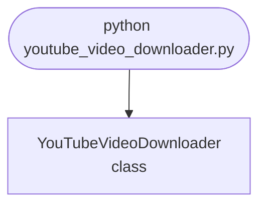

## Abstract
YouTube Video Downloader is a Python project that downloads YouTube videos. The application features video extraction, format selection, and a CLI interface, demonstrating best practices in automation and media processing.

## Prerequisites
- Python 3.8 or above
- A code editor or IDE
- Basic understanding of web scraping and media processing
- Required libraries: `pytube`

## Before you Start
Install Python and the required libraries:
```bash title="Install dependencies" showLineNumbers{1}
pip install pytube
```

## Getting Started
#### Create a Project
1. Create a folder named `youtube-video-downloader`.
2. Open the folder in your code editor or IDE.
3. Create a file named `youtube_video_downloader.py`.
4. Copy the code below into your file.

## Write the Code
<FileCode file="projects/advance/youtube_video_downloader.py" lang="python" title="YouTube Video Downloader" />

## Example Usage
```bash title="Run video downloader" showLineNumbers{1}
python youtube_video_downloader.py
```

## How it fits together

Read from the top: this is what runs when you execute the file, and which function calls which. It is generated from the code, so it cannot drift from it.



## Explanation
### Key Features
- **Video Extraction:** Downloads videos from YouTube.
- **Format Selection:** Allows selection of video format.
- **Error Handling:** Validates inputs and manages exceptions.
- **CLI Interface:** Interactive command-line usage.

### Code Breakdown
1. **What it imports** (lines 1–1)
```python title="youtube_video_downloader.py" showLineNumbers startLineNumber=1
from pytube import YouTube
```

2. **`YouTubeVideoDownloader` — the class** (lines 3–15)
```python title="youtube_video_downloader.py" showLineNumbers startLineNumber=3
class YouTubeVideoDownloader:
    def __init__(self):
        pass

    def download(self, url):
        yt = YouTube(url)
        stream = yt.streams.get_highest_resolution()
        print(f"Downloading: {yt.title}")
        # stream.download()  # Uncomment to actually download
        print("Download complete.")

    def demo(self):
        self.download('https://www.youtube.com/watch?v=dQw4w9WgXcQ')
```

The file defines 1 top-level symbol in all; the whole thing is above under *Write the Code*.

## Features
- **Video Downloading:** Extraction and format selection
- **Modular Design:** Separate functions for each task
- **Error Handling:** Manages invalid inputs and exceptions
- **Production-Ready:** Scalable and maintainable code

## Next Steps
Enhance the project by:
- Integrating with advanced video processing libraries
- Supporting playlist downloads
- Creating a GUI for downloading
- Adding real-time progress
- Unit testing for reliability

## Educational Value
This project teaches:
- **Media Processing:** Video downloading and format selection
- **Software Design:** Modular, maintainable code
- **Error Handling:** Writing robust Python code

## Real-World Applications
- **Media Platforms**
- **Automation Tools**
- **AI Apps**

## Checkpoint exercise

This checkpoint practises parsing a video ID from several URL styles and choosing the best format under a size cap.

<DataCampExercise
  lang="python"
  hint={`The ID is the first capture group: m.group(1).`}
  code={`import re

def video_id(url):
    m = re.search(r"(?:v=|youtu\\.be/)([\\w-]{11})", url)
    return ___ if m else None

print(video_id("https://www.youtube.com/watch?v=dQw4w9WgXcQ&t=10"))
print(video_id("https://youtu.be/dQw4w9WgXcQ"))

formats = [{"res": 360, "mb": 20}, {"res": 720, "mb": 60}, {"res": 1080, "mb": 140}]
ok = [f for f in formats if f["mb"] <= 100]
print("best:", max(ok, key=lambda f: f["res"])["res"])

# -- Expected output (last line must match) --
# dQw4w9WgXcQ
# dQw4w9WgXcQ
# best: 720`}
  solution={`import re

def video_id(url):
    m = re.search(r"(?:v=|youtu\\.be/)([\\w-]{11})", url)
    return m.group(1) if m else None

print(video_id("https://www.youtube.com/watch?v=dQw4w9WgXcQ&t=10"))
print(video_id("https://youtu.be/dQw4w9WgXcQ"))

formats = [{"res": 360, "mb": 20}, {"res": 720, "mb": 60}, {"res": 1080, "mb": 140}]
ok = [f for f in formats if f["mb"] <= 100]
print("best:", max(ok, key=lambda f: f["res"])["res"])`}
  sct={`test_output_contains("best: 720", pattern=False)
success_msg("Checkpoint complete: this is the core step of the project.")`}
  height={360}
/>

## Conclusion
YouTube Video Downloader demonstrates how to build a scalable and accurate video downloading tool using Python. With modular design and extensibility, this project can be adapted for real-world applications in media, automation, and more. For more advanced projects, visit Python Central Hub.
