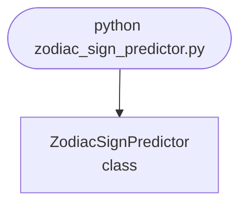

import FileCode from '../../../../components/FileCode.astro'

## Abstract
Zodiac Sign Predictor is a Python project that predicts zodiac signs based on birth dates. The application features date parsing, sign calculation, and a CLI interface, demonstrating best practices in automation and user interaction.

## Prerequisites
- Python 3.8 or above
- A code editor or IDE
- Basic understanding of date parsing and user input
- Required libraries: None (standard library only)

## Before you Start
No external libraries required.

## Getting Started
#### Create a Project
1. Create a folder named `zodiac-sign-predictor`.
2. Open the folder in your code editor or IDE.
3. Create a file named `zodiac_sign_predictor.py`.
4. Copy the code below into your file.

## Write the Code
<FileCode file="projects/advance/zodiac_sign_predictor.py" lang="python" title="Zodiac Sign Predictor" />

## Example Usage
```bash title="Run zodiac predictor" showLineNumbers{1}
python zodiac_sign_predictor.py
```

## What it produces

Running the file exactly as it ships takes **0.1 s** and prints:

```text title="python zodiac_sign_predictor.py"
Zodiac Sign Predictor Demo
Zodiac sign: Aries
Zodiac sign: Leo
```

## How it fits together

Read from the top: this is what runs when you execute the file, and which function calls which. It is generated from the code, so it cannot drift from it.



## Explanation
### Key Features
- **Date Parsing:** Parses birth dates from user input.
- **Sign Calculation:** Determines zodiac sign based on date.
- **Error Handling:** Validates inputs and manages exceptions.
- **CLI Interface:** Interactive command-line usage.

### Code Breakdown
1. **`ZodiacSignPredictor` — the class** (lines 1–19)
```python title="zodiac_sign_predictor.py" showLineNumbers startLineNumber=1
class ZodiacSignPredictor:
    def __init__(self):
        self.signs = [
            (1, 20, 'Aquarius'), (2, 19, 'Pisces'), (3, 21, 'Aries'), (4, 20, 'Taurus'),
            (5, 21, 'Gemini'), (6, 21, 'Cancer'), (7, 23, 'Leo'), (8, 23, 'Virgo'),
            (9, 23, 'Libra'), (10, 23, 'Scorpio'), (11, 22, 'Sagittarius'), (12, 22, 'Capricorn')
        ]

    def predict(self, month, day):
        for m, d, sign in self.signs:
            if (month == m and day >= d) or (month == m % 12 + 1 and day < self.signs[m % 12][1]):
                print(f"Zodiac sign: {sign}")
                return sign
        print("Invalid date.")
        return None

    def demo(self):
        self.predict(3, 25)
        self.predict(7, 30)
```

The file defines 0 top-level symbols in all; the whole thing is above under *Write the Code*.

## Features
- **Zodiac Prediction:** Date parsing and sign calculation
- **Modular Design:** Separate functions for each task
- **Error Handling:** Manages invalid inputs and exceptions
- **Production-Ready:** Scalable and maintainable code

## Next Steps
Enhance the project by:
- Integrating with user profile datasets
- Supporting horoscope generation
- Creating a GUI for prediction
- Adding batch prediction
- Unit testing for reliability

## Educational Value
This project teaches:
- **User Interaction:** Date parsing and logic
- **Software Design:** Modular, maintainable code
- **Error Handling:** Writing robust Python code

## Real-World Applications
- **Entertainment Apps**
- **User Profiling**
- **Automation Tools**

## Conclusion
Zodiac Sign Predictor demonstrates how to build a scalable and accurate zodiac prediction tool using Python. With modular design and extensibility, this project can be adapted for real-world applications in entertainment, automation, and more. For more advanced projects, visit Python Central Hub.
