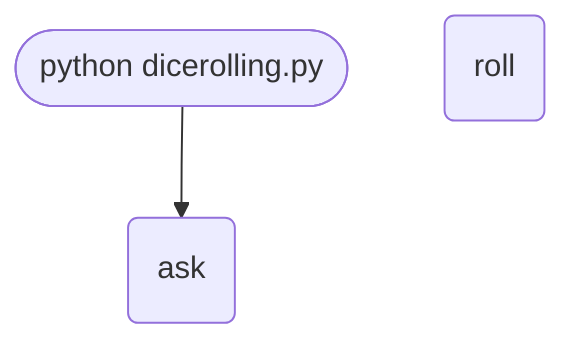

## Abstract
A Dice Rolling Simulator is one of the most rewarding beginner projects because it does something *visibly random* — every run produces a different result. Under the hood it teaches you four core skills you will use forever: importing modules from the standard library, defining your own functions, looping until a condition changes, and parsing user input.

In this project we build a dice roller that:
- Rolls a virtual six-sided die and prints the result.
- Lets the user roll again or quit at any time.
- Is easy to extend to support multiple dice, dice of any number of sides (d4, d20, d100), and even Dungeons & Dragons style notation like `3d6+2`.

By the end you will understand `random.randint`, function definitions with `def`, the `while True` loop, and how a tiny script grows into a real tool.

## Prerequisites
- Python 3.6 or above ([download](https://www.python.org/downloads/)).
- A code editor or IDE (VS Code, PyCharm, Sublime, etc.).
- Completed the [Hello World project](/projects/beginners/helloworld/) — or general comfort running a `.py` file.
- No external libraries are needed; `random` ships with Python.

## Concepts You Will Use

Before writing code, here is what each piece does conceptually:

- **`random` module** — Python's standard library tool for pseudo-random numbers. It can pick integers, floats, items from a list, shuffle a sequence, and more.
- **`random.randint(a, b)`** — returns a random integer `N` such that `a ≤ N ≤ b`. Both endpoints are *inclusive*, which is exactly what you want for dice (1 and 6 are valid rolls).
- **`def`** — defines a function. Functions let you give a *name* to a block of code so you can reuse it.
- **`while True:`** — an infinite loop. You leave it with a `break` statement when the user wants to quit.
- **`input(prompt)`** — pauses the program, prints a prompt, waits for the user to press Enter, returns whatever they typed as a string.
- **`.lower()`** — converts a string to lowercase, so `"Y"` and `"y"` both behave the same way.

## Getting Started

### Create the project
1. Create a folder named `dice-rolling-simulator`.
2. Open it in your code editor.
3. Inside, create a file called `dicerolling.py`.

### Write the code
Add the following to `dicerolling.py`:
<FileCode file="projects/beginners/dicerolling.py" lang="python" title="Dice Rolling" />

Save the file. Open the integrated terminal and run:

```cmd title="command" showLineNumbers{1} {1}
C:\Users\username\PythonCentralHub\projects\beginners\dice-rolling-simulator> python dicerolling.py
You rolled 4
Do you want to roll again? (y/n): y
You rolled 5
Do you want to roll again? (y/n): y
You rolled 5
Do you want to roll again? (y/n): n
Thanks for playing!
```

Run it several times. Notice the numbers change each run — that is the random module doing its job.

## What it produces

Running the file exactly as it ships takes **0.3 s** and prints:

```text title="python dicerolling.py"
one d6:   1
one d20:  13
one d100: 4

three d6: [1, 4, 4]  total: 9
   3d6+2 -> [5, 1, 2] = 10
  1d20+5 -> [12] = 17
  2d10-1 -> [6, 4] = 9

3d6, 60,000 rolls:

   3  0.49%  ##
   4  1.31%  ####
   5  2.88%  #########
   6  4.57%  ##############
   7  6.74%  #####################
   8  9.63%  ##############################
   9 11.57%  ####################################
  10 12.71%  ########################################
  11 12.63%  ########################################
...
```

The first 20 of 30 lines are shown; the run continues past this point.

## How it fits together

Read from the top: this is what runs when you execute the file, and which function calls which. It is generated from the code, so it cannot drift from it.



## Step-by-Step Explanation

### 1. Import the random module
```python title="dicerolling.py" showLineNumbers{1} {1}
import random
```
`import` makes another module's code available in yours. After this line, anything inside the `random` module is reachable as `random.something`. The module itself lives somewhere in your Python installation; you do not need to know where.

### 2. Define the roll function
```python title="dicerolling.py" showLineNumbers{1} {1-2}
def roll():
    return random.randint(1, 6)
```
- `def roll():` declares a new function named `roll` that takes no arguments.
- The indented body is the function's code.
- `return` hands a value back to whoever called the function. Here we return a fresh random integer between 1 and 6.
- Calling `roll()` now feels like rolling a real die — you do not care *how* it gets a number, only that you get one.

Why bother with a function for one line? Because:
- It documents intent: reading `roll()` is clearer than reading `random.randint(1, 6)` everywhere.
- It is easy to change: if you later want a 20-sided die, you change one line.

### 3. Loop until the user stops
```python title="dicerolling.py" showLineNumbers{1} {1-5}
while True:
    print(f"You rolled {roll()}")
    play_again = input("Do you want to roll again? (y/n): ")
    if play_again.lower() != "y":
        break
```
- `while True:` starts a loop that never ends *on its own* — you exit it manually.
- `print(f"You rolled {roll()}")` is an **f-string**. The `f` prefix lets you embed expressions inside `{ }`. `roll()` is called, the result is converted to text, and inserted into the message.
- `input(...)` shows the prompt and waits.
- `play_again.lower() != "y"` is the check: if the user did not type `y` (in any case), `break` immediately exits the loop.

### 4. Say goodbye
```python title="dicerolling.py" showLineNumbers{1} {1}
print("Thanks for playing!")
```
This line runs once, after the loop ends.

## Pseudo-Random, Not Truly Random

`random.randint` does not produce truly random numbers — computers cannot. It produces **pseudo-random** numbers from a deterministic algorithm seeded by the current time. For dice this is more than fine. For cryptography, banking, or anything security-sensitive, use the `secrets` module instead.

You can demonstrate the determinism yourself:
```python title="seeded.py"
import random
random.seed(42)
print(random.randint(1, 6))   # Always prints the same number for seed 42
```
Seeding is useful for *reproducible* test runs.


The other thing worth measuring is what happens when dice are added together.
One d6 is flat -- each face turns up about a sixth of the time -- but 3d6 is
not, and the file rolls it 60,000 times to show the shape:

```text title="python dicerolling.py (tail)"
   3  0.49%  ##
   ...
  10 12.71%  ########################################
  11 12.63%  ########################################
   ...
  18  0.49%  ##
```

Totals of 3 came up **292 times** and totals of 10 came up **7,628 times** --
**26x** more often, against the 27x the combinatorics predict (there are 27
ways to roll 10 with three dice and exactly one way to roll 3, out of 216
outcomes). The measured mean was **10.509**, against a true value of 10.5.

That is the entire reason tabletop games roll 3d6 for ability scores instead
of 1d18. The range is the same; the distribution is not, and averages become
overwhelmingly more likely than extremes as soon as dice are summed.

## Common Mistakes

| Problem | Fix |
|---|---|
| `NameError: name 'random' is not defined` | You forgot `import random` at the top. |
| The program crashes after one roll | You used `if play_again == "y": break` — backwards logic. Use `!= "y"` to break. |
| The program never quits no matter what you type | `"Y"` is not equal to `"y"`. Use `.lower()` to normalize. |
| `random.randint(1, 6.0)` errors with `TypeError` | `randint` needs integers — use `random.uniform(1, 6)` for floats. |

## Variations to Try

### 1. Roll multiple dice at once
```python title="multi_dice.py"
def roll_dice(count):
    return [random.randint(1, 6) for _ in range(count)]

results = roll_dice(3)
print(f"You rolled: {results}  total: {sum(results)}")
```
A **list comprehension** generates `count` rolls in one line, and `sum()` totals them.

### 2. Dice with any number of sides
```python title="any_sides.py"
def roll(sides=6):
    return random.randint(1, sides)

print(roll())      # six-sided
print(roll(20))    # twenty-sided
print(roll(100))   # percentile die
```
`sides=6` is a **default argument** — if the caller does not specify a value, Python uses 6.

### 3. Parse D&D-style notation (`3d6+2`)
```python title="dnd_notation.py"
import re, random

def parse_and_roll(notation):
    match = re.fullmatch(r"(\d+)d(\d+)([+-]\d+)?", notation.replace(" ", ""))
    if not match:
        raise ValueError(f"Bad notation: {notation}")
    count, sides, modifier = match.groups()
    rolls = [random.randint(1, int(sides)) for _ in range(int(count))]
    total = sum(rolls) + (int(modifier) if modifier else 0)
    return rolls, total

print(parse_and_roll("3d6+2"))
# Example output: ([4, 2, 5], 13)
```
This shows how a simple project naturally grows into using **regular expressions** and **error handling**.

### 4. ASCII-art dice faces
```python title="ascii_dice.py"
FACES = {
    1: ("┌─────────┐", "│         │", "│    ●    │", "│         │", "└─────────┘"),
    2: ("┌─────────┐", "│  ●      │", "│         │", "│      ●  │", "└─────────┘"),
    # …add 3, 4, 5, 6
}

for line in FACES[roll()]:
    print(line)
```
A dictionary maps each face to its ASCII art.

### 5. Statistics over many rolls
```python title="stats.py"
from collections import Counter
rolls = [random.randint(1, 6) for _ in range(10_000)]
print(Counter(rolls))
```
You should see roughly 1666 occurrences of each face — proof the distribution is uniform.

## Real-World Applications
- **Tabletop games** — replace lost dice, run probability experiments before a game session.
- **Monte Carlo simulations** — repeated random sampling is the core of physics and finance simulations.
- **Game development** — every roguelike, RPG, or loot system relies on randomness.
- **Teaching probability** — let students *see* the law of large numbers by rolling 100,000 dice.

## Features
- Uses Python's standard library only — no installs.
- Demonstrates functions, loops, conditionals, and input parsing in under 15 lines.
- Easy to extend: any-sided dice, multiple dice, parsed notation, GUI.

## Next Steps
You now have a working dice simulator. Push yourself with one of these challenges:
- Add an **average** that updates after each roll.
- Add a **history** of the last 10 rolls.
- Wrap it in a **Tkinter GUI** with a big "Roll!" button.
- Build a **web version** with Flask that lets a remote player roll dice in a shared room.
- Turn it into a **probability tool** that calculates the chance of beating a target with N dice of S sides.

## Try it here

Click to roll two dice — each shows 1–6 pips and the total is their sum, exactly what your
`random.randint(1, 6)` calls produce:

```p5 title="Roll the dice" desc="Click to roll two dice. Each die shows 1-6 pips; the total is their sum." height="240"
let d1 = 3, d2 = 5;
function die(cx, cy, n) {
  noStroke();
  fill(230);
  rect(cx - 50, cy - 50, 100, 100, 14);
  fill(13, 17, 23);
  const o = 26;
  const P = {
    1: [[0, 0]],
    2: [[-o, -o], [o, o]],
    3: [[-o, -o], [0, 0], [o, o]],
    4: [[-o, -o], [o, -o], [-o, o], [o, o]],
    5: [[-o, -o], [o, -o], [0, 0], [-o, o], [o, o]],
    6: [[-o, -o], [o, -o], [-o, 0], [o, 0], [-o, o], [o, o]],
  };
  for (const p of P[n]) ellipse(cx + p[0], cy + p[1], 16, 16);
}
function setup() {
  createCanvas(600, 240);
  textFont("monospace");
  textAlign(CENTER, CENTER);
  noLoop();
}
function draw() {
  background(13, 17, 23);
  die(210, 104, d1);
  die(390, 104, d2);
  fill(255, 211, 67);
  textSize(22);
  text("total:  " + (d1 + d2), width / 2, 200);
  fill(150);
  textSize(13);
  text("click to roll", width / 2, 226);
}
function mousePressed() {
  d1 = 1 + Math.floor(random(6));
  d2 = 1 + Math.floor(random(6));
  redraw();
}
```

## Conclusion
In this project you used Python's `random` module to simulate dice, learned to encapsulate behavior in a function, looped until the user wanted to stop, and saw several directions to extend the program. The dice roller is small but it touches every fundamental you need for bigger projects. Find more beginner projects on Python Central Hub and keep that momentum going.

## Pitfalls

- **Assuming a small sample looks fair.** Six rolls of a fair die will almost never give one of each face. Fairness is a statement about the limit, and the exercise below shows how slowly the observed frequencies actually settle.
- **`random.randint(1, 6)` includes both ends.** That is unusual: `range(1, 6)` stops at 5 and `random.randrange(1, 6)` does too. `randint` is the exception, and mixing them up quietly produces a five-sided die.
- **Reading the loop as 'ask, then roll'.** It rolls first and asks afterwards, so the die is always thrown at least once — including when the program runs unattended, which is why the output above has a roll in it.
- **Seeding with the clock for anything that matters.** Python seeds `random` from the OS by default, which is fine here. Setting `random.seed(42)` makes a run reproducible, which is useful for a test and disastrous for a game.

## Recap

- `random.randint(1, 6)` is inclusive at both ends — six outcomes, not five.
- The loop rolls before it asks, so a run always produces at least one result.
- `ask()` answers 'n' when nothing is typed, so the loop terminates unattended instead of raising EOFError.
- A fair die is a claim about long-run frequency; six rolls cannot demonstrate it, and the exercise shows how many can.

## Try it yourself

<DataCampExercise
  lang="python"
  hint={`Roll a growing number of times and watch how far the observed frequencies stay from one sixth.`}
  code={`# Task: How many rolls before a fair die looks fair?
import random
from collections import Counter

random.seed(0)                      # reproducible, for a measurement
EXPECTED = 1 / 6

print(f"{'rolls':>9} {'counts':>32} {'largest gap from 1/6':>22}")
for rolls in (6, 60, 600, 6_000, 60_000):
    counts = Counter(___ for _ in range(rolls))  # TODO: one random die roll, 1 to 6
    shares = [counts[face] / rolls for face in range(1, 7)]
    gap = ___  # TODO: the largest abs(share - EXPECTED) over all shares
    tally = " ".join(f"{counts[face]:>5}" for face in range(1, 7))
    print(f"{rolls:>9,} {tally:>32} {gap:>22.4f}")

missing = sum(1 for _ in range(10_000)
              if len({random.randint(1, 6) for _ in range(6)}) < 6)
print(f"\\nin 10,000 sets of six rolls, {missing:,} were missing at least")
print(f"one face -- that is {missing / 10_000:.1%}, so seeing all six faces")
print("in six rolls is the unusual outcome rather than the expected one")`}
  solution={`# Task: How many rolls before a fair die looks fair?
import random
from collections import Counter

random.seed(0)                      # reproducible, for a measurement
EXPECTED = 1 / 6

print(f"{'rolls':>9} {'counts':>32} {'largest gap from 1/6':>22}")
for rolls in (6, 60, 600, 6_000, 60_000):
    counts = Counter(random.randint(1, 6) for _ in range(rolls))
    shares = [counts[face] / rolls for face in range(1, 7)]
    gap = max(abs(share - EXPECTED) for share in shares)
    tally = " ".join(f"{counts[face]:>5}" for face in range(1, 7))
    print(f"{rolls:>9,} {tally:>32} {gap:>22.4f}")

missing = sum(1 for _ in range(10_000)
              if len({random.randint(1, 6) for _ in range(6)}) < 6)
print(f"\\nin 10,000 sets of six rolls, {missing:,} were missing at least")
print(f"one face -- that is {missing / 10_000:.1%}, so seeing all six faces")
print("in six rolls is the unusual outcome rather than the expected one")`}
  sct={`test_output_contains("largest gap from 1/6", pattern=False)
test_output_contains("60,000", pattern=False)
test_output_contains("missing at least", pattern=False)
success_msg("Nice - the output shows what the project is really doing.")`}
  height={160}
/>

<Quiz
  questions={[
    {
      q: "`random.randint(1, 6)` and `random.randrange(1, 6)` differ. How?",
      options: [
        "They are the same function",
        "`randint` includes both endpoints and can return 6; `randrange` excludes the upper one and stops at 5",
        "`randrange` is cryptographically stronger",
        "`randint` only accepts positive numbers"
      ],
      answer: 1,
      explanation: "`randint` is the odd one out in Python: nearly everything else, including slices and `range`, excludes the upper bound."
    },
    {
      q: "The program rolled once and stopped when no answer was typed. Why did it roll at all?",
      options: [
        "Because the default answer is 'y'",
        "Because the loop rolls first and asks afterwards, so the first throw happens before any answer is needed",
        "Because EOFError is raised after the roll",
        "Because randint always runs once at import"
      ],
      answer: 1,
      explanation: "Loop order decides how a program behaves at its edges. Asking first would have produced a run with no roll in it at all."
    },
    {
      q: "You roll a fair die six times and get no 4. What does that tell you about the die?",
      options: [
        "It is biased against 4",
        "Almost nothing — missing at least one face in six rolls is the common outcome, not the surprising one",
        "The random number generator is broken",
        "It needs reseeding"
      ],
      answer: 1,
      explanation: "The chance that six rolls show all six faces is 6!/6^6, about 1.5%. Seeing every face would be the unusual result."
    }
  ]}
/>
