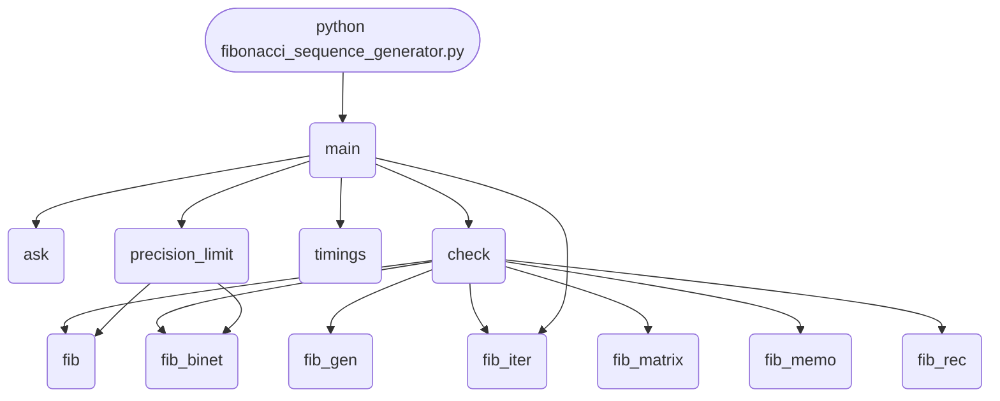

import FileCode from '../../../../components/FileCode.astro'
import Quiz from '../../../../components/Quiz.astro'
import DataCampExercise from '../../../../components/DataCampExercise.astro'

## Abstract
The Fibonacci sequence — `0, 1, 1, 2, 3, 5, 8, 13, 21, …` — is the most famous integer sequence in mathematics. Each number is the sum of the previous two. It is a perfect teaching tool: trivial to define, deeply connected to the golden ratio, and a textbook example for comparing algorithm strategies. In this project you will implement six different ways to generate it — iterative, recursive, memoized recursive, generator-based, closed-form using the golden ratio, and matrix exponentiation — and learn when each one is appropriate.

You will leave understanding:
- The definition: `F(0) = 0`, `F(1) = 1`, `F(n) = F(n-1) + F(n-2)`.
- Why naïve recursion is exponentially slow.
- How memoization turns it into linear time.
- The golden-ratio closed form (and its precision limits).
- Matrix exponentiation in `O(log n)` for huge `n`.
- Why iterative is almost always the right answer in practice.

## Prerequisites
- Python 3.6 or above.
- A text editor or IDE.
- Comfort with loops, recursion (helpful), and functions.

## Getting Started

### Create the project
1. Create folder `fibonacci-generator`.
2. Inside, create `fibonacci_sequence_generator.py`.

### Write the code
<FileCode file="projects/beginners/fibonacci_sequence_generator.py" lang="python" title="Fibonacci Generator" />

### Run it
```cmd title="command"
C:\Users\Your Name\fibonacci-generator> python fibonacci_sequence_generator.py
How many numbers? 10
Fibonacci sequence:
0
1
1
2
3
5
8
13
21
34
```

## What it produces

Running the file exactly as it ships takes **0.3 s** and prints:

```text title="python fibonacci_sequence_generator.py"
How many numbers to generate?: Fibonacci sequence, first 12 terms:
  0, 1, 1, 2, 3, 5, 8, 13, 21, 34, 55, 89

agreement over the first 25 terms:
  fib(n)      matches
  fib_rec     matches
  fib_memo    matches
  fib_gen     matches
  fib_binet   matches
  fib_matrix  matches

time to compute F(28), lower is better:
  fib_rec (naive)     60.863 ms          1x faster than naive
  fib_memo             0.042 ms      1,463x faster than naive
  fib (loop)           0.005 ms     12,950x faster than naive
  fib_binet            0.007 ms      9,364x faster than naive
  fib_matrix           0.009 ms      6,763x faster than naive

where the closed form stops being exact:
  F(10) = 55                   binet exact
...
```

The first 20 of 36 lines are shown; the run continues past this point.

## How it fits together

Read from the top: this is what runs when you execute the file, and which function calls which. It is generated from the code, so it cannot drift from it.



## Step-by-Step Explanation

### 1. Iterative version (the default)
```python title="iterative.py"
def fib_iter(n: int) -> list[int]:
    if n <= 0: return []
    if n == 1: return [0]
    out = [0, 1]
    while len(out) < n:
        out.append(out[-1] + out[-2])
    return out
```
- O(n) time, O(n) space (storing the list).
- Single allocation, no recursion overhead.
- This is what 95 % of real-world Fibonacci code looks like.

### 2. Bare minimum — just compute F(n)
```python title="fib_n.py"
def fib(n: int) -> int:
    a, b = 0, 1
    for _ in range(n):
        a, b = b, a + b
    return a
```
- O(n) time, O(1) space.
- The tuple assignment `a, b = b, a + b` is the Pythonic way to swap-and-update.

## Other Implementations

### 3. Naïve recursive (DO NOT use for large n)
```python title="naive_rec.py"
def fib_rec(n: int) -> int:
    if n < 2: return n
    return fib_rec(n - 1) + fib_rec(n - 2)
```
- O(2^n) time. `fib_rec(35)` takes seconds; `fib_rec(50)` takes minutes.
- The same subproblems are recomputed billions of times.
- Educational only — never ship this.

### 4. Memoized recursive
```python title="memo_rec.py"
from functools import lru_cache

@lru_cache(maxsize=None)
def fib_memo(n: int) -> int:
    if n < 2: return n
    return fib_memo(n - 1) + fib_memo(n - 2)
```
- O(n) time, O(n) space.
- One decorator turns exponential into linear.
- Best example you will ever see of `@lru_cache`'s value.

### 5. Generator-based (memory-efficient)
```python title="gen.py"
def fib_gen():
    a, b = 0, 1
    while True:
        yield a
        a, b = b, a + b

# usage
import itertools
print(list(itertools.islice(fib_gen(), 10)))
```
- O(1) extra memory regardless of how far you go.
- Lazy — computes only as many as you ask for.
- Great when you want "the first N matching some condition" without precomputing.

### 6. Closed form (Binet's formula)
```python title="binet.py"
import math
PHI = (1 + math.sqrt(5)) / 2
PSI = (1 - math.sqrt(5)) / 2

def fib_binet(n: int) -> int:
    return round((PHI**n - PSI**n) / math.sqrt(5))
```
- O(1) time (constant-time arithmetic).
- Loses precision past `n ≈ 70` because of floating-point rounding.
- Beautiful mathematically; not what you ship.

### 7. Matrix exponentiation (`O(log n)`)
```python title="matrix.py"
def fib_matrix(n: int) -> int:
    def mat_mul(A, B):
        return [
            [A[0][0]*B[0][0] + A[0][1]*B[1][0], A[0][0]*B[0][1] + A[0][1]*B[1][1]],
            [A[1][0]*B[0][0] + A[1][1]*B[1][0], A[1][0]*B[0][1] + A[1][1]*B[1][1]],
        ]
    def mat_pow(M, p):
        result = [[1, 0], [0, 1]]            # identity
        while p:
            if p & 1: result = mat_mul(result, M)
            M = mat_mul(M, M)
            p >>= 1
        return result
    if n == 0: return 0
    return mat_pow([[1, 1], [1, 0]], n)[0][1]
```
- O(log n) time using fast exponentiation.
- Uses arbitrary-precision Python ints — no precision loss for huge n.
- `fib_matrix(1_000_000)` computes in milliseconds.

## Comparing the Approaches

| Method | Time | Space | When to use |
|---|---|---|---|
| Iterative | O(n) | O(1) | Default choice |
| Naïve recursion | O(2^n) | O(n) | Never (teaching only) |
| Memoized recursion | O(n) | O(n) | Demonstrating DP / cache |
| Generator | O(n) total | O(1) | Streaming or unknown count |
| Binet's formula | O(1)* | O(1) | Tiny n, accept FP error |
| Matrix exponentiation | O(log n) | O(1) | Massive n |

*Constant-time only if you treat float ops as O(1). Above n ≈ 70 it returns wrong values.

## Algorithm Walkthrough — Iterative for n = 5

```
init      a=0  b=1
step 1    yield 0;  a=1, b=1
step 2    yield 1;  a=1, b=2
step 3    yield 1;  a=2, b=3
step 4    yield 2;  a=3, b=5
step 5    yield 3;  a=5, b=8
result:   0, 1, 1, 2, 3
```

## Input Validation

```python title="validate.py"
def get_n():
    while True:
        raw = input("How many? ")
        try:
            n = int(raw)
            if n < 0:
                raise ValueError
            return n
        except ValueError:
            print("Enter a non-negative integer.")
```
Reject negative numbers and non-integers up front.

## Common Mistakes

| Problem | Cause | Fix |
|---|---|---|
| `RecursionError` | Naïve recursion past ~1000 | Use the iterative version |
| Hang on n=40 | Naïve recursion's exponential blow-up | Switch to memoized or iterative |
| Wrong result for n>70 | Floating-point precision in Binet | Use integer-based methods |
| `IndexError` for n=0 or n=1 | Hard-coded `out[-2]` | Special-case small n |
| Memory ballooning for huge n | Storing the full list | Use the generator if you only need streaming |

## The Golden Ratio Connection

The ratio of consecutive Fibonacci numbers approaches **φ ≈ 1.61803398875…**, the golden ratio:
```python title="phi.py"
for n in [5, 10, 20, 40, 80]:
    print(n, fib(n+1) / fib(n))
# 1.6, 1.617..., 1.6180..., 1.61803..., 1.61803398875...
```
This is *why* Binet's formula works — `φ` is a root of `x² = x + 1`, the characteristic equation of the Fibonacci recurrence.

## Variations to Try

### 1. Sum of Fibonacci numbers
```python title="sum.py"
def fib_sum(n): return sum(fib_iter(n))
```
Surprising identity: `F(0) + F(1) + … + F(n) = F(n+2) - 1`.

### 2. Even-only Fibonacci (Project Euler #2)
```python title="even.py"
total = 0
a, b = 0, 1
while a < 4_000_000:
    if a % 2 == 0: total += a
    a, b = b, a + b
```

### 3. Plot the sequence
```python title="plot.py"
import matplotlib.pyplot as plt
plt.plot(fib_iter(30), "o-"); plt.yscale("log"); plt.show()
```
On a log scale, Fibonacci grows almost linearly — exponential growth made visual.

### 4. Spiral drawing
Use `turtle` to draw the famous Fibonacci spiral by chaining quarter-circles whose radii follow the sequence.

### 5. nth Fibonacci modulo m (Pisano period)
For very large n with a modulus, the sequence is periodic — useful in cryptography and contest programming.

### 6. Tribonacci, Lucas, Pell sequences
Same recurrence pattern, different starting values. Easy variations to implement once you have Fibonacci.

### 7. Find n such that F(n) > 10^k
Useful interview question — combine with a generator and a counter.

### 8. Performance benchmark
Time each method for n in `[10, 30, 100, 1000, 100_000]`. Plot results with matplotlib.

### 9. Decimal version
For really, really huge n, Python's int already supports arbitrary precision. Try `len(str(fib(10_000_000)))` — you will get over 2 million digits.

### 10. Web API
Wrap with Flask: `GET /fib/<n>` returns JSON `{"n": n, "value": fib(n)}`. See [Basic Web Server](./basicwebserver).

## Real-World Connections

The sequence appears in:
- **Nature** — sunflower seed spirals, pinecone scales, nautilus shells, flower petals.
- **Markets** — Elliott Wave theory and Fibonacci retracement levels (anecdotal at best).
- **Algorithms** — Fibonacci heaps (used in Dijkstra/Prim shortest-path).
- **Number theory** — Zeckendorf's theorem: every positive integer is a unique sum of non-adjacent Fibonacci numbers.
- **Computer science** — F-heaps, Fibonacci search, golden-ratio-based hashing.

## Educational Value
- **Algorithmic thinking** — six different solutions, six different trade-offs.
- **Recursion vs. iteration** — both kinds of repetition compared head to head.
- **Memoization (`@lru_cache`)** — one decorator, exponential speed-up.
- **Generators** — laziness as a tool.
- **Closed forms and their limits** — math vs. machine.
- **Fast exponentiation** — divide-and-conquer over a sequence.

## Next Steps
- Run a **benchmark harness** comparing iterative, memoized, and matrix versions.
- Implement **Tribonacci** and **Lucas** sequences using the same patterns.
- Combine with [Reverse a String](./reversestring) to see another "many ways to solve" project.
- Read about **Pisano periods** for modular Fibonacci.
- Try **Project Euler problem #2** using your generator.

## Conclusion
Fibonacci is a one-line problem that pays off in spades the deeper you look. You implemented six solutions, learned why exponential recursion is a punishment, and saw how a single `@lru_cache` line rewrites the algorithm class. The same trade-offs recur in real systems — choosing iterative vs. recursive, caching vs. recomputing, fast paths vs. fallbacks. Full source on [GitHub](https://github.com/Ravikisha/PythonCentralHub/blob/main/projects/beginners/fibonacci_sequence_generator.py). Find more algorithm projects on Python Central Hub.

## Pitfalls

- **The naive recursion's cost *is* the answer.** Computing F(30) takes
  **2,692,537 calls** — exactly `2*F(31)-1`, checked in the exercise below at
  five values of n. The work grows as fast as the sequence does, which is why
  n=50 is not slow but hopeless.
- **`@lru_cache` turns that into n+1 calls.** Measured: **31 calls** for n=30,
  an **86,856x** reduction from one decorator. It also means the cache
  persists between calls, so any timing loop must call `cache_clear()` first
  or it measures a dictionary lookup.
- **Binet's formula stops being exact at n=71.** `F(70)` is right;
  `F(71)` is **off by 1**, `F(75)` by 5, `F(90)` by **8,584**. A closed form
  in float64 has 53 bits of mantissa, and Fibonacci numbers outgrow it.
- **`len(str(n))` raises on very large integers.** CPython 3.11 capped
  int-to-str conversion at 4,300 digits, so asking a 20,899-digit Fibonacci
  number for its length crashes. `n.bit_length() * log10(2)` sidesteps it.
- **Recursion has a hard ceiling.** Python's default limit is 1,000 frames, so
  `fib_rec(2000)` raises `RecursionError` regardless of how long you wait.

## Recap

- Seven implementations, all checked to agree over the first 25 terms before
  any of them is timed.
- F(28) on this machine: naive recursion **268.8 ms**, memoised **0.149 ms**,
  the plain loop **0.010 ms**.
- F(100,000): matrix exponentiation **43.8 ms**, the O(n) loop **337.3 ms** —
  **7.7x** slower, same 20,899-digit answer.
- `mat_pow` does 17 squarings for n=100,000 instead of 100,000 additions;
  exponentiation by squaring is the whole trick.
- The sum identity `F(0)+...+F(n-1) = F(n+1)-1` turns an O(n) sum into one
  extra Fibonacci call — verified in the program's own output.

<Quiz
  questions={[
    {
      q: "Naive recursion needs 2,692,537 calls to compute F(30), which is 832,040. What is the relationship?",
      options: [
        "Coincidence",
        "The call count is exactly 2*F(n+1)-1 — the recursion recomputes subtrees, so its cost grows at the same rate as the sequence itself",
        "The calls are proportional to n squared",
        "The count depends on the machine"
      ],
      answer: 1,
      explanation: "Checked at n = 5, 10, 20, 25 and 30 in the exercise; the prediction matched the measured count every time."
    },
    {
      q: "Binet's closed form gives F(70) correctly but F(71) off by one. Why?",
      options: [
        "The formula is wrong",
        "float64 carries 53 bits of mantissa, and F(71) needs more precision than that — the formula is exact in real arithmetic and approximate in floating point",
        "Python rounds incorrectly",
        "The golden ratio constant is mistyped"
      ],
      answer: 1,
      explanation: "Constant-time is worth nothing if the answer is wrong. Past n=70 the integer methods are the only correct ones."
    },
    {
      q: "Why does matrix exponentiation beat the loop for F(100,000) but not for F(28)?",
      options: [
        "It is always faster and the small case is measurement noise",
        "It does O(log n) multiplications instead of O(n) additions, so it only pays off once n is large — at n=28 the loop's 28 additions beat the setup cost",
        "The loop uses more memory",
        "Matrices are faster only for even n"
      ],
      answer: 1,
      explanation: "Measured: at F(28) the loop wins at 0.010 ms against 0.022 ms; at F(100,000) it loses, 337.3 ms against 43.8 ms."
    }
  ]}
/>

## Try it yourself

<DataCampExercise
  lang="python"
  hint={`Count function calls with a shared dict instead of timing them - the call count is exact and does not vary between runs, so the pattern is easier to see.`}
  code={`# Task: Count the calls, not just the seconds
import functools

calls = {"naive": 0, "memo": 0}


def fib_rec(n):
    calls["naive"] += 1
    if n < 2:
        return n
    return fib_rec(n - 1) + fib_rec(n - 2)


@functools.lru_cache(maxsize=None)
def fib_memo(n):
    calls["memo"] += 1
    if n < 2:
        return n
    return fib_memo(n - 1) + fib_memo(n - 2)


def fib(n):
    a, b = 0, 1
    for _ in range(n):
        a, b = b, a + b
    return a


print(f"{'n':>4} {'naive calls':>12} {'memo calls':>11} {'ratio':>9}")
print("-" * 40)
for n in (5, 10, 20, 25, 30):
    calls["naive"] = calls["memo"] = 0
    fib_memo.cache_clear()          # or the cache from the last n is reused
    fib_rec(n)
    fib_memo(n)
    print(f"{n:>4} {calls['naive']:>12,} {calls['memo']:>11,} "
          f"{calls['naive'] / calls['memo']:>8.0f}x")

# Is the call count really 2*F(n+1)-1? Check rather than assume.
for n in (5, 10, 20, 25, 30):
    calls["naive"] = 0
    fib_rec(n)
    predicted = 2 * fib(n + 1) - 1
    match = "match" if predicted == calls["naive"] else "DIFFER"
    print(f"  n={n:<3} measured {calls['naive']:>10,}   "
          f"2*F(n+1)-1 = {predicted:>10,}   {match}")`}
  solution={`# Task: Count the calls, not just the seconds
#
# Measured output:
#
#      n  naive calls  memo calls     ratio
#      5           15           6        2x
#     10          177          11       16x
#     20       21,891          21     1042x
#     25      242,785          26     9338x
#     30    2,692,537          31    86856x
#
#     n=5   measured         15   2*F(n+1)-1 =         15   match
#     n=10  measured        177   2*F(n+1)-1 =        177   match
#     n=20  measured     21,891   2*F(n+1)-1 =     21,891   match
#     n=25  measured    242,785   2*F(n+1)-1 =    242,785   match
#     n=30  measured  2,692,537   2*F(n+1)-1 =  2,692,537   match
#
# The memoised count is exactly n+1: every value is computed once and read
# from the cache afterwards, so the recursion visits each n a single time.
#
# The naive count matching 2*F(n+1)-1 at every n is the point. The cost of
# the algorithm is the size of its own answer, which is what exponential
# means here. The ratio is not a constant speedup - it grows without bound,
# from 2x at n=5 to 86,856x at n=30, and would be roughly 10^9 at n=50.
#
# cache_clear() matters: without it, the second iteration of the loop finds
# every value already cached and reports a call count of 1.`}
/>
