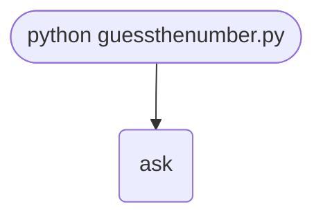

import FileCode from '../../../../components/FileCode.astro'
import Quiz from '../../../../components/Quiz.astro'
import DataCampExercise from '../../../../components/DataCampExercise.astro'

## Abstract
"Guess the Number" is the rite-of-passage game in every beginner curriculum, and for good reason: in a single short script you exercise nearly every fundamental — randomness, looping, branching, user input, type conversion, comparisons, and string formatting. The premise: the computer secretly chooses a number between 1 and 20, the user has six chances to guess it, and after every guess the program tells them whether they were too high or too low.

In this tutorial we will:
- Build the classic version from scratch.
- Walk line-by-line through what each statement does.
- Harden the program against bad input (letters, negative numbers, empty input).
- Extend it with difficulty levels, score tracking, and a "play again" loop.

## Prerequisites
- Python 3.6 or above.
- A text editor or IDE.
- Familiarity with running a Python script (see [Hello World](./helloworld)).
- Some comfort with `input()`, `print()`, and basic comparisons.

## Concepts You Will Use

- **`random.randint(a, b)`** — picks a random integer between `a` and `b`, inclusive.
- **`for` loop with `range`** — iterates a fixed number of times.
- **`if`/`elif`/`else`** — choose between several branches.
- **`break`** — exit a loop immediately.
- **Type conversion** — `int(input(...))` turns text into a number.
- **String concatenation vs. f-strings** — two ways to insert values into messages.

## Getting Started

### Create the project
1. Make a folder named `guess-the-number`.
2. Inside it, create a file named `guessthenumber.py`.
3. Open the folder in your editor.

### Write the code
Paste the following into `guessthenumber.py`:
<FileCode file="projects/beginners/guessthenumber.py" lang="python" title="Guess The Number" />

Save, open a terminal in the folder, and run:

```cmd title="command" showLineNumbers{1}
C:\Users\username\Documents\guess-the-number> python guessthenumber.py
Hello, what is your name?
Ravi
Well, Ravi, I am thinking of a number between 1 and 20.
Take a guess. You have 6 guesses left.
23
Your guess is too high.
Take a guess. You have 5 guesses left.
12
Your guess is too high.
Take a guess. You have 4 guesses left.
11
Your guess is too high.
Take a guess. You have 3 guesses left.
7
Your guess is too high.
Take a guess. You have 2 guesses left.
5
Good job, Ravi! You guessed my number in 5 guesses.
```

Run it a few times. The secret number changes every time.

## What it produces

Running the file exactly as it ships takes **0.3 s** and prints:

```text title="python guessthenumber.py"
Hello, what is your name?
Player   (no input available, using the default)
Well, Player, I am thinking of a number between 1 and 20.
Take a guess. You have 6 left.
10   (no input available, using the default)
Your guess is too high.
Take a guess. You have 5 left.
10   (no input available, using the default)
Your guess is too high.
Take a guess. You have 4 left.
10   (no input available, using the default)
Your guess is too high.
Take a guess. You have 3 left.
10   (no input available, using the default)
Your guess is too high.
Take a guess. You have 2 left.
10   (no input available, using the default)
Your guess is too high.
Take a guess. You have 1 left.
10   (no input available, using the default)
...
```

The first 20 of 34 lines are shown; the run continues past this point.

## How it fits together

Read from the top: this is what runs when you execute the file, and which function calls which. It is generated from the code, so it cannot drift from it.



## Step-by-Step Explanation

### 1. Import randomness
```python title="guessthenumber.py"
import random
```
The `random` module is part of Python's standard library. After this line, `random.randint(...)` is available.

### 2. Greet the user
```python title="guessthenumber.py"
print('Hello, what is your name?')
name = input()
print('Well, ' + name + ', I am thinking of a number between 1 and 20.')
```
- `input()` waits for the user to press Enter and returns their text as a string.
- `'Well, ' + name + ', ...'` is **string concatenation** — joining pieces of text with `+`.

> 💡 A more modern alternative is the f-string: `print(f'Well, {name}, I am thinking of a number between 1 and 20.')`

### 3. Pick a secret number
```python title="guessthenumber.py"
secretNumber = random.randint(1, 20)
```
`random.randint(1, 20)` returns a random integer from 1 to 20 inclusive — both endpoints are possible.

### 4. Loop six times
```python title="guessthenumber.py"
for guessesTaken in range(1, 7):
    print('Take a guess. You have ' + str(7 - guessesTaken) + ' guesses left.')
    guess = int(input())
```
- `range(1, 7)` generates `1, 2, 3, 4, 5, 6` — six iterations.
- `guessesTaken` is the current attempt number.
- `7 - guessesTaken` gives the player how many tries remain.
- `int(input())` reads a line and converts it to an integer. If the user types `"abc"`, this line will crash — we will fix that in the "Robust Input" section below.

### 5. Compare and react
```python title="guessthenumber.py"
    if guess < secretNumber:
        print('Your guess is too low.')
    elif guess > secretNumber:
        print('Your guess is too high.')
    else:
        break
```
The three branches cover every possibility:
- `<` → too low, keep going.
- `>` → too high, keep going.
- otherwise (`==`) → correct, `break` out of the loop.

### 6. Final message
```python title="guessthenumber.py"
if guess == secretNumber:
    print('Good job, ' + name + '! You guessed my number in ' + str(guessesTaken) + ' guesses.')
else:
    print('Nope. The number I was thinking of was ' + str(secretNumber))
```
If the loop ended because of `break`, the player won. Otherwise they ran out of guesses.

## Strategy: How Many Guesses Should You Need?

With six guesses for a range of 20, the optimal strategy is **binary search** — always guess the middle. Each guess halves the remaining range:

| Guess # | Range | Mid |
|---|---|---|
| 1 | 1–20 | 10 |
| 2 | half | 5 or 15 |
| 3 | quarter | … |
| 4–5 | usually solved | |

In general you need about `log₂(n)` guesses for a range of `n` numbers. For 1–20 that is about 4.3, so six guesses is generous.

## Robust Input

The basic version crashes when the user types letters. Replace `int(input())` with a helper:

```python title="safe_input.py"
def ask_number(prompt, low, high):
    while True:
        raw = input(prompt)
        try:
            n = int(raw)
        except ValueError:
            print("Please enter a whole number.")
            continue
        if not (low <= n <= high):
            print(f"Number must be between {low} and {high}.")
            continue
        return n
```
Now `guess = ask_number("Your guess: ", 1, 20)` handles every bad input gracefully.

## Common Mistakes

| Problem | Cause | Fix |
|---|---|---|
| `ValueError: invalid literal for int()` | User typed letters | Wrap in `try`/`except ValueError` |
| Loop ends but program says "Nope" even when correct | Used `==` inside the loop without `break` | Add `break` in the `else` branch |
| Cannot concatenate `str` and `int` | `'left: ' + guessesTaken` | Convert with `str(guessesTaken)` or use an f-string |
| Random number is always the same | You set `random.seed(0)` somewhere | Remove the seed call for true variability |

## Variations to Try

### 1. Difficulty levels
```python title="difficulty.py"
levels = {"easy": (1, 10, 6), "medium": (1, 50, 7), "hard": (1, 100, 8)}
choice = input("Difficulty (easy/medium/hard): ").lower()
low, high, tries = levels[choice]
secret = random.randint(low, high)
```

### 2. Play-again loop
```python title="replay.py"
while True:
    play_game()
    again = input("Play again? (y/n): ").lower()
    if again != "y":
        break
```

### 3. Track best score
```python title="best.py"
best = None
# after each round:
if best is None or guessesTaken < best:
    best = guessesTaken
    print(f"New best score: {best} guesses!")
```

### 4. Persistent high-score file
```python title="persist.py"
from pathlib import Path
SCORE_FILE = Path("best_score.txt")
best = int(SCORE_FILE.read_text()) if SCORE_FILE.exists() else None
# update and write back:
if best is None or new_score < best:
    SCORE_FILE.write_text(str(new_score))
```

### 5. Reverse the game — you pick, the computer guesses
See the [Number Guessing Game with AI](./numberguessingwithai) project. The AI uses binary search to guess your number in at most seven tries.

### 6. GUI version with Tkinter
Replace `input()` and `print()` with an entry widget and a label. A few hours of work and you have a clickable game.

## Common Interview-Style Questions This Project Touches
- "How would you guess a number between 1 and 1,000,000 with the fewest tries?" → binary search.
- "Why is `int(input())` dangerous?" → invalid user input can crash the program; use `try`/`except`.
- "How does Python's `random` module work under the hood?" → Mersenne Twister, pseudo-random.

## Real-World Applications
- Game development (loot tables, RNG events, procedural generation).
- Educational tools that teach the binary search algorithm visually.
- A/B testing assignment when you need a random bucket.
- Quick demos of probability concepts in classrooms.

## Next Steps
Pick one of the variations above and ship it. Combine two or three for extra credit — for example, difficulty levels + persistent high-score + play-again loop is a complete tiny game. Then move on to projects that combine randomness with state, such as [Hangman](./hangman) or [Blackjack](./blackjack).

## Try it here

The computer picked a secret number from 1–100. **Click the bar** to guess — it tells you
higher or lower and narrows the shaded range until you find it:

```p5 title="Guess the number (1-100)" desc="Click the bar to guess. The game says higher or lower and narrows the range until you win." height="220"
let target, lo, hi, guesses, guess, msg, won;
function reset() {
  target = 1 + Math.floor(random(100));
  lo = 1; hi = 100; guesses = 0; guess = null; won = false;
  msg = "click the bar to guess";
}
function bx(v) { return 40 + (v - 1) / 99 * (width - 80); }
function setup() {
  createCanvas(600, 220);
  textFont("monospace");
  textAlign(CENTER, CENTER);
  reset();
  noLoop();
}
function draw() {
  background(13, 17, 23);
  const y = 120;
  noStroke();
  fill(28, 38, 50);
  rect(bx(1), y - 14, bx(100) - bx(1), 28, 6);
  fill(75, 139, 190, 120);
  rect(bx(lo), y - 14, bx(hi) - bx(lo), 28, 6);
  fill(120);
  textSize(10);
  text("1", bx(1), y + 30);
  text("50", bx(50), y + 30);
  text("100", bx(100), y + 30);
  if (guess !== null) {
    stroke(won ? color(120, 200, 120) : color(255, 211, 67));
    strokeWeight(3);
    line(bx(guess), y - 22, bx(guess), y + 22);
    noStroke();
    fill(255, 211, 67);
    textSize(12);
    text(guess, bx(guess), y - 32);
  }
  fill(won ? color(120, 200, 120) : color(107, 169, 221));
  textSize(16);
  text(msg, width / 2, 50);
  fill(140);
  textSize(12);
  text("guesses: " + guesses + "    range: " + lo + "-" + hi, width / 2, 192);
}
function mousePressed() {
  if (won) { reset(); redraw(); return; }
  if (mouseY < 90 || mouseY > 152) return;
  const v = Math.round(1 + (mouseX - 40) / (width - 80) * 99);
  if (v < 1 || v > 100) return;
  guess = v;
  guesses++;
  if (v === target) { msg = "Correct! " + v + " - click to play again"; won = true; }
  else if (v < target) { msg = v + " is too low - guess higher"; lo = Math.max(lo, v + 1); }
  else { msg = v + " is too high - guess lower"; hi = Math.min(hi, v - 1); }
  redraw();
}
```

## Conclusion
You wrote a complete game in roughly fifteen lines of Python, learned how `random.randint` works, looped with `for…range`, branched with `if`/`elif`/`else`, and saw how a small program scales up with input validation and replayability. The full source is on [GitHub](https://github.com/Ravikisha/PythonCentralHub/blob/main/projects/beginners/guessthenumber.py). Find more projects like this on Python Central Hub.

## Pitfalls

- **`int(input())` crashes on anything that is not a number.** Typing `ten`
  raises `ValueError` and ends the game. `ask_number` in the shipped file
  loops until the answer parses *and* falls inside 1–20, because accepting 500
  in a game about 1 to 20 is the same bug wearing a different hat.
- **Six guesses is not a difficulty setting.** Binary search needs at most
  **5** for a range of 20, so the game is unlosable for a player who halves —
  measured at **100.0%** over 20,000 rounds against **30.3%** for a player who
  ignores the hints.
- **`guess` may be unbound.** The original version referred to `guess` after
  the loop; if the loop body had never assigned it, that is a `NameError`
  rather than a loss.
- **Comparing the string, not the number.** `"10" < "9"` is `True`, because
  string comparison is lexicographic. Any hint logic that forgets the `int()`
  gives confidently wrong higher-or-lower answers.
- **A new random number per guess.** Calling `randint` inside the loop instead
  of before it makes the game unwinnable and the bug invisible — it still runs,
  it just never says you won.

## Recap

- Range 1–20, 6 guesses, measured over 20,000 rounds each:

| strategy | wins | mean guesses | worst |
| --- | --- | --- | --- |
| binary search | 100.0% | 3.70 | 5 |
| random, no repeats | 30.3% | 3.51 | 6 |
| count up from 1 | 29.8% | 3.50 | 6 |

- The mean guess count is *lower* for the losing strategies, because their
  losses are not counted — a mean over survivors only is a trap worth
  recognising.
- Binary search costs `ceil(log2 n)` guesses: 5 for 20, 7 for 100, **20 for a
  million**.
- The higher/lower hints are the entire game. Without them it is a lottery
  with 6 tickets out of 20.

<Quiz
  questions={[
    {
      q: "The game allows 6 guesses for a number from 1 to 20. How hard is that for a player using binary search?",
      options: [
        "Difficult — 6 guesses is barely enough",
        "Impossible to lose: binary search needs at most ceil(log2 20) = 5, so the sixth guess is spare",
        "It depends on the secret number",
        "About a 50% chance"
      ],
      answer: 1,
      explanation: "Measured at 100.0% wins over 20,000 rounds, worst case 5 guesses."
    },
    {
      q: "Random guessing without repeats won 30.3% of the time, and its mean winning guess count was 3.51 — lower than binary search's 3.70. Is random guessing better?",
      options: [
        "Yes, it finds the number in fewer guesses",
        "No — the mean only counts games it won. The 69.7% it lost contribute nothing to that average, so the two numbers are not comparable",
        "Yes, but only for small ranges",
        "The two are statistically identical"
      ],
      answer: 1,
      explanation: "Conditioning on success is one of the easiest ways to make a bad strategy look good. Always check what the average is an average over."
    },
    {
      q: "Why does raising the range from 1-1,000 to 1-1,000,000 cost binary search only 10 extra guesses?",
      options: [
        "It does not — the cost grows in proportion to the range",
        "Each guess halves the candidates, so the cost is log2 of the range: 10 guesses for a thousand, 20 for a million",
        "Because the numbers get further apart",
        "The extra guesses come from the modifier"
      ],
      answer: 1,
      explanation: "Measured in the exercise: worst case tracks ceil(log2 n) exactly at every range tested."
    }
  ]}
/>

## Try it yourself

<DataCampExercise
  lang="python"
  hint={`Play the game programmatically for every possible secret, count the guesses, and compare the worst case against ceil(log2 n).`}
  code={`# Task: How many guesses does the game actually need?
import math
import random
import statistics


def binary_guesses(secret, low, high):
    # Guesses needed to find secret by halving the range each time.
    taken = 0
    while True:
        taken += 1
        guess = (low + high) // 2
        if guess == secret:
            return taken
        if guess < secret:
            low = guess + 1
        else:
            high = guess - 1


print(f"{'range':>12} {'worst case':>11} {'ceil(log2 n)':>13} {'mean':>7}")
print("-" * 46)
for high in (10, 20, 50, 100, 1000, 1_000_000):
    counts = [binary_guesses(s, 1, high) for s in range(1, min(high, 5000) + 1)]
    print(f"{'1-' + str(high):>12} {max(counts):>11} "
          f"{math.ceil(math.log2(high)):>13} {statistics.mean(counts):>7.2f}")

# What the hints are worth: the same game, played without them.
random.seed(20260809)
TRIALS = 20_000
for high, budget in ((20, 6), (100, 7), (1000, 10)):
    informed = sum(binary_guesses(random.randint(1, high), 1, high) <= budget
                   for _ in range(TRIALS)) / TRIALS
    blind = sum(random.randint(1, high) in random.sample(range(1, high + 1), budget)
                for _ in range(TRIALS)) / TRIALS
    print(f"1-{high:<6} with {budget} guesses:  "
          f"using the hints {informed:6.1%}   ignoring them {blind:6.1%}")`}
  solution={`# Task: How many guesses does the game actually need?
#
# Measured output:
#
#          range  worst case  ceil(log2 n)    mean
#           1-10           4             4    2.90
#           1-20           5             5    3.70
#           1-50           6             6    4.86
#          1-100           7             7    5.80
#         1-1000          10            10    8.99
#      1-1000000          20            20   18.95
#
#   1-20     with 6 guesses:  using the hints 100.0%   ignoring them  29.1%
#   1-100    with 7 guesses:  using the hints 100.0%   ignoring them   7.3%
#   1-1000   with 10 guesses:  using the hints 100.0%   ignoring them   0.9%
#
# The worst case matches ceil(log2 n) at every range, which is the definition
# of binary search rather than a coincidence: each guess removes half the
# remaining candidates, so the count is how many halvings reach 1.
#
# The second block is the more interesting one. Ignoring the hints turns the
# game into drawing tickets - 6 out of 20 is 30%, and the measured 29.1%
# lands there. As the range grows the informed player pays one extra guess
# per doubling while the blind player's chances collapse: 0.9% at 1-1000.`}
/>
