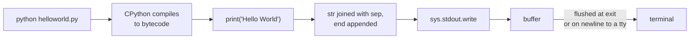

import FileCode from '../../../../components/FileCode.astro'
import Quiz from '../../../../components/Quiz.astro'
import DataCampExercise from '../../../../components/DataCampExercise.astro'


## Abstract
Writing a "Hello, World!" program is the traditional first step in learning any programming language. It looks trivial, but it teaches you four very real things at once: how to **write** source code, how to **save** it as a file your machine can find, how to **run** it through the Python interpreter, and how to **read** the output. In this tutorial we will go beyond just typing one line. We will explore *why* the program works, what happens when you press Enter, common errors beginners hit on their first day, and several small variations that take you from a single print statement to your first interactive program.

By the end of this tutorial you will be able to:
- Verify Python is installed on your computer.
- Create and save a `.py` file.
- Run a script from the terminal.
- Understand what `print()` does and how Python evaluates a line of code.
- Modify the program to take user input and respond.

## Prerequisites
- Python 3.6 or above installed ([download page](https://www.python.org/downloads/)).
- A text editor or IDE. We recommend [Visual Studio Code](https://code.visualstudio.com/) with the official Python extension.
- A terminal you are comfortable opening (Command Prompt or PowerShell on Windows, Terminal on macOS/Linux).
- No previous programming experience required.

## Before You Start
Open a terminal and confirm Python is on your PATH:

```cmd title="check-python"
python --version
```

You should see something like `Python 3.11.4`. If you get *"python is not recognized"* on Windows, re-run the Python installer and check the **"Add Python to PATH"** option, then restart your terminal. On macOS/Linux you may need to use `python3` instead of `python`.

## Getting Started

### Step 1 — Create a project folder
Keeping each project in its own folder is a habit worth forming on day one. It keeps your scripts organized and prevents naming clashes later.

1. Choose a place on your disk, for example `Documents`.
2. Create a new folder named `hello-world`.
3. Open the folder in your editor (in VS Code: **File → Open Folder…**).

### Step 2 — Create the file
1. In your editor, choose **File → New File**.
2. Save it immediately with **File → Save As…** as `hello_world.py` inside the `hello-world` folder.
3. The `.py` extension is important — it tells the operating system and your editor that this is a Python file. Editors use the extension to enable syntax highlighting and Python tooling.

### Step 3 — Write the code
Add the following code to `hello_world.py`:
<FileCode file="projects/beginners/helloworld.py" lang="python" title="Hello World" />

Save the file again with **Ctrl+S** (or **Cmd+S** on macOS).

### Step 4 — Run it
Open the integrated terminal in your editor (**View → Terminal** in VS Code) and run:

```cmd title="command" showLineNumbers{1} {2}
C:\Users\username\Documents\hello-world> python hello_world.py
Hello World!
```

That `Hello World!` line is your program's output, printed to the screen by the Python interpreter.

## How It Works

A Python source file is just a plain text file. When you type `python hello_world.py`, four things happen behind the scenes:

1. **The interpreter starts.** Your operating system launches the `python` executable.
2. **It reads your file top-to-bottom.** Python parses the file into tokens (keywords, names, punctuation), then into an internal tree representation called an **AST** (Abstract Syntax Tree).
3. **It compiles to bytecode.** The AST is compiled into a compact intermediate format. You may notice a `__pycache__` folder appear next to your script — that is the cached bytecode.
4. **It executes the bytecode.** The Python virtual machine walks the bytecode, sees a call to the built-in `print` function with the string `"Hello World!"`, and writes that string to **standard output** — which your terminal then displays.

The whole pipeline is invisible. From your perspective: you saved a file, ran one command, and saw output. Everything else is Python's job.

### What does `print()` actually do?
`print` is a **built-in function**. You can call it with any value:

```python title="print-examples"
print("Hello World!")    # a string
print(42)                # an integer
print(3.14 * 2)          # an expression that evaluates first
print("a", "b", "c")     # multiple values separated by spaces
```

By default `print` appends a newline character (`\n`) after its output. You can change this with the `end` keyword argument:

```python title="end-arg"
print("Hello", end=" ")
print("World!")
# Output: Hello World!
```

## Common Mistakes

Beginners often hit one of these on day one. None of them are signs you are bad at programming — every Python developer has seen them.

| Problem | What you typed | What went wrong | Fix |
|---|---|---|---|
| `SyntaxError: Missing parentheses in call to 'print'` | `print "Hello"` | Python 2 syntax | Use `print("Hello")` |
| `NameError: name 'Hello' is not defined` | `print(Hello)` | Missing quotes — Python looked for a variable named `Hello` | Wrap strings in quotes: `print("Hello")` |
| `python: can't open file 'hello_world.py'` | Ran `python hello_world.py` from wrong folder | Terminal is in a different directory | `cd` into your project folder first |
| Nothing happens | Forgot to **save** the file | Editor still shows the dot meaning unsaved changes | Save with **Ctrl+S** before running |
| `IndentationError` | Pasted code with leading spaces | Python is whitespace-sensitive | Remove leading whitespace on top-level statements |

## Variations to Try

Once your first program runs, modify it. Tweaking working code is the fastest way to learn.

### 1. Ask for a name
```python title="hello_user.py"
name = input("What is your name? ")
print("Hello,", name + "!")
```
- `input()` pauses the program, waits for the user to type something and press Enter, and returns whatever they typed as a string.
- `name + "!"` joins two strings using the `+` operator (called **string concatenation**).

### 2. Use an f-string
F-strings are the modern, readable way to embed values inside strings:
```python title="f-string.py"
name = input("Name: ")
print(f"Hello, {name}! Welcome to Python.")
```
The `f` prefix tells Python: *"this string contains expressions in curly braces — evaluate them and insert the result."*

### 3. Greet in multiple languages
```python title="multilang.py"
print("Hello, World!")
print("Hola, Mundo!")
print("Bonjour le monde!")
print("こんにちは世界")
```
Python source files are UTF-8 by default — non-Latin characters work out of the box.

### 4. Loop a greeting
```python title="loop.py"
for i in range(3):
    print(f"Hello #{i + 1}")
```
This introduces the `for` loop and `range()` — two building blocks you will use in nearly every program.

## Running Without the Terminal

If you prefer not to use the terminal:

- **VS Code:** click the ▶ run button in the top-right while `hello_world.py` is open.
- **PyCharm:** right-click the file in the project tree → **Run 'hello_world'**.
- **IDLE** (bundled with Python): open the file and press **F5**.

All three do the same thing — they invoke `python hello_world.py` for you and capture the output in a panel.

## Frequently Asked Questions

**Why is it always "Hello, World!"?**
The phrase comes from Brian Kernighan's 1972 tutorial for the B programming language and was popularized by the 1978 *C Programming Language* book. It became a tradition.

**Do I need to compile Python like C or Java?**
No. Python compiles to bytecode automatically the first time the file is run and caches it in `__pycache__`. You only run `python hello_world.py`.

**What if I want to share this with someone who does not have Python installed?**
Look into **PyInstaller** or **Nuitka** — both can package a Python script into a standalone executable. That is far beyond Hello World, but good to know it is possible.

## What it produces

Running the file exactly as it ships, with nothing typed at the prompt, takes **0.1 s** and prints:

```text title="python helloworld.py"
Hello World
```

## Educational Value
Even this tiny program teaches:
- **File-based source code** — the foundation of every real Python project.
- **The print function** — output is how programs communicate with humans.
- **String literals** — your first data type.
- **Running an interpreter** — the loop you will use thousands of times: edit, save, run, read output, fix.
- **Reading errors** — error messages are not punishments, they are clues.

## Next Steps
You have a working Python development setup and you understand what happened when you ran your first program. From here, try one of the following:

- Modify the program to greet *you* by name.
- Move on to the next project, **Simple Calculator**, which introduces functions and basic arithmetic.
- Read about [Python's built-in functions](https://docs.python.org/3/library/functions.html) — `print` is just one of about seventy.

You can find the complete source code on [GitHub](https://github.com/Ravikisha/PythonCentralHub/blob/main/projects/beginners/helloworld.py).

## Conclusion
A one-line program is not the goal. The goal is to make sure your environment works end-to-end: editor saves, interpreter runs, terminal shows output. Once that loop is reliable, every other project on Python Central Hub becomes easier. Celebrate this moment — every programmer alive started exactly where you are right now.

## How it fits together



## Pitfalls

- **`print` is a function, not a statement.** In Python 2 `print "hi"` was
  valid syntax; in Python 3 it is a `SyntaxError`. Every tutorial older than
  2020 that you copy from is a candidate for this one.
- **Output is buffered when it is not going to a terminal.** Run this file
  and the text appears instantly; pipe it into another program and it may
  appear only when the process exits. That is why `print(..., flush=True)`
  exists, and why the `stderr` line in the exercise below comes out *first* —
  stderr is unbuffered.
- **`print` converts, it does not format.** `print([1, 2, 3])` shows the
  list's `repr`, and `print(0.1 + 0.2)` shows `0.30000000000000004`, because
  that genuinely is the nearest float to 0.3.
- **The file has no `if __name__ == "__main__":` guard.** For one line that is
  fine, but it means importing this module prints. Every project past this one
  in the section has the guard, and the reason is exactly that.

## Recap

- The whole program is one line, and it runs in **0.094 s** on this machine —
  almost all of that is interpreter startup, not the print.
- `print(*args, sep=" ", end="\n", file=sys.stdout)` — all three keyword
  arguments are what make it more than `sys.stdout.write`.
- Writing to `sys.stderr` keeps a message out of a redirected stdout.
- `print` is a thin wrapper: `file.write(sep.join(map(str, args)) + end)`
  reproduces it exactly.

<Quiz
  questions={[
    {
      q: "What is the difference between print('a', 'b') and print('a' + 'b')?",
      options: [
        "There is none",
        "The first passes two arguments and joins them with sep (a space by default); the second passes one already-joined string",
        "The second is faster because it avoids a function call",
        "The first is invalid syntax"
      ],
      answer: 1,
      explanation: "sep only exists when print receives more than one argument. It is also why print('a', 'b') works on numbers while 'a' + 1 raises TypeError."
    },
    {
      q: "Why might output written with print appear late, or out of order with error messages?",
      options: [
        "Python runs the lines out of order",
        "stdout is buffered when it is not attached to a terminal, while stderr is not — so the two streams can interleave differently than the source order",
        "print is asynchronous",
        "The terminal sorts lines alphabetically"
      ],
      answer: 1,
      explanation: "Pass flush=True, or run with python -u, when ordering across the two streams matters."
    },
    {
      q: "print(0.1 + 0.2) shows 0.30000000000000004. What is wrong?",
      options: [
        "print has a rounding bug",
        "Nothing is wrong with print — 0.1 and 0.2 have no exact binary representation, so their sum is the nearest float, and print is showing it honestly",
        "The addition should use integers",
        "Python needs a higher precision setting"
      ],
      answer: 1,
      explanation: "Use decimal.Decimal for money, or format the output, but do not blame the display for the arithmetic."
    }
  ]}
/>

## Try it yourself

<DataCampExercise
  lang="python"
  hint={`Every argument of print is a parameter you can change: sep, end and file. Try rebuilding print out of sys.stdout.write and check the two agree.`}
  code={`# Task: What print() is actually doing
import sys

# print is not magic. It joins its arguments, adds a terminator, and writes
# the result to a file object. Every one of those three is a parameter.
print("Hello", "World")                       # sep defaults to a space
print("Hello", "World", sep="")                # no separator at all
print("Hello", "World", sep=" -- ")
print("Hello", end="")                         # no newline
print("World")

# The file it writes to is a parameter too. Warnings belong on stderr, so a
# redirect of stdout keeps them on the terminal instead of burying them.
print("this went to stdout", file=sys.stdout)
print("this went to stderr", file=sys.stderr)

# The low-level equivalent. print() is a thin wrapper over this.
sys.stdout.write("Hello World")
sys.stdout.write("\\n")

# Which means print() can be replicated exactly:
def my_print(*args, sep=" ", end="\\n", file=sys.stdout):
    file.write(sep.join(str(a) for a in args) + end)


my_print("Hello", "World")
my_print(1, 2, 3, sep="+")

# And it explains a common surprise: print converts, it does not format.
print([1, 2, 3])            # the list's repr, not its contents
print(0.1 + 0.2)            # the float you get, not the one you typed
print(f"{0.1 + 0.2:.17f}")`}
  solution={`# Task: What print() is actually doing
import sys

print("Hello", "World")                       # Hello World
print("Hello", "World", sep="")                # HelloWorld
print("Hello", "World", sep=" -- ")            # Hello -- World
print("Hello", end="")
print("World")                                 # HelloWorld on one line

print("this went to stdout", file=sys.stdout)
print("this went to stderr", file=sys.stderr)

sys.stdout.write("Hello World")
sys.stdout.write("\\n")


def my_print(*args, sep=" ", end="\\n", file=sys.stdout):
    file.write(sep.join(str(a) for a in args) + end)


my_print("Hello", "World")
my_print(1, 2, 3, sep="+")                     # 1+2+3

print([1, 2, 3])                               # [1, 2, 3]
print(0.1 + 0.2)                               # 0.30000000000000004
print(f"{0.1 + 0.2:.17f}")                     # 0.30000000000000004

# Running this, the stderr line appears FIRST in a captured transcript,
# because stderr is unbuffered and stdout is not. Nothing ran out of order;
# only the flushing differs.`}
/>
