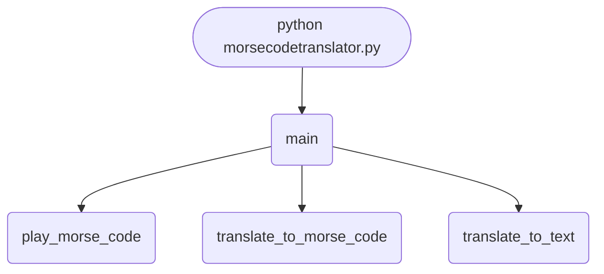

import FileCode from '../../../../components/FileCode.astro'
import Quiz from '../../../../components/Quiz.astro'
import DataCampExercise from '../../../../components/DataCampExercise.astro'

## Abstract
Morse code was the first global digital encoding — used over telegraph wires, ship-to-shore radio, and emergency signaling for over a century. In this project you build a Python translator that converts text to Morse code and back, plays the code as audio beeps using realistic dot-dash-space timing, and supports the full International Morse alphabet including punctuation. Then we add a Tkinter GUI, cross-platform audio (no more Windows-only `winsound`), visual signaling with screen flashes, and an audio decoder that listens to Morse and transcribes it.

You will learn:
- The exact mapping between characters and Morse symbols.
- How to invert a dictionary cleanly for reverse lookup.
- Realistic Morse timing (the 1:3:1:3:7 rule).
- Cross-platform audio generation with NumPy and sounddevice.
- How to encode and decode digital signals — a foundation for any communications project.

## Prerequisites
- Python 3.6 or above.
- A text editor or IDE.
- Speakers (for audio playback).
- Familiarity with dictionaries and string iteration.

## Install Dependencies
The basic version uses only built-ins. For cross-platform audio:
```cmd title="install"
pip install numpy sounddevice
```

## Getting Started

### Create the project
1. Create folder `morse-code-translator`.
2. Inside, create `morsecodetranslator.py`.

### Write the code
<FileCode file="projects/beginners/morsecodetranslator.py" lang="python" title="Morse Translator" />

### Run it
```cmd title="command"
C:\Users\Your Name\morse-code-translator> python morsecodetranslator.py
1. Translate to Morse Code
2. Translate to Text
3. Play Morse Code
4. Exit
Choice: 1
Text: HELLO
Morse: .... . .-.. .-.. ---
```

## The Morse Code Table

```python title="codes.py"
MORSE = {
    "A": ".-",    "B": "-...",  "C": "-.-.",  "D": "-..",
    "E": ".",     "F": "..-.",  "G": "--.",   "H": "....",
    "I": "..",    "J": ".---",  "K": "-.-",   "L": ".-..",
    "M": "--",    "N": "-.",    "O": "---",   "P": ".--.",
    "Q": "--.-",  "R": ".-.",   "S": "...",   "T": "-",
    "U": "..-",   "V": "...-",  "W": ".--",   "X": "-..-",
    "Y": "-.--",  "Z": "--..",
    "0": "-----", "1": ".----", "2": "..---", "3": "...--",
    "4": "....-", "5": ".....", "6": "-....", "7": "--...",
    "8": "---..", "9": "----.",
    ".": ".-.-.-", ",": "--..--", "?": "..--..", "/": "-..-.",
    "(": "-.--.",  ")": "-.--.-", "-": "-....-",
}
TEXT = {v: k for k, v in MORSE.items()}     # reverse lookup, built in one line
```
The dictionary-comprehension `{v: k for k, v in MORSE.items()}` is the cleanest way to invert a dict.

## How it fits together

Read from the top: this is what runs when you execute the file, and which function calls which. It is generated from the code, so it cannot drift from it.



## What it produces

Running the file exactly as it ships, with nothing typed at the prompt, takes **0.1 s** and prints:

```text title="python morsecodetranslator.py"

Morse Code Translator
1. Translate to Morse Code
2. Translate to Text
3. Play Morse Code
4. Exit
Enter your choice: 1   (scripted demo answer)
Text: SOS help   (scripted demo answer)
Morse: ... --- ... / .... . .-.. .--.
Flash: # # #    ### ### ###    # # #              # # # #    #    # ### # #    # ### ### # 
Would take 5.0s at 60 ms per dit

Morse Code Translator
...
```

The menu then decodes `... --- ...` back to SOS and encodes `Hello World`; the first exchange is shown.

## Step-by-Step Explanation

### 1. Text → Morse
```python title="encode.py"
def to_morse(text: str) -> str:
    parts = []
    for ch in text.upper():
        if ch == " ":
            parts.append("/")             # word separator
        elif ch in MORSE:
            parts.append(MORSE[ch])
        # silently skip unknown characters
    return " ".join(parts)
```
- Letters are separated by **one space**.
- Words are separated by `" / "` (a slash with spaces around it) — the International convention.

### 2. Morse → Text
```python title="decode.py"
def from_morse(morse: str) -> str:
    out = []
    for word in morse.split(" / "):
        letters = []
        for code in word.split():
            if code in TEXT:
                letters.append(TEXT[code])
            else:
                letters.append("?")        # unknown code
        out.append("".join(letters))
    return " ".join(out)
```
Two split levels: words on `/`, letters on whitespace.

### 3. Audio playback
The original used Windows-only `winsound`. Here is the cross-platform version using NumPy + sounddevice:
```python title="play.py"
import numpy as np
import sounddevice as sd

UNIT = 0.08            # seconds per "dit" (dot)
FREQ = 700             # Hz

def tone(seconds):
    t = np.linspace(0, seconds, int(seconds * 44100), endpoint=False)
    wave = 0.4 * np.sin(2 * np.pi * FREQ * t)
    sd.play(wave, 44100); sd.wait()

def silence(seconds):
    sd.play(np.zeros(int(seconds * 44100)), 44100); sd.wait()

def play_morse(morse: str):
    for sym in morse:
        if   sym == ".": tone(UNIT)
        elif sym == "-": tone(UNIT * 3)
        elif sym == " ": silence(UNIT * 3)
        elif sym == "/": silence(UNIT * 7)
        # intra-character gap (between dots/dashes of a letter) = 1 unit
        silence(UNIT)
```
A clean, smooth sine wave instead of harsh beeps.

## Real Morse Timing — The 1:3:1:3:7 Rule

International Morse defines all durations as multiples of one **"unit"**:
- **Dot (·)**: 1 unit on.
- **Dash (−)**: 3 units on.
- **Intra-character gap** (between dots/dashes of the same letter): 1 unit off.
- **Inter-character gap** (between letters): 3 units off.
- **Inter-word gap** (between words): 7 units off.

A speed of "20 WPM" (words per minute) means roughly 60 ms per unit. Slow learners use 100 ms; experts use 30 ms.

## Common Mistakes

| Problem | Cause | Fix |
|---|---|---|
| `KeyError: 'h'` | Forgot to uppercase | `ch = ch.upper()` |
| Wrong character on decode | Whitespace mismatch (multiple spaces) | `morse.split()` (splits on any whitespace) |
| Reverse lookup wrong character | Manual inversion left bugs | Use `{v: k for k, v in MORSE.items()}` |
| Words run together on decode | No `/` separator | Use `" / "` for word breaks |
| Audio harsh and clicky | Square-wave beeps | Use a sine wave (NumPy) |
| Only works on Windows | `winsound` | Use `sounddevice` + NumPy |

## Variations to Try

### 1. Visual flasher
Replace audio with a Tkinter window that flashes:
```python title="flash.py"
def flash(seconds, color="white"):
    label.config(bg=color); root.update(); time.sleep(seconds)
    label.config(bg="black"); root.update(); time.sleep(UNIT)
```
Useful for signaling at sea or for accessibility.

### 2. Tkinter GUI
A window with a text input, output box, and "To Morse" / "To Text" / "Play" / "Stop" buttons. See [Currency Exchange Rate Calculator GUI](./currencyexchnageratecalculator) for the pattern.

### 3. WAV file export
Concatenate the audio array and save as `output.wav` with `scipy.io.wavfile.write`.

### 4. Audio decoder
Use `sounddevice.rec` to capture mic input. Detect peaks above a threshold, measure their duration, and classify as dot/dash. Match gaps to find letter and word boundaries. The hardest part is choosing a sensible threshold — adaptive amplitude detection helps.

### 5. Adjustable speed
A `Scale` widget controls WPM. Recalculate `UNIT = 1.2 / wpm` on every change.

### 6. Prosigns
Support `<SK>` (end of contact), `<AR>` (end of message), `<BT>` (new paragraph), `<KN>` (named station only).

### 7. Practice mode
Generate random words; player types what they hear. Score and high-score tracking.

### 8. Light-pulse output
Pair with a Raspberry Pi and an LED — physically blink the Morse code.

### 9. Network transmission
Send Morse over a TCP socket between two computers — a working "telegraph network".

### 10. Multi-language
Cyrillic, Greek, Japanese Wabun all have their own Morse mappings.

## Common Morse Phrases

| Phrase | Morse | Meaning |
|---|---|---|
| **SOS** | `... --- ...` | International distress signal (note: not "Save Our Souls" — chosen for being unambiguous) |
| **CQ** | `-.-. --.-` | "Calling any station" |
| **73** | `--... ...--` | "Best regards" — ham radio sign-off |
| **88** | `---.. ---..` | "Love and kisses" |
| **QTH** | `--.- - ....` | "What is your location?" |
| **QRT** | `--.- .-. -` | "Stop transmitting" |

## Real-World Applications
- **Amateur radio (ham)** — Morse is still active on shortwave bands.
- **Aviation** — VOR/NDB navigation beacons identify themselves in Morse.
- **Emergency signaling** — light/sound SOS without electronics.
- **Accessibility** — single-switch input device for people with severe motor disabilities.
- **Education** — teaching encoding, timing, and digital communication concepts.

## Educational Value
- **Dictionary inversion** — one of the most common Python idioms.
- **Encoding & decoding** — generalizes to any symbol-substitution cipher.
- **Audio generation** — sine waves, sample rates, NumPy basics.
- **Timing-sensitive code** — what real-time means in practice.
- **Cross-platform thinking** — Windows vs. Linux vs. macOS audio APIs.

## Next Steps
- Replace **`winsound`** with the **NumPy + sounddevice** version above.
- Add a **Tkinter GUI** with text fields and a "play" button.
- Build an **audio decoder** that listens to Morse and transcribes it.
- Add **adjustable WPM**.
- Combine with [Basic Music Player](./basicmusicplayer) for richer audio.

## Conclusion
You built a translator that handles letters, digits, punctuation, and audio playback — the same building blocks every digital communication protocol uses. From the perspective of encoding theory, Morse is the simplest "variable-length prefix code" you can study, and the same principles power UTF-8 and Huffman coding. Full source on [GitHub](https://github.com/Ravikisha/PythonCentralHub/blob/main/projects/beginners/morsecodetranslator.py). Find more encoding projects on Python Central Hub.

## Pitfalls

- **`import winsound` at the top of the file made it Windows-only.** A
  platform-specific module imported for an optional beep decides whether the
  whole translator loads. It now lives inside `tone()`, where it can fail
  without taking the encoder with it.
- **`main()` called itself for every menu choice.** That is recursion used as
  a `goto`: each choice adds a stack frame, and a long enough session ends in
  `RecursionError` instead of at the exit option. A `while True` loop is the
  same code without the ceiling.
- **Decoding by searching the values list.** The original ran
  `list(MORSE.values()).index(letter)` per character, rebuilding two lists
  each time to do a linear scan. `{code: letter for letter, code in ...}` is
  one line, built once, and O(1) per lookup.
- **Losing the word separator loses the message.** `IT IS ON` and `ITISON`
  encode to identical symbols once the word gap is a plain space. Worse,
  `...---...` with no gaps at all has **430** valid readings — `SOS` is one
  of them, and so is `EEAMEEE`.

## Recap

- Encoding is a dict lookup; decoding is the reversed dict. Everything else
  is spacing.
- Morse timing is defined in dits: a dah is 3, the gap inside a letter is 1,
  between letters 3, between words 7. `play_morse(audible=False)` adds that
  table up without waiting, which is what makes the duration testable.
- At 60 ms per dit, measured: `E` takes **0.06 s**, `T` **0.18 s**, `SOS`
  **1.74 s**, `HELLO WORLD` **7.56 s**.
- `E` is one dit and `T` is three because the most common English letters got
  the shortest codes. The alphabet is a compression scheme.

<Quiz
  questions={[
    {
      q: "Why was importing winsound at the top of the file a problem?",
      options: [
        "It is slow to import",
        "It only exists on Windows, so the entire translator failed to import on other platforms for the sake of an optional beep",
        "It conflicts with the time module",
        "It requires administrator rights"
      ],
      answer: 1,
      explanation: "Import a platform- or dependency-specific module inside the function that needs it, so its absence costs you that feature and nothing else."
    },
    {
      q: "The gapless string ...---... has 430 valid readings. What does that show?",
      options: [
        "Morse code is broken",
        "Symbol gaps are not formatting — they carry information, and without them decoding is ambiguous rather than merely harder",
        "SOS is a poorly chosen signal",
        "The decoder has a bug"
      ],
      answer: 1,
      explanation: "Morse is not a prefix-free code over the raw symbols; the timing gaps are what make it decodable at all."
    },
    {
      q: "The original decoder ran list(MORSE.values()).index(letter) for every character. What is wrong with it?",
      options: [
        "It returns the wrong letter",
        "It rebuilds two lists and linearly scans them per character, where a reversed dict built once gives the same answer in constant time",
        "It cannot handle digits",
        "It is only correct for uppercase input"
      ],
      answer: 1,
      explanation: "The answer was right; the cost was not. Building the reverse map once is one line."
    }
  ]}
/>

## Try it yourself

<DataCampExercise
  lang="python"
  hint={`Encode two different phrases with a plain space between words instead of a slash, and compare the results. Then try to decode a string with no gaps at all.`}
  code={`# Task: Why Morse needs a word separator
MORSE = {'A': '.-', 'B': '-...', 'C': '-.-.', 'D': '-..', 'E': '.',
         'H': '....', 'I': '..', 'L': '.-..', 'O': '---', 'S': '...',
         'T': '-', 'W': '.--', 'R': '.-.', 'N': '-.', 'M': '--'}
TEXT = {code: letter for letter, code in MORSE.items()}


def to_morse(text, word_gap=" / "):
    return word_gap.join(
        " ".join(MORSE[c] for c in word if c in MORSE)
        for word in text.upper().split())


def from_morse(code):
    return " ".join(
        "".join(TEXT[s] for s in word.split() if s in TEXT)
        for word in code.split("/")).strip()


for phrase in ("SOS", "HELLO WORLD", "IT IS ON"):
    code = to_morse(phrase)
    back = from_morse(code)
    print(f"{phrase:12} -> {back:12} {'ok' if back == phrase else 'LOST'}")

# Without the separator, spacing is the only clue, and it is not enough.
for phrase in ("IT IS ON", "ITISON"):
    print(f"  {phrase:8} -> {to_morse(phrase, word_gap=' ')}")


def readings(symbols):
    # Every way to split a gapless Morse string into valid letters.
    if not symbols:
        return [""]
    out = []
    for size in (1, 2, 3, 4):
        head, rest = symbols[:size], symbols[size:]
        if head in TEXT:
            out.extend(TEXT[head] + tail for tail in readings(rest))
    return out


gapless = to_morse("SOS").replace(" ", "")
found = sorted(set(readings(gapless)))
print(f"'{gapless}' has {len(found)} valid readings, e.g. {found[:4]}")`}
  solution={`# Task: Why Morse needs a word separator
#
# Measured output:
#
#   SOS          -> SOS          ok
#   HELLO WORLD  -> HELLO WORLD  ok
#   IT IS ON     -> IT IS ON     ok
#     IT IS ON -> .. - .. ... --- -.
#     ITISON   -> .. - .. ... --- -.
#   '...---...' has 430 valid readings, e.g. ['EEAMEEE', 'EEAMEI', ...]
#
# Two different phrases encode to identical symbols the moment the word gap
# stops being distinguishable, so no decoder can recover which was sent. The
# slash is not decoration.
#
# The 430 figure is the same problem taken to its limit. Morse symbols are
# not prefix-free: '.' is a valid letter and so is '..', so a run of dots can
# be cut in many places. The gaps are what make the encoding decodable, which
# is why the timing specification is part of Morse rather than a rendering
# detail -- one dit between symbols, three between letters, seven between
# words.`}
/>
