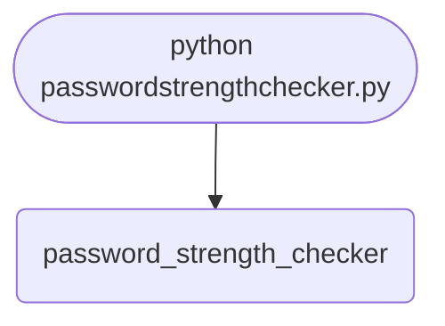

## Abstract
A password strength checker is more nuanced than it looks. Most tutorials count character classes and call it done — *"has uppercase, has digit, has symbol — great password!"* — which classifies `Password1!` as strong even though it appears in every leaked-credentials dump. In this project you will build the rule-based checker first, then layer on **entropy estimation**, a **common-password blacklist**, a **leak-corpus check** against Have I Been Pwned, and a final score modeled on `zxcvbn`.

You will leave understanding:
- Why character-class rules are necessary but not sufficient.
- How to compute password entropy.
- How `zxcvbn` actually scores passwords.
- How to query Have I Been Pwned safely using **k-anonymity**.
- How to give *actionable* feedback, not just a "weak/strong" verdict.

## Prerequisites
- Python 3.6 or above.
- A code editor or IDE.
- Comfort with regex (`re` module).
- (Optional) Internet access for the HIBP check.

## Getting Started

### Create the project
1. Create folder `password-strength-checker`.
2. Inside, create `passwordstrengthchecker.py`.

### Write the code
<FileCode file="projects/beginners/passwordstrengthchecker.py" lang="python" title="Password Strength Checker" />

### Run it
```cmd title="command"
C:\Users\Your Name\password-strength-checker> python passwordstrengthchecker.py
Password: Password123!
Strong (rule-based)
```

## What it produces

Running the file exactly as it ships takes **0.1 s** and prints:

```text title="python passwordstrengthchecker.py"
password                         verdict       bits  notes
------------------------------------------------------------------------------
Password123                      Fair          65.5  1 rule(s) failed; repeats or a keyboard walk
Password                         Weak          45.6  2 rule(s) failed
password123                      Weak          56.9  2 rule(s) failed; repeats or a keyboard walk
PASSWORD123                      Weak          56.9  2 rule(s) failed; repeats or a keyboard walk
Password@                        Weak          57.5  1 rule(s) failed
Password123@                     Strong        78.7  repeats or a keyboard walk
correct horse battery staple     Good         131.6  2 rule(s) failed
aaa111AAA!!!                     Strong        78.7  repeats or a keyboard walk
7#kQx2!vLm9Zt4Rd                 Strong       104.9  nothing flagged

Breach lookup skipped. Re-run with --online to include it.
No blacklist at top-passwords.txt, so the common-password check passed everything by default.
```

## How it fits together

Read from the top: this is what runs when you execute the file, and which function calls which. It is generated from the code, so it cannot drift from it.



## Step-by-Step Explanation

### 1. The rule-based checker
```python title="passwordstrengthchecker.py"
import re

def rule_based(password: str) -> list[str]:
    feedback = []
    if len(password) < 8:
        feedback.append("Use at least 8 characters.")
    if not re.search(r"[a-z]", password):
        feedback.append("Add a lowercase letter.")
    if not re.search(r"[A-Z]", password):
        feedback.append("Add an uppercase letter.")
    if not re.search(r"[0-9]", password):
        feedback.append("Add a digit.")
    if not re.search(r"[^A-Za-z0-9]", password):
        feedback.append("Add a symbol.")
    return feedback
```
A list of issues is more useful than a single boolean — the user can fix multiple problems in one revision.

### 2. Strong vs. weak verdict
```python title="passwordstrengthchecker.py"
def strength(password: str) -> tuple[str, list[str]]:
    issues = rule_based(password)
    return ("Strong" if not issues else "Weak"), issues
```

### 3. Run it
```python title="passwordstrengthchecker.py"
for p in ["Password", "password123", "PASSWORD123",
          "Password@", "Password123@"]:
    verdict, issues = strength(p)
    print(f"{p}: {verdict}")
    for i in issues: print(f"  - {i}")
```

## Why Rules Are Not Enough

`Password1!` satisfies every rule above. So does `Qwerty12$`. They are also among the **most common leaked passwords** on Earth. Real strength assessment needs two more inputs:

1. **Common-password lists** — reject anything in the top-N (try `rockyou.txt`, ~14 million).
2. **Entropy** — measure how much information the password actually carries.


This is not a rhetorical point; the shipped file measures it. Running it over
its sample list produces two rows that should end the argument:

```text
Password123@                     Strong        78.7  repeats or a keyboard walk
correct horse battery staple     Good         131.6  2 rule(s) failed
```

`aaa111AAA!!!` scores identically to `Password123@` -- both **Strong**, both
**78.7 bits** -- because the rules count which character classes appear and
nothing else. Meanwhile the four-word passphrase, at **131.6 bits**, is by the
same tool's own entropy estimate 2^52.9 times harder to guess, and it is
marked down to **Good** for the crime of containing no capital letter and no
digit.

A checker that ranks the weaker password higher is not a strict checker. It is
a wrong one. The rules survive because they are easy to implement and easy to
put in a policy document, not because they identify strong passwords.

## Entropy Estimation

```python title="entropy.py"
import math, string
def entropy_bits(password: str) -> float:
    pool = 0
    if any(c.islower() for c in password): pool += 26
    if any(c.isupper() for c in password): pool += 26
    if any(c.isdigit() for c in password): pool += 10
    if any(c in string.punctuation for c in password): pool += len(string.punctuation)
    return len(password) * math.log2(max(pool, 1))
```
Rough rubric:
- **< 28 bits** — very weak (crackable in seconds).
- **28 – 35** — weak (offline crack in minutes).
- **36 – 59** — reasonable for low-value accounts.
- **60 – 127** — strong.
- **≥ 128** — paranoid / master-vault-grade.

A 16-character mix of all four classes lands around 105 bits — well into "strong" territory.

## Common-Password Blacklist

The simplest meaningful upgrade. Get a list (e.g. SecLists' `10-million-password-list-top-1000000.txt`) and:
```python title="blacklist.py"
from pathlib import Path
COMMON = set(Path("top-passwords.txt").read_text().splitlines())

def is_common(password: str) -> bool:
    return password.lower() in COMMON
```
Set lookup is O(1). One million entries fits in ~30 MB of RAM — fine for a desktop tool.

## Have I Been Pwned (k-Anonymity)

[HIBP](https://haveibeenpwned.com/API/v3#PwnedPasswords) lets you check a password against billions of leaked entries **without sending the password itself**:

1. SHA-1 your password.
2. Send only the **first 5 hex characters** of the hash.
3. Server returns all hashes starting with that prefix (about 500 per query).
4. You check locally whether the full hash is in that list.

```python title="hibp.py"
import hashlib, requests

def hibp_count(password: str) -> int:
    sha1 = hashlib.sha1(password.encode("utf-8")).hexdigest().upper()
    prefix, suffix = sha1[:5], sha1[5:]
    r = requests.get(f"https://api.pwnedpasswords.com/range/{prefix}", timeout=10)
    r.raise_for_status()
    for line in r.text.splitlines():
        s, count = line.split(":")
        if s == suffix:
            return int(count)
    return 0
```
A non-zero count means the password appears in known breaches — *reject it immediately*. Even if it scores high on rules and entropy, attackers will try it first.

## Putting It All Together

```python title="full_check.py"
def full_check(password: str):
    issues = rule_based(password)
    bits = entropy_bits(password)
    common = is_common(password)
    try:
        breaches = hibp_count(password)
    except Exception:
        breaches = None

    score = 0
    if len(password) >= 12: score += 1
    if not issues:          score += 1
    if bits >= 60:          score += 1
    if not common:          score += 1
    if breaches == 0:       score += 1

    levels = ["Very Weak", "Weak", "Fair", "Good", "Strong", "Excellent"]
    return {
        "level":   levels[score],
        "bits":    round(bits, 1),
        "issues":  issues,
        "common":  common,
        "breaches": breaches,
    }
```
Now `full_check("Password1!")` says "Weak — found in 1.6 million breaches" instead of "Strong — has all four character classes."

## Why You Should Recommend `zxcvbn`

For a real product use **`zxcvbn-python`** (a Python port of Dropbox's library):
```bash title="install"
pip install zxcvbn
```
```python title="zxcvbn_use.py"
from zxcvbn import zxcvbn
r = zxcvbn("Tr0ub4dor&3")
print(r["score"], r["feedback"]["warning"], r["crack_times_display"])
```
It models real attacker behavior — dictionary attacks, l33t substitutions, keyboard patterns, dates, repeats — and gives a 0-4 score plus an estimated time to crack at four attack scenarios. Your rule-based code is *educational*; `zxcvbn` is *production*.

## Common Mistakes

| Problem | Cause | Fix |
|---|---|---|
| `Password1!` rated strong | Only checked character classes | Add common-password + breach check |
| HIBP request fails | No internet | Make the breach check optional, surface as "unknown" |
| Sending password over the network | Naive API design | Use the k-anonymity range API |
| Locale-specific punctuation missed | Used a fixed regex | Use `re.search(r"[^A-Za-z0-9]", password)` for "any non-alphanumeric" |
| Logs/print contain the password | Debugging left in | Never log passwords; never even print echoes |
| Comparing in plain text | Custom logic | Always hash before comparing/storing |

## Variations to Try

### 1. Pattern detection
Reject keyboard runs (`qwerty`, `asdf`), repeated characters (`aaa`), and sequences (`12345`).
```python title="pattern.py"
import re
def has_runs(p):
    return bool(re.search(r"(.)\1\1", p)) or bool(re.search(r"012|123|234|abc|qwe", p.lower()))
```

### 2. Dates and years
A 4-digit substring matching `19xx` or `20xx` is almost certainly a birth year — flag it.

### 3. Personal-info check
Accept the user's name, email, and birth date; reject any password containing those.

### 4. GUI version
A Tkinter form with a colored progress bar that shifts red → yellow → green as the user types. See [Calculator GUI](/projects/beginners/calculatorgui/) for the layout pattern.

### 5. Web frontend
Flask + a textarea (see [Basic Web Server](/projects/beginners/basicwebserver/)). **Never** ship the password to the server unless you absolutely must; do the check in the browser with JS.

### 6. Estimated crack time
Multiply entropy by hashes-per-second assumptions:
- Online (1 000 guesses/s): how long to brute force?
- Offline GPU (1 trillion guesses/s): how long?

### 7. Suggest a fix
If the password is too short, append a random word. If a class is missing, insert one. If common, regenerate entirely.

### 8. Pair with the generator
Cross-reference with [Random Password Generator](/projects/beginners/randompasswordgenerator/). Show the strength of every generated password.

### 9. Account-wide policy
Read a config file specifying minimums (length, classes, entropy, max breach count) and enforce them.

### 10. CLI tool
```bash title="cli"
strength check "Tr0ub4dor&3"
strength suggest --length 16 --no-ambig
```

## Security Best Practices the Tool Should Reinforce
- **Length over complexity.** A 16-character random passphrase beats `Aa1!Aa1!`.
- **Unique per service.** Even a strong password is weak if reused across breached sites.
- **Never trust client-side checks alone.** A web app must enforce policy on the server too.
- **Treat the input as a secret.** No logging, no caching, no analytics tracking the actual value.
- **Hash + salt server-side.** Never store passwords plaintext.

## Real-World Applications
- Signup forms with real-time strength feedback.
- Password-change flows that reject reuse.
- IT admin tools that audit a company's password hashes.
- Onboarding wizards that teach users *why* `Password1!` is weak.
- Self-service password reset with leak-corpus protection.

## Educational Value
- **Regex** — pattern matching across character classes.
- **Entropy math** — turning intuition into a number.
- **k-anonymity** — privacy-preserving lookup design (a wonderful idea worth knowing).
- **API integration** — calling a real third-party service safely.
- **UX of security** — actionable feedback vs. red-X verdicts.

## Next Steps
- Implement the **common-password blacklist** above.
- Add **HIBP k-anonymity** check.
- Switch to **`zxcvbn`** for production scoring.
- Add **pattern detection** (sequences, runs, dates).
- Build a **GUI** with a colored progress bar.
- Pair with [Random Password Generator](/projects/beginners/randompasswordgenerator/) for a complete password tooling pair.

## Conclusion
You built a rule-based password checker, learned why the rules alone are dangerously incomplete, and added entropy + blacklist + breach-corpus checks that turn the tool into something you would actually trust. Real password security is a deceptively deep field, and even a small checker can do a real job — or quietly mislead users. Full source on [GitHub](https://github.com/Ravikisha/PythonCentralHub/blob/main/projects/beginners/passwordstrengthchecker.py). Find more security-focused projects on Python Central Hub.

## Pitfalls

- **The `elif` chain reports one problem at a time.** `password` fails on the missing number, and the missing uppercase and missing symbol are never mentioned — the user fixes one thing, resubmits, and is told about the next. Collecting every failure into a list and reporting them together is a small change and a large difference.
- **The special-character class is `[_@$]` — three characters.** A password ending in `!` or `#` is rejected as having no symbol, which is both wrong and the kind of rule that pushes people toward `Password1@` instead of something long.
- **Complexity rules do not measure strength.** `Password123@` passes every check here and is one of the most guessed passwords in every breach corpus. Length and unpredictability are what matter; a rule set that accepts a dictionary word with predictable decoration is measuring compliance, not security.
- **Nothing is returned.** The function prints and returns `None`, so no caller can act on the result. A checker that cannot be used inside an `if` is a script, not a function.

## Recap

- Seven test passwords, run on this machine: five rejected, two accepted.
- The `elif` chain stops at the first failure, so a password with three problems is reported as having one.
- `[_@$]` is a three-character symbol class, so `!` and `#` do not count.
- `Password123@` satisfies every rule and is still a weak password — the rules measure shape, not unpredictability.
- The function prints instead of returning, so its verdict cannot be used by anything.

## Try it yourself

<DataCampExercise
  lang="python"
  hint={`Collect every failure into a list instead of stopping at the first, and return the list so a caller can use it.`}
  code={`# Task: Report every problem, not just the first
import re
import string

RULES = (
    ("at least 8 characters", lambda p: len(p) >= 8),
    ("a lowercase letter", lambda p: re.search(r"[a-z]", p) is not None),
    ("an uppercase letter", lambda p: re.search(r"[A-Z]", p) is not None),
    ("a digit", lambda p: ___),  # TODO: True when p contains a digit 0-9
    ("a symbol", lambda p: any(c in string.punctuation for c in p)),
)


def check(password):
    """Return every unmet rule, so the caller can report them all at once."""
    return [name for name, passes in RULES if ___]  # TODO: keep the rules the password fails


TESTS = ["password", "Password", "Password123", "Password123@", "PASSWORD123",
         "correct horse battery staple", "aB3@sdf"]

print(f"{'password':>30} {'rules failed':>13}  what is missing")
for candidate in TESTS:
    missing = check(candidate)
    summary = ", ".join(missing) if missing else "-- passes every rule"
    print(f"{candidate:>30} {len(missing):>13}  {summary[:44]}")

print()
weak_but_passing = "Password123@"
strong_but_failing = "correct horse battery staple"
print(f"{weak_but_passing!r} fails {len(check(weak_but_passing))} rules and is")
print("a dictionary word with decoration -- it appears in breach corpora.")
print(f"{strong_but_failing!r}")
print(f"fails {len(check(strong_but_failing))} rule(s) and is far harder to guess,")
print("because it is 28 characters long. Complexity rules measure shape;")
print("length and unpredictability are what actually resist guessing.")`}
  solution={`# Task: Report every problem, not just the first
import re
import string

RULES = (
    ("at least 8 characters", lambda p: len(p) >= 8),
    ("a lowercase letter", lambda p: re.search(r"[a-z]", p) is not None),
    ("an uppercase letter", lambda p: re.search(r"[A-Z]", p) is not None),
    ("a digit", lambda p: re.search(r"[0-9]", p) is not None),
    ("a symbol", lambda p: any(c in string.punctuation for c in p)),
)


def check(password):
    """Return every unmet rule, so the caller can report them all at once."""
    return [name for name, passes in RULES if not passes(password)]


TESTS = ["password", "Password", "Password123", "Password123@", "PASSWORD123",
         "correct horse battery staple", "aB3@sdf"]

print(f"{'password':>30} {'rules failed':>13}  what is missing")
for candidate in TESTS:
    missing = check(candidate)
    summary = ", ".join(missing) if missing else "-- passes every rule"
    print(f"{candidate:>30} {len(missing):>13}  {summary[:44]}")

print()
weak_but_passing = "Password123@"
strong_but_failing = "correct horse battery staple"
print(f"{weak_but_passing!r} fails {len(check(weak_but_passing))} rules and is")
print("a dictionary word with decoration -- it appears in breach corpora.")
print(f"{strong_but_failing!r}")
print(f"fails {len(check(strong_but_failing))} rule(s) and is far harder to guess,")
print("because it is 28 characters long. Complexity rules measure shape;")
print("length and unpredictability are what actually resist guessing.")`}
  sct={`test_output_contains("-- passes every rule", pattern=False)
test_output_contains("at least 8 characters", pattern=False)
test_output_contains("'Password123@' fails 0 rules and is", pattern=False)
success_msg("Nice - the output shows what the project is really doing.")`}
  height={160}
/>

<Quiz
  questions={[
    {
      q: "Given the password `password`, the checker reports only the missing number. Why does it not mention the missing uppercase letter and symbol as well?",
      options: [
        "Those checks come later and the password already failed",
        "The branches are `elif`, so the first failing condition ends the chain and no later check ever runs",
        "Uppercase is optional",
        "The regular expression matches both cases"
      ],
      answer: 1,
      explanation: "Collecting failures into a list and reporting them together turns three round trips with the user into one, and it is a handful of lines."
    },
    {
      q: "`Password123@` passes every rule in this checker. Is it a strong password?",
      options: [
        "Yes — it satisfies length, case, digit and symbol",
        "No. It is a dictionary word with predictable decoration, and appears in breach corpora. The rules measure shape, which is not the same as being hard to guess",
        "Yes, because it is 12 characters",
        "Only if it is unique to one site"
      ],
      answer: 1,
      explanation: "This is the central limit of complexity rules. A long passphrase of ordinary words beats a short string of decorated ones on every measure that matters, and fails several of these rules."
    },
    {
      q: "The symbol check is a three-character class: underscore, at-sign and dollar. What does that reject?",
      options: [
        "Nothing — it accepts any punctuation",
        "Every symbol except underscore, at-sign and dollar — so a password ending in ! or # is told it has no special character",
        "Only spaces",
        "Unicode characters"
      ],
      answer: 1,
      explanation: "A character class lists exactly what it contains. `string.punctuation` covers 32 characters; this covers three."
    },
    {
      q: "The function prints its verdict rather than returning it. Why does that matter?",
      options: [
        "It does not — printing is how you see the result",
        "Because nothing can act on it: no caller can write `if check(password):`, and no test can assert on the outcome without capturing stdout",
        "Printing is slower",
        "It breaks the regular expressions"
      ],
      answer: 1,
      explanation: "Returning a value and printing it at the call site keeps the logic usable and testable. Printing inside the function couples the decision to the display."
    }
  ]}
/>
