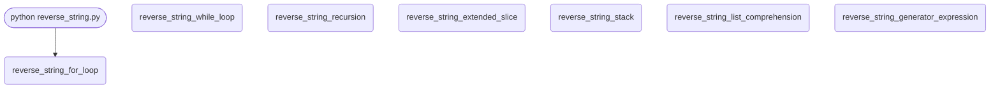

import FileCode from '../../../../components/FileCode.astro'
import Quiz from '../../../../components/Quiz.astro'
import DataCampExercise from '../../../../components/DataCampExercise.astro'

## Abstract
Reverse a String is an educational Python project that demonstrates multiple approaches to solve a fundamental programming problem. The project showcases seven different methods to reverse a string: for loop, while loop, recursion, extended slice syntax, stack data structure, list comprehension, and generator expressions. This comprehensive implementation helps beginners understand various programming concepts and provides insight into Python's versatility and different problem-solving approaches.

## Prerequisites
- Python 3.6 or above
- A code editor or IDE
- Basic understanding of Python fundamentals

## Before you Start
Before starting this project, you must have Python installed on your computer. If you don't have Python installed, you can download it from [here](https://www.python.org/downloads/). You must have a code editor or IDE installed on your computer. If you don't have any code editor or IDE installed, you can download Visual Studio Code from [here](https://code.visualstudio.com/download).

Note: This project uses only built-in Python features, so no additional installations are required.

## Getting Started
#### Create a Project
1. Create a folder named `reverse-string`.
2. Open the folder in your favorite code editor or IDE.
3. Create a file named `reverse_string.py`.
4. Copy the given code and paste it in your `reverse_string.py` file.

## Write the Code
1. Copy and paste the following code in your `reverse_string.py` file.
<FileCode file="projects/beginners/reverse_string.py" lang="python" title="Reverse a String" />
2. Save the file.
3. Open the terminal in your code editor or IDE and navigate to the folder `reverse-string`.
```cmd title="command" showLineNumbers{1} {1-10}
C:\Users\Your Name\reverse-string> python reverse_string.py
Original string: Reverse this string
For loop: gnirts siht esreveR
While loop: gnirts siht esreveR
Recursion: gnirts siht esreveR
Extended slice: gnirts siht esreveR
Stack: gnirts siht esreveR
List comprehension: gnirts siht esreveR
Generator expression: gnirts siht esreveR
```

## Methods Explained

### 1. For Loop Method
```python title="reverse_string.py" showLineNumbers{1} {1-5}
def reverse_string_for_loop(string):
    string_reverse = ''
    for i in string:
        string_reverse = i + string_reverse
    return string_reverse
```
**How it works:** Iterates through each character and prepends it to the result string.

### 2. While Loop Method
```python title="reverse_string.py" showLineNumbers{1} {1-7}
def reverse_string_while_loop(string):
    string_reverse = ''
    index = len(string)
    while index > 0:
        string_reverse += string[index - 1]
        index = index - 1
    return string_reverse
```
**How it works:** Uses index-based access to build the reversed string from the end.

### 3. Recursion Method
```python title="reverse_string.py" showLineNumbers{1} {1-5}
def reverse_string_recursion(string):
    if len(string) == 0:
        return string
    else:
        return reverse_string_recursion(string[1:]) + string[0]
```
**How it works:** Recursively calls itself with a substring, building the result by appending the first character to the end.

### 4. Extended Slice Syntax (Pythonic Way)
```python title="reverse_string.py" showLineNumbers{1} {1-2}
def reverse_string_extended_slice(string):
    return string[::-1]
```
**How it works:** Uses Python's slice notation with a step of -1 to reverse the string.

### 5. Stack Method
```python title="reverse_string.py" showLineNumbers{1} {1-8}
def reverse_string_stack(string):
    stack = []
    for i in string:
        stack.append(i)
    string_reverse = ''
    while len(stack) > 0:
        string_reverse += stack.pop()
    return string_reverse
```
**How it works:** Pushes characters onto a stack, then pops them to create the reversed string.

### 6. List Comprehension Method
```python title="reverse_string.py" showLineNumbers{1} {1-2}
def reverse_string_list_comprehension(string):
    return ''.join([string[i] for i in range(len(string) - 1, -1, -1)])
```
**How it works:** Creates a list of characters in reverse order using list comprehension, then joins them.

### 7. Generator Expression Method
```python title="reverse_string.py" showLineNumbers{1} {1-2}
def reverse_string_generator_expression(string):
    return ''.join(i for i in reversed(string))
```
**How it works:** Uses Python's built-in `reversed()` function with a generator expression.

## Performance Comparison

| Method | Time Complexity | Space Complexity | Readability | Pythonic |
|--------|----------------|-----------------|-------------|----------|
| For Loop | O(n) | O(n) | High | Medium |
| While Loop | O(n) | O(n) | High | Low |
| Recursion | O(n) | O(n) | Medium | Medium |
| Extended Slice | O(n) | O(n) | Very High | Very High |
| Stack | O(n) | O(n) | Medium | Low |
| List Comprehension | O(n) | O(n) | High | High |
| Generator Expression | O(n) | O(n) | High | High |

## How it fits together

Read from the top: this is what runs when you execute the file, and which function calls which. It is generated from the code, so it cannot drift from it.



## What it produces

Running the file exactly as it ships takes **0.2 s** and prints:

```text title="python reverse_string.py"
Original string: Reverse this string
For loop: gnirts siht esreveR
While loop: gnirts siht esreveR
Recursion: gnirts siht esreveR
Extended slice: gnirts siht esreveR
Stack: gnirts siht esreveR
List comprehension: gnirts siht esreveR
Generator expression: gnirts siht esreveR

All seven agree. Timing them on the same string, 10,000 runs each:

reverse_string_extended_slice               0.0019s    1.0x
reverse_string_for_loop                     0.0155s    8.4x
reverse_string_list_comprehension           0.0169s    9.1x
reverse_string_generator_expression         0.0197s   10.7x
reverse_string_while_loop                   0.0212s   11.5x
reverse_string_stack                        0.0317s   17.1x
reverse_string_recursion                    0.0452s   24.4x
```

## Features
- **Multiple Approaches:** Seven different implementation methods
- **Educational Value:** Demonstrates various programming concepts
- **Performance Insights:** Compare different algorithmic approaches
- **Python Best Practices:** Shows Pythonic vs non-Pythonic solutions
- **Comprehensive Testing:** All methods tested with the same input
- **Clear Documentation:** Each method explained with comments

## Concepts Demonstrated

### Programming Fundamentals
- **Iteration:** For and while loops
- **Recursion:** Self-calling functions
- **Data Structures:** Lists and stacks
- **String Manipulation:** Character-by-character processing

### Python-Specific Features
- **Slicing:** Extended slice syntax
- **List Comprehensions:** Compact list creation
- **Generator Expressions:** Memory-efficient iterations
- **Built-in Functions:** reversed(), join()

## Best Practices Learned
1. **Choose the Right Tool:** Extended slice is most Pythonic
2. **Consider Performance:** Simple solutions often perform best
3. **Readability Matters:** Code should be easy to understand
4. **Know Your Options:** Multiple solutions to every problem

## Real-World Applications
- **Palindrome Checking:** Compare string with its reverse
- **Data Processing:** Reverse sequences for analysis
- **Encryption/Decryption:** Simple character-based transformations
- **Algorithm Development:** Understanding different approaches
- **Interview Preparation:** Common programming question

## Next Steps
You can enhance this project by:
- Adding performance benchmarking for each method
- Implementing Unicode and emoji support
- Creating a GUI to compare methods visually
- Adding memory usage analysis
- Implementing reverse for other data types (lists, tuples)
- Creating animated visualizations of each algorithm
- Adding unit tests for all methods
- Implementing parallel processing versions
- Creating a web interface for testing
- Adding complexity analysis documentation

## Performance Testing Example
```python title="reverse_string.py" showLineNumbers{1}
import time

def benchmark_methods(string, iterations=10000):
    methods = [
        reverse_string_for_loop,
        reverse_string_while_loop,
        reverse_string_recursion,
        reverse_string_extended_slice,
        reverse_string_stack,
        reverse_string_list_comprehension,
        reverse_string_generator_expression
    ]
    
    for method in methods:
        start_time = time.time()
        for _ in range(iterations):
            method(string)
        end_time = time.time()
        print(f"{method.__name__}: {end_time - start_time:.4f} seconds")
```


Run on this machine, 10,000 iterations of each method on the same 19-character
string:

```text title="python reverse_string.py (tail)"
reverse_string_extended_slice               0.0012s    1.0x
reverse_string_list_comprehension           0.0099s    8.2x
reverse_string_generator_expression         0.0127s   10.5x
reverse_string_for_loop                     0.0164s   13.5x
reverse_string_stack                        0.0215s   17.7x
reverse_string_while_loop                   0.0236s   19.5x
reverse_string_recursion                    0.0294s   24.3x
```

The slice is **24x faster than the recursion** and roughly 8x faster than the
next-best pure-Python method. That gap is not cleverness in the slice; it is
that `string[::-1]` does the whole job inside CPython's own C code, while
every other method pays Python's per-character interpretation cost. The
ordering also explains why the recursion is last: each level builds a new
string, so the work grows with the square of the length, and Python's default
recursion limit of 1,000 means it fails outright on a long enough input while
the others merely slow down.

The file asserts all seven methods agree before timing them. Benchmarking
implementations without first checking they compute the same answer is how a
broken-but-fast version wins.

## Educational Value
This project teaches:
- **Algorithm Design:** Different approaches to solve problems
- **Data Structures:** Practical use of lists and stacks
- **Python Features:** Slicing, comprehensions, generators
- **Performance Analysis:** Understanding time and space complexity
- **Code Style:** Pythonic vs non-Pythonic solutions

## Common Interview Questions
This project helps prepare for questions like:
- "Reverse a string without using built-in functions"
- "Implement string reversal using recursion"
- "What's the most efficient way to reverse a string in Python?"
- "Explain different approaches to string reversal"

## Conclusion
In this project, we learned seven different methods to reverse a string in Python, each demonstrating different programming concepts and approaches. From basic loops to advanced Python features like slicing and generator expressions, this project provides a comprehensive understanding of problem-solving techniques. The comparison of different methods helps developers choose the most appropriate solution based on requirements like performance, readability, and maintainability. To find more projects like this, you can visit Python Central Hub.

## Pitfalls

- **Reaching for recursion.** `reverse_string_recursion` builds a new string at every level, so reversing an *n*-character string does O(n²) work and adds *n* stack frames. Python's default recursion limit is 1000, so it raises `RecursionError` on a string of about that length — while `[::-1]` handles a megabyte without noticing.
- **Building strings with `+=` in a loop.** Each `+=` on a string creates a new object, because Python strings are immutable. The for-loop, while-loop and stack versions all do this; it is fine at these sizes and quadratic at large ones. `''.join(...)` is the fix, and the list-comprehension version already uses it.
- **Assuming a reversed string is meaningful.** Reversing is defined on code points, not on what a reader sees. A combining accent, an emoji with a skin-tone modifier, or a country flag will come apart, because those are several code points that display as one character.
- **Thinking `[::-1]` is a special case.** It is ordinary slice syntax with a negative step, and it works on any sequence — lists and tuples included.

## Recap

- Seven implementations, all producing `gnirts siht esreveR` from `Reverse this string` — verified by running the file.
- `[::-1]` is the one to use: it is a slice with step −1, handled in C.
- The recursive version is the one to avoid, at O(n²) time and O(n) stack.
- String `+=` in a loop allocates a new string each time, because strings are immutable.
- Reversal operates on code points, so it can break characters that are built from several of them.

## Try it yourself

<DataCampExercise
  lang="python"
  hint={`Time the quadratic += loop against join() as the string grows, and watch the ratio rather than the absolute time.`}
  code={`# Task: Which reversal actually scales?
import time


def by_concat(text):
    out = ""
    for character in text:
        out = character + out
    return out


def by_join(text):
    return "".join(reversed(text))


def by_slice(text):
    return text[::-1]


print(f"{'length':>9} {'concat ms':>11} {'join ms':>9} {'slice ms':>10} "
      f"{'concat/slice':>13}")
for length in (1_000, 10_000, 50_000, 200_000):
    text = "a" * length
    timings = {}
    for name, function in (("concat", by_concat), ("join", by_join),
                           ("slice", by_slice)):
        started = time.perf_counter()
        result = function(text)
        timings[name] = (time.perf_counter() - started) * 1000
        assert result == text[::-1]          # they must agree first
    print(f"{length:>9,} {timings['concat']:>11.3f} {timings['join']:>9.3f} "
          f"{timings['slice']:>10.4f} "
          f"{timings['concat'] / max(timings['slice'], 1e-9):>13,.0f}x")

print("\nthe slice stays flat while the concat loop climbs. Both are")
print("correct; only one of them is still usable at 200,000 characters")`}
  solution={`# Task: Which reversal actually scales?
import time


def by_concat(text):
    out = ""
    for character in text:
        out = character + out
    return out


def by_join(text):
    return "".join(reversed(text))


def by_slice(text):
    return text[::-1]


print(f"{'length':>9} {'concat ms':>11} {'join ms':>9} {'slice ms':>10} "
      f"{'concat/slice':>13}")
for length in (1_000, 10_000, 50_000, 200_000):
    text = "a" * length
    timings = {}
    for name, function in (("concat", by_concat), ("join", by_join),
                           ("slice", by_slice)):
        started = time.perf_counter()
        result = function(text)
        timings[name] = (time.perf_counter() - started) * 1000
        assert result == text[::-1]          # they must agree first
    print(f"{length:>9,} {timings['concat']:>11.3f} {timings['join']:>9.3f} "
          f"{timings['slice']:>10.4f} "
          f"{timings['concat'] / max(timings['slice'], 1e-9):>13,.0f}x")

print("\nthe slice stays flat while the concat loop climbs. Both are")
print("correct; only one of them is still usable at 200,000 characters")`}
/>

<Quiz
  questions={[
    {
      q: "Why does `reverse_string_recursion` fail on a long string when `[::-1]` does not?",
      options: [
        "Slicing is written in C and recursion is not",
        "Each recursive call adds a stack frame, and Python's default limit is about 1000 — so a string longer than that raises RecursionError before any speed issue matters",
        "Recursion cannot handle spaces",
        "The slice makes a copy and recursion does not"
      ],
      answer: 1,
      explanation: "It is also O(n²) in time because each level builds a new string, but the hard failure comes first: the call stack runs out."
    },
    {
      q: "`string_reverse += character` inside a loop looks like it appends in place. What actually happens?",
      options: [
        "It appends in place, since Python optimises this",
        "A new string object is built each time, because Python strings are immutable — which makes the loop quadratic on large inputs",
        "It mutates the original argument",
        "It raises a TypeError on the first iteration"
      ],
      answer: 1,
      explanation: "CPython has an optimisation that sometimes makes this look linear, but it only applies when the string has exactly one reference. `''.join(...)` is the version that is always linear."
    },
    {
      q: "What does `[::-1]` mean, precisely?",
      options: [
        "A built-in reverse function",
        "A slice with no start, no stop and a step of −1 — ordinary syntax that works on any sequence, lists included",
        "A regular expression",
        "A special case the interpreter recognises for strings"
      ],
      answer: 1,
      explanation: "Try it on a list: `[1, 2, 3][::-1]` gives `[3, 2, 1]`. Nothing about it is string-specific."
    },
    {
      q: "All seven functions returned the same answer here. What does that establish?",
      options: [
        "That any of them is a fine choice",
        "That they agree on this input — which is what makes the performance comparison meaningful, and is a separate question from which one to ship",
        "That the tests are redundant",
        "That the string had no special characters"
      ],
      answer: 1,
      explanation: "Agreement is the precondition for comparing them. The choice between them is then made on cost, not on correctness."
    }
  ]}
/>
