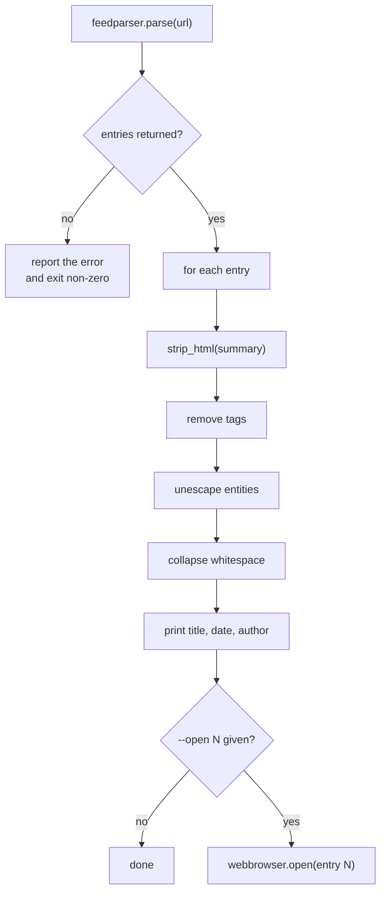

import FileCode from '../../../../components/FileCode.astro'
import Quiz from '../../../../components/Quiz.astro'
import DataCampExercise from '../../../../components/DataCampExercise.astro'

## Abstract

RSS (Really Simple Syndication) is the oldest still-working standard for publishing a list of articles in a machine-readable format. Most blogs, news sites, podcast hosts, and YouTube channels expose an RSS or Atom feed. In this project you will build a Python program that fetches a feed, parses it, and displays each article's title, summary, publication date, author, and tags — then optionally opens any article in your default browser.

This project teaches:
- How HTTP and feed formats fit together.
- How to use the `feedparser` library to handle the messy real-world variations of RSS and Atom.
- How to extract structured data and present it nicely.
- How to extend a simple reader into a personalized news aggregator.

## What Is RSS?

An RSS feed is a single XML document served from a URL. It contains:
- **Feed-level metadata** — title, description, link to the website, last-updated date.
- **A list of entries** — each one with its own title, link, summary or content, published date, author, and categories (tags).

When you "subscribe to" a feed, your reader app fetches that URL on a schedule and shows you new entries. There is no signup, no algorithm, no tracking — just a URL.

Feeds typically live at URLs like:
- `https://news.ycombinator.com/rss`
- `https://www.reddit.com/r/Python/.rss`
- `https://feeds.bbci.co.uk/news/rss.xml`
- `https://www.youtube.com/feeds/videos.xml?channel_id=CHANNEL_ID`

## Prerequisites

- Python 3.6 or above.
- A text editor or IDE.
- An internet connection.
- Comfort installing packages with `pip`.

## Install Dependencies

```bash title="install"
pip install feedparser
```

`feedparser` is the standard Python library for reading both RSS and Atom (a slightly different, newer format). It hides the differences between formats so you only deal with a uniform structure.

## Getting Started

### Create the project
1. Create a folder named `rss-feed-reader`.
2. Inside it, create `rssfeedreader.py`.
3. Open the folder in your editor.

### Write the code
<FileCode file="projects/beginners/rssfeedreader.py" lang="python" title="RSS Feed Reader" />

### Run it
```bash title="run"
python rssfeedreader.py
```
Sample output:
```
Feed Title: Python - Reddit
Article 1: How to build a web scraper with Python
Summary: Learn the basics of web scraping using BeautifulSoup...
Published: Mon, 01 Sep 2025 10:30:00 GMT
Author: pythondev123
Tags: programming, python, web-scraping
```

## What it produces

Running the file exactly as it ships, with nothing typed at the prompt, takes **1.8 s** and prints:

```text title="python rssfeedreader.py"
Python -- 25 entries

  0. Showcase Thread
     2026-08-04T16:05:25+00:00  by /u/AutoModerator
     Post all of your code/projects/showcases/AI slop here. Recycles once a month. submitted by /u/AutoModerator [l...

  1. Sunday Daily Thread: What's everyone working on this week?
     2026-08-09T00:00:08+00:00  by /u/AutoModerator
     Weekly Thread: What's Everyone Working On This Week? 🛠️ Hello r/Python ! It's time to share what you've been w...

  2. Python 3.15.0 RC1 Is Here — Python 3.15 Is Almost Ready 🚀
     2026-08-08T12:08:30+00:00  by /u/Dhileepan_0311
     ​ This is an important milestone because the Python team has now entered the release-candidate phase. At this ...

...
```

Twenty-five entries were fetched; the first three are shown.

## Step-by-Step Explanation

### 1. Import what you need
```python title="rssfeedreader.py"
import feedparser
import webbrowser
```
- `feedparser` does all the HTTP + XML work.
- `webbrowser` opens URLs in the user's default browser with one call.

### 2. Fetch and parse the feed
```python title="rssfeedreader.py"
url = "https://www.reddit.com/r/Python/.rss"
feed = feedparser.parse(url)
```
A single call. Under the hood `feedparser`:
1. Sends an HTTP `GET` to the URL.
2. Reads the response body.
3. Parses it as XML.
4. Normalizes the differences between RSS 1.0, RSS 2.0, and Atom into a common object structure.

The result is an object that *looks like* a dictionary. You can also access values with dot notation: `feed.feed.title`.

### 3. Read feed-level metadata
```python title="rssfeedreader.py"
print("Feed Title:", feed["feed"]["title"])
print("Feed Link:", feed["feed"]["link"])
print("Feed Description:", feed["feed"].get("description", "—"))
```
Note `feed["feed"]` — yes, the feed object has a `feed` key for the *feed-level* fields, separate from the list of entries. It is a quirk of `feedparser`'s API.

Using `.get(key, default)` avoids `KeyError` when a feed omits an optional field.

### 4. Loop through entries
```python title="rssfeedreader.py"
for i, entry in enumerate(feed.entries, start=1):
    print(f"\nArticle {i}: {entry.title}")
    print(f"Summary: {entry.get('summary', '')}")
    print(f"Published: {entry.get('published', 'unknown')}")
    print(f"Author: {entry.get('author', 'unknown')}")
    tags = [t.term for t in entry.get('tags', [])]
    if tags:
        print(f"Tags: {', '.join(tags)}")
```
- `enumerate(..., start=1)` gives you both the index (starting at 1) and the entry.
- Each entry has at least `title` and `link`. Everything else is optional and varies by source.
- Tags arrive as a list of objects; `t.term` is the actual tag string.

### 5. Open articles in the browser
```python title="rssfeedreader.py"
choice = input("\nEnter article number to open (or press Enter to skip): ")
if choice.strip().isdigit():
    n = int(choice) - 1
    if 0 <= n < len(feed.entries):
        webbrowser.open(feed.entries[n].link)
```
`webbrowser.open(url)` launches your default browser pointed at that URL. Cross-platform with no setup.

## Cleaning Up HTML in Summaries

Many feeds put HTML in the summary field — paragraphs, links, embedded images. To show plain text, strip the tags:

```python title="strip_html.py"
import re

def strip_html(text):
    return re.sub(r"<[^>]+>", "", text or "").strip()

print(strip_html(entry.summary))
```

For higher-quality output, use **BeautifulSoup**:
```python title="bs4_clean.py"
from bs4 import BeautifulSoup
text = BeautifulSoup(entry.summary, "html.parser").get_text()
```

## Handling Network Errors

`feedparser` does not raise on bad URLs; it sets a status. Always check it:

```python title="check_status.py"
feed = feedparser.parse(url)
if feed.bozo:                           # bozo flag = something went wrong
    print(f"Warning: feed may be malformed — {feed.bozo_exception}")
if not feed.entries:
    print("No entries found.")
```

## Common Mistakes

| Problem | Cause | Fix |
|---|---|---|
| `KeyError: 'author'` | Feed omits an optional field | Use `entry.get('author', 'unknown')` |
| `UnicodeEncodeError` printing entries | Terminal cannot render some characters | Set `PYTHONIOENCODING=utf-8` or pipe to a file |
| Empty `feed.entries` | URL is HTML, not a feed; or site blocks the user agent | Pass a custom `User-Agent` via `feedparser.parse(url, request_headers={...})` |
| `webbrowser.open` does nothing | Running in a headless environment | Print the URL instead |

## Variations to Try

### 1. Read multiple feeds
```python title="multi_feed.py"
FEEDS = [
    "https://news.ycombinator.com/rss",
    "https://www.reddit.com/r/Python/.rss",
    "https://feeds.bbci.co.uk/news/technology/rss.xml",
]
for url in FEEDS:
    feed = feedparser.parse(url)
    print(f"\n=== {feed.feed.title} ===")
    for entry in feed.entries[:5]:
        print(f"  • {entry.title}")
```

### 2. Sort entries by date
Use the parsed `published_parsed` field, which is a Python `struct_time`:
```python title="sort.py"
import time
entries = sorted(feed.entries,
                 key=lambda e: e.get("published_parsed", time.gmtime(0)),
                 reverse=True)
```

### 3. Save articles offline
Write each entry's text content to a file for offline reading:
```python title="offline.py"
from pathlib import Path, PurePath
safe = "".join(c for c in entry.title if c.isalnum() or c == " ")[:80]
Path(f"articles/{safe}.txt").write_text(entry.summary, encoding="utf-8")
```

### 4. Show only new articles (since last run)
Store the timestamp of the last fetch in a file. Filter entries newer than that:
```python title="incremental.py"
last_run = float(Path("last_run.txt").read_text() or 0)
new_entries = [e for e in feed.entries
               if time.mktime(e.published_parsed) > last_run]
Path("last_run.txt").write_text(str(time.time()))
```

### 5. Send a daily email digest
Combine `feedparser` with `smtplib` (Python's email module) to mail yourself the new entries each morning.

### 6. Build a GUI reader
Wrap the loop in a Tkinter app with a feed list on the left and articles on the right. See [Simple Blog System](./simple-blog-system) for the layout pattern.

### 7. Convert to OPML
OPML is the standard format readers use to import/export feed subscriptions. Generate one from your list of URLs.

### 8. Search across feeds
After fetching, store all entries in a list and let the user filter by keyword:
```python title="search.py"
keyword = input("Search: ").lower()
matches = [e for e in all_entries if keyword in e.title.lower()]
```

## Best Practices

- **Cache responses.** Hitting the same feed every few seconds is rude. Honor the feed's `etag` and `modified` headers and pass them on subsequent requests so the server can answer with `304 Not Modified`.
  ```python title="cache.py"
  feed = feedparser.parse(url, etag=last_etag, modified=last_modified)
  ```
- **Set a polite User-Agent** identifying your app and a contact URL.
- **Limit display length.** Truncate long summaries to keep the terminal readable.
- **Validate input.** When letting the user open entry N, check N is in range.

## Real-World Applications

- Personal news aggregators (think Feedly, NetNewsWire).
- Podcast catchers — podcasts publish RSS feeds with `<enclosure>` tags pointing to MP3s.
- Monitoring tools — turn build-failure feeds, CVE feeds, or pricing feeds into alerts.
- Content backups — archive a blog by downloading every entry.
- Cross-posting pipelines — read from one platform's feed, post to another.

## Educational Value

This project teaches:
- **Working with web data** — HTTP requests are hidden but real.
- **Structured data extraction** — feeds, JSON APIs, scraped pages all share the same patterns.
- **Defensive coding** — `entry.get(key, default)` is the difference between robust and brittle.
- **Module ecosystem** — when to reach for a library (`feedparser`) instead of parsing XML by hand.
- **User experience** — even a CLI tool benefits from clean formatting and gentle error messages.

## Next Steps

- Build a **subscription manager** that stores feed URLs in a JSON file and lets the user add/remove them.
- Add a **search index** with `sqlite3` so you can grep entries across hundreds of feeds.
- Turn it into a **web service** with Flask (see [Basic Web Server](./basicwebserver)) that shows your feeds on a web page.
- Bridge feeds to **Discord or Slack** with their webhook APIs.
- Plug into a **TTS engine** (`pyttsx3`) for an audio news briefing.

## Conclusion

A few dozen lines of Python plus `feedparser` is enough to replicate the core of a commercial RSS reader. You learned to fetch a feed, walk its entries, handle missing fields gracefully, and open articles in the browser. The same patterns will serve you anywhere you consume structured data from the web. The full source is on [GitHub](https://github.com/Ravikisha/PythonCentralHub/blob/main/projects/beginners/rssfeedreader.py). Explore more projects on Python Central Hub.

## How it fits together



## Pitfalls

- **The original opened a browser window just for running.**
  `webbrowser.open(entry['link'])` sat at module level, so anyone who ran the
  script to read some headlines got a tab instead. Opening a window is now
  behind `--open N`.
- **Using the loop variable after the loop.** After `for entry in ...:` ends,
  `entry` is the *last* item. The original then printed "the" summary, author
  and link from it. That works, silently, and means something other than what
  it looks like.
- **Order matters when cleaning HTML.** Unescaping entities before stripping
  tags turns the text `&lt;script&gt;` into a real tag, which the stripper
  then deletes. Measured on the exercise below: `5 &lt; 6 &amp;&amp; 7 &gt; 6`
  becomes `5 6` — three tokens of content silently destroyed.
- **A regex is not an HTML parser.** `<a title="1 > 2">link</a>` strips to
  `2">link`, because the `>` inside the attribute closes the tag early. That
  is acceptable when the goal is to discard markup and unacceptable when the
  goal is to understand it.
- **A feed that fails to parse still returns an object.** `feedparser` sets
  `bozo` rather than raising, so a network error looks like an empty feed
  unless you check.

## Recap

- Measured run: **25 entries** from `r/Python`, fetched and printed in
  **1.8 s**.
- `strip_html` does three things in a fixed order: remove tags, unescape
  entities, collapse whitespace. Swapping the first two loses content.
- Side effects like opening a browser belong behind an explicit flag.
- `feed['feed']['title']` is metadata; `feed['entries']` is the list. Neither
  raises when the fetch failed, which is what `bozo` is for.

<Quiz
  questions={[
    {
      q: "Why must tags be stripped before HTML entities are unescaped?",
      options: [
        "It is faster that way",
        "Unescaping first turns escaped text like &lt;b&gt; into a real tag, which the tag stripper then deletes — silently removing content that was never markup",
        "The regex only works on escaped text",
        "It does not matter, both orders give the same result"
      ],
      answer: 1,
      explanation: "Measured: 5 &lt; 6 &amp;&amp; 7 &gt; 6 becomes '5 < 6 && 7 > 6' in the right order and '5 6' in the wrong one."
    },
    {
      q: "The original script ended with webbrowser.open(entry['link']). What are the two separate problems with that line?",
      options: [
        "It is slow, and it needs a browser installed",
        "It opens a window as an unrequested side effect of running the script, and `entry` after the loop is whichever entry happened to be last",
        "It uses the wrong module, and the link may be relative",
        "There is nothing wrong with it"
      ],
      answer: 1,
      explanation: "Both are easy to miss because neither raises. The script does something, just not the thing it appears to."
    },
    {
      q: "feedparser.parse() on an unreachable URL does what?",
      options: [
        "Raises ConnectionError",
        "Returns an object with bozo set and no entries — so an unchecked failure looks exactly like an empty feed",
        "Returns None",
        "Retries automatically"
      ],
      answer: 1,
      explanation: "Libraries that report failure in a return value rather than an exception need an explicit check, or the error path is silence."
    }
  ]}
/>

## Try it yourself

<DataCampExercise
  lang="python"
  hint={`Write the same cleaner twice, swapping the order of the tag strip and the entity unescape, then run both over text that contains escaped angle brackets.`}
  code={`# Task: The order of unescaping and stripping changes the answer
import html
import re

TAG = re.compile(r"<[^>]+>")
WS = re.compile(r"\\s+")

SAMPLES = [
    '<div class="md"><p>Hello <b>world</b></p></div>',
    "a &amp; b",
    "&lt;b&gt; is how you write a bold tag in prose",
    "5 &lt; 6 &amp;&amp; 7 &gt; 6",
]


def strip_then_unescape(text):
    return WS.sub(" ", html.unescape(TAG.sub(" ", text))).strip()


def unescape_then_strip(text):
    return WS.sub(" ", TAG.sub(" ", html.unescape(text))).strip()


differences = 0
for sample in SAMPLES:
    a, b = strip_then_unescape(sample), unescape_then_strip(sample)
    differences += a != b
    print(f"{sample[:44]:46} {a[:26]:28} {b[:26]}")

print(f"{differences} of {len(SAMPLES)} inputs differ between the two orders.")

hostile = "The &lt;script&gt; tag is dangerous"
print(f"strip first:     {strip_then_unescape(hostile)}")
print(f"unescape first:  {unescape_then_strip(hostile)}")

# Neither order makes a regex into a parser:
tricky = '<a title="1 > 2">link</a>'
print(f"tricky input stripped to: {strip_then_unescape(tricky)}")`}
  solution={`# Task: The order of unescaping and stripping changes the answer
#
# Measured output:
#
#   2 of 4 inputs differ between the two orders.
#   strip first:     The <script> tag is dangerous
#   unescape first:  The tag is dangerous
#   tricky input stripped to: 2">link
#
# Unescaping first is destructive. &lt;script&gt; is the *text* "<script>",
# something a security article might legitimately print. Decode it before
# removing tags and the tag regex eats it, along with anything between it and
# the next angle bracket. Three words vanished above and nothing reported it.
#
# Stripping first cannot make that mistake: by the time entities are decoded
# there is no markup left to confuse them with.
#
# The last line is the honest limit of the whole approach. A regex cannot
# know that the > inside title="1 > 2" is data rather than the end of a tag.
# For discarding markup that failure is cosmetic; for anything that must be
# correct, use html.parser or BeautifulSoup.`}
/>
