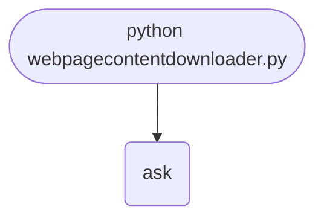

import FileCode from '../../../../components/FileCode.astro'
import Quiz from '../../../../components/Quiz.astro'
import DataCampExercise from '../../../../components/DataCampExercise.astro'

## Abstract
Saving a web page to disk is the simplest "real" web project: one HTTP request, one file write. But the gap between "works on `example.com`" and "works on any URL" hides every web-programming concept in one place — encoding, redirects, retries, timeouts, errors, streaming large files, and politeness toward servers. In this tutorial you build the trivial 3-line version with `urllib`, then evolve to a robust downloader using `requests`, streaming for large responses, retry policies, progress bars, and a mirror mode that downloads HTML plus its referenced assets.

You will leave understanding:
- The HTTP request/response cycle.
- Why default `urllib` is fine for toys and `requests` is the standard for real code.
- How content encoding (`gzip`, `br`), character encoding, and redirects all bite naïve scripts.
- How to stream large responses without loading them into memory.
- The ethics and legality of downloading — robots.txt, rate limits, copyright.

## Prerequisites
- Python 3.6 or above.
- A text editor or IDE.
- Internet connection.
- Comfort with file I/O.

## Part 1 — The Trivial Version

`urllib` ships with Python so no install is needed.

### Create the project
1. Create folder `web-content-downloader`.
2. Inside, create `webpagecontentdownloader.py`.

### Write the code
<FileCode file="projects/beginners/webpagecontentdownloader.py" lang="python" title="Web Page Downloader" />

### Run it
```cmd title="command"
C:\Users\Your Name\web-content-downloader> python webpagecontentdownloader.py
Enter the URL: https://www.example.com
Enter the file name: example.html
# Page content saved to example.html
```

## What it produces

Running the file exactly as it ships takes **0.5 s** and prints:

```text title="python webpagecontentdownloader.py"
Enter the URL: https://example.com   (no input available, using the default)
Enter the file name: example.html   (no input available, using the default)
https://example.com -> example.html  (559 characters, decoded as utf-8)
https://example.com -> streamed-example.html  (559 bytes, streamed in 64 KB chunks)
https://example.com/definitely-not-a-real-page returned HTTP 404 (Not Found)
```

## How it fits together

Read from the top: this is what runs when you execute the file, and which function calls which. It is generated from the code, so it cannot drift from it.



## Step-by-Step Explanation (Trivial Version)

```python title="trivial.py"
import urllib.request

url = input("URL: ")
filename = input("Filename: ")
response = urllib.request.urlopen(url)
data = response.read().decode("utf-8")
with open(filename, "w", encoding="utf-8") as f:
    f.write(data)
```
- `urlopen` sends a `GET` and returns a file-like object.
- `read()` slurps the **entire response** into memory.
- `.decode("utf-8")` turns the bytes into a Python string — **fails for non-UTF-8 pages**, which is most of the legacy web.

This version works only when the URL is reachable, the page is UTF-8, smaller than your RAM, and does not redirect.

## Part 2 — Robust Version with `requests`

```bash title="install"
pip install requests
```

```python title="robust.py"
import requests, sys
from urllib.parse import urlparse

def download(url: str, filename: str | None = None) -> str:
    if not url.startswith(("http://", "https://")):
        url = "https://" + url
    try:
        r = requests.get(url, timeout=30, headers={"User-Agent": "PCH-Downloader/1.0"})
        r.raise_for_status()
    except requests.HTTPError as e:
        print(f"HTTP {e.response.status_code}: {e.response.reason}")
        sys.exit(1)
    except requests.RequestException as e:
        print(f"Network error: {e}")
        sys.exit(1)

    filename = filename or (urlparse(url).path.rsplit("/", 1)[-1] or "page.html")
    encoding = r.encoding or r.apparent_encoding or "utf-8"
    with open(filename, "w", encoding=encoding) as f:
        f.write(r.text)
    print(f"Saved {len(r.text):,} chars to {filename}")
    return filename
```
What this fixes:
- **Custom User-Agent.** Default `python-requests/...` is widely blocked.
- **Timeout.** No hanging on slow servers.
- **`raise_for_status()`** turns 4xx/5xx into exceptions.
- **`r.encoding` + `r.apparent_encoding`.** First trusts the server's `Content-Type` header; falls back to `chardet`-based guess.
- **URL auto-completion.** `example.com` → `https://example.com`.
- **Smart filename.** Derives from URL path if not provided.

## Stream Large Files

`requests.get(...).text` loads everything into RAM. For PDFs, ZIPs, or images, **stream** instead:
```python title="stream.py"
def download_large(url: str, filename: str, chunk: int = 8192):
    with requests.get(url, stream=True, timeout=30) as r:
        r.raise_for_status()
        total = int(r.headers.get("Content-Length", 0))
        done = 0
        with open(filename, "wb") as f:
            for piece in r.iter_content(chunk_size=chunk):
                if not piece: continue
                f.write(piece)
                done += len(piece)
                if total:
                    pct = done * 100 // total
                    print(f"\r{pct}%  ({done:,}/{total:,} bytes)", end="", flush=True)
        print()
```
`stream=True` defers the body download. `iter_content` yields it in chunks so memory stays flat regardless of file size.

For a real progress bar, use **`tqdm`**:
```python title="tqdm.py"
from tqdm import tqdm
with requests.get(url, stream=True) as r, open(filename, "wb") as f:
    bar = tqdm(total=int(r.headers["Content-Length"]), unit="B", unit_scale=True)
    for chunk in r.iter_content(8192):
        f.write(chunk); bar.update(len(chunk))
    bar.close()
```

## Retries with Back-off

Transient errors (5xx, network blips) should retry; permanent ones (404) should not:
```python title="retry.py"
from requests.adapters import HTTPAdapter
from urllib3.util.retry import Retry

retry = Retry(total=5, backoff_factor=1,
              status_forcelist=[502, 503, 504], allowed_methods=["GET"])
adapter = HTTPAdapter(max_retries=retry)
session = requests.Session()
session.mount("https://", adapter)
session.mount("http://", adapter)
r = session.get(url, timeout=30)
```
`backoff_factor=1` means waits of 1, 2, 4, 8, 16 seconds between retries.

## Common Mistakes

| Problem | Cause | Fix |
|---|---|---|
| `UnicodeDecodeError` | Forced `utf-8` on non-UTF-8 page | Use `r.encoding` / `r.apparent_encoding` |
| 403 Forbidden | Default User-Agent blocked | Send a real header |
| Hangs indefinitely | No timeout | `timeout=30` |
| MemoryError on 4 GB ZIP | `r.text` loads everything | `stream=True` + `iter_content` |
| File not saved cross-platform | `\` in filename | Use `urllib.parse.quote` or `Path` |
| Directory traversal | User-supplied filename `"../../etc/passwd"` | Sanitize with `os.path.basename` |

## Variations to Try

### 1. Mirror mode
Pull the HTML, parse with BeautifulSoup, then download every ``, `<script>`, `<link rel=stylesheet>` and rewrite the HTML to point at the local copies. Result: a fully self-contained `index.html` plus an `assets/` folder.

### 2. Recursive crawl
Follow internal `<a>` links up to depth N. See [Basic Web Crawler](./basicwebcrawler) for the proper queue + visited-set pattern.

### 3. Authentication
`requests.get(url, auth=("user", "pass"))` for HTTP Basic; or use session cookies for login forms.

### 4. Robots.txt compliance
Use `urllib.robotparser` to honor crawl directives before downloading:
```python title="robots.py"
from urllib.robotparser import RobotFileParser
rp = RobotFileParser()
rp.set_url(urlparse(url)._replace(path="/robots.txt").geturl())
rp.read()
if not rp.can_fetch("PCH-Downloader/1.0", url):
    print("robots.txt forbids this URL"); return
```

### 5. JSON-aware mode
If `Content-Type` is `application/json`, pretty-print with `json.dumps(r.json(), indent=2)`.

### 6. PDF extraction
`pip install pypdf`. After download, extract text and save side-by-side as `.txt`.

### 7. Headless browser
Some pages are JavaScript-rendered and arrive empty via `requests`. Switch to **Playwright** to get the rendered DOM.

### 8. Resume support
For broken downloads, use HTTP `Range` headers:
```python title="resume.py"
existing = os.path.getsize(filename) if os.path.exists(filename) else 0
r = requests.get(url, headers={"Range": f"bytes={existing}-"}, stream=True)
mode = "ab" if r.status_code == 206 else "wb"
```

### 9. Batch from a file
Read URLs from `urls.txt` and download all (with rate limiting).

### 10. GUI version
Tkinter window with URL entry, save-as button, and progress bar. See [Currency Exchange Rate Calculator GUI](./currencyexchnageratecalculator) for the pattern.

## Ethical & Legal Notes

- **Read the ToS.** Many sites forbid bulk downloading.
- **Respect `robots.txt`.** It is the standard signal.
- **Identify yourself** with a real `User-Agent` plus contact info.
- **Rate-limit aggressively** when crawling many pages — 1 request per second is friendly.
- **Copyright applies** to downloaded content; for personal study most uses are fine, redistribution is not.
- **Never bypass paywalls** or login walls without explicit permission.

## Security Considerations
- **Validate URLs** — refuse `file:`, `javascript:`, `data:` schemes if users supply URLs.
- **Sanitize filenames** with `os.path.basename` to block directory traversal.
- **Scan downloaded executables** before running them — `requests` does not check for malware.
- **Pin TLS** for sensitive endpoints with `verify=` and a CA bundle.

## Real-World Applications
- Personal-page archive ("save for offline reading").
- Migration tools — copying content from a CMS to a static site.
- SEO audits — pull pages locally for parsing.
- Dataset construction for ML — but check licenses.
- One-off data extraction for research.

## Educational Value
- **HTTP fundamentals** — GET, status codes, headers.
- **Encoding awareness** — content vs. character encoding.
- **Streaming** — when memory is finite and the file is not.
- **Error taxonomy** — `HTTPError`, `Timeout`, `ConnectionError` mean different things.
- **Politeness** — the principle that scales when you scale up.

## Next Steps
- Replace **`urllib` → `requests`** for everything.
- Add **streaming + progress bar**.
- Add **retries with exponential backoff**.
- Build the **mirror mode** that downloads referenced assets.
- Compare with [Basic Web Crawler](./basicwebcrawler) for multi-page traversal.

## Conclusion
You upgraded a trivial download script into a robust, polite, streaming, resumable, retrying downloader. Every web-aware program you ever write reuses these patterns — fail safely, respect the server, never load more than you need. Full source on [GitHub](https://github.com/Ravikisha/PythonCentralHub/blob/main/projects/beginners/webpagecontentdownloader.py). Explore more web projects on Python Central Hub.

## Pitfalls

- **`decode("utf-8")` regardless of what the server said.** The response
  carries a charset in its `Content-Type` header, and it is not always UTF-8.
  Assuming is how a page becomes `Café`. `response.headers.get_content_charset()`
  is the answer the server already gave you.
- **No error handling at all.** `urlopen` raises `HTTPError` on a 404 and
  `URLError` when DNS fails, and the original caught neither, so any missing
  page ended in a traceback. The measured run above shows the fixed path:
  `https://example.com/definitely-not-a-real-page returned HTTP 404`.
- **No timeout.** Without one, a server that accepts the connection and never
  answers hangs the script indefinitely. There is no default.
- **`response.read()` loads the whole body into memory.** Fine for a 559-byte
  page, fatal for the large file someone eventually points this at.
  `download_large` streams with `shutil.copyfileobj` so peak memory is one
  64 KB chunk.
- **A filename taken from a URL is attacker-controlled.** `safe_name` runs
  `os.path.basename`, so `https://example.com/../../etc/passwd` writes to
  `passwd` in the current directory rather than wherever the path pointed.
- **`errors="ignore"` destroys data.** It makes the exception go away by
  deleting the bytes it could not decode — 6 characters lost in the exercise
  below, unrecoverably.

## Recap

- Measured run: **559 characters** decoded as utf-8, the same page streamed
  as **559 bytes** in 64 KB chunks, and a 404 reported rather than raised.
- Four things separate `download` from the three-line version: a User-Agent,
  a timeout, the server's own encoding, and an error path.
- Bytes have no encoding. A decoding is a *claim* about what they mean, and
  the wrong claim either raises or silently produces the wrong text.
- Mojibake is recoverable when the wrong codec mapped every byte to something
  (`cp1252` does); it is not recoverable after `errors="ignore"`.

<Quiz
  questions={[
    {
      q: "The same UTF-8 bytes decoded as cp1252 give 'Café' instead of 'Café'. Can that be undone?",
      options: [
        "No, the data is lost",
        "Yes — cp1252 maps every byte to some character, so re-encoding as cp1252 recovers the original bytes and they can be decoded again as UTF-8",
        "Only if the text is ASCII",
        "Only with a third-party library"
      ],
      answer: 1,
      explanation: "Measured in the exercise: the round trip returns the original string exactly. What is not recoverable is anything dropped by errors='ignore'."
    },
    {
      q: "Why does download_large use shutil.copyfileobj instead of response.read()?",
      options: [
        "It is faster",
        "It moves the body to disk in fixed-size chunks, so peak memory is the chunk rather than the whole file",
        "read() does not work on HTTP responses",
        "It handles encoding automatically"
      ],
      answer: 1,
      explanation: "For a 559-byte page the difference is nothing. For a 700 MB download it is the difference between working and not."
    },
    {
      q: "What does errors='ignore' do to text it cannot decode?",
      options: [
        "Replaces it with a placeholder character",
        "Deletes it — the exception goes away because the data does, and no later re-encoding brings it back",
        "Logs a warning and keeps the bytes",
        "Falls back to latin-1"
      ],
      answer: 1,
      explanation: "errors='replace' at least leaves a marker. 'ignore' silently shortens the string, which is why it is the wrong default for anything you intend to keep."
    }
  ]}
/>

## Try it yourself

<DataCampExercise
  lang="python"
  hint={`Encode one string to bytes, then decode those same bytes with several different codecs and compare. Nothing about the bytes changes - only the claim about what they mean.`}
  code={`# Task: The same bytes, decoded four ways
TEXT = "Cafe\\u0301 \\u2014 nai\\u0308ve costs 5 \\u00a3"
TEXT = "Caf\\u00e9 \\u2014 na\\u00efve r\\u00e9sum\\u00e9 costs 5 \\u00a3"

raw = TEXT.encode("utf-8")
print(f"{len(raw)} bytes of UTF-8\\n")

for name in ("utf-8", "cp1252", "iso-8859-15", "ascii"):
    try:
        print(f"  as {name:12} {raw.decode(name)!r}")
    except UnicodeDecodeError as exc:
        print(f"  as {name:12} UnicodeDecodeError at byte {exc.start}")

print()
for handler in ("replace", "ignore", "backslashreplace"):
    print(f"  errors={handler:18} {raw.decode('ascii', errors=handler)!r}")

# Round-tripping through the wrong codec is how mojibake is made -- and
# sometimes how it is undone.
mojibake = raw.decode("cp1252")
recovered = mojibake.encode("cp1252").decode("utf-8")
print(f"\\nrecovered the original? {recovered == TEXT}")

lossy = raw.decode("ascii", errors="ignore")
print(f"after errors='ignore', characters lost: {len(TEXT) - len(lossy)}")`}
  solution={`# Task: The same bytes, decoded four ways
#
# Measured output:
#
#   as utf-8        'Café — naïve résumé costs 5 £'
#   as cp1252       'Café â€" naïve résumé costs 5 £'
#   as iso-8859-15  'Café â\\x80\\x94 naïve résumé costs 5 £'
#   as ascii        UnicodeDecodeError at byte 3
#
#   errors=replace            'Caf?? ??? na??ve r??sum?? costs 5 ??'
#   errors=ignore             'Caf  nave rsum costs 5 '
#
#   recovered the original? True
#   after errors='ignore', characters lost: 6
#
# The bytes were identical in every line. Only the claim about what they
# encode changed, which is exactly what a Content-Type charset header is
# for -- and why guessing UTF-8 is a guess, not a default.
#
# The recovery works because cp1252 has a character for every byte value, so
# the misreading is reversible. errors='ignore' is not: it removed six
# characters and left no record that they existed.`}
/>
