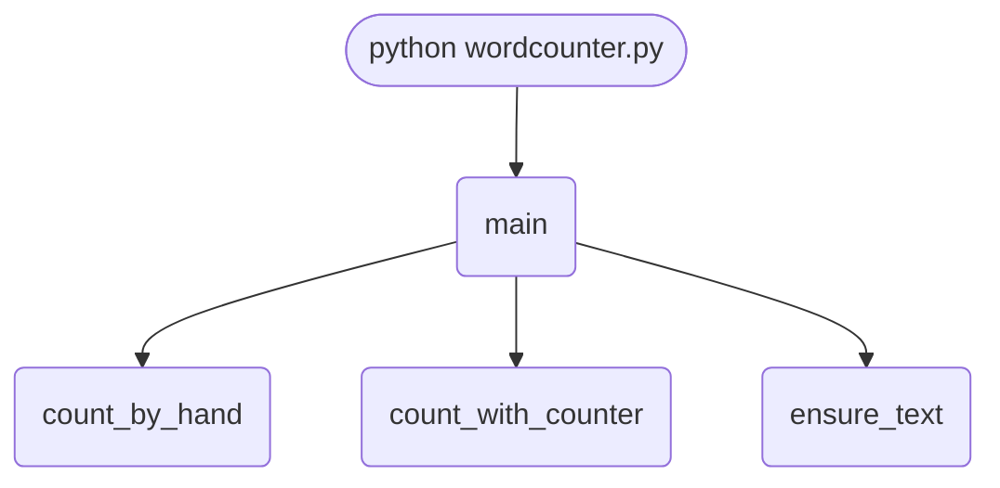

import FileCode from '../../../../components/FileCode.astro'
import Quiz from '../../../../components/Quiz.astro'
import DataCampExercise from '../../../../components/DataCampExercise.astro'

## Abstract
A word counter answers a simple question — *"which words appear most often in this text?"* — and ends up teaching you nearly every fundamental of text processing: file I/O, tokenization, normalization, counting with dictionaries, and producing readable output. In this project you will build the program two different ways (with `collections.Counter` and from scratch with a plain dictionary), then add real text-preprocessing (lowercasing, punctuation stripping, stop-word filtering, n-grams) and finally generate a word cloud image of the results.

You will leave comfortable with:
- Reading files with `open()` and the `with` block.
- Tokenizing text into words.
- Counting with both `Counter` and a manual dictionary.
- Sorting by value with `sorted(..., key=lambda x: x[1], reverse=True)`.
- Preprocessing text — the difference between a noisy and a useful word count.
- N-gram analysis for spotting phrases, not just words.

## Prerequisites
- Python 3.6 or above.
- A code editor or IDE.
- A text file to analyze. Anything from your own writing to a public-domain book from [Project Gutenberg](https://www.gutenberg.org).

## Getting Started

### Create the project
1. Create a folder named `word-counter`.
2. Inside it, create `wordcounter.py`.
3. Add a sample `text.txt` file in the same folder. Suggested contents:
   ```txt title="text.txt"
   Lorem ipsum dolor sit amet, consectetur adipiscing elit.
   Etiam at pharetra velit. Donec mattis lacus vel tortor elementum,
   in tincidunt ligula tristique. Fusce commodo eget odio eget feugiat.
   Etiam id porta lacus. Python is a great programming language.
   Python makes text analysis easy and fun.
   ```

### Write the code
<FileCode file="projects/beginners/wordcounter.py" lang="python" title="Word Counter" />

### Run it
```cmd title="command"
C:\Users\Your Name\word-counter> python wordcounter.py
[('et', 3), ('sed', 3), ('in', 3), ('vel', 2), ('sit', 2), ('amet,', 2), ('Etiam', 2), ('lacus', 2), ('vitae', 2), ('mauris', 2)]
```

## Two Approaches

### Method 1 — Using `collections.Counter`
```python title="method1.py"
from collections import Counter

with open("text.txt", encoding="utf-8") as f:
    words = f.read().split()

counts = Counter(words)
print(counts.most_common(10))
```
- `Counter(words)` counts every distinct item.
- `.most_common(N)` returns the top N as `(word, count)` tuples.
- Three lines of logic. This is the right tool.

### Method 2 — Manual Dictionary
Useful for **understanding** the algorithm:
```python title="method2.py"
counts = {}
for word in words:
    counts[word] = counts.get(word, 0) + 1

top = sorted(counts.items(), key=lambda kv: kv[1], reverse=True)
print(top[:10])
```
- `dict.get(key, default)` is the safe way to read-and-default.
- `sorted(..., key=lambda kv: kv[1], reverse=True)` sorts by *count*, not by word.

### Why `Counter` wins
- Less code, less to get wrong.
- Implemented in C — faster than the manual loop.
- Supports `.most_common`, addition (`c1 + c2`), subtraction, and many other operations out of the box.

The manual approach is still worth knowing because real interviews still ask it, and because every dictionary-counting pattern in the wild looks like this.

## What it produces

Running the file exactly as it ships, with nothing typed at the prompt, takes **0.2 s** and prints:

```text title="python wordcounter.py"
text.txt was missing, so a sample was written to it

32 words, 16 distinct

        word   count
         the       6
         fox       5
       quick       3
         dog       3
        lazy       2
        runs       2
           a       2
       brown       1
       jumps       1
        over       1

hand-written tally agrees with Counter: True
Counter is a dict subclass that does the same counting in C, and
most_common sorts it for you. The loop is here to show that there
is no magic in it, not because it is worth writing again.
```

## How it fits together

Read from the top: this is what runs when you execute the file, and which function calls which. It is generated from the code, so it cannot drift from it.



## Step-by-Step Explanation

### 1. Open the file safely
```python title="wordcounter.py"
with open("text.txt", encoding="utf-8") as f:
    text = f.read()
```
The `with` block guarantees the file is closed even if an error happens later. Always pass `encoding="utf-8"` unless you know otherwise — the platform default (cp1252 on Windows, utf-8 elsewhere) is a frequent bug source.

### 2. Split into words
```python title="wordcounter.py"
words = text.split()
```
`split()` with no arguments splits on any run of whitespace — spaces, tabs, newlines. Good enough for a first pass, but it keeps punctuation glued to words (`amet,` and `amet` are different).

### 3. Count and rank
```python title="wordcounter.py"
counts = Counter(words)
top = counts.most_common(10)
for word, n in top:
    print(f"{word:15} {n}")
```
`f"{word:15}"` pads the word to 15 characters wide, producing a tidy column-aligned table.

## Real Preprocessing

The raw counts above are noisy:
- **Case mismatch:** `Python` and `python` are different.
- **Punctuation glued on:** `amet,` ≠ `amet`.
- **Stop words dominate:** `the`, `and`, `is` overwhelm everything interesting.

Fix all three:

```python title="preprocess.py"
import re
from collections import Counter

STOP_WORDS = {
    "the","a","an","and","or","but","of","in","on","at","to","for","with",
    "is","are","was","were","be","been","being","i","you","he","she","it","we","they",
    "this","that","these","those","as","by","from","up","down","out","so","not"
}

def tokenize(text: str) -> list[str]:
    text = text.lower()
    text = re.sub(r"[^a-z0-9\s']", " ", text)   # keep apostrophes for contractions
    return [w for w in text.split() if w and w not in STOP_WORDS]

with open("text.txt", encoding="utf-8") as f:
    words = tokenize(f.read())
print(Counter(words).most_common(20))
```
A simple stop-word list cuts most of the noise. For serious work use **NLTK's** list (`from nltk.corpus import stopwords`).

## N-grams: Counting Phrases

A bigram is a pair of consecutive words. Counting them surfaces common phrases:
```python title="ngrams.py"
def ngrams(words: list[str], n: int) -> list[tuple]:
    return [tuple(words[i:i+n]) for i in range(len(words) - n + 1)]

bigrams = Counter(ngrams(words, 2))
print(bigrams.most_common(10))
# [(('python', 'is'), 5), (('text', 'analysis'), 3), ...]
```
Trigrams (`n=3`) reveal even more — useful for catching named entities ("New York City") and idioms.

## Common Mistakes

| Problem | Cause | Fix |
|---|---|---|
| `UnicodeDecodeError` | Wrong encoding | Always `encoding="utf-8"` |
| `Python` and `python` counted separately | No lowercasing | `text.lower()` before splitting |
| `amet,` and `amet` separate | Punctuation glued on | Strip with `re.sub(r"[^a-z0-9\s']", " ", text)` |
| Top words are all `the`, `and`, `of` | No stop-word filter | Skip a stop-word set |
| `Counter` not sorted by frequency | Iterated a `Counter` directly (insertion order) | Use `.most_common()` |
| Counts wrong on a huge file | Loaded all into memory unnecessarily | Stream line-by-line: `for line in f: ...` |

## Variations to Try

### 1. Word cloud
```bash title="install"
pip install wordcloud matplotlib
```
```python title="cloud.py"
from wordcloud import WordCloud
import matplotlib.pyplot as plt
cloud = WordCloud(width=800, height=400, background_color="white").generate_from_frequencies(Counter(words))
plt.imshow(cloud); plt.axis("off"); plt.savefig("cloud.png", dpi=150)
```

### 2. Unique-word ratio (lexical diversity)
```python title="diversity.py"
diversity = len(set(words)) / len(words)
print(f"Lexical diversity: {diversity:.2%}")
```
A high ratio means a rich vocabulary; a low ratio means a lot of repetition.

### 3. Word-length distribution
```python title="lengths.py"
lengths = Counter(len(w) for w in words)
for k in sorted(lengths):
    print(f"{k:2} chars: {'#' * lengths[k]}")
```

### 4. Compare two documents
```python title="compare.py"
a = Counter(tokenize(open("a.txt").read()))
b = Counter(tokenize(open("b.txt").read()))
print("In A but not B:", (a - b).most_common(10))
```

### 5. Read PDFs
```bash title="install"
pip install pypdf
```
```python title="pdf.py"
from pypdf import PdfReader
text = "\n".join(p.extract_text() or "" for p in PdfReader("file.pdf").pages)
```

### 6. Streaming counts for huge files
```python title="stream.py"
counts = Counter()
with open("big.txt", encoding="utf-8") as f:
    for line in f:
        counts.update(tokenize(line))
```
Memory stays constant even for multi-gigabyte inputs.

### 7. Export to CSV
```python title="csv_export.py"
import csv
with open("out.csv", "w", newline="", encoding="utf-8") as f:
    csv.writer(f).writerows(counts.most_common())
```

### 8. Real NLP with NLTK or spaCy
Stop words, stemming (`run`, `running`, `runs` → `run`), lemmatization, named-entity recognition. A few extra lines unlock major analytical power.

### 9. Web frontend
Wrap with Flask (see [Basic Web Server](./basicwebserver)): paste text, get back top words and a generated word cloud image.

### 10. Concordance
For any word, print every sentence it appears in — a basic literary-analysis tool.

## Performance Considerations

For text up to ~100 MB, the simple `Counter(text.split())` is plenty fast (a few seconds). Beyond that:
- Stream line-by-line (see Variation 6) to keep memory bounded.
- Use `re.findall(r"\w+", line)` instead of `.split()` — it tokenizes and strips punctuation in one step.
- For multi-gigabyte corpora consider **DuckDB**'s `read_csv` with SQL aggregation, or `pandas` with chunked CSV reads.

## Real-World Applications
- **SEO research** — keyword density on a page.
- **Plagiarism detection** — fingerprinting documents by word frequencies.
- **Stylometry** — identifying authors by their word patterns.
- **Content auditing** — finding overused words in your own writing.
- **Spam filtering** — Naive Bayes spam classifiers count exactly like this.
- **Search engines** — inverted indexes start with the same per-document word counts.

## Educational Value
- **File I/O** — reading text safely and with the right encoding.
- **Text preprocessing** — the gap between *raw text* and *useful data*.
- **`Counter`** — one of the most useful classes in the standard library.
- **Sorting with a key** — a pattern you will reuse for the rest of your career.
- **Generators and streaming** — memory matters at scale.

## Next Steps
- Combine with [Personal Diary](./personaldiary): analyze your own journal entries for mood and themes over time.
- Plug the n-gram code into a markov-chain text generator for fun.
- Build a **Flask** front-end and host it publicly.
- Move to **spaCy** for named-entity recognition and proper tokenization.
- Compare classic literature texts — easy way to learn distributed text analysis without distributed systems.

## Conclusion
You counted words two ways, learned why preprocessing turns garbage counts into useful insight, and saw the path from a 5-line script to a real text-analysis pipeline. The same algorithms power search engines, spam filters, and SEO tools. Full source on [GitHub](https://github.com/Ravikisha/PythonCentralHub/blob/main/projects/beginners/wordcounter.py). Find more text-processing projects on Python Central Hub.

## Pitfalls

- **`split()` is not tokenisation.** `dog` and `dog.` are two different words to this program, and so are `The` and `the`. The counts above are counts of whitespace-separated strings, which is close enough for a demo and wrong for anything that matters.
- **The file used to crash when `text.txt` was missing.** It now writes a sample instead — a demo that ends in `FileNotFoundError` teaches nothing, and the fallback is three lines.
- **`Counter` is a dict subclass, so it is unordered until you ask.** `most_common()` does the sorting; iterating a `Counter` directly gives insertion order, which is not frequency order and looks correct on small inputs.
- **Ties are broken arbitrarily.** Four words here appear once each, and which of them lands in the top ten depends on insertion order rather than on anything meaningful. Any 'top N' over a tied boundary needs to say how ties were resolved.

## Recap

- 32 words, 16 distinct, measured by running the file with no input.
- `the` appears 6 times and `fox` 5 — the whole distribution is in the output above.
- The hand-written tally and `collections.Counter` agree, which is what makes the comparison between them fair.
- `split()` separates on whitespace only, so punctuation and case produce spurious distinct words.
- `most_common()` is what sorts a `Counter`; the object itself is a dict and carries no order.

## Try it yourself

<DataCampExercise
  lang="python"
  hint={`Count the raw split first, then again after lowercasing and stripping punctuation, and compare how many distinct words each finds.`}
  code={`# Task: What split() counts, and what it should
import string
from collections import Counter

TEXT = """The quick brown fox jumps over the lazy dog.
The dog barks, and the Fox runs! A quick fox is a clever fox.
The lazy dog sleeps -- while the quick fox runs."""


def naive(text):
    return text.split()


def tokenised(text):
    cleaned = text.lower()
    for mark in string.punctuation:
        cleaned = cleaned.replace(mark, " ")
    return cleaned.split()


for name, tokens in (("split()", naive(TEXT)), ("lower + strip", tokenised(TEXT))):
    counts = Counter(tokens)
    print(f"{name:>14}: {len(tokens):>3} words, {len(counts):>3} distinct")
    print(f"{'':>14}  top 5: {counts.most_common(5)}")

raw, clean = Counter(naive(TEXT)), Counter(tokenised(TEXT))
lost = len(raw) - len(clean)
print(f"\nnaive counting invents {lost} extra distinct words")
for word in ("the", "fox", "dog"):
    variants = sorted(w for w in raw if w.lower().strip(string.punctuation) == word)
    print(f"  {word:>5}: naive sees {variants} -> {clean[word]} occurrences once cleaned")
print("\nnone of this is tokenisation either -- it does not handle")
print("contractions, hyphens or names. It is one step less wrong.")`}
  solution={`# Task: What split() counts, and what it should
import string
from collections import Counter

TEXT = """The quick brown fox jumps over the lazy dog.
The dog barks, and the Fox runs! A quick fox is a clever fox.
The lazy dog sleeps -- while the quick fox runs."""


def naive(text):
    return text.split()


def tokenised(text):
    cleaned = text.lower()
    for mark in string.punctuation:
        cleaned = cleaned.replace(mark, " ")
    return cleaned.split()


for name, tokens in (("split()", naive(TEXT)), ("lower + strip", tokenised(TEXT))):
    counts = Counter(tokens)
    print(f"{name:>14}: {len(tokens):>3} words, {len(counts):>3} distinct")
    print(f"{'':>14}  top 5: {counts.most_common(5)}")

raw, clean = Counter(naive(TEXT)), Counter(tokenised(TEXT))
lost = len(raw) - len(clean)
print(f"\nnaive counting invents {lost} extra distinct words")
for word in ("the", "fox", "dog"):
    variants = sorted(w for w in raw if w.lower().strip(string.punctuation) == word)
    print(f"  {word:>5}: naive sees {variants} -> {clean[word]} occurrences once cleaned")
print("\nnone of this is tokenisation either -- it does not handle")
print("contractions, hyphens or names. It is one step less wrong.")`}
/>

<Quiz
  questions={[
    {
      q: "The text contains both `dog` and `dog.` — how does this program count them?",
      options: [
        "As the same word, since punctuation is stripped",
        "As two different words, because `split()` separates on whitespace and does nothing about punctuation or case",
        "It raises an error on punctuation",
        "It counts only the first occurrence"
      ],
      answer: 1,
      explanation: "Real tokenisation lowercases and strips punctuation at minimum, and usually handles contractions and hyphenation too. `split()` is a placeholder for it."
    },
    {
      q: "What does `collections.Counter` give you over the hand-written dictionary loop?",
      options: [
        "A different answer",
        "The same answer with the counting done in C, plus `most_common()` for the sort — which is why the project checks the two agree before comparing them",
        "Automatic tokenisation",
        "Ordered keys"
      ],
      answer: 1,
      explanation: "Counter is a dict subclass. It adds counting and ranking helpers; it does not change what a word is."
    },
    {
      q: "Four words in this text appear exactly once. What decides which of them appears in the top ten?",
      options: [
        "Alphabetical order",
        "Insertion order — `most_common` is stable, so ties come out in the order first seen, which is not a meaningful ranking",
        "Word length",
        "They are excluded from the ranking"
      ],
      answer: 1,
      explanation: "Any 'top N' whose boundary falls inside a tie has to state its tie-break, or the list looks more decisive than the data is."
    }
  ]}
/>
