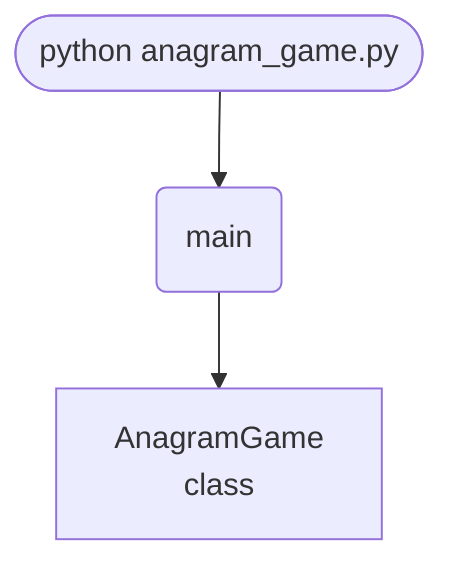

import FileCode from '../../../../components/FileCode.astro'

## Abstract
An anagram game is a deceptively rich little project. On the surface it just scrambles a word and asks you to unscramble it — but underneath it touches randomization, string manipulation, input validation, event-driven GUI programming, and game state. In this tutorial you build a Tkinter anagram game on a short word list, then grow it into something you'd actually want to play: a real dictionary, hints, a per-round countdown timer, difficulty levels, and a high-score table saved to disk.

You will leave understanding:
- How `random.sample` produces a scramble and why it can occasionally return the original word.
- The Entry + Button + Label event loop that drives almost every small Tkinter app.
- Why you normalize input (`strip().lower()`) before comparing strings.
- How to separate game **state** (score, current word) from game **view** (the widgets).
- How to add a non-blocking timer with `after` instead of `sleep`.

## Prerequisites
- Python 3.6 or above.
- A text editor or IDE.
- Tkinter (ships with Python; on Linux: `sudo apt install python3-tk`).
- Comfort with functions, classes, and basic string methods. If GUIs are new, start with [Calculator GUI](../../beginners/calculatorgui).

## Getting Started

### Create the project
1. Create a folder named `anagram-game`.
2. Inside it, create `anagram_game.py`.
3. Open the folder in your editor.

### Write the code
<FileCode file="projects/intermediate/anagram_game.py" lang="python" title="anagram_game.py" showLineNumbers={1} />

### Run it
```cmd title="command"
C:\Users\Your Name\anagram-game> python anagram_game.py
# A window opens showing a scrambled word, an answer box,
# and Submit / Next buttons. Type the unscrambled word and Submit.
```

## How it fits together

Read from the top: this is what runs when you execute the file, and which function calls which. It is generated from the code, so it cannot drift from it.



## Step-by-Step Explanation

### 1. The word bank
```python title="anagram_game.py"
WORDS = ["python", "anagram", "challenge", "programming", "developer", "algorithm"]
```
A plain list is fine to start. Later you'll swap this for a dictionary file so the game never runs out of words.

### 2. Scrambling a word
```python title="anagram_game.py"
self.current_word = random.choice(WORDS)
self.scrambled_word = "".join(random.sample(self.current_word, len(self.current_word)))
```
`random.choice` picks the answer; `random.sample(word, len(word))` returns the letters in a new random order. `sample` draws *without replacement*, so every letter is used exactly once — that's what makes it a true anagram rather than a random jumble. **Catch:** `sample` can occasionally return the letters in their original order, handing the player the answer for free. The fix is below.

### 3. Validating the guess
```python title="anagram_game.py"
user_answer = self.answer_entry.get().strip().lower()
if user_answer == self.current_word:
    self.score += 1
    messagebox.showinfo("Correct!", f"Well done! Your score: {self.score}")
else:
    messagebox.showerror("Incorrect", f"The correct word was: {self.current_word}")
```
`.strip()` kills stray spaces, `.lower()` makes the check case-insensitive — both essential when comparing free-text input. Skip them and "Python " (with a trailing space) reads as wrong.

### 4. State vs. view
The `AnagramGame` class holds **state** (`score`, `current_word`, `scrambled_word`) as attributes and **view** (the `Label`, `Entry`, `Button`) as widgets. `next_word()` mutates state then pushes it into the view with `self.word_label.config(...)`. Keeping these two ideas separate is the single most useful habit you'll carry into bigger GUI apps.

## Fix: Never Hand Out the Answer

Re-scramble until the result differs from the original:
```python title="fix.py"
def scramble(word):
    if len(word) < 2:
        return word
    while True:
        letters = random.sample(word, len(word))
        candidate = "".join(letters)
        if candidate != word:
            return candidate
```
For a word with repeated letters (e.g. "letter") some scrambles look identical even when the underlying order changed — comparing strings is still the right check for the player's experience.

## Use a Real Dictionary

Hard-coded lists get stale. Load thousands of words from a file:
```python title="dictionary.py"
from pathlib import Path
import random

# One word per line. On Linux/Mac, /usr/share/dict/words exists.
WORDS = [
    w.strip().lower()
    for w in Path("words.txt").read_text().splitlines()
    if 4 <= len(w.strip()) <= 8 and w.strip().isalpha()
]

def new_word():
    return random.choice(WORDS)
```
Filtering by length (`4 <= len <= 8`) keeps rounds fair — 2-letter words are trivial, 15-letter words are cruel.

## Add a Hint Button

Reveal the first letter, at the cost of points:
```python title="hint.py"
def show_hint(self):
    self.hint_used = True
    first = self.current_word[0]
    self.hint_label.config(text=f"Starts with: {first.upper()}")
```
Award only half points (or zero) when `self.hint_used` is `True`. Hints turn a frustrating round into a learnable one.

## Add a Per-Round Timer

Use Tkinter's `after` — never `time.sleep`, which freezes the whole window:
```python title="timer.py"
def start_timer(self, seconds=20):
    self.time_left = seconds
    self.tick()

def tick(self):
    self.timer_label.config(text=f"Time: {self.time_left}s")
    if self.time_left <= 0:
        messagebox.showinfo("Time!", f"The word was: {self.current_word}")
        self.next_word()
        return
    self.time_left -= 1
    self._timer_id = self.root.after(1000, self.tick)   # schedule next tick
```
Cancel the pending tick whenever the player submits early: `self.root.after_cancel(self._timer_id)`. Otherwise an old timer fires on the next word.

## Common Mistakes

| Problem | Cause | Fix |
|---|---|---|
| Scramble shows the real word | `random.sample` returned original order | Loop until `candidate != word` |
| "Correct" answer marked wrong | Trailing space or capital letters | Normalize with `.strip().lower()` on both sides |
| Window freezes during countdown | Used `time.sleep` on the main thread | Use `root.after(1000, ...)` instead |
| Timer fires on the wrong word | Old `after` callback still pending | Track the id and `after_cancel` it on submit |
| Game crashes at end of list | Indexed past the word bank | Pick randomly, or guard `index < len(words)` |
| Same word repeats constantly | Tiny word list | Load from a dictionary file |

## Variations to Try

1. **Multiplayer** — two players alternate; track separate scores.
2. **Categories** — animals, countries, programming terms; pick a bank per round.
3. **Streak bonus** — extra points for consecutive correct answers.
4. **Definitions** — pull a definition from a dictionary API and show it as a hint.
5. **Daily challenge** — seed `random` with today's date so everyone gets the same word.
6. **Difficulty tiers** — short words = easy, long words = hard, shorter timer = harder.
7. **Leaderboard** — persist `(name, score, date)` to JSON; show top 10 at launch.
8. **Web version** — rebuild in Flask (see [Simple Blog with Flask](./simple-blog-with-flask)).

## Real-World Applications
- **Language learning** — vocabulary drills and spelling practice.
- **Brain-training apps** — word games like those in Lumosity or NYT Games.
- **Classroom tools** — teachers generating spelling exercises.
- **Onboarding mini-games** — lightweight engagement in larger apps.

## Educational Value
- **Randomization** — `choice`, `sample`, and seeding.
- **String hygiene** — normalizing user input before comparison.
- **Event-driven GUIs** — the button-callback model.
- **Non-blocking timing** — `after` vs. `sleep`, a lesson that scales to every GUI/async app.
- **State/view separation** — the foundation of maintainable UI code.

## Next Steps
- Add the **re-scramble fix** so the answer is never given away.
- Swap the list for a **dictionary file** and filter by length.
- Add a **hint button** and a **per-round timer**.
- Introduce **difficulty tiers** and a **JSON high-score table**.

## Try it here

Click the scrambled tiles to build the answer (click a placed letter to take it back). Spell
the hidden word to win, then click for a new one:

```p5 title="Unscramble the word" desc="Click letters to build the answer; click a placed letter to remove it. Spell the hidden word to win." height="260"
const words = ["PYTHON", "CODING", "SCRIPT", "MODULE", "OBJECT"];
let target, tiles, answer, msg;
function shuffleArr(a) {
  for (let i = a.length - 1; i > 0; i--) {
    const j = Math.floor(random(i + 1));
    const t = a[i]; a[i] = a[j]; a[j] = t;
  }
  return a;
}
function newWord() {
  target = random(words);
  let letters = target.split("").map((ch, i) => ({ ch: ch, id: i, used: false }));
  do { shuffleArr(letters); } while (letters.map((l) => l.ch).join("") === target);
  tiles = letters;
  answer = [];
  msg = "click the scrambled letters to build the word";
}
function setup() {
  createCanvas(600, 260);
  textFont("monospace");
  textAlign(CENTER, CENTER);
  newWord();
  noLoop();
}
function solved() {
  return answer.length === target.length && answer.map((idx) => tiles[idx].ch).join("") === target;
}
function draw() {
  background(13, 17, 23);
  const n = target.length, bw = 54, gap = 8, x0 = (width - (n * bw + (n - 1) * gap)) / 2;
  fill(107, 169, 221);
  textSize(14);
  text(msg, width / 2, 28);
  for (let i = 0; i < n; i++) {
    const x = x0 + i * (bw + gap), y = 74;
    noStroke();
    fill(24, 32, 44);
    rect(x, y, bw, 54, 8);
    if (answer[i] !== undefined) {
      fill(255, 211, 67);
      textSize(26);
      text(tiles[answer[i]].ch, x + bw / 2, y + 27);
    }
    noFill();
    stroke(60, 70, 84);
    strokeWeight(1);
    rect(x, y, bw, 54, 8);
    noStroke();
  }
  for (let i = 0; i < tiles.length; i++) {
    if (tiles[i].used) continue;
    const x = x0 + i * (bw + gap), y = 168;
    noStroke();
    fill(75, 139, 190);
    rect(x, y, bw, 54, 8);
    fill(255);
    textSize(26);
    text(tiles[i].ch, x + bw / 2, y + 27);
  }
  if (solved()) {
    fill(120, 200, 120);
    textSize(17);
    text("Correct! click for a new word", width / 2, 242);
  }
}
function mousePressed() {
  const n = target.length, bw = 54, gap = 8, x0 = (width - (n * bw + (n - 1) * gap)) / 2;
  if (solved()) { newWord(); redraw(); return; }
  for (let i = 0; i < tiles.length; i++) {
    const x = x0 + i * (bw + gap), y = 168;
    if (!tiles[i].used && mouseX >= x && mouseX <= x + bw && mouseY >= y && mouseY <= y + 54) {
      tiles[i].used = true;
      answer.push(i);
      redraw();
      return;
    }
  }
  for (let i = 0; i < answer.length; i++) {
    const x = x0 + i * (bw + gap), y = 74;
    if (mouseX >= x && mouseX <= x + bw && mouseY >= y && mouseY <= y + 54) {
      tiles[answer[i]].used = false;
      answer.splice(i, 1);
      redraw();
      return;
    }
  }
}
```

## Conclusion
You built a working anagram game, hardened its weak spots (free answers, sloppy input matching, blocking timers), and sketched a path to a polished word game with dictionaries, hints, timers, and leaderboards. The same Entry → validate → update-state → refresh-view loop powers most small interactive apps you'll write. Full source on [GitHub](https://github.com/Ravikisha/PythonCentralHub/blob/main/projects/intermediate/anagram_game.py). Explore more games and tools on Python Central Hub.
