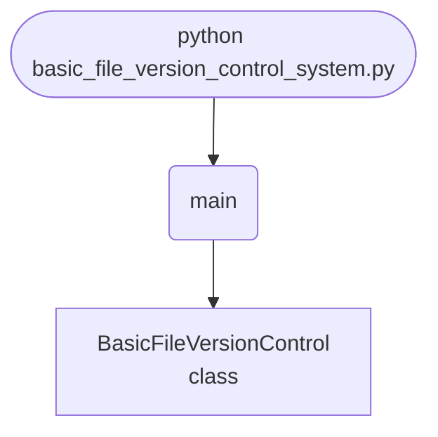

import FileCode from '../../../../components/FileCode.astro'

## Abstract
Ever wondered what Git actually *does*? Strip away the branches and remotes and you're left with a simple idea: hash a file's contents, store a snapshot, and let the user roll back. This project builds exactly that — a command-line version control system that commits files with messages, skips commits when nothing changed (by comparing hashes), and reverts to the last saved version. Then you'll grow it from "remembers one version" into a real multi-version history with timestamps, a full log, and diffs — and learn why `pickle` is a poor storage choice for anything you'll keep.

You will leave understanding:
- Why content **hashing** (SHA-256) is the heart of every VCS.
- How "no changes detected" works by comparing the new hash to the stored one.
- The commit → store-snapshot → revert cycle.
- The limits of the starter design (one version, pickle) and how to fix them.

## Prerequisites
- Python 3.8 or above (uses the `:=` walrus operator).
- A text editor or IDE.
- Standard library only — `os`, `hashlib`, `pickle`, `datetime`.
- Comfort with classes, dictionaries, and file I/O.

## Getting Started

### Create the project
1. Create a folder named `mini-vcs`.
2. Inside it, create `basic_file_version_control_system.py`.

### Write the code
<FileCode file="projects/intermediate/basic_file_version_control_system.py" lang="python" title="basic_file_version_control_system.py" showLineNumbers={1} />

### Run it
```cmd title="command"
C:\Users\Your Name\mini-vcs> python basic_file_version_control_system.py
# Menu: 1) Commit  2) Revert  3) View Log  4) Exit
# Commit a file, edit it, commit again, then revert to undo your edits.
```

## How it fits together

Read from the top: this is what runs when you execute the file, and which function calls which. It is generated from the code, so it cannot drift from it.



## What it produces

Running the file exactly as it ships, with nothing typed at the prompt, takes **0.2 s** and prints:

```text title="python basic_file_version_control_system.py"
Basic File Version Control System
1. Commit File
2. Revert File
3. View Log
4. Exit
Enter your choice: 4   (no input available, using the default)
```

## Step-by-Step Explanation

### 1. Hashing a file
```python title="basic_file_version_control_system.py"
def hash_file(self, file_path):
    hasher = hashlib.sha256()
    with open(file_path, "rb") as f:
        while chunk := f.read(8192):
            hasher.update(chunk)
    return hasher.hexdigest()
```
This is the core idea. A SHA-256 hash is a fixed-length fingerprint of the file's bytes — change a single character and the hash changes completely. Reading in 8 KB chunks (the `:=` walrus loop) means even a huge file never loads fully into memory. Git uses the same trick (with SHA-1/SHA-256) to identify content.

### 2. Skipping unchanged commits
```python title="basic_file_version_control_system.py"
if file_name in self.versions and self.versions[file_name]["hash"] == file_hash:
    print("No changes detected.")
    return
```
Before saving, compare the new hash to the stored one. Identical hashes mean identical content — so there's nothing to commit. That's how Git knows "nothing to commit, working tree clean".

### 3. Storing a snapshot
```python title="basic_file_version_control_system.py"
version_data = {
    "hash": file_hash,
    "timestamp": timestamp,
    "message": message,
    "content": open(file_path, "rb").read(),
}
self.versions[file_name] = version_data
with open(self.version_file, "wb") as f:
    pickle.dump(self.versions, f)
```
Each commit stores the hash, time, message, and the **full file contents**, then pickles the whole `versions` dict to `.versions.pkl`. **Notice the limitation:** `self.versions[file_name] = ...` *overwrites* — so only the latest version per file is kept. The upgrade below fixes that.

### 4. Reverting
```python title="basic_file_version_control_system.py"
with open(os.path.join(self.repo_path, file_name), "wb") as f:
    f.write(self.versions[file_name]["content"])
```
Revert just writes the stored bytes back to disk. Because we kept the raw content, restoring is trivial.

## Fix #1: Keep Every Version

A real VCS keeps history. Store a *list* of versions per file:
```python title="history.py"
# versions[file_name] becomes a list of snapshots
entry = {"hash": file_hash, "timestamp": timestamp,
         "message": message, "content": data}
self.versions.setdefault(file_name, []).append(entry)

def revert(self, file_name, index=-1):      # -1 = latest, 0 = first, etc.
    snapshot = self.versions[file_name][index]
    Path(self.repo_path, file_name).write_bytes(snapshot["content"])

def log(self, file_name):
    for i, v in enumerate(self.versions[file_name]):
        print(f"[{i}] {v['timestamp']}  {v['hash'][:8]}  {v['message']}")
```
Now you can revert to *any* past commit by index — much closer to real version control.

## Fix #2: Store Diffs, Not Full Copies

Saving the whole file every commit wastes space. Store the *difference* between versions:
```python title="diffs.py"
import difflib

def make_diff(old_text, new_text):
    return list(difflib.unified_diff(old_text.splitlines(), new_text.splitlines(), lineterm=""))
```
Git does a sophisticated version of this (delta compression). For a learning project, `difflib` is enough to show how diffs shrink storage.

## Fix #3: Drop Pickle

`pickle` is convenient but **unsafe** (unpickling untrusted data can execute code) and not human-readable. For text snapshots, prefer storing content files in a folder plus a JSON index:
```python title="store.py"
import json, hashlib
# Save each unique blob by its hash, like Git's object store
blob_path = Path(self.repo_path, ".objects", file_hash)
blob_path.write_bytes(data)
# Index maps filename -> list of {hash, timestamp, message}
Path(self.repo_path, "index.json").write_text(json.dumps(index, indent=2))
```
This is literally a simplified version of Git's `.git/objects` content-addressable store.

## Common Mistakes

| Problem | Cause | Fix |
|---|---|---|
| Only one version is kept | `versions[name] = ...` overwrites | Append to a **list** per file |
| `SyntaxError` on `:=` | Python < 3.8 | Upgrade, or use a normal `while` loop |
| Reverting wipes recent work | Revert with no confirmation | Confirm; commit current state first |
| Repo file grows huge | Storing full content every commit | Store **diffs** or dedupe blobs by hash |
| `pickle` load fails / unsafe | Format change or untrusted data | Switch to JSON index + blob store |
| Binary files break diffs | `difflib` is line-based | Keep full copies for binaries |

## Variations to Try

1. **Multi-version history** — revert to any commit by index or hash.
2. **`status` command** — show which tracked files changed since last commit.
3. **Whole-directory tracking** — commit a folder, not one file.
4. **Diff viewer** — print a colored unified diff between two versions.
5. **Tags** — name important commits ("v1.0").
6. **Branches** — keep parallel histories (the real leap toward Git).
7. **Compression** — gzip stored blobs to save space.

## Real-World Applications
- **Understanding Git** — this *is* Git's core, minus the plumbing.
- **Document versioning** — wikis, CMSs, and editors that track edits.
- **Config backups** — snapshot a config before changing it.
- **Undo systems** — the same snapshot/restore idea powers app undo.

## Educational Value
- **Hashing** — content fingerprints and change detection.
- **Serialization** — pickle vs. JSON vs. a blob store, and their trade-offs.
- **Data modeling** — why a list beats a single slot for history.
- **Demystifying tools** — seeing the simple idea inside a complex tool.

## Next Steps
- Store **every version** in a list and revert by index.
- Replace full copies with **diffs**.
- Swap `pickle` for a **JSON index + hashed blob store**.
- Add **status**, **tags**, and eventually **branches**.

## Conclusion
You built a miniature version control system and saw that the magic behind Git is really just *hash the content, store a snapshot, restore on request*. By keeping full history, storing diffs, and dropping pickle for a content-addressable store, you walk the same path Git's designers did. Next time you `git commit`, you'll know exactly what's happening underneath. Full source on [GitHub](https://github.com/Ravikisha/PythonCentralHub/blob/main/projects/intermediate/basic_file_version_control_system.py). Explore more systems projects on Python Central Hub.
