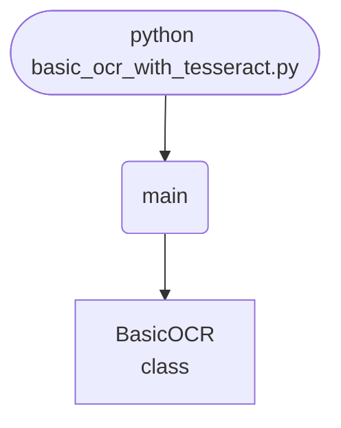

## Abstract
Optical Character Recognition turns a *picture* of text into *editable* text — the tech behind scanning receipts, digitizing books, and reading license plates. This project wraps Google's open-source **Tesseract** engine in a Tkinter GUI: upload an image, and the extracted text appears in a scrollable box. It's only a few lines, because `pytesseract` does the heavy lifting. The real lesson is everything *around* the OCR call — because raw scans rarely read cleanly, you'll learn the image preprocessing (grayscale, threshold, denoise) that turns garbage output into accurate text, plus page-segmentation modes, batch processing, and searchable-PDF export.

You will leave understanding:
- How `pytesseract` bridges Python and the Tesseract engine.
- Why **preprocessing** is 80% of real-world OCR accuracy.
- What page-segmentation modes (`--psm`) do and when to change them.
- How to scale from one image to a batch pipeline.

## Prerequisites
- Python 3.6 or above.
- **The Tesseract engine itself** (separate from the Python package): install via [the Tesseract installer](https://github.com/UB-Mannheim/tesseract/wiki) on Windows, `brew install tesseract` on Mac, or `apt install tesseract-ocr` on Linux.
- `pip install pytesseract pillow opencv-python`.
- Tkinter (bundled with Python).

## Getting Started

### Point Python at Tesseract (Windows)
If `pytesseract` can't find the engine, set the path explicitly:
```python title="setup.py"
import pytesseract
pytesseract.pytesseract.tesseract_cmd = r"C:\Program Files\Tesseract-OCR\tesseract.exe"
```

### Create the project
1. Create a folder named `ocr-app`.
2. Inside it, create `basic_ocr_with_tesseract.py`.
3. Install the Python packages and the Tesseract engine.

### Write the code
<FileCode file="projects/intermediate/basic_ocr_with_tesseract.py" lang="python" title="basic_ocr_with_tesseract.py" showLineNumbers={1} />

### Run it
```cmd title="command"
C:\Users\Your Name\ocr-app> python basic_ocr_with_tesseract.py
# Upload Image -> pick a clear photo/scan of text -> text appears in the box.
```

## How it fits together

Read from the top: this is what runs when you execute the file, and which function calls which. It is generated from the code, so it cannot drift from it.



## Step-by-Step Explanation

### 1. The OCR call
```python title="basic_ocr_with_tesseract.py"
from PIL import Image
import pytesseract

image = Image.open(file_path)
extracted_text = pytesseract.image_to_string(image)
```
That's the entire recognition step. `Image.open` loads the file with Pillow; `image_to_string` hands it to Tesseract and returns the recognized text. Everything else is UI and error handling.

### 2. The file dialog
```python title="basic_ocr_with_tesseract.py"
file_path = filedialog.askopenfilename(
    filetypes=[("Image Files", "*.png;*.jpg;*.jpeg;*.bmp;*.tiff")])
if file_path:
    self.extract_text(file_path)
```
Restricting `filetypes` keeps users from selecting files Tesseract can't read. The `if file_path` guard handles the user pressing Cancel.

### 3. Showing the result safely
```python title="basic_ocr_with_tesseract.py"
try:
    ...
    self.text_area.delete(1.0, END)
    self.text_area.insert(END, extracted_text)
except Exception as e:
    self.text_area.delete(1.0, END)
    self.text_area.insert(END, f"Error: {e}")
```
Clearing before inserting prevents results from stacking. Wrapping in `try/except` turns a missing-engine or corrupt-file error into a visible message instead of a crash.

## The Secret to Good OCR: Preprocessing

Tesseract is only as good as the image you feed it. Clean it up with OpenCV first — this single step often doubles accuracy:
```python title="preprocess.py"
import cv2

def clean(path):
    img = cv2.imread(path)
    gray = cv2.cvtColor(img, cv2.COLOR_BGR2GRAY)          # 1. drop color
    gray = cv2.medianBlur(gray, 3)                        # 2. remove speckle noise
    # 3. binarize: pure black text on white, adaptive to lighting
    thresh = cv2.adaptiveThreshold(
        gray, 255, cv2.ADAPTIVE_THRESH_GAUSSIAN_C,
        cv2.THRESH_BINARY, 31, 2)
    return thresh

text = pytesseract.image_to_string(clean("scan.jpg"))
```
Grayscale → denoise → threshold (black/white) is the standard recipe. For skewed scans, add deskewing; for tiny text, upscale the image first.

## Page-Segmentation Modes

Tesseract assumes a full page by default. Tell it the layout for better results:
```python title="psm.py"
# --psm 6: assume a single uniform block of text (great for paragraphs)
pytesseract.image_to_string(img, config="--psm 6")
# --psm 7: treat the image as a single line (receipts, labels)
pytesseract.image_to_string(img, config="--psm 7")
# --psm 10: a single character
```
Picking the right `--psm` for the content is one of the biggest accuracy levers.

## Get Word Positions (Bounding Boxes)

Beyond plain text, Tesseract can tell you *where* each word is — useful for highlighting or forms:
```python title="boxes.py"
data = pytesseract.image_to_data(img, output_type=pytesseract.Output.DICT)
for i, word in enumerate(data["text"]):
    if word.strip():
        x, y, w, h = (data[k][i] for k in ("left", "top", "width", "height"))
        print(word, (x, y, w, h), "conf:", data["conf"][i])
```

## Batch Mode and Searchable PDFs

Process a folder, or produce a PDF with an invisible text layer (so it's searchable):
```python title="batch.py"
from pathlib import Path
for img in Path("scans").glob("*.png"):
    Path(img.with_suffix(".txt")).write_text(
        pytesseract.image_to_string(Image.open(img)))

# Searchable PDF:
pdf = pytesseract.image_to_pdf_or_hocr("scan.png", extension="pdf")
Path("scan.pdf").write_bytes(pdf)
```

## Common Mistakes

| Problem | Cause | Fix |
|---|---|---|
| `TesseractNotFoundError` | Engine not installed / not on PATH | Install Tesseract; set `tesseract_cmd` |
| Gibberish output | Noisy, low-contrast, or skewed image | Preprocess: grayscale + threshold + denoise |
| Misses a single line / receipt | Wrong layout assumption | Set `--psm 7` (single line) or `6` (block) |
| Wrong language | Default is English | Install language data; pass `lang="deu"` etc. |
| Tiny text unread | Resolution too low | Upscale the image before OCR |
| Results stack in the box | Didn't clear the Text widget | `delete(1.0, END)` before inserting |

## Variations to Try

1. **Preprocessing pipeline** — grayscale, threshold, deskew (the big win).
2. **Multi-language** — add `lang=` and the language packs.
3. **Batch folder** — OCR every image in a directory.
4. **Searchable PDF** — image → PDF with a hidden text layer.
5. **Receipt parser** — extract totals/dates with regex on the output.
6. **Live capture** — OCR from a webcam frame.
7. **Translate** — pipe extracted text into a translation API.
8. **Confidence highlighting** — color words by Tesseract's confidence score.

## Real-World Applications
- **Document digitization** — turning paper archives into searchable text.
- **Data entry automation** — invoices, receipts, forms.
- **Accessibility** — reading text aloud for the visually impaired.
- **License-plate / sign reading** — logistics and automotive.

## Educational Value
- **OCR fundamentals** — what the engine does and its inputs.
- **Image preprocessing** — the unglamorous step that drives accuracy.
- **Configuration** — page-segmentation modes and languages.
- **Pipelines** — single image → batch → structured output.

## Next Steps
- Add an **OpenCV preprocessing** step before OCR.
- Experiment with **`--psm` modes** and **languages**.
- Build **batch processing** and **searchable-PDF** export.
- Parse structured docs (receipts/forms) with regex on the output.

## Checkpoint exercise

This checkpoint practices OCR post-processing: drop low-confidence words and repair digits that the engine misread.

<DataCampExercise
  lang="python"
  hint={`Keep words whose confidence is at least MIN_CONF. For amounts, str.replace swaps the letter O for the digit 0.`}
  code={`MIN_CONF = 60
results = [(" Total ", 93), ("$1O.5l", 88), ("blurr", 31), ("Paid", 77)]

def fix_amount(tok):
    return tok.___.replace("l", "1")

kept = [t.strip() for t, conf in results if conf ___ MIN_CONF]
cleaned = [fix_amount(t) if t.startswith("$") else t for t in kept]
print("kept:", len(kept), "of", len(results))
print("text:", " ".join(cleaned))

# Expected output includes: text: Total $10.51 Paid`}
  solution={`MIN_CONF = 60
results = [(" Total ", 93), ("$1O.5l", 88), ("blurr", 31), ("Paid", 77)]

def fix_amount(tok):
    return tok.replace("O", "0").replace("l", "1")

kept = [t.strip() for t, conf in results if conf >= MIN_CONF]
cleaned = [fix_amount(t) if t.startswith("$") else t for t in kept]
print("kept:", len(kept), "of", len(results))
print("text:", " ".join(cleaned))`}
  sct={`test_output_contains("text: Total $10.51 Paid", pattern=False)
success_msg("OCR output cleaned.")`}
  height={260}
/>

## Conclusion
You built an OCR app that extracts text from images in a few lines — and learned that the real skill isn't the `image_to_string` call, it's the preprocessing and configuration that make it *accurate*. Grayscale, threshold, the right `--psm`, and batch pipelines are what separate a demo from the engine behind every scanner app. Full source on [GitHub](https://github.com/Ravikisha/PythonCentralHub/blob/main/projects/intermediate/basic_ocr_with_tesseract.py). Explore more vision projects on Python Central Hub.
