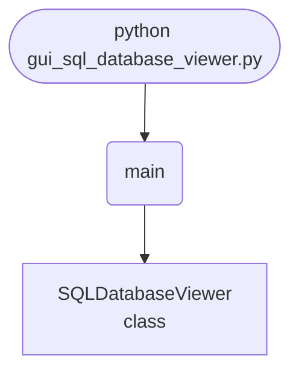

import FileCode from '../../../../components/FileCode.astro'

## Abstract
A database GUI is the kind of tool you reach for constantly — a mini DB Browser or phpMyAdmin you built yourself. This project connects to a SQLite database, runs whatever SQL you type, and renders the results in a proper table using Tkinter's `Treeview` widget. You'll learn cursors, dynamic columns from `cursor.description`, and result rendering. Then you'll make it safe and useful: guard destructive statements, support parameterized queries, browse the schema, and export results to CSV.

You will leave understanding:
- The SQLite workflow: `connect` → `cursor` → `execute` → `fetchall`.
- How `cursor.description` gives you column names for any query.
- How `Treeview` displays tabular data with sortable headings.
- Why running arbitrary SQL is powerful *and* dangerous — and how to fence it.

## Prerequisites
- Python 3.6 or above.
- A text editor or IDE.
- Standard library only — `sqlite3` and `tkinter` are built in.
- Basic SQL (`SELECT`, `INSERT`, `CREATE TABLE`).
- A SQLite `.db` file to open (or create one — see below).

## Getting Started

### Make a test database (optional)
```python title="make_db.py"
import sqlite3
conn = sqlite3.connect("test.db")
conn.execute("CREATE TABLE users (id INTEGER, name TEXT, age INTEGER)")
conn.executemany("INSERT INTO users VALUES (?, ?, ?)",
                 [(1, "Alice", 30), (2, "Bob", 25), (3, "Carol", 41)])
conn.commit(); conn.close()
```

### Create the project
1. Create a folder named `sql-viewer`.
2. Inside it, create `gui_sql_database_viewer.py`.

### Write the code
<FileCode file="projects/intermediate/gui_sql_database_viewer.py" lang="python" title="gui_sql_database_viewer.py" showLineNumbers={1} />

### Run it
```cmd title="command"
C:\Users\Your Name\sql-viewer> python gui_sql_database_viewer.py
# Enter the path to a .db file, click Connect.
# Type "SELECT * FROM users" and click Execute.
```

## How it fits together

Read from the top: this is what runs when you execute the file, and which function calls which. It is generated from the code, so it cannot drift from it.



## Step-by-Step Explanation

### 1. Connecting
```python title="gui_sql_database_viewer.py"
self.connection = sqlite3.connect(db_path)
```
`sqlite3.connect` opens (or creates) a database file and returns a connection. Everything else flows through it. Wrapping it in `try/except sqlite3.Error` turns a bad path into a friendly dialog instead of a crash.

### 2. Executing a query
```python title="gui_sql_database_viewer.py"
cursor = self.connection.cursor()
cursor.execute(query)
self.connection.commit()
```
A **cursor** runs SQL and holds the result set. `commit()` saves changes for write statements (`INSERT`/`UPDATE`/`DELETE`); it's harmless for `SELECT`.

### 3. Dynamic columns
```python title="gui_sql_database_viewer.py"
columns = [description[0] for description in cursor.description] if cursor.description else []
self.result_tree["columns"] = columns
for col in columns:
    self.result_tree.heading(col, text=col)
```
This is the clever bit. `cursor.description` lists metadata about each result column — its `[0]` is the name. Because you read it *after* every query, the table adapts to *any* SQL automatically. For non-`SELECT` statements `description` is `None`, hence the guard.

### 4. Filling the table
```python title="gui_sql_database_viewer.py"
for item in self.result_tree.get_children():   # clear old rows
    self.result_tree.delete(item)
for row in cursor.fetchall():                   # add new rows
    self.result_tree.insert("", END, values=row)
```
Clear, then insert. `fetchall()` pulls every result row as a tuple; each becomes a Treeview row.

## Safety: Fence Off Destructive SQL

Running *any* SQL means a typo'd `DROP TABLE` is one click away. Add a confirmation for write/DDL statements:
```python title="guard.py"
DESTRUCTIVE = ("drop", "delete", "update", "alter", "truncate")

def is_destructive(query):
    return query.strip().lower().split()[0] in DESTRUCTIVE

# before executing:
if is_destructive(query):
    if not messagebox.askyesno("Confirm", "This modifies data. Continue?"):
        return
```
For a pure *viewer*, consider opening read-only: `sqlite3.connect("file:db.sqlite?mode=ro", uri=True)`.

## Parameterized Queries

Typed queries are fine for exploration, but if you add input fields (e.g. "find user by name"), **never** f-string values into SQL:
```python title="params.py"
# WRONG — SQL injection
cursor.execute(f"SELECT * FROM users WHERE name = '{name}'")
# RIGHT — parameterized
cursor.execute("SELECT * FROM users WHERE name = ?", (name,))
```
The `?` placeholder lets SQLite handle escaping safely.

## Browse the Schema

List tables and columns so users don't have to guess:
```python title="schema.py"
def tables(conn):
    return [r[0] for r in conn.execute(
        "SELECT name FROM sqlite_master WHERE type='table'")]

def columns(conn, table):
    return [r[1] for r in conn.execute(f"PRAGMA table_info({table})")]
```
Show these in a side panel; double-click a table to auto-fill `SELECT * FROM <table>`.

## Export Results to CSV

```python title="export.py"
import csv
def export(tree, path="results.csv"):
    cols = tree["columns"]
    with open(path, "w", newline="") as f:
        w = csv.writer(f)
        w.writerow(cols)
        for item in tree.get_children():
            w.writerow(tree.item(item)["values"])
```

## Common Mistakes

| Problem | Cause | Fix |
|---|---|---|
| Accidental data loss | Ran `DROP`/`DELETE` by mistake | Confirm destructive SQL; open read-only |
| Old + new rows mixed | Didn't clear the Treeview | `delete` all children before inserting |
| Crash on `INSERT`/`CREATE` | `cursor.description` is `None` | Guard before reading column names |
| SQL injection risk | f-stringing inputs into SQL | Use `?` parameterized queries |
| Changes don't persist | Forgot `commit()` | Commit after write statements |
| UI freezes on big result | Fetching huge tables at once | Page results / `fetchmany`, or add `LIMIT` |

## Variations to Try

1. **Read-only mode** — open the DB so no query can modify it.
2. **Schema browser** — clickable tree of tables and columns.
3. **Query history** — recall and re-run past queries.
4. **Sortable columns** — click a heading to sort by that column.
5. **Multiple DB engines** — add MySQL/PostgreSQL via their drivers.
6. **Export/import** — CSV and JSON round-trips.
7. **Pagination** — `LIMIT`/`OFFSET` for large tables.

## Real-World Applications
- **Database administration** — lightweight DB Browser / TablePlus clone.
- **Internal admin tools** — quick data inspection for support teams.
- **Data exploration** — ad-hoc querying during development.
- **Teaching SQL** — a safe sandbox for learners.

## Educational Value
- **Database programming** — connections, cursors, transactions.
- **Dynamic UIs** — building tables from query metadata.
- **Security** — injection, parameterization, read-only access.
- **`Treeview` mastery** — Tkinter's most capable data widget.

## Next Steps
- Add a **destructive-SQL confirmation** or open **read-only**.
- Support **parameterized** input fields.
- Build a **schema browser** and **CSV export**.
- Add **query history** and **column sorting**.

## Conclusion
You built a SQL database viewer that runs arbitrary queries and renders them in a self-adapting table — then made it safe with confirmations, parameterization, and read-only access. The `connect → cursor → execute → describe → render` pipeline is the backbone of every database tool, and the `cursor.description` trick is how real viewers handle queries they've never seen. Full source on [GitHub](https://github.com/Ravikisha/PythonCentralHub/blob/main/projects/intermediate/gui_sql_database_viewer.py). Explore more database projects on Python Central Hub.
