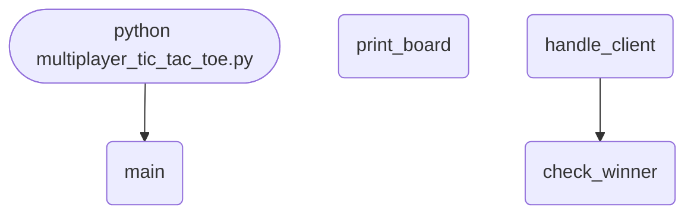

import FileCode from '../../../../components/FileCode.astro'

## Abstract
Tic-Tac-Toe is simple enough that the *game* never gets in the way of the real lesson: how do two programs on different machines share one consistent state? In this project you build a socket server that hosts a game board, assigns players X and O, validates moves, detects a winner, and uses a **lock** to keep the shared board from being corrupted by two threads at once. Along the way you'll see exactly why naive multiplayer code lets both players move at once — and how to enforce turns and broadcast the board to everyone.

You will leave understanding:
- How a server holds authoritative game state two clients connect to.
- Why shared mutable state across threads needs a `threading.Lock`.
- The win/draw detection algorithm over a flat 9-cell board.
- The difference between *having* a lock and actually *enforcing turns*.

## Prerequisites
- Python 3.6 or above.
- A text editor or IDE.
- Standard library only — `socket` and `threading`.
- Comfort with lists, loops, and basic threading.

## Getting Started

### Create the project
1. Create a folder named `tic-tac-toe-net`.
2. Inside it, create `multiplayer_tic_tac_toe.py`.

### Write the code
<FileCode file="projects/intermediate/multiplayer_tic_tac_toe.py" lang="python" title="multiplayer_tic_tac_toe.py" showLineNumbers={1} />

### Run it
```cmd title="command"
# Start the server
C:\Users\Your Name\tic-tac-toe-net> python multiplayer_tic_tac_toe.py
Server started. Waiting for players...

# Connect two clients (e.g. with `telnet 127.0.0.1 65432` or a small client script)
```

## How it fits together

Read from the top: this is what runs when you execute the file, and which function calls which. It is generated from the code, so it cannot drift from it.



## Step-by-Step Explanation

### 1. Shared state + a lock
```python title="multiplayer_tic_tac_toe.py"
board = [" " for _ in range(9)]
current_player = "X"
lock = threading.Lock()
```
The board is a flat list of 9 cells (index 0-8). Because two client threads can touch `board` and `current_player` at the same time, every change is guarded by `lock` to prevent a **race condition** — two writes interleaving and leaving the board inconsistent.

### 2. Assigning players
```python title="multiplayer_tic_tac_toe.py"
player = current_player
with lock:
    current_player = "O" if current_player == "X" else "X"
```
The first client becomes X, the second O. `with lock:` ensures the swap is atomic — without it, two simultaneous connections could both grab "X".

### 3. Win detection
```python title="multiplayer_tic_tac_toe.py"
winning_combinations = [
    [0, 1, 2], [3, 4, 5], [6, 7, 8],   # rows
    [0, 3, 6], [1, 4, 7], [2, 5, 8],   # columns
    [0, 4, 8], [2, 4, 6]               # diagonals
]
for combo in winning_combinations:
    if board[combo[0]] == board[combo[1]] == board[combo[2]] != " ":
        return board[combo[0]]
if " " not in board:
    return "Draw"
```
All 8 winning lines are hard-coded as index triples. The chained comparison checks "all three equal *and* not empty" in one line. No empty cells and no winner means a draw.

### 4. Validating a move
```python title="multiplayer_tic_tac_toe.py"
if not move.isdigit() or int(move) not in range(9):
    conn.sendall("Invalid move. Try again.\n".encode())
    continue
...
with lock:
    if board[move] == " ":
        board[move] = player
    else:
        conn.sendall("Spot already taken. Try again.\n".encode())
```
Input is validated twice: it must be a digit 0-8, and the target cell must be empty. Both checks happen before mutating the board.

## The Big Gap: Turns Aren't Actually Enforced

Look closely — the server swaps `current_player` *once at connect*, but the move loop never checks **whose turn it is**. Both players can hammer moves whenever they like. Real turn enforcement:
```python title="turns.py"
turn = "X"   # global, lock-protected

# inside the move handler:
with lock:
    if player != turn:
        conn.sendall("Not your turn. Wait.\n".encode())
        continue
    if board[move] == " ":
        board[move] = player
        winner = check_winner()
        turn = "O" if turn == "X" else "X"   # hand off the turn
```
A multiplayer server is the **referee** — clients propose moves, the server decides if they're legal.

## The Other Gap: Broadcast the Board to Both

The current code sends the board only to the player who just moved. The opponent never sees it. Track both connections and push updates to both:
```python title="broadcast.py"
clients = []   # filled as players connect

def send_board():
    rendered = render(board).encode()
    for c in list(clients):
        try:
            c.sendall(rendered)
        except OSError:
            clients.remove(c)
```
Call `send_board()` after every accepted move so both screens stay in sync.

## Common Mistakes

| Problem | Cause | Fix |
|---|---|---|
| Both players move freely | Turn never checked in the loop | Enforce `player == turn` under the lock |
| Opponent's screen never updates | Board sent only to the mover | Broadcast to all connected clients |
| Board occasionally corrupts | Unlocked access from two threads | Guard every read/write with `lock` |
| `Address already in use` | Port not released | `setsockopt(SO_REUSEADDR)` before bind |
| Server hangs after a win | Socket not closed / loop not broken | `break` and `conn.close()` on game over |
| Move index off by one | Used 1-9 instead of 0-8 | Keep cells 0-8, or subtract 1 on input |

## Variations to Try

1. **Proper turn engine** — enforce alternation and reject out-of-turn moves.
2. **Spectators** — extra connections that receive the board read-only.
3. **Rematch** — reset the board and swap who goes first.
4. **Tkinter client** — a clickable 3×3 grid instead of typing indices.
5. **Lobby / multiple games** — pair players into separate boards.
6. **AI opponent** — single-player vs. a minimax bot.
7. **`N×N` board** — generalize win detection to k-in-a-row.

## Real-World Applications
- **Turn-based multiplayer games** — chess, checkers, board games.
- **Authoritative servers** — the anti-cheat pattern in online games.
- **Collaborative state** — shared whiteboards, live documents.
- **State synchronization** — keeping multiple clients consistent.

## Educational Value
- **Authoritative server design** — the server as referee.
- **Thread safety** — locks and race conditions on shared state.
- **Protocol design** — how clients and server agree on messages.
- **Game logic** — win/draw detection over a flat array.

## Next Steps
- Add a **real turn engine** that rejects out-of-turn moves.
- **Broadcast** the board to both players after each move.
- Build a **Tkinter client** with a clickable grid.
- Add **rematch** and a simple **lobby**.

## Try it here

Here's a local two-player board to feel the game logic — **click a cell** to place a mark
(X and O alternate), get three in a row to win, then click to reset:

```p5 title="Play tic-tac-toe" desc="Click a cell to place your mark. X and O alternate; three in a row wins. Click after a game to reset." height="360"
let board;
let turn;
let winner;
function reset() {
  board = new Array(9).fill("");
  turn = "X";
  winner = null;
}
function checkWin() {
  const L = [[0, 1, 2], [3, 4, 5], [6, 7, 8], [0, 3, 6], [1, 4, 7], [2, 5, 8], [0, 4, 8], [2, 4, 6]];
  for (const l of L) {
    if (board[l[0]] && board[l[0]] === board[l[1]] && board[l[1]] === board[l[2]]) return board[l[0]];
  }
  if (board.every((x) => x)) return "draw";
  return null;
}
function setup() {
  createCanvas(360, 360);
  textAlign(CENTER, CENTER);
  textFont("monospace");
  reset();
}
function draw() {
  background(13, 17, 23);
  stroke(90, 100, 116);
  strokeWeight(2);
  for (let i = 1; i < 3; i++) {
    line(i * 120, 0, i * 120, 360);
    line(0, i * 120, 360, i * 120);
  }
  noStroke();
  textSize(64);
  for (let i = 0; i < 9; i++) {
    const x = (i % 3) * 120 + 60, y = Math.floor(i / 3) * 120 + 60;
    if (board[i] === "X") { fill(75, 139, 190); text("X", x, y); }
    else if (board[i] === "O") { fill(255, 211, 67); text("O", x, y); }
  }
  if (winner) {
    fill(13, 17, 23, 190);
    rect(0, 0, width, height);
    fill(120, 200, 120);
    textSize(26);
    text(winner === "draw" ? "Draw — click to reset" : winner + " wins! click to reset", width / 2, height / 2);
  }
}
function mousePressed() {
  if (mouseX < 0 || mouseX > width || mouseY < 0 || mouseY > height) return;
  if (winner) { reset(); redraw(); return; }
  const c = Math.floor(mouseX / 120), r = Math.floor(mouseY / 120), i = r * 3 + c;
  if (i >= 0 && i < 9 && !board[i]) {
    board[i] = turn;
    turn = turn === "X" ? "O" : "X";
    winner = checkWin();
    redraw();
  }
}
```

## Conclusion
You built networked Tic-Tac-Toe and learned the defining idea of online multiplayer: the server owns the truth, clients only propose. You also saw why "has a lock" isn't the same as "enforces the rules" — turn logic and broadcasting are what make it a real game. Those patterns scale straight up to chess servers and collaborative editors. Full source on [GitHub](https://github.com/Ravikisha/PythonCentralHub/blob/main/projects/intermediate/multiplayer_tic_tac_toe.py). Explore more networking and game projects on Python Central Hub.
