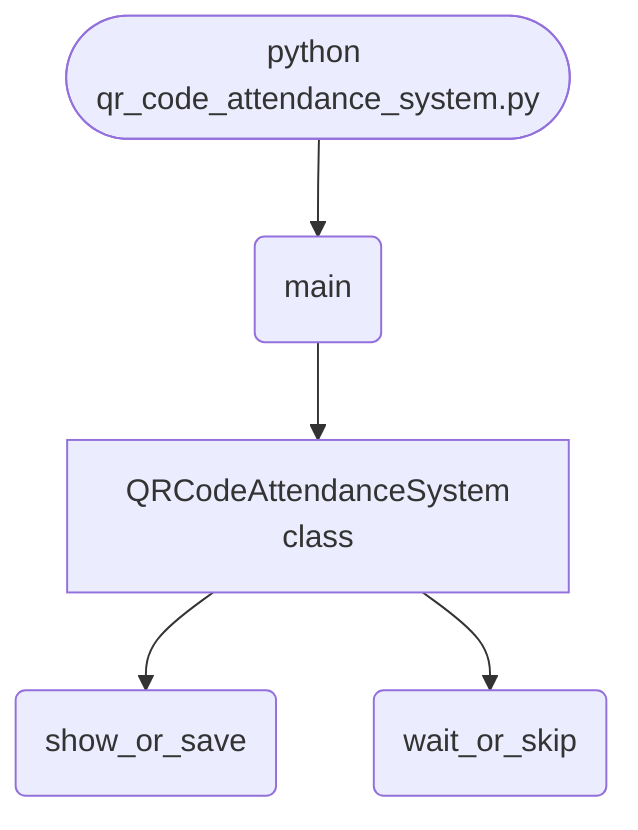

import FileCode from '../../../../components/FileCode.astro'

## Abstract
QR codes turn any phone or printout into a scannable ID — which is why they run everything from event check-ins to classroom attendance. This project wires together two libraries: `qrcode` to **generate** a code for each user, and OpenCV to **scan** it through a webcam and stamp the time. You'll build the generate-and-scan core, then turn the toy into a usable system: a database of records, duplicate-scan prevention, a live camera overlay that shows the decoded ID, and CSV export for reports.

You will leave understanding:
- How QR codes encode arbitrary text and how `qrcode` renders them.
- The OpenCV capture loop: open camera → read frame → detect → release.
- Why the naive version can't tell who's already checked in (and how to fix it).
- How to move from "popup says scanned" to a real attendance log.

## Prerequisites
- Python 3.6 or above.
- A text editor or IDE.
- `pip install qrcode[pil] opencv-python`.
- A working webcam.
- Tkinter (bundled with Python).

## Getting Started

### Create the project
1. Create a folder named `qr-attendance`.
2. Inside it, create `qr_code_attendance_system.py`.
3. Install dependencies: `pip install qrcode[pil] opencv-python`.

### Write the code
<FileCode file="projects/intermediate/qr_code_attendance_system.py" lang="python" title="qr_code_attendance_system.py" showLineNumbers={1} />

### Run it
```cmd title="command"
C:\Users\Your Name\qr-attendance> python qr_code_attendance_system.py
# Enter a User ID and "Generate QR Code" -> saves <id>_qr.png
# "Scan QR Code" opens the webcam; show the code to mark attendance.
```

## How it fits together

Read from the top: this is what runs when you execute the file, and which function calls which. It is generated from the code, so it cannot drift from it.



## Step-by-Step Explanation

### 1. Generating a QR code
```python title="qr_code_attendance_system.py"
qr = qrcode.QRCode(version=1, box_size=10, border=5)
qr.add_data(user_id)
qr.make(fit=True)
img = qr.make_image(fill="black", back_color="white")
img.save(f"{user_id}_qr.png")
```
A QR code is just text encoded as a grid. `version` sets capacity (1 = smallest), `box_size` is pixels per module, `border` is the quiet zone around it. `fit=True` auto-grows the version if the data doesn't fit. Here the encoded data is simply the user ID.

### 2. Opening the camera
```python title="qr_code_attendance_system.py"
cap = cv2.VideoCapture(0)          # 0 = default webcam
detector = cv2.QRCodeDetector()
```
`VideoCapture(0)` grabs the first camera. `QRCodeDetector` is OpenCV's built-in QR reader — no extra library needed.

### 3. The scan loop
```python title="qr_code_attendance_system.py"
while True:
    ret, frame = cap.read()
    if not ret:
        break
    data, bbox, _ = detector.detectAndDecode(frame)
    if data:
        timestamp = datetime.now().strftime("%Y-%m-%d %H:%M:%S")
        messagebox.showinfo("Attendance Marked", f"User ID: {data}\nTime: {timestamp}")
        break
    cv2.imshow("QR Code Scanner", frame)
    if cv2.waitKey(1) & 0xFF == ord("q"):
        break
cap.release()
cv2.destroyAllWindows()
```
Each loop reads a frame, tries to decode a QR code, and on success stamps the time and stops. `cv2.imshow` shows the live feed; `waitKey(1)` keeps it responsive and lets `q` quit. **Always** `release()` the camera and `destroyAllWindows()` — skip it and the webcam stays locked.

## The Core Problem: Nothing Is Actually Stored

The naive version pops a message and forgets. A real system needs a record. Add SQLite:
```python title="db.py"
import sqlite3

conn = sqlite3.connect("attendance.db")
conn.execute("""CREATE TABLE IF NOT EXISTS attendance (
    user_id TEXT, timestamp TEXT
)""")

def mark(user_id):
    ts = datetime.now().strftime("%Y-%m-%d %H:%M:%S")
    conn.execute("INSERT INTO attendance VALUES (?, ?)", (user_id, ts))
    conn.commit()
```
Note `?` placeholders — never f-string user input into SQL (injection risk).

## Prevent Duplicate Scans

A code lingering in view marks attendance dozens of times. Check today's log first:
```python title="dedupe.py"
def already_marked_today(user_id):
    today = datetime.now().strftime("%Y-%m-%d")
    row = conn.execute(
        "SELECT 1 FROM attendance WHERE user_id=? AND timestamp LIKE ?",
        (user_id, f"{today}%")).fetchone()
    return row is not None
```
Mark only if `not already_marked_today(data)`.

## Draw a Live Overlay

Show the detected box and ID on the video so the user knows it worked:
```python title="overlay.py"
if data and bbox is not None:
    pts = bbox.astype(int).reshape(-1, 2)
    for i in range(len(pts)):
        cv2.line(frame, tuple(pts[i]), tuple(pts[(i + 1) % len(pts)]), (0, 255, 0), 2)
    cv2.putText(frame, data, tuple(pts[0]), cv2.FONT_HERSHEY_SIMPLEX, 0.8, (0, 255, 0), 2)
```

## Export to CSV

For reports, dump the table:
```python title="export.py"
import csv
def export():
    rows = conn.execute("SELECT user_id, timestamp FROM attendance").fetchall()
    with open("attendance.csv", "w", newline="") as f:
        csv.writer(f).writerows([("User ID", "Time"), *rows])
```

## Common Mistakes

| Problem | Cause | Fix |
|---|---|---|
| Camera stays on / locked | Forgot `release()` | Always `cap.release()` + `destroyAllWindows()` |
| Same person marked many times | No duplicate check | Skip if already marked today |
| Attendance vanishes on exit | Nothing persisted | Store in SQLite/CSV |
| Black window, no feed | Wrong camera index or in-use | Try `VideoCapture(1)`; close other apps |
| QR won't scan | Too small / poor lighting / glare | Larger `box_size`, better light, hold steady |
| SQL breaks on odd IDs | String-formatted query | Use `?` parameterized queries |

## Variations to Try

1. **User registry** — generate codes for a whole roster from a CSV.
2. **Check-in / check-out** — track both, compute hours present.
3. **Web dashboard** — live attendance via Flask (see [Simple Blog with Flask](./simple-blog-with-flask)).
4. **Encrypted payloads** — sign the QR data so codes can't be forged.
5. **Email/SMS confirmation** — notify on successful check-in.
6. **Photo capture** — save a webcam snapshot with each scan.
7. **Mobile scanning** — a companion phone app posting to your API.

## Real-World Applications
- **Events & conferences** — ticketed entry and session check-in.
- **Schools & offices** — class and workplace attendance.
- **Gyms & memberships** — access logging.
- **Inventory & logistics** — scanning items in and out.

## Educational Value
- **QR generation & decoding** — encoding data, the `qrcode` and OpenCV APIs.
- **Computer vision basics** — the capture/detect/release loop.
- **Database design** — records, queries, and safe parameterization.
- **Data integrity** — duplicate prevention and exports.

## Next Steps
- Persist scans to **SQLite** with **duplicate prevention**.
- Add a **live overlay** showing the decoded ID.
- Support **check-in/check-out** and **CSV export**.
- Generate codes for a **whole roster** at once.

## Conclusion
You combined `qrcode` and OpenCV into a scan-to-log attendance system, then closed the gap that makes the naive version a toy: it now *remembers*, refuses duplicates, and exports reports. Generate-then-scan plus a database is the exact recipe behind ticketing, access control, and inventory systems everywhere. Full source on [GitHub](https://github.com/Ravikisha/PythonCentralHub/blob/main/projects/intermediate/qr_code_attendance_system.py). Explore more computer-vision projects on Python Central Hub.
