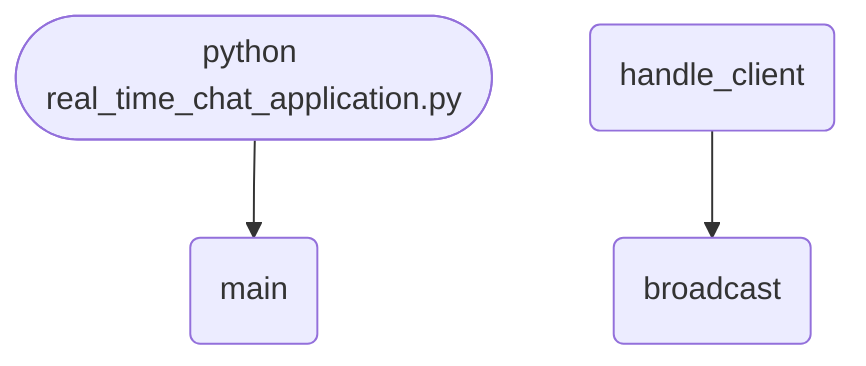

import FileCode from '../../../../components/FileCode.astro'

## Abstract
WebSockets are how the modern web does *real-time* — a persistent, two-way connection that lets a server push messages to clients the instant they arrive, with none of the polling overhead of plain HTTP. This project builds a WebSocket chat server in pure `asyncio`: clients connect, and every message is broadcast to all of them, live. It's your introduction to **asynchronous** Python — `async`/`await`, coroutines, and an event loop handling many connections on a single thread. You'll also fix a real deprecation in the starter code and add usernames, rooms, and a browser client.

You will leave understanding:
- What a WebSocket is and how it differs from request/response HTTP.
- How `async`/`await` lets one thread juggle thousands of connections.
- The `async for message in websocket` pattern for receiving.
- Why the starter's `asyncio.wait([...])` broadcast is deprecated, and the modern replacement.

## Prerequisites
- Python 3.7 or above (for `asyncio.run`).
- A text editor or IDE.
- The websockets library: `pip install websockets`.
- Basic understanding of functions; async is explained here.
- Helpful: the thread-based [Basic Chatroom App](./basic-chatroom-app) for contrast.

## Getting Started

### Create the project
1. Create a folder named `ws-chat`.
2. Inside it, create `real_time_chat_application.py`.
3. Install the dependency: `pip install websockets`.

### Write the code
<FileCode file="projects/intermediate/real_time_chat_application.py" lang="python" title="real_time_chat_application.py" showLineNumbers={1} />

### Run it
```cmd title="command"
C:\Users\Your Name\ws-chat> python real_time_chat_application.py
Server started on ws://localhost:8765
# Connect with a browser console or a small client (see below).
```

## How it fits together

Read from the top: this is what runs when you execute the file, and which function calls which. It is generated from the code, so it cannot drift from it.



## Step-by-Step Explanation

### 1. Tracking connected clients
```python title="real_time_chat_application.py"
connected_clients = set()
```
A `set` of active WebSocket connections. Sets make add/remove O(1) and prevent duplicates — perfect for a connection registry.

### 2. Handling a client (a coroutine)
```python title="real_time_chat_application.py"
async def handle_client(websocket, path):
    connected_clients.add(websocket)
    try:
        async for message in websocket:
            print(f"Received message: {message}")
            await broadcast(message)
    except websockets.ConnectionClosed:
        print("Client disconnected")
    finally:
        connected_clients.remove(websocket)
```
`async def` makes this a **coroutine** — a function that can pause at `await` and let other connections run. `async for message in websocket` yields each incoming message as it arrives, *without blocking* the other clients. The `finally` guarantees the client is removed from the registry even if it disconnects abruptly — critical for not broadcasting to dead sockets.

### 3. Broadcasting
```python title="real_time_chat_application.py"
async def broadcast(message):
    if connected_clients:
        await asyncio.wait([client.send(message) for client in connected_clients])
```
Send the message to everyone. **Heads-up:** this line is deprecated in modern `websockets`/`asyncio` — see the fix below.

### 4. Starting the server
```python title="real_time_chat_application.py"
async def main():
    server = await websockets.serve(handle_client, "localhost", 8765)
    print("Server started on ws://localhost:8765")
    await server.wait_closed()

asyncio.run(main())
```
`websockets.serve` binds the port and runs `handle_client` for each connection. `asyncio.run(main())` creates the event loop, runs the coroutine, and cleans up — the standard async entry point.

## Fix: Modernize the Broadcast

`asyncio.wait([coro, ...])` with bare coroutines is **deprecated** (and broadcasting to a client that just disconnected raises). The clean, current approach:
```python title="broadcast_fixed.py"
async def broadcast(message):
    if not connected_clients:
        return
    # gather runs all sends concurrently; return_exceptions keeps one
    # failed send from cancelling the rest
    await asyncio.gather(
        *(client.send(message) for client in connected_clients),
        return_exceptions=True,
    )
```
Recent `websockets` versions also offer a built-in `websockets.broadcast(connected_clients, message)` helper that handles dead connections for you.

## Add Usernames

Have each client send a name as its first message, then prefix broadcasts:
```python title="usernames.py"
names = {}   # websocket -> name

async def handle_client(websocket):
    name = await websocket.recv()          # first message is the name
    names[websocket] = name
    connected_clients.add(websocket)
    await broadcast(f"*** {name} joined ***")
    try:
        async for msg in websocket:
            await broadcast(f"{name}: {msg}")
    finally:
        connected_clients.discard(websocket)
        await broadcast(f"*** {name} left ***")
```
(Modern `websockets` passes only `websocket` to the handler — `path` is no longer required.)

## Add Rooms

Group clients into channels by keeping a `dict[str, set]` of rooms and broadcasting only within the sender's room — the same pattern Slack and Discord channels use.

## A Browser Client

WebSockets are native to browsers — no library needed:
```html title="client.html"
<script>
  const ws = new WebSocket("ws://localhost:8765");
  ws.onopen = () => ws.send("Alice");                 // send username first
  ws.onmessage = (e) => console.log(e.data);          // print incoming
  function send(text) { ws.send(text); }
</script>
```

## WebSockets vs. Threads (vs. HTTP)

| Approach | Model | Scales to many clients? |
|---|---|---|
| HTTP polling | Repeated request/response | Poorly — wasteful, laggy |
| Thread per client | One OS thread each | Hundreds (threads are heavy) |
| **asyncio + WebSocket** | One loop, many coroutines | Thousands (cheap to suspend) |

This is *why* async exists: I/O-bound work (waiting on the network) suspends cheaply, so one thread serves enormous numbers of idle-but-connected clients.

## Common Mistakes

| Problem | Cause | Fix |
|---|---|---|
| `DeprecationWarning` on broadcast | `asyncio.wait` with coroutines | Use `asyncio.gather(..., return_exceptions=True)` |
| Server crashes when one client drops | `send` to a closed socket | `return_exceptions=True`, or `websockets.broadcast` |
| `handler() takes 1 arg` error | Newer `websockets` drops `path` | Define `handle_client(websocket)` |
| Messages never arrive | Mixed `ws://` and `wss://`, or wrong port | Match scheme/port; `wss` needs TLS |
| Dead clients still in the set | Removed only on clean close | Remove in a `finally` block |
| Blocking call freezes everyone | Using sync I/O in a coroutine | Use async equivalents; never `time.sleep` |

## Variations to Try

1. **Modern broadcast** — the `gather`/`websockets.broadcast` fix (do this first).
2. **Usernames & system messages** — join/leave notices.
3. **Chat rooms** — multiple channels.
4. **Browser UI** — an HTML/JS front end (above).
5. **Message history** — replay the last N messages on join.
6. **Typing indicators / presence** — show who's online and typing.
7. **Authentication** — validate a token on connect.
8. **Persistence** — log messages to a database.

## Real-World Applications
- **Live chat & messaging** — Slack, Discord, support widgets.
- **Collaborative apps** — Google Docs-style live editing.
- **Live dashboards** — real-time metrics, prices, scores.
- **Multiplayer games** — low-latency state updates.

## Educational Value
- **Async Python** — `async`/`await`, coroutines, the event loop.
- **WebSockets** — persistent, bidirectional connections.
- **Concurrency models** — async vs. threads vs. polling.
- **Keeping up with APIs** — recognizing and fixing deprecations.

## Next Steps
- Replace the deprecated broadcast with **`asyncio.gather`**.
- Add **usernames**, **system messages**, and **rooms**.
- Build a **browser client** and add **message history**.
- Add **authentication** and **persistence**.

## Conclusion
You built a real-time chat server with `asyncio` and WebSockets, learned how one thread serves thousands of connections by suspending at `await`, and modernized a deprecated broadcast in the process. Persistent, push-based connections are the backbone of every live app you use — and async is how Python scales them. Full source on [GitHub](https://github.com/Ravikisha/PythonCentralHub/blob/main/projects/intermediate/real_time_chat_application.py). Explore more networking projects on Python Central Hub.
