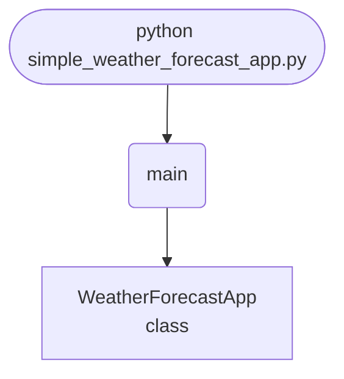

## Abstract
Consuming a real web API is a rite of passage, and weather is the perfect first API: free, well-documented, and instantly gratifying. In this tutorial you build a Tkinter app that queries the OpenWeatherMap API for a city's current conditions and displays temperature, "feels like", humidity, and a description. Then you grow it into something polished — a 5-day forecast, weather icons, °C/°F toggle, geolocation, response caching, and the kind of error handling that separates a demo from a tool.

You will leave understanding:
- How to register for and use an API key safely.
- The request → JSON → parse → display pipeline behind every API client.
- How to read nested JSON (`data["weather"][0]["description"]`) without crashing.
- Why you check `status_code` and handle the unhappy paths first.

## Prerequisites
- Python 3.6 or above.
- A text editor or IDE.
- The `requests` library: `pip install requests`.
- A **free** OpenWeatherMap API key from [openweathermap.org/api](https://openweathermap.org/api).
- Tkinter (bundled with Python).

## Getting Started

### Get an API key
1. Sign up at [openweathermap.org](https://openweathermap.org/api) (free tier is plenty).
2. Copy your API key from the dashboard.
3. New keys can take a few minutes to activate — don't panic if the first call 401s.

### Create the project
1. Create a folder named `weather-app`.
2. Inside it, create `simple_weather_forecast_app.py`.
3. Install the dependency: `pip install requests`.

### Write the code
<FileCode file="projects/intermediate/simple_weather_forecast_app.py" lang="python" title="simple_weather_forecast_app.py" showLineNumbers={1} />

### Run it
```cmd title="command"
C:\Users\Your Name\weather-app> python simple_weather_forecast_app.py
# Enter a city name, click "Get Weather".
# Make sure you replaced API_KEY with your real key first.
```

## How it fits together

Read from the top: this is what runs when you execute the file, and which function calls which. It is generated from the code, so it cannot drift from it.



## Step-by-Step Explanation

### 1. The endpoint and key
```python title="simple_weather_forecast_app.py"
API_KEY = "your_openweathermap_api_key"
BASE_URL = "http://api.openweathermap.org/data/2.5/weather"
```
`BASE_URL` is the "current weather" endpoint. The key authenticates you and counts against your rate limit.

### 2. Building the request
```python title="simple_weather_forecast_app.py"
params = {"q": city, "appid": API_KEY, "units": "metric"}
response = requests.get(BASE_URL, params=params)
data = response.json()
```
Passing a `params` dict lets `requests` build the query string for you (`?q=London&appid=...&units=metric`) and handles URL-encoding spaces and special characters. `units="metric"` gives Celsius; `"imperial"` gives Fahrenheit.

### 3. Check status before parsing
```python title="simple_weather_forecast_app.py"
if response.status_code == 200:
    weather = data["weather"][0]["description"].capitalize()
    temp = data["main"]["temp"]
    ...
else:
    messagebox.showerror("Error", data.get("message", "Failed to fetch weather data."))
```
This is the most important habit in API work: **handle the failure path first**. A typo'd city returns `404` with a helpful `message` field — surface it instead of crashing on a missing key.

### 4. Reading nested JSON
```python title="simple_weather_forecast_app.py"
data["weather"][0]["description"]   # list → first item → field
data["main"]["temp"]                # nested dict
```
OpenWeatherMap nests `weather` inside a *list* (a place can have several conditions) and groups numbers under `main`. Knowing the shape of the JSON is half the battle — print `data` once and study it.

## Protect Your API Key

Never hard-code secrets. Use an environment variable:
```python title="config.py"
import os
API_KEY = os.environ["OWM_API_KEY"]   # set OWM_API_KEY in your shell, not in code
```
```cmd title="command"
# PowerShell
$env:OWM_API_KEY = "your_key_here"
```
This keeps the key out of screenshots, git history, and shared code.

## Add a 5-Day Forecast

The forecast endpoint returns data in 3-hour steps:
```python title="forecast.py"
FORECAST_URL = "http://api.openweathermap.org/data/2.5/forecast"

def five_day(city):
    r = requests.get(FORECAST_URL,
                     params={"q": city, "appid": API_KEY, "units": "metric"},
                     timeout=10)
    r.raise_for_status()
    # Pick the midday (12:00) reading for each day
    return [item for item in r.json()["list"] if "12:00:00" in item["dt_txt"]]
```
Loop the result into five labels or a small table.

## Show Weather Icons

Each condition carries an icon code:
```python title="icons.py"
from tkinter import PhotoImage
import requests, io

icon_code = data["weather"][0]["icon"]                       # e.g. "10d"
url = f"http://openweathermap.org/img/wn/{icon_code}@2x.png"
img_bytes = requests.get(url, timeout=10).content
# Save then load, or use Pillow's ImageTk for in-memory display
```

## Add a °C / °F Toggle

Store the raw value once, convert for display:
```python title="units.py"
def to_fahrenheit(celsius):
    return celsius * 9 / 5 + 32

label.config(text=f"{temp}°C" if self.metric else f"{to_fahrenheit(temp):.1f}°F")
```

## Common Mistakes

| Problem | Cause | Fix |
|---|---|---|
| `401 Unauthorized` | Key missing, wrong, or not yet active | Check the key; wait a few minutes after signup |
| `KeyError: 'main'` | Parsed JSON before checking status | Guard with `if status_code == 200` first |
| App freezes on slow network | No `timeout` | Add `timeout=10`; fetch on a background thread |
| Spaces in city name break URL | Manual string concatenation | Use the `params=` dict — it encodes for you |
| Wrong temperature scale | Forgot `units` | Set `units="metric"` or `"imperial"` |
| Rate-limit errors | Polling too often | Cache responses for a few minutes |

## Variations to Try

1. **Geolocation** — detect the user's city via their IP and load it on launch.
2. **Hourly chart** — plot the next 24 hours with `matplotlib`.
3. **Favorites** — save a list of cities and refresh them all at once.
4. **Severe-weather alerts** — use the One Call API's `alerts` field.
5. **Background by condition** — change the window color for sunny/rainy/snow.
6. **Caching layer** — store responses with a timestamp; skip the API within 10 minutes.
7. **Voice output** — read the forecast aloud (see [Weather App with Voice Commands](/projects/intermediate/weather-app-with-voice-commands/)).

## Real-World Applications
- **Travel apps** — destination weather at a glance.
- **Agriculture & logistics** — planning around conditions.
- **Dashboards** — a weather widget on a home-automation panel.
- **Event planning** — outdoor-event go/no-go decisions.

## Educational Value
- **REST APIs** — keys, query parameters, JSON responses.
- **Defensive parsing** — status checks and `.get()` with defaults.
- **Secret management** — environment variables over hard-coding.
- **Caching & rate limits** — being a good API citizen.

## Next Steps
- Move the key into an **environment variable**.
- Add a **5-day forecast** and **weather icons**.
- Implement a **°C/°F toggle** and **response caching**.
- Detect the user's city with **geolocation**.

## Checkpoint exercise

This checkpoint practices the forecast summary: parse an inline JSON response, find each day's high and convert it to Fahrenheit.

<DataCampExercise
  lang="python"
  hint={`Celsius to Fahrenheit is c * 9 / 5 + 32.`}
  code={`import json

raw = '{"hourly": [{"t": "2025-01-01T09:00", "c": 2.0}, {"t": "2025-01-01T12:00", "c": 5.0}, {"t": "2025-01-01T18:00", "c": 3.5}, {"t": "2025-01-02T09:00", "c": -1.0}, {"t": "2025-01-02T15:00", "c": 0.5}]}'
data = json.loads(raw)

def to_f(c):
    return ___

highs = {}
for h in data["hourly"]:
    day = h["t"][:10]
    highs[day] = max(highs.get(day, h["c"]), h["c"])

for day in sorted(highs):
    print(f"{day}: high {highs[day]:.1f}C / {to_f(highs[day]):.1f}F")

# Expected output includes: 2025-01-01: high 5.0C / 41.0F`}
  solution={`import json

raw = '{"hourly": [{"t": "2025-01-01T09:00", "c": 2.0}, {"t": "2025-01-01T12:00", "c": 5.0}, {"t": "2025-01-01T18:00", "c": 3.5}, {"t": "2025-01-02T09:00", "c": -1.0}, {"t": "2025-01-02T15:00", "c": 0.5}]}'
data = json.loads(raw)

def to_f(c):
    return c * 9 / 5 + 32

highs = {}
for h in data["hourly"]:
    day = h["t"][:10]
    highs[day] = max(highs.get(day, h["c"]), h["c"])

for day in sorted(highs):
    print(f"{day}: high {highs[day]:.1f}C / {to_f(highs[day]):.1f}F")`}
  sct={`test_output_contains("2025-01-01: high 5.0C / 41.0F", pattern=False)
success_msg("Daily highs converted.")`}
  height={260}
/>

## Conclusion
You built a weather app that turns a city name into live conditions, then layered on a forecast, icons, unit toggles, and caching — all on top of the same request → parse → display loop you'll reuse for every API you ever touch. The skill transfers directly: swap the endpoint and you have a stock ticker, a currency converter, or a news reader. Full source on [GitHub](https://github.com/Ravikisha/PythonCentralHub/blob/main/projects/intermediate/simple_weather_forecast_app.py). Explore more API projects on Python Central Hub.
