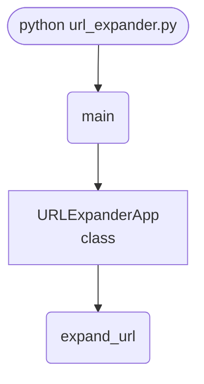

import FileCode from '../../../../components/FileCode.astro'

## Abstract
Shortened links (`bit.ly`, `t.co`, `tinyurl`) hide their real destination — convenient for sharing, risky for clicking. A URL expander follows the chain of HTTP redirects and shows you where a short link *actually* lands before you visit it. In this tutorial you build a small Tkinter app around a single `requests` call, then turn it into a genuinely useful safety tool: it reveals the **full** redirect chain, flags suspicious hops, handles timeouts, expands links in bulk, and copies results to the clipboard.

You will leave understanding:
- How HTTP redirects (301/302) work and how `requests` follows them.
- The difference between a `HEAD` and a `GET` request, and why `HEAD` is cheaper here.
- How to handle network errors without crashing the UI.
- Why expanding a link is a security practice, not just a convenience.

## Prerequisites
- Python 3.6 or above.
- A text editor or IDE.
- The `requests` library: `pip install requests`.
- Tkinter (bundled with Python).
- A basic grasp of HTTP requests and responses.

## Getting Started

### Create the project
1. Create a folder named `url-expander`.
2. Inside it, create `url_expander.py`.
3. Install the dependency: `pip install requests`.

### Write the code
<FileCode file="projects/intermediate/url_expander.py" lang="python" title="url_expander.py" showLineNumbers={1} />

### Run it
```cmd title="command"
C:\Users\Your Name\url-expander> python url_expander.py
# Paste a short URL (e.g. https://bit.ly/xyz) and click "Expand URL".
# A dialog shows the final destination.
```

## How it fits together

Read from the top: this is what runs when you execute the file, and which function calls which. It is generated from the code, so it cannot drift from it.



## Step-by-Step Explanation

### 1. The core: follow the redirects
```python title="url_expander.py"
def expand_url(short_url):
    try:
        response = requests.head(short_url, allow_redirects=True)
        return response.url
    except requests.RequestException as e:
        return str(e)
```
Two ideas do all the work:
- **`requests.head`** asks only for the response *headers*, not the page body. Since we only care about the final URL, downloading the whole page would be wasteful.
- **`allow_redirects=True`** tells `requests` to chase every `Location` header automatically. After the last hop, `response.url` holds the real destination.

Catching `requests.RequestException` (the base class for all `requests` errors) means a dead link or DNS failure returns a message instead of crashing.

### 2. Input guard
```python title="url_expander.py"
short_url = self.url_entry.get()
if not short_url:
    messagebox.showerror("Error", "Please enter a URL.")
    return
```
Never trust an empty field. Bail early with a clear message.

### 3. Show the result
```python title="url_expander.py"
expanded_url = expand_url(short_url)
messagebox.showinfo("Expanded URL", f"Original URL: {expanded_url}")
```
A popup is fine for one URL. For more, you'll want a results panel (below).

## Upgrade: Show the Full Redirect Chain

A single destination hides intermediate hops — and those hops are where shady redirectors live. `response.history` records every step:
```python title="chain.py"
import requests

def redirect_chain(short_url, timeout=10):
    r = requests.get(short_url, allow_redirects=True, timeout=timeout)
    hops = [resp.url for resp in r.history] + [r.url]
    return hops

for i, url in enumerate(redirect_chain("https://bit.ly/example")):
    print(f"{i}: {url}")
```
Seeing `bit.ly → tracking.example → final.com` tells you far more than `final.com` alone.

## Add a Timeout (Always)

A request with no timeout can hang forever, freezing your app:
```python title="timeout.py"
requests.head(short_url, allow_redirects=True, timeout=10)
```
**Rule of thumb:** every network call in production code gets a `timeout`. Catch `requests.Timeout` separately to tell the user "the server is slow" rather than "the URL is broken".

## Flag Suspicious Links

A lightweight safety check before the user clicks:
```python title="safety.py"
from urllib.parse import urlparse

SUSPICIOUS_TLDS = {".zip", ".mov", ".tk", ".xyz"}

def looks_risky(url):
    host = urlparse(url).netloc.lower()
    flags = []
    if any(url.lower().endswith(t) for t in SUSPICIOUS_TLDS):
        flags.append("unusual TLD")
    if url.count("//") > 1:
        flags.append("nested redirect")
    if "@" in url:
        flags.append("credentials in URL")
    return flags
```
This is heuristic, not a malware scanner — but "credentials in URL" and "nested redirect" catch a surprising number of phishing tricks.

## Batch Mode

Expand a whole list at once and show results in a `Text` widget instead of popups:
```python title="batch.py"
def expand_many(self):
    urls = self.input_text.get("1.0", "end").splitlines()
    self.output_text.delete("1.0", "end")
    for url in filter(str.strip, urls):
        final = expand_url(url.strip())
        self.output_text.insert("end", f"{url.strip()}  ->  {final}\n")
```
Now you can paste 50 links and audit them in one click.

## Common Mistakes

| Problem | Cause | Fix |
|---|---|---|
| App hangs on a bad link | No `timeout` set | Pass `timeout=10` to every request |
| Some shorteners don't expand | They block `HEAD` requests | Fall back to `requests.get` |
| Only the final URL shown | Ignored `response.history` | Build the chain from `history + [r.url]` |
| `SSLError` on valid sites | Outdated certificates | Update `certifi`; never disable verification in production |
| UI freezes during batch | Network calls on the main thread | Run expansion in a background thread |
| Crash on malformed input | No URL validation | Check scheme with `urlparse` before requesting |

## Variations to Try

1. **Clipboard integration** — auto-read the clipboard and expand on launch.
2. **Browser extension companion** — expose the logic as a small Flask API.
3. **QR support** — decode a QR image to a short URL, then expand it.
4. **History log** — save every expansion to a JSON file with a timestamp.
5. **Threaded UI** — keep the window responsive during slow lookups.
6. **Reputation lookup** — query a URL-reputation API and show a verdict.
7. **CLI mode** — accept a URL as a command-line argument for scripting.

## Real-World Applications
- **Security & anti-phishing** — verify links before clicking in email or chat.
- **Social media tooling** — audit campaign links and tracking parameters.
- **Link analytics** — uncover the tracking domains a redirect passes through.
- **Content moderation** — inspect user-submitted short links at scale.

## Educational Value
- **HTTP fundamentals** — redirects, status codes, `HEAD` vs. `GET`.
- **Robust networking** — timeouts, exception hierarchies, retries.
- **Security thinking** — why obscured destinations are a risk.
- **Responsive GUIs** — moving slow work off the main thread.

## Next Steps
- Print the **full redirect chain** instead of just the destination.
- Add a **timeout** and `HEAD`→`GET` fallback.
- Implement the **suspicious-link** heuristics.
- Build **batch mode** with a results panel and a saved history log.

## Conclusion
You built a URL expander from a single `requests.head` call and grew it into a redirect auditor that reveals every hop, flags risky links, survives slow servers, and processes links in bulk. Underneath a tiny UI sits a genuinely useful security habit: know where a link goes before you go there. Full source on [GitHub](https://github.com/Ravikisha/PythonCentralHub/blob/main/projects/intermediate/url_expander.py). Find more networking projects on Python Central Hub.
