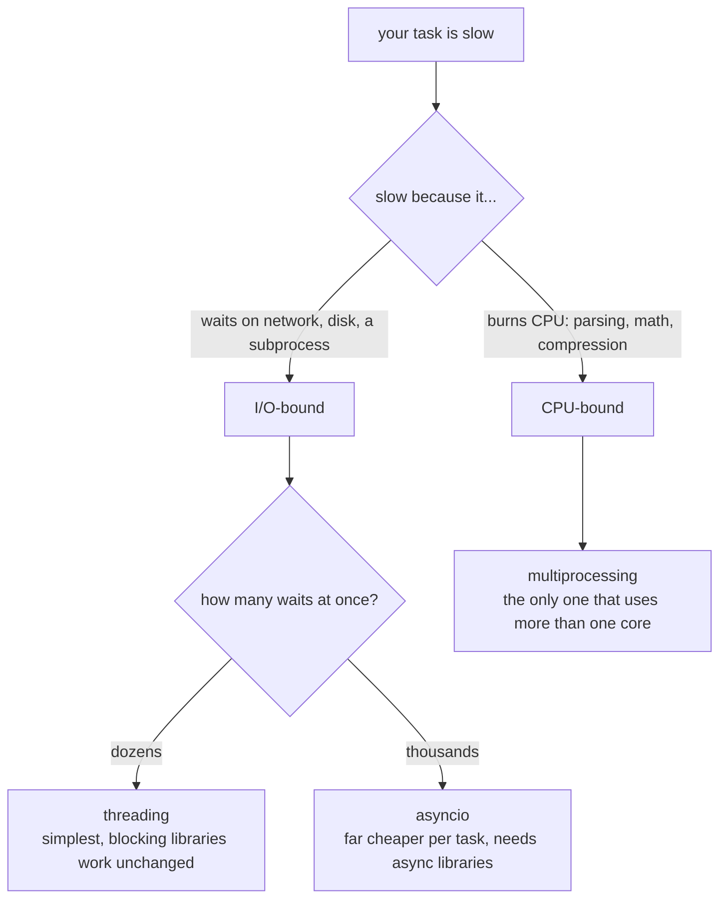

import DataCampExercise from "../../../../components/DataCampExercise.astro";
import Quiz from "../../../../components/Quiz.astro";

Concurrency means making progress on **more than one task at a time**. Python offers three approaches, each suited to a different kind of work:

| Approach | Best for | Why |
|:---|:---|:---|
| **threading** | I/O-bound work (network, disk) | Threads wait together; cheap to create. |
| **multiprocessing** | CPU-bound work (number crunching) | Separate processes use multiple cores. |
| **asyncio** | Many I/O tasks at once | One thread, cooperative `await`, very scalable. |

## The GIL — why it matters

CPython has a **Global Interpreter Lock (GIL)**: only one thread executes Python bytecode at a time. So threads **don't** speed up CPU-bound code — but they're great for I/O, where threads spend most time *waiting* (and release the GIL while waiting). For CPU-bound parallelism, use **multiprocessing**, which sidesteps the GIL with separate processes.

> Rule of thumb: **I/O-bound → threading or asyncio. CPU-bound → multiprocessing.**

## threading

Run functions in separate threads. Start them, then `join` to wait for completion.

```python title="threading_basic.py"
import threading
import time

def worker(name):
    print(f"{name} starting")
    time.sleep(1)               # simulates an I/O wait
    print(f"{name} done")

threads = [threading.Thread(target=worker, args=(f"T{i}",)) for i in range(3)]
for t in threads:
    t.start()                   # begin running concurrently
for t in threads:
    t.join()                    # wait for each to finish
print("all done")
```

Because the threads sleep concurrently, three 1-second waits finish in about **1 second**, not 3.

### Sharing data safely with a Lock

When threads modify shared state, guard it with a `Lock` to avoid race conditions.

```python title="lock.py"
import threading

counter = 0
lock = threading.Lock()

def increment():
    global counter
    for _ in range(100_000):
        with lock:              # only one thread at a time
            counter += 1

ts = [threading.Thread(target=increment) for _ in range(2)]
for t in ts: t.start()
for t in ts: t.join()
print(counter)                  # 200000 (correct, thanks to the lock)
```

## concurrent.futures — a simpler interface

`ThreadPoolExecutor` / `ProcessPoolExecutor` manage a pool of workers and collect results for you.

```python title="executor.py"
from concurrent.futures import ThreadPoolExecutor

def square(n):
    return n * n

with ThreadPoolExecutor(max_workers=4) as pool:
    results = list(pool.map(square, [1, 2, 3, 4, 5]))
print(results)                  # [1, 4, 9, 16, 25]
```

Swap `ThreadPoolExecutor` for `ProcessPoolExecutor` to run CPU-bound work across cores — the API is identical.

## multiprocessing

Each process has its own Python interpreter and memory, so they run truly in parallel on multiple cores.

```python title="multiprocessing_basic.py"
from multiprocessing import Pool

def heavy(n):
    return sum(i * i for i in range(n))

if __name__ == "__main__":          # required guard on Windows/macOS
    with Pool(processes=4) as pool:
        results = pool.map(heavy, [10_000, 20_000, 30_000])
    print(results)
```

> Always wrap multiprocessing entry code in `if __name__ == "__main__":` — without it, spawned processes re-import and re-run your script.

## asyncio — async/await

`asyncio` runs many I/O tasks on a **single thread** using cooperative multitasking. An `async def` function is a **coroutine**; `await` yields control while waiting, letting other coroutines run.

```python title="asyncio_basic.py"
import asyncio

async def fetch(name, delay):
    print(f"{name} start")
    await asyncio.sleep(delay)      # non-blocking wait
    print(f"{name} done")
    return name

async def main():
    # Run three coroutines concurrently
    results = await asyncio.gather(
        fetch("A", 1),
        fetch("B", 1),
        fetch("C", 1),
    )
    print(results)

asyncio.run(main())                 # entry point
```

All three "fetches" overlap, so the total time is about **1 second**, not 3.

### Key asyncio pieces

| Piece | Purpose |
|:---|:---|
| `async def` | Defines a coroutine. |
| `await x` | Wait for an awaitable without blocking the thread. |
| `asyncio.run(coro)` | Run the top-level coroutine. |
| `asyncio.gather(*coros)` | Run many coroutines concurrently, collect results. |
| `asyncio.create_task(coro)` | Schedule a coroutine to run in the background. |
| `asyncio.sleep(s)` | Non-blocking sleep. |

## Choosing the right tool

```text title="decision.txt"
Is the work CPU-bound (math, parsing, compression)?
   -> multiprocessing (use all cores, beat the GIL)

Is the work I/O-bound (HTTP, files, DB)?
   A few tasks, simple code?      -> threading / ThreadPoolExecutor
   Hundreds/thousands of tasks?   -> asyncio
```

## Common pitfalls

- **Threads won't speed up CPU work** — the GIL serializes them; use multiprocessing.
- **Forgetting `join`** — the main program may exit before threads finish.
- **Unguarded shared state** — use a `Lock` around shared mutable data.
- **Blocking calls inside asyncio** — `time.sleep` or heavy CPU work freezes the whole event loop; use `await asyncio.sleep` and run CPU work in an executor.
- **Missing `if __name__ == "__main__":`** — breaks multiprocessing on Windows/macOS.

## Practice Exercises

### Exercise 1 – Run work in threads

<DataCampExercise
  lang="python"
  hint={`Call t.start() to begin a thread and t.join() to wait for it.`}
  code={`# Task: Start the thread and wait for it to finish.
import threading

def task():
    print("working")

t = threading.Thread(target=task)
t.___()      # begin running
t.join()     # wait for completion
print("finished")

# Expected Output:
# working
# finished`}
  solution={`import threading

def task():
    print("working")

t = threading.Thread(target=task)
t.start()
t.join()
print("finished")`}
  sct={`test_output_contains("finished")
success_msg("start() launches the thread; join() waits for it.")`}
  height={190}
/>

### Exercise 2 – Define and run a coroutine

<DataCampExercise
  lang="python"
  hint={`Use 'async def' to define the coroutine and asyncio.run to start it.`}
  code={`# Task: Complete the async function and run it with asyncio.run.
import asyncio

___ def main():
    await asyncio.sleep(0)
    print("hello from async")

asyncio.run(main())

# Expected Output:
# hello from async`}
  solution={`import asyncio

async def main():
    await asyncio.sleep(0)
    print("hello from async")

asyncio.run(main())`}
  sct={`test_output_contains("hello from async")
success_msg("async def creates a coroutine; asyncio.run drives it.")`}
  height={180}
/>

### Exercise 3 – Map work over a thread pool

<DataCampExercise
  lang="python"
  hint={`Use pool.map(func, iterable) to apply the function to every item.`}
  code={`# Task: Square each number using a ThreadPoolExecutor.
from concurrent.futures import ThreadPoolExecutor

def square(n):
    return n * n

with ThreadPoolExecutor() as pool:
    results = list(pool.___(square, [1, 2, 3, 4]))
print(results)

# Expected Output:
# [1, 4, 9, 16]`}
  solution={`from concurrent.futures import ThreadPoolExecutor

def square(n):
    return n * n

with ThreadPoolExecutor() as pool:
    results = list(pool.map(square, [1, 2, 3, 4]))
print(results)`}
  sct={`test_output_contains("[1, 4, 9, 16]")
success_msg("pool.map runs the function across worker threads.")`}
  height={190}
/>

## Choosing between the three

The choice is not a matter of taste. It follows from one question — is your program
**waiting**, or is it **computing**?



The dividing line is the **GIL**: one lock that lets only one thread execute Python
bytecode at a time. A thread that is *waiting* releases it, so waiting overlaps freely.
A thread that is *computing* holds it, so computing does not overlap at all.

## The measurement that shows the GIL

Wall-clock speedup on a shared machine is noisy. A ratio measured inside one run is
not. Time the **CPU** each worker actually consumed and divide by the elapsed time:

```python title="overlap.py" showLineNumbers{1}
import time
from concurrent.futures import ThreadPoolExecutor, ProcessPoolExecutor

def cpu_thread(n):                       # per-THREAD cpu time
    t = time.thread_time()
    s = 0
    for i in range(n):
        s += i * i
    return time.thread_time() - t

def cpu_proc(n):                         # per-PROCESS cpu time
    t = time.process_time()
    s = 0
    for i in range(n):
        s += i * i
    return time.process_time() - t

if __name__ == "__main__":               # required on Windows and macOS
    N = 10_000_000
    t = time.perf_counter()
    with ThreadPoolExecutor(4) as ex:
        d = list(ex.map(cpu_thread, [N] * 4))
    print(sum(d) / (time.perf_counter() - t))    # 1.00

    t = time.perf_counter()
    with ProcessPoolExecutor(4) as ex:
        d = list(ex.map(cpu_proc, [N] * 4))
    print(sum(d) / (time.perf_counter() - t))    # 3.05
```

Measured on CPython 3.14.4, 8 logical CPUs, four workers each squaring 10 million
integers:

| pool | wall | CPU consumed | CPU ÷ wall | reading |
|:--|--:|--:|--:|:--|
| 4 threads | 2.72 s | 2.72 s | **1.00×** | perfectly serialized |
| 4 processes | 1.53 s | 4.67 s | **3.05×** | genuinely parallel |

The threads consumed exactly as much CPU as the clock advanced: at any instant, one of
them was running. The processes consumed 4.67 s of CPU in 1.53 s of wall time, which is
only possible on more than one core.

:::caution[Measure CPU time, not elapsed time]
Timing a worker with `time.perf_counter` measures how long it was *alive*, including
time parked waiting for the GIL. All four threads span the whole window, so that metric
reports near-perfect "overlap" and appears to disprove the GIL. `time.thread_time` and
`time.process_time` count CPU actually burned, which is the question being asked.
:::

## See it move

One GIL, four threads. Only the thread holding the baton runs; the others queue. Switch
to processes and each gets its own interpreter — and its own baton. Toggle the workload
to see why waiting changes everything.

```p5 title="The GIL as a baton" desc="CPU-bound threads must pass one baton so only one runs at a time. Processes each hold their own. Waiting threads release the baton, so I/O overlaps." height="340"
let mode = 0;      // 0 = threads, 1 = processes
let kind = 0;      // 0 = cpu-bound, 1 = io-bound
let holder = 0;
let tick = 0;
let progress = [0, 0, 0, 0];

function setup() {
  createCanvas(600, 340);
  textFont("monospace");
}

function running(i) {
  if (mode === 1) return true;         // processes: all run
  if (kind === 1) return true;         // waiting threads all overlap
  return i === holder;                 // cpu-bound threads: only the holder
}

function draw() {
  background(13, 17, 23);
  tick++;
  if (mode === 0 && kind === 0 && tick % 18 === 0) holder = (holder + 1) % 4;

  for (let i = 0; i < 4; i++) {
    if (running(i)) progress[i] = min(100, progress[i] + 0.5);
  }
  if (progress.every(function (p) { return p >= 100; })) progress = [0, 0, 0, 0];

  noStroke();
  fill(230);
  textSize(13);
  textAlign(LEFT, TOP);
  text(mode === 0 ? "4 threads, one interpreter" : "4 processes, one interpreter each", 24, 18);
  fill(120);
  textSize(11);
  text(kind === 0 ? "workload: CPU-bound (holds the GIL)" : "workload: I/O-bound (releases the GIL while waiting)", 24, 38);

  for (let i = 0; i < 4; i++) {
    const y = 70 + i * 46;
    const on = running(i);
    noStroke();
    fill(150);
    textSize(11);
    textAlign(LEFT, CENTER);
    text((mode === 0 ? "thread " : "process ") + i, 24, y + 14);

    stroke(48, 56, 68);
    strokeWeight(1);
    fill(18, 23, 30);
    rect(120, y, 300, 26, 4);
    noStroke();
    fill(on ? color(75, 139, 190) : color(48, 56, 68));
    rect(121, y + 1, (progress[i] / 100) * 298, 24, 3);

    textAlign(LEFT, CENTER);
    textSize(11);
    if (on) {
      fill(120, 190, 130);
      text("running", 434, y + 13);
    } else {
      fill(232, 110, 110);
      text("blocked", 434, y + 13);
    }

    if (mode === 0 && kind === 0 && i === holder) {
      fill(255, 211, 67);
      textAlign(RIGHT, CENTER);
      text("GIL", 112, y + 13);
    } else if (mode === 1) {
      fill(255, 211, 67);
      textAlign(RIGHT, CENTER);
      text("GIL", 112, y + 13);
    }
  }

  const parallel = mode === 1 || kind === 1 ? 4 : 1;
  noStroke();
  textAlign(LEFT, CENTER);
  textSize(12);
  fill(210);
  text("workers making progress right now: " + parallel + " of 4", 24, 268);
  fill(120);
  textSize(11);
  if (mode === 0 && kind === 0) text("measured CPU / wall = 1.00x  -> no speedup from threads", 24, 290);
  else if (mode === 0) text("threads waiting together: the GIL is released during I/O", 24, 290);
  else text("measured CPU / wall = 3.05x  -> real cores, real speedup", 24, 290);

  drawBtn(24, 306, 150, mode === 0 ? "mode: threads" : "mode: processes");
  drawBtn(186, 306, 190, kind === 0 ? "work: CPU-bound" : "work: I/O-bound");
}

function drawBtn(x, y, w, label) {
  const hot = mouseX > x && mouseX < x + w && mouseY > y && mouseY < y + 24;
  stroke(hot ? color(255, 211, 67) : color(60, 70, 84));
  strokeWeight(1);
  fill(hot ? color(34, 40, 50) : color(22, 28, 36));
  rect(x, y, w, 24, 4);
  noStroke();
  fill(hot ? color(255, 211, 67) : 200);
  textSize(11);
  textAlign(CENTER, CENTER);
  text(label, x + w / 2, y + 12);
}

function mousePressed() {
  if (mouseY < 306 || mouseY > 330) return;
  if (mouseX > 24 && mouseX < 174) { mode = 1 - mode; progress = [0, 0, 0, 0]; }
  if (mouseX > 186 && mouseX < 376) { kind = 1 - kind; progress = [0, 0, 0, 0]; }
}
```

## Waiting is where threads shine

Ten tasks that each sleep 0.1 s, measured on the same machine:

| approach | wall | speedup |
|:--|--:|--:|
| sequential | 1.005 s | 1.00× |
| `ThreadPoolExecutor(10)` | 0.110 s | **9.17×** |
| `asyncio.gather` of 10 | 0.116 s | **8.64×** |

`time.sleep` releases the GIL, and so does every well-behaved socket and file call.
Ten threads therefore wait *simultaneously* and the total is set by the longest wait
rather than their sum.

Threads and coroutines are equally fast here. What separates them is cost per task:

```python title="cost.py" showLineNumbers{1}
# 500 threads that do nothing   -> 104.2 ms   (208 us each)
# 500 coroutines that do nothing ->  3.0 ms   (6 us each)
```

Roughly **35× cheaper**. A thread needs an OS stack; a coroutine is an object. At ten
concurrent waits the difference is irrelevant — at ten thousand, it decides whether the
program runs at all.

:::caution[Processes are not free]
Starting a 4-worker pool and running four trivial tasks took about **1 second** on this
machine, and every argument and result must be pickled and copied between processes.
For work measured in milliseconds a process pool is reliably *slower* than doing it
sequentially. It pays off only when each task runs long enough to dwarf that setup.
:::

:::danger[The `__main__` guard is mandatory]
On Windows and macOS, `multiprocessing` starts workers with **spawn**: each child
re-imports your module. Without `if __name__ == "__main__":` around the code that
creates the pool, every child creates another pool. Symptoms range from
`RuntimeError` to an endless fork bomb.
:::

## Check yourself

<Quiz
  questions={[
    {
      q: "Four CPU-bound tasks run in a ThreadPoolExecutor(4). Measured CPU time divided by wall time is 1.00. What does that mean?",
      options: [
        "the threads used four cores efficiently",
        "only one thread executed Python bytecode at a time, so nothing overlapped",
        "the measurement failed, since the ratio can never be 1",
        "the tasks were actually I/O-bound",
      ],
      answer: 1,
      explain:
        "A ratio of 1 means the workers together burned exactly one core-second per second of clock. That is the GIL serializing them. The same measurement over four processes gives 3.05.",
    },
    {
      q: "Why measure workers with time.thread_time rather than time.perf_counter?",
      options: [
        "perf_counter has too little resolution for short tasks",
        "perf_counter measures elapsed time, so a thread blocked on the GIL still accrues duration",
        "thread_time is the only clock available inside a thread",
        "they are interchangeable, thread_time is just shorter to type",
      ],
      answer: 1,
      explain:
        "All four threads are alive for the whole window, so summing their elapsed times reports near-perfect overlap and appears to disprove the GIL. thread_time counts CPU actually consumed.",
    },
    {
      q: "For ten tasks that each sleep 0.1 s, threads gave 9.17x and asyncio 8.64x. What separates them?",
      options: [
        "nothing measurable here; coroutines cost about 35x less to create, which matters at large scale",
        "asyncio is faster because it avoids the GIL entirely",
        "threads are faster because the OS schedules them on multiple cores",
        "asyncio is slower because coroutines cannot overlap waits",
      ],
      answer: 0,
      explain:
        "Both overlap the waiting, so both approach 10x. Measured creation cost was 208 us per thread against 6 us per coroutine, which decides things at thousands of concurrent tasks, not ten.",
    },
    {
      q: "When is a process pool likely to be SLOWER than a plain sequential loop?",
      options: [
        "when the tasks are CPU-bound",
        "when there are more cores than tasks",
        "when each task is short, because pool startup and pickling dominate",
        "never; processes are always at least as fast",
      ],
      answer: 2,
      explain:
        "Starting a 4-worker pool cost about 1 second here, plus pickling every argument and result. Tasks measured in milliseconds cannot repay that.",
    },
  ]}
/>

## Summary

- The **GIL** means threads don't parallelize CPU work — they shine for I/O.
- **threading** + `Lock` for simple concurrent I/O; **`concurrent.futures`** for pools and results.
- **multiprocessing** for CPU-bound parallelism across cores (guard with `__main__`).
- **asyncio** (`async`/`await`, `gather`, `run`) scales to many concurrent I/O tasks on one thread.
- Match the tool to the workload: CPU → processes, I/O → threads/async.
