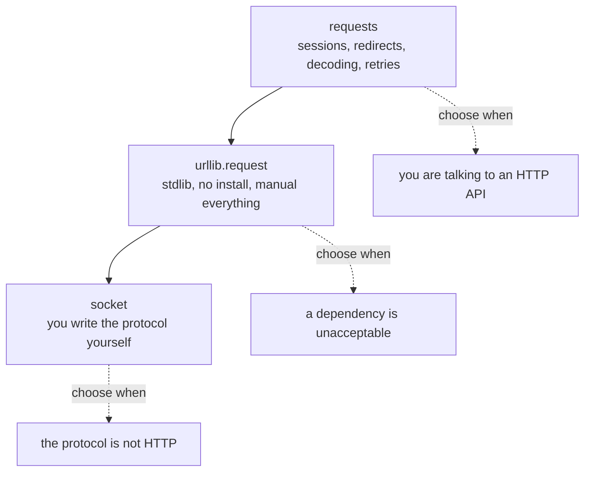

import DataCampExercise from "../../../../components/DataCampExercise.astro";
import Quiz from "../../../../components/Quiz.astro";

Networking in Python spans two levels: **high-level HTTP** (talking to web APIs and sites) and **low-level sockets** (raw TCP/UDP connections). Most apps live at the HTTP level.

| Tool | Level | Notes |
|:---|:---|:---|
| `requests` | High (HTTP) | Third-party, the de-facto standard. `pip install requests`. |
| `urllib.request` | High (HTTP) | Built in; more verbose, no install needed. |
| `urllib.parse` | Helper | Build and parse URLs (pure, no network). |
| `socket` | Low (TCP/UDP) | Raw connections; build your own protocols. |

## requests — the friendly HTTP client

`requests` makes HTTP calls readable. Install it first (`pip install requests`).

```python title="requests_get.py"
import requests

resp = requests.get("https://api.example.com/users", params={"page": 2})
print(resp.status_code)     # 200
print(resp.headers["Content-Type"])
data = resp.json()          # parse a JSON body into Python
print(data)
```

```python title="requests_post.py"
import requests

# Send JSON in the body
resp = requests.post(
    "https://api.example.com/users",
    json={"name": "Ada", "role": "admin"},
    headers={"Authorization": "Bearer TOKEN"},
    timeout=10,
)
resp.raise_for_status()     # raise if status is 4xx/5xx
print(resp.json())
```

| `requests` piece | Purpose |
|:---|:---|
| `requests.get/post/put/delete` | The HTTP verbs. |
| `params={...}` | Query-string parameters. |
| `json={...}` | Send a JSON body. |
| `headers={...}` | Custom request headers. |
| `resp.status_code` | The HTTP status (200, 404, ...). |
| `resp.json()` / `resp.text` | Parsed JSON / raw text. |
| `resp.raise_for_status()` | Turn error statuses into exceptions. |
| `timeout=` | Fail fast instead of hanging forever. |

## urllib — the standard-library option

When you can't add dependencies, `urllib.request` does the same job with more ceremony.

```python title="urllib_get.py"
import urllib.request
import json

req = urllib.request.Request(
    "https://api.example.com/data",
    headers={"User-Agent": "my-app"},
)
with urllib.request.urlopen(req, timeout=10) as resp:
    body = resp.read().decode("utf-8")
    data = json.loads(body)
print(data)
```

## urllib.parse — build and parse URLs

This part of `urllib` is pure (no network) and extremely useful for assembling query strings and dissecting URLs.

```python title="urllib_parse.py"
from urllib.parse import urlencode, urlparse, parse_qs

# Build a query string from a dict
qs = urlencode({"q": "python", "page": 2})
print(qs)                     # q=python&page=2

# Dissect a URL
parts = urlparse("https://example.com/search?q=python&page=2")
print(parts.scheme)           # https
print(parts.netloc)           # example.com
print(parts.path)             # /search
print(parse_qs(parts.query))  # {'q': ['python'], 'page': ['2']}
```

## socket — low-level TCP

For custom protocols or learning how the network really works, use raw sockets. Here's a minimal echo server and client.

```python title="tcp_server.py"
import socket

server = socket.socket(socket.AF_INET, socket.SOCK_STREAM)
server.bind(("127.0.0.1", 9000))
server.listen()
print("listening on 9000")

conn, addr = server.accept()      # blocks until a client connects
with conn:
    data = conn.recv(1024)        # read up to 1024 bytes
    conn.sendall(data)            # echo it back
```

```python title="tcp_client.py"
import socket

with socket.socket(socket.AF_INET, socket.SOCK_STREAM) as s:
    s.connect(("127.0.0.1", 9000))
    s.sendall(b"hello")
    reply = s.recv(1024)
print(reply)                      # b'hello'
```

| socket call | Purpose |
|:---|:---|
| `socket(AF_INET, SOCK_STREAM)` | Create a TCP socket. |
| `bind((host, port))` | Attach a server to an address. |
| `listen()` / `accept()` | Wait for and accept a connection. |
| `connect((host, port))` | Client connects to a server. |
| `sendall(bytes)` / `recv(n)` | Send / receive raw bytes. |

> Sockets speak **bytes**, not strings — encode with `.encode()` and decode with `.decode()`.

## Choosing a level

```text title="decision.txt"
Talking to a web API or website?   -> requests (or urllib if no installs)
Just building/parsing a URL?       -> urllib.parse
Custom protocol / raw TCP/UDP?     -> socket
```

## Common pitfalls

- **No timeout** — network calls can hang forever; always pass `timeout=`.
- **Ignoring status codes** — check `resp.status_code` or call `raise_for_status()`.
- **Sending strings over sockets** — sockets need bytes; encode/decode explicitly.
- **`requests` isn't built in** — it needs `pip install requests`; `urllib` does not.

## Practice Exercises

These exercises use `urllib.parse`, which runs without any network access.

### Exercise 1 – Build a query string

<DataCampExercise
  lang="python"
  hint={`urlencode turns a dict into key=value&key=value form.`}
  code={`# Task: Build a query string from the params dict.
from urllib.parse import urlencode

params = {"q": "python", "page": 2}
print(___(params))

# Expected Output:
# q=python&page=2`}
  solution={`from urllib.parse import urlencode

params = {"q": "python", "page": 2}
print(urlencode(params))`}
  sct={`test_output_contains("q=python&page=2")
success_msg("urlencode safely builds the query portion of a URL.")`}
  height={160}
/>

### Exercise 2 – Extract the host from a URL

<DataCampExercise
  lang="python"
  hint={`urlparse returns an object; the host is in the .netloc attribute.`}
  code={`# Task: Print the host (netloc) of the URL.
from urllib.parse import urlparse

parts = urlparse("https://docs.python.org/3/library/urllib.html")
print(parts.___)

# Expected Output:
# docs.python.org`}
  solution={`from urllib.parse import urlparse

parts = urlparse("https://docs.python.org/3/library/urllib.html")
print(parts.netloc)`}
  sct={`test_output_contains("docs.python.org")
success_msg("urlparse splits a URL into scheme, netloc, path, query, etc.")`}
  height={160}
/>

### Exercise 3 – Parse query parameters

<DataCampExercise
  lang="python"
  hint={`parse_qs returns a dict mapping each key to a list of values.`}
  code={`# Task: Parse the query string into a dict of lists.
from urllib.parse import parse_qs

query = "q=python&page=2"
print(___(query))

# Expected Output:
# {'q': ['python'], 'page': ['2']}`}
  solution={`from urllib.parse import parse_qs

query = "q=python&page=2"
print(parse_qs(query))`}
  sct={`test_output_contains("'q': ['python']")
success_msg("parse_qs decodes a query string back into structured data.")`}
  height={160}
/>

## Three levels, and how much they do for you

The same GET can be written at three levels. Each one below hands you more raw material
and more responsibility:



Reach for `requests` unless you have a reason not to. Drop to `urllib.request` when you
cannot add a dependency. Drop to `socket` only when you are speaking a protocol that has
no library — at that level you are responsible for framing, encoding, retries and
timeouts yourself.

## `urllib.parse` is the part you should use every time

Even with `requests`, URL manipulation belongs here rather than in an f-string:

```python title="parse.py" showLineNumbers{1}
from urllib.parse import urlparse, parse_qs, urljoin, urlencode

u = "https://user:pw@api.example.com:8443/v1/items?q=a+b&tag=x&tag=y#frag"
p = urlparse(u)

p.scheme      # 'https'
p.hostname    # 'api.example.com'
p.port        # 8443
p.path        # '/v1/items'
p.query       # 'q=a+b&tag=x&tag=y'
p.fragment    # 'frag'

parse_qs(p.query)     # {'q': ['a b'], 'tag': ['x', 'y']}   <- values are LISTS
```

`parse_qs` returns **lists** because a query string may repeat a key — `?tag=x&tag=y` is
legal and meaningful. Code that assumes a single value silently drops data.

:::caution[`urlparse` splits, it does not validate]
`urlparse("not a url")` returns happily with `scheme=''` and `path='not a url'`. It
tells you nothing about whether the URL is usable.
:::

## `urljoin` is not string concatenation

One trailing slash changes the answer:

| base | relative | result |
|:--|:--|:--|
| `https://x.com/a/b/` | `c` | `https://x.com/a/b/c` |
| `https://x.com/a/b` | `c` | **`https://x.com/a/c`** |
| `https://x.com/a/b/` | `/c` | **`https://x.com/c`** |
| `https://x.com/a/b/` | `../c` | `https://x.com/a/c` |
| `https://x.com/a/` | `https://y.com/z` | **`https://y.com/z`** |

Without the trailing slash, `b` is treated as a *file* and replaced. A leading slash
means "from the root". And a relative reference that is actually absolute **replaces the
host entirely** — which is worth remembering when the relative part comes from user
input or from a redirect you did not write.

## See it move

TCP is a stream of bytes. It has no idea where your messages begin or end — that is
your job. Send some messages and watch what the receiver actually gets.

```p5 title="TCP has no message boundaries" desc="Four send() calls arrived as 28 recv() chunks. One send is not one recv, so any protocol must carry its own framing." height="340"
let mode = 0;   // 0 = raw stream, 1 = length-prefixed framing
let t = 0;
let playing = true;
const MSGS = ["HELLO", "WORLD", "THIRD"];

function setup() {
  createCanvas(600, 340);
  textFont("monospace");
}

function draw() {
  background(13, 17, 23);
  if (playing) { t += 0.6; if (t > 100) t = 0; }

  noStroke();
  fill(230);
  textSize(13);
  textAlign(LEFT, TOP);
  text(mode === 0 ? "send() three messages, then recv()" : "with a 4-byte length prefix", 24, 16);
  fill(120);
  textSize(11);
  text(mode === 0 ? "the receiver cannot tell where one message ends"
                  : "the receiver reads the length, then exactly that many bytes", 24, 36);

  // sender side
  fill(150);
  textSize(11);
  textAlign(LEFT, TOP);
  text("sender", 24, 64);
  let x = 24;
  for (let i = 0; i < MSGS.length; i++) {
    const w = MSGS[i].length * 15 + (mode === 1 ? 34 : 0);
    const c = [color(75, 139, 190), color(255, 211, 67), color(120, 190, 130)][i];
    if (mode === 1) {
      noStroke();
      fill(90, 100, 112);
      rect(x, 84, 30, 28, 3);
      fill(20);
      textSize(10);
      textAlign(CENTER, CENTER);
      text(MSGS[i].length, x + 15, 98);
      x += 34;
    }
    noStroke();
    fill(c);
    rect(x, 84, MSGS[i].length * 15, 28, 3);
    fill(20);
    textSize(11);
    textAlign(CENTER, CENTER);
    text(MSGS[i], x + MSGS[i].length * 7.5, 98);
    x += MSGS[i].length * 15 + 8;
  }

  // the wire
  stroke(60, 70, 84);
  strokeWeight(1);
  line(24, 138, 560, 138);
  noStroke();
  fill(90);
  textSize(10);
  textAlign(LEFT, TOP);
  text("the wire: one continuous stream of bytes, no separators", 24, 144);

  // receiver side
  fill(150);
  textSize(11);
  text("receiver", 24, 176);
  const chunks = mode === 0 ? [4, 6, 2, 3] : [5, 5, 5];
  let rx = 24;
  for (let i = 0; i < chunks.length; i++) {
    const w = chunks[i] * 15;
    const arrived = t > i * 22;
    stroke(mode === 0 ? color(232, 110, 110) : color(120, 190, 130));
    strokeWeight(1);
    fill(arrived ? color(30, 36, 46) : color(17, 22, 29));
    rect(rx, 196, w, 28, 3);
    if (arrived) {
      noStroke();
      fill(mode === 0 ? color(232, 110, 110) : color(120, 190, 130));
      textSize(10);
      textAlign(CENTER, CENTER);
      text(mode === 0 ? "recv " + chunks[i] : MSGS[i], rx + w / 2, 210);
    }
    rx += w + 8;
  }

  noStroke();
  textSize(11);
  textAlign(LEFT, TOP);
  if (mode === 0) {
    fill(232, 110, 110);
    text("chunks do not line up with messages - 'HELLO' may arrive split,", 24, 244);
    text("or glued to 'WORLD'. measured: 4 send() calls -> 28 recv() chunks", 24, 262);
  } else {
    fill(120, 190, 130);
    text("each message is recovered exactly, whatever the chunking", 24, 244);
    fill(120);
    text("read 4 bytes -> n, then loop until n bytes have been read", 24, 262);
  }

  drawBtn(24, 292, 240, mode === 0 ? "framing: none (raw stream)" : "framing: length prefix");
  drawBtn(276, 292, 90, playing ? "pause" : "play");
}

function drawBtn(x, y, w, label) {
  const hot = mouseX > x && mouseX < x + w && mouseY > y && mouseY < y + 24;
  stroke(hot ? color(255, 211, 67) : color(60, 70, 84));
  strokeWeight(1);
  fill(hot ? color(34, 40, 50) : color(22, 28, 36));
  rect(x, y, w, 24, 4);
  noStroke();
  fill(hot ? color(255, 211, 67) : 200);
  textSize(11);
  textAlign(CENTER, CENTER);
  text(label, x + w / 2, y + 12);
}

function mousePressed() {
  if (mouseY < 292 || mouseY > 316) return;
  if (mouseX > 24 && mouseX < 264) { mode = 1 - mode; t = 0; }
  if (mouseX > 276 && mouseX < 366) playing = !playing;
}
```

Measured over a real loopback socket: three 5-byte sends followed by one 100,000-byte
send arrived as **28 separate `recv()` chunks** — the first three of 5 bytes, then
repeated 4,096-byte reads. Every byte arrived, in order, and `recv(4096)` never returned
more than it was asked for.

```python title="framing.py" showLineNumbers{1}
def recv_exactly(sock, n):
    # recv() returns UP TO n bytes. Loop until you have all of them.
    buf = bytearray()
    while len(buf) < n:
        chunk = sock.recv(n - len(buf))
        if not chunk:                       # peer closed early
            raise ConnectionError(f"wanted {n} bytes, got {len(buf)}")
        buf += chunk
    return bytes(buf)
```

:::danger[The bug this prevents]
`sock.recv(1024)` reads *up to* 1024 bytes. Treating one `recv` as one message works
perfectly on localhost with small payloads and fails the moment the message grows or
the network is real. Every TCP protocol needs framing — a length prefix, a delimiter,
or fixed-size records.
:::

## Check yourself

<Quiz
  questions={[
    {
      q: "Three 5-byte send() calls and one 100,000-byte send() arrived as 28 recv() chunks. What does that show?",
      options: [
        "bytes were lost and had to be retransmitted",
        "TCP is a byte stream with no message boundaries, so one send is not one recv",
        "the socket was misconfigured",
        "recv always returns exactly 4096 bytes",
      ],
      answer: 1,
      explain:
        "Every byte arrived in order, but the chunking is decided by the network stack. recv(n) returns up to n bytes, so a protocol must carry its own framing.",
    },
    {
      q: "What is urljoin('https://x.com/a/b', 'c')?",
      options: [
        "https://x.com/a/b/c",
        "https://x.com/a/c",
        "https://x.com/c",
        "https://x.com/a/b/c/",
      ],
      answer: 1,
      explain:
        "Without a trailing slash, 'b' is treated as a file name and replaced. With the slash, urljoin('https://x.com/a/b/', 'c') gives .../a/b/c. One character changes the target.",
    },
    {
      q: "parse_qs('q=a+b&tag=x&tag=y') returns values as lists. Why?",
      options: [
        "to keep the return type consistent with urlencode",
        "because a query string may legally repeat a key, and both values matter",
        "because all query values are arrays in HTTP",
        "to preserve the original ordering",
      ],
      answer: 1,
      explain:
        "?tag=x&tag=y is valid and carries two values. Returning {'tag': ['x','y']} keeps both; code that assumes a single value silently discards data.",
    },
    {
      q: "urljoin('https://x.com/a/', 'https://y.com/z') returns https://y.com/z. Why does that matter?",
      options: [
        "it does not, since the result is obviously correct",
        "an absolute reference replaces the host entirely, so a value from user input or a redirect can send the request somewhere else",
        "it means urljoin ignores its base argument",
        "it indicates the base URL was malformed",
      ],
      answer: 1,
      explain:
        "urljoin follows the RFC: an absolute reference wins. If the relative part comes from outside your program, the resulting request may target a host you did not intend.",
    },
  ]}
/>

## Summary

- For HTTP, reach for **`requests`** (clean API) or **`urllib.request`** (built in, verbose).
- Always set a **`timeout`** and check the **status code**.
- **`urllib.parse`** builds and dissects URLs with `urlencode`, `urlparse`, and `parse_qs`.
- **`socket`** gives raw TCP/UDP for custom protocols — remember it speaks bytes.
- Pick the level that matches the task: APIs → requests, URLs → urllib.parse, raw connections → socket.
