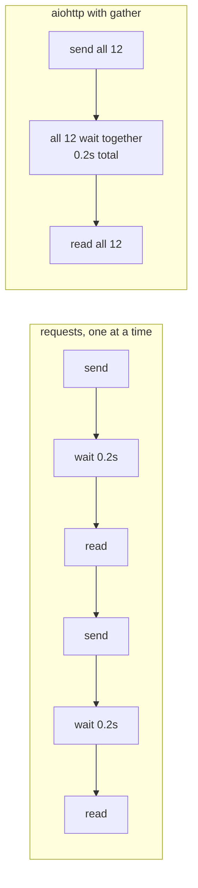

## Why aiohttp

The `requests` library is blocking.

For asyncio, you typically use:

- `aiohttp`

It supports non-blocking HTTP requests.

## Basic GET

```python title="aiohttp_get.py" showLineNumbers{1}
import asyncio
import aiohttp


async def main():
    timeout = aiohttp.ClientTimeout(total=10)

    async with aiohttp.ClientSession(timeout=timeout) as session:
        async with session.get("https://api.github.com") as resp:
            data = await resp.json()
            print(resp.status)
            print(list(data.keys())[:5])


asyncio.run(main())
```

## Fetch many URLs concurrently

```python title="aiohttp_many.py" showLineNumbers{1}
import asyncio
import aiohttp


async def fetch(session: aiohttp.ClientSession, url: str) -> int:
    async with session.get(url) as resp:
        await resp.read()
        return resp.status


async def main():
    urls = [
        "https://httpbin.org/delay/1",
        "https://httpbin.org/delay/1",
        "https://httpbin.org/delay/1",
    ]

    timeout = aiohttp.ClientTimeout(total=5)

    async with aiohttp.ClientSession(timeout=timeout) as session:
        statuses = await asyncio.gather(*(fetch(session, u) for u in urls), return_exceptions=True)
        print(statuses)


asyncio.run(main())
```

## Notes

- Use timeouts.
- Handle non-200 responses.
- Avoid hitting API rate limits (use semaphores).

import DataCampExercise from "../../../../components/DataCampExercise.astro";
import Quiz from "../../../../components/Quiz.astro";

## Why HTTP is the ideal asyncio workload

A request spends nearly all its life doing nothing — the bytes are in flight, and the
CPU is idle. That waiting is exactly what an event loop can overlap:



Measured against a local server whose endpoint sleeps 0.20 s, 12 requests:

| approach | time | speedup |
|:--|--:|--:|
| `requests.get` in a loop | 2.53 s | 1.00× |
| `requests.Session` in a loop | 2.47 s | 1.03× |
| **`aiohttp` + `gather`** | **0.22 s** | **11.6×** |

A local server was used deliberately: the delay is known and fixed, so the figures say
something about the *client* rather than about someone else's network.

Note the middle row. Reusing a `Session` saves the TCP and TLS handshake, which is real
on a remote host but nearly free on localhost — **1.03×** here. Connection reuse is not
what buys the 11.6×; overlapping the waiting is.

## The shape of the code

```python title="fetch_all.py" showLineNumbers{1}
import asyncio, aiohttp

async def fetch(session, url):
    async with session.get(url) as resp:      # releases the loop while waiting
        return resp.status, await resp.json()

async def main(urls):
    async with aiohttp.ClientSession() as session:   # ONE session for all requests
        return await asyncio.gather(*[fetch(session, u) for u in urls])

if __name__ == "__main__":
    results = asyncio.run(main([f"http://localhost:8000/slow/{i}" for i in range(12)]))
```

Two details carry most of the benefit:

- **One `ClientSession` for the whole batch.** It owns the connection pool. Creating one
  per request throws that away and is the most common aiohttp mistake.
- **`async with` on the response.** It releases the connection back to the pool. Without
  it the pool drains and later requests queue behind nothing.

:::caution[`await resp.json()` is a separate wait]
`session.get` returns once the *headers* arrive. The body may still be in flight, which
is why reading it is itself awaitable. Returning `resp` from inside the `async with`
and reading it later gives you a closed response.
:::

## See it move

Twelve requests, a server that takes 0.20 s each. Drag the concurrency limit and watch
the batches form — the total is simply how many rounds you need.

```p5 title="Concurrency limit sets the number of rounds" desc="With 12 requests at 0.2s each, a limit of 3 needs 4 rounds and a limit of 6 needs 2. Measured times match that arithmetic almost exactly." height="330"
let limit = 3;
const N = 12;
const DELAY = 0.2;

function setup() {
  createCanvas(600, 330);
  textFont("monospace");
}

function draw() {
  background(13, 17, 23);
  const rounds = ceil(N / limit);
  const predicted = rounds * DELAY;

  noStroke();
  fill(230);
  textSize(13);
  textAlign(LEFT, TOP);
  text("12 requests, server takes " + DELAY + "s each", 24, 18);
  fill(120);
  textSize(11);
  text("asyncio.Semaphore(" + limit + ")", 24, 38);

  // grid of requests coloured by which round they land in
  const cols = 6;
  for (let i = 0; i < N; i++) {
    const round = floor(i / limit);
    const cx = 28 + (i % cols) * 62;
    const cy = 70 + floor(i / cols) * 46;
    const hue = [color(75, 139, 190), color(255, 211, 67), color(120, 190, 130), color(200, 120, 200)][round % 4];
    stroke(hue);
    strokeWeight(1);
    fill(red(hue) * 0.22, green(hue) * 0.22, blue(hue) * 0.22);
    rect(cx, cy, 54, 36, 4);
    noStroke();
    fill(hue);
    textSize(11);
    textAlign(CENTER, CENTER);
    text("req " + i, cx + 27, cy - 1 + 18);
    fill(150);
    textSize(9);
    text("round " + (round + 1), cx + 27, cy + 29);
  }

  const barY = 178;
  fill(120);
  textSize(11);
  textAlign(LEFT, TOP);
  text("rounds run one after another:", 24, barY);
  for (let r = 0; r < rounds; r++) {
    const hue = [color(75, 139, 190), color(255, 211, 67), color(120, 190, 130), color(200, 120, 200)][r % 4];
    const w = 460 / rounds;
    noStroke();
    fill(hue);
    rect(24 + r * w, barY + 20, w - 3, 20, 3);
    fill(20);
    textSize(10);
    textAlign(CENTER, CENTER);
    if (w > 40) text(DELAY + "s", 24 + r * w + w / 2 - 1, barY + 30);
  }

  noStroke();
  fill(210);
  textSize(12);
  textAlign(LEFT, TOP);
  text(rounds + " rounds x " + DELAY + "s = " + nf(predicted, 0, 2) + "s predicted", 24, barY + 52);

  let measured = "";
  if (limit === 3) measured = "measured 0.83s";
  else if (limit === 6) measured = "measured 0.42s";
  else if (limit >= N) measured = "measured 0.22s  (all at once)";
  if (measured !== "") {
    fill(120, 190, 130);
    text(measured, 24, barY + 72);
  }

  fill(120);
  textSize(11);
  text("drag to change the limit", 24, 296);
  const sx = 200, sw = 300;
  stroke(60, 70, 84);
  strokeWeight(2);
  line(sx, 302, sx + sw, 302);
  const px = sx + ((limit - 1) / (N - 1)) * sw;
  noStroke();
  fill(255, 211, 67);
  circle(px, 302, 13);
  fill(200);
  textAlign(LEFT, CENTER);
  textSize(11);
  text(limit, sx + sw + 14, 302);
}

function mouseDragged() { setLimit(); }
function mousePressed() { setLimit(); }

function setLimit() {
  const sx = 200, sw = 300;
  if (mouseY < 288 || mouseY > 318) return;
  const f = constrain((mouseX - sx) / sw, 0, 1);
  limit = round(1 + f * (N - 1));
}
```

Measured against the local server:

| limit | rounds needed | predicted | measured |
|:--|--:|--:|--:|
| `Semaphore(3)` | 4 | 0.80 s | **0.83 s** |
| `Semaphore(6)` | 2 | 0.40 s | **0.42 s** |
| no limit (12) | 1 | 0.20 s | **0.22 s** |

The arithmetic is the whole model: **time ≈ ceil(N / limit) × latency**. Overhead is
roughly 20–30 ms on top.

```python title="limited.py" showLineNumbers{1}
async def fetch_all(urls, limit=6):
    sem = asyncio.Semaphore(limit)
    async with aiohttp.ClientSession() as session:
        async def one(url):
            async with sem:                       # at most `limit` inside at a time
                async with session.get(url) as r:
                    return r.status, await r.json()
        return await asyncio.gather(*[one(u) for u in urls])
```

:::caution[Unlimited concurrency is a way to get blocked]
`gather` over 10,000 URLs really does try to open 10,000 connections. You will exhaust
file descriptors, trip the server's rate limit, or both. A `Semaphore` is not a
performance tuning knob so much as basic courtesy — and the difference between a
scraper that finishes and one that gets banned.
:::

## Check yourself

<Quiz
  questions={[
    {
      q: "12 requests to an endpoint that takes 0.2 s: a requests loop took 2.53 s and aiohttp with gather took 0.22 s. Where does the gain come from?",
      options: [
        "aiohttp parses JSON faster",
        "the waiting overlaps, since each request releases the loop while its bytes are in flight",
        "aiohttp uses one thread per request",
        "aiohttp compresses the requests",
      ],
      answer: 1,
      explain:
        "Almost all of a request is waiting. One thread can hold twelve waits at once, so the total approaches a single round trip rather than twelve.",
    },
    {
      q: "Reusing requests.Session for the same 12 local requests gave only 1.03x. Why so little?",
      options: [
        "Session does not actually reuse connections",
        "a Session helps by skipping TCP and TLS setup, which is nearly free over localhost",
        "the server refused keep-alive",
        "Session adds locking overhead that cancels the gain",
      ],
      answer: 1,
      explain:
        "Connection reuse removes handshake cost, which matters over a real network and barely registers locally. It is not what produces the 11.6x — overlapping the waiting is.",
    },
    {
      q: "With 12 URLs at 0.2 s each and asyncio.Semaphore(3), roughly how long should the batch take?",
      options: [
        "0.2 s, since everything is concurrent",
        "about 0.8 s, because 12 / 3 gives 4 sequential rounds",
        "2.4 s, the same as sequential",
        "it cannot be predicted",
      ],
      answer: 1,
      explain:
        "A semaphore of 3 permits three in flight at a time, so the work forms 4 rounds of 0.2 s. Predicted 0.80 s, measured 0.83 s.",
    },
    {
      q: "Why create one aiohttp.ClientSession for a whole batch rather than one per request?",
      options: [
        "sessions are required to be global",
        "the session owns the connection pool, so a session per request discards connection reuse and setup cost",
        "creating several sessions raises RuntimeError",
        "only one session may exist per event loop",
      ],
      answer: 1,
      explain:
        "A ClientSession holds the connector and its pool. Building one per request recreates that machinery every time and is the most common aiohttp mistake.",
    },
  ]}
/>

## 🧪 Try It Yourself

### Exercise 1 – Your First Coroutine

<DataCampExercise
  lang="python"
  hint={`Define an \`async def\` function and run it with \`asyncio.run()\`.`}
  code={`# Task: Exercise 1 – Your First Coroutine
import asyncio

# Hint: use async def to define a coroutine
___ def hello():              # replace ___ with async
    print("Hello, asyncio!")

# Hint: run the coroutine with asyncio.run()
asyncio.___(hello())          # replace ___ with run

# ── Expected Output ───────────────────────────────────────────
# Hello, asyncio!
# ──────────────────────────────────────────────────────────────`}
  solution={`import asyncio

async def hello():
    print("Hello, asyncio!")

asyncio.run(hello())`}
  sct={`test_output_contains("Hello, asyncio!")
success_msg("First coroutine running!")`}
  height={130}
/>

### Exercise 2 – await asyncio.sleep

<DataCampExercise
  lang="python"
  hint={`Use \`await asyncio.sleep(seconds)\` to pause without blocking.`}
  code={`# Task: Exercise 2 – await asyncio.sleep
import asyncio

async def delayed():
    print("Before sleep")
    ___ asyncio.sleep(0)   # replace ___ with await
    print("After sleep")

asyncio.run(delayed())

# ── Expected Output ───────────────────────────────────────────
# Before sleep
# After sleep
# ──────────────────────────────────────────────────────────────`}
  solution={`import asyncio

async def delayed():
    print("Before sleep")
    await asyncio.sleep(0)
    print("After sleep")

asyncio.run(delayed())`}
  sct={`test_output_contains("Before sleep")
test_output_contains("After sleep")
success_msg("await pauses the coroutine!")`}
  height={135}
/>

### Exercise 3 – Gather Two Coroutines

<DataCampExercise
  lang="python"
  hint={`Use \`asyncio.gather(coro1(), coro2())\` to run two coroutines concurrently.`}
  code={`# Task: Exercise 3 – Gather Two Coroutines
import asyncio

async def task(name):
    await asyncio.sleep(0)
    print(f"Done: {name}")

async def main():
    # Hint: use asyncio.gather to run both tasks concurrently
    await asyncio.___(task("A"), task("B"))   # replace ___ with gather

asyncio.run(main())

# ── Expected Output ───────────────────────────────────────────
# Done: A
# Done: B
# ──────────────────────────────────────────────────────────────`}
  solution={`import asyncio

async def task(name):
    await asyncio.sleep(0)
    print(f"Done: {name}")

async def main():
    await asyncio.gather(task("A"), task("B"))

asyncio.run(main())`}
  sct={`test_output_contains("Done: A")
test_output_contains("Done: B")
success_msg("gather() runs coroutines concurrently!")`}
  height={150}
/>

