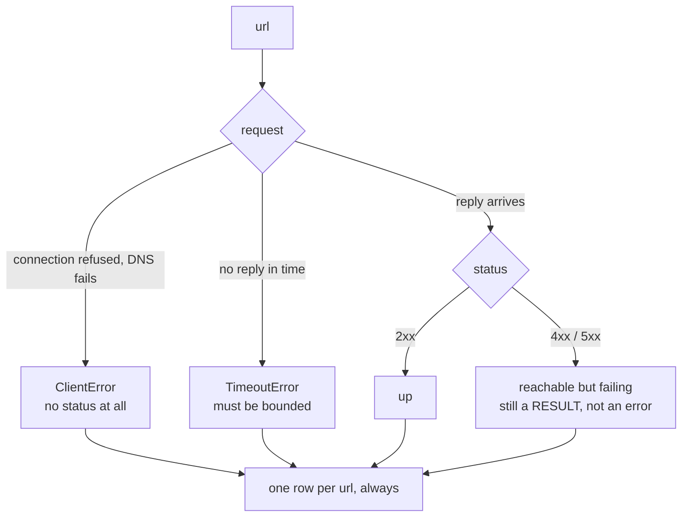

## Goal

Build a script that:

- checks many URLs
- runs requests concurrently
- returns status codes
- uses timeouts and a concurrency limit

## Implementation

```python title="url_checker.py" showLineNumbers{1}
import asyncio
import aiohttp


async def fetch(session: aiohttp.ClientSession, sem: asyncio.Semaphore, url: str):
    async with sem:
        try:
            async with session.get(url) as resp:
                await resp.read()
                return url, resp.status
        except Exception as e:
            return url, str(e)


async def main():
    urls = [
        "https://api.github.com",
        "https://httpbin.org/status/404",
        "https://httpbin.org/delay/2",
        "https://example.com",
    ]

    sem = asyncio.Semaphore(5)
    timeout = aiohttp.ClientTimeout(total=5)

    async with aiohttp.ClientSession(timeout=timeout) as session:
        results = await asyncio.gather(*(fetch(session, sem, u) for u in urls))

    for url, status in results:
        print(url, "->", status)


if __name__ == "__main__":
    asyncio.run(main())
```

## Improvements

- read URLs from a file
- write results to CSV
- add retries with exponential backoff


## What a URL checker must get right

The happy path is four lines. Everything that makes it a *tool* is the handling of
things that go wrong, and each failure has a different shape:



The design rule that falls out: **every URL produces exactly one row**. A checker that
crashes on the first bad host is useless, and one that silently drops failures is worse
than useless.

```python title="checker.py" showLineNumbers{1}
import asyncio, aiohttp, time

async def check(session, url, sem):
    async with sem:
        started = time.perf_counter()
        try:
            async with session.get(url) as r:
                await r.read()                       # finish the body before timing
                return {"url": url, "status": r.status,
                        "ok": r.status < 400,
                        "ms": round((time.perf_counter() - started) * 1000)}
        except asyncio.TimeoutError:
            return {"url": url, "status": None, "ok": False, "error": "timeout"}
        except aiohttp.ClientError as e:
            return {"url": url, "status": None, "ok": False,
                    "error": type(e).__name__}

async def check_all(urls, limit=10, timeout=5):
    sem = asyncio.Semaphore(limit)
    conf = aiohttp.ClientTimeout(total=timeout)
    async with aiohttp.ClientSession(timeout=conf) as session:
        return await asyncio.gather(*[check(session, u, sem) for u in urls])
```

Three decisions worth naming:

- **`return_exceptions` is not needed** because nothing is allowed to escape `check`.
  Each call returns a row describing success *or* failure.
- **A 404 is a result, not an error.** The site answered. Conflating "unreachable" with
  "returned 404" hides the difference that matters when you are debugging.
- **The timeout is on the session**, so it covers connection, headers and body together
  rather than only one phase.

## See it move

Each row is a URL. Watch how the concurrency limit turns a long queue into a few short
rounds — and how failures take their place in the results without stopping anything.

```p5 title="Checking many URLs with a bounded pool" desc="Requests enter as slots free up. Failures and slow hosts produce rows like any other result, so one bad URL never stops the run." height="340"
let limit = 4;
let t = 0;
let playing = true;
const URLS = [
  { n: "example.com/a",  dur: 40, out: "200" },
  { n: "example.com/b",  dur: 70, out: "200" },
  { n: "example.com/404", dur: 35, out: "404" },
  { n: "down.invalid",   dur: 55, out: "ERR" },
  { n: "example.com/c",  dur: 45, out: "200" },
  { n: "slow.example",   dur: 110, out: "TIMEOUT" },
  { n: "example.com/d",  dur: 30, out: "200" },
  { n: "example.com/500", dur: 50, out: "500" },
];

function setup() {
  createCanvas(600, 340);
  textFont("monospace");
}

// simple slot scheduler: assign each url the earliest free slot
function schedule() {
  const slotFree = new Array(limit).fill(0);
  const plan = [];
  for (let i = 0; i < URLS.length; i++) {
    let best = 0;
    for (let s = 1; s < limit; s++) if (slotFree[s] < slotFree[best]) best = s;
    const start = slotFree[best];
    const end = start + URLS[i].dur;
    slotFree[best] = end;
    plan.push({ start: start, end: end, slot: best });
  }
  return plan;
}

function colFor(out) {
  if (out === "200") return color(120, 190, 130);
  if (out === "404" || out === "500") return color(255, 211, 67);
  return color(232, 110, 110);
}

function draw() {
  background(13, 17, 23);
  const plan = schedule();
  const total = max(plan.map(function (p) { return p.end; })) + 20;
  if (playing) { t += 1.2; if (t > total) t = 0; }

  noStroke();
  fill(230);
  textSize(13);
  textAlign(LEFT, TOP);
  text("8 urls, Semaphore(" + limit + ")", 24, 16);
  fill(120);
  textSize(11);
  text("green 2xx    amber reachable but 4xx/5xx    red never answered", 24, 36);

  const x0 = 150, wpx = 330;
  for (let i = 0; i < URLS.length; i++) {
    const y = 62 + i * 26;
    const p = plan[i];
    const started = t >= p.start;
    const done = t >= p.end;
    const frac = constrain((t - p.start) / (p.end - p.start), 0, 1);

    noStroke();
    fill(done ? 190 : (started ? 150 : 80));
    textSize(10);
    textAlign(LEFT, CENTER);
    text(URLS[i].n, 24, y + 9);

    stroke(48, 56, 68);
    strokeWeight(1);
    fill(18, 23, 30);
    rect(x0, y, wpx, 18, 3);

    if (started) {
      noStroke();
      const c = colFor(URLS[i].out);
      fill(done ? c : color(75, 139, 190));
      const bx = x0 + (p.start / total) * wpx;
      const bw = ((p.end - p.start) / total) * wpx * frac;
      rect(bx + 1, y + 1, max(1, bw - 2), 16, 2);
    }

    if (done) {
      noStroke();
      fill(colFor(URLS[i].out));
      textSize(10);
      textAlign(LEFT, CENTER);
      text(URLS[i].out, x0 + wpx + 8, y + 9);
    }
  }

  const finished = plan.filter(function (p) { return t >= p.end; }).length;
  noStroke();
  fill(210);
  textSize(12);
  textAlign(LEFT, TOP);
  text("rows collected: " + finished + " / " + URLS.length, 24, 278);
  fill(120);
  textSize(11);
  text("every url yields a row - failures included", 24, 296);

  drawBtn(330, 274, 110, "limit: " + limit);
  drawBtn(450, 274, 90, playing ? "pause" : "play");
  fill(90);
  textSize(10);
  textAlign(LEFT, TOP);
  text("click the limit button to cycle 2 / 4 / 8", 330, 302);
}

function drawBtn(x, y, w, label) {
  const hot = mouseX > x && mouseX < x + w && mouseY > y && mouseY < y + 22;
  stroke(hot ? color(255, 211, 67) : color(60, 70, 84));
  strokeWeight(1);
  fill(hot ? color(34, 40, 50) : color(22, 28, 36));
  rect(x, y, w, 22, 4);
  noStroke();
  fill(hot ? color(255, 211, 67) : 200);
  textSize(11);
  textAlign(CENTER, CENTER);
  text(label, x + w / 2, y + 11);
}

function mousePressed() {
  if (mouseY < 274 || mouseY > 296) return;
  if (mouseX > 330 && mouseX < 440) { limit = limit === 2 ? 4 : (limit === 4 ? 8 : 2); t = 0; }
  if (mouseX > 450 && mouseX < 540) { playing = !playing; }
}
```

## Reporting the result

Sorting by status makes the output usable — the failures are what you opened the report
to read:

```python title="report.py" showLineNumbers{1}
rows = asyncio.run(check_all(urls, limit=10))

rows.sort(key=lambda r: (r["ok"], r.get("status") or 0))
for r in rows:
    status = r.get("status") or r.get("error")
    print(f"{str(status):>8}  {r['url']}")

up = sum(1 for r in rows if r["ok"])
print(f"\n{up}/{len(rows)} up")
```

Because `check` never raises, `len(rows) == len(urls)` always holds — a property worth
asserting in a test.

:::note[Measured behaviour of the pool]
Against a local server at 0.20 s per request, 12 URLs took **0.83 s** at
`Semaphore(3)`, **0.42 s** at `Semaphore(6)`, and **0.22 s** unbounded — matching
`ceil(N / limit) × 0.2 s` each time. Pick the limit from what the target host tolerates,
then predict the runtime with that formula.
:::

### Extensions worth doing

- **Retry only what is worth retrying.** A timeout or a 503 may succeed on a second
  attempt; a 404 never will. Retry with a growing delay, and cap the attempts.
- **Follow redirects deliberately.** aiohttp follows them by default; pass
  `allow_redirects=False` when you are auditing *what a URL says*, not where it ends up.
- **Record the elapsed time per URL.** A site that answers in 4 s is a problem your
  checker should surface even though its status is 200.

## Check yourself

<Quiz
  questions={[
    {
      q: "Why should check() catch its own exceptions and return a row rather than letting them propagate to gather?",
      options: [
        "gather cannot handle exceptions at all",
        "so every URL yields exactly one result row, and one unreachable host cannot end the run",
        "because exceptions are slower than return values",
        "to avoid needing a Semaphore",
      ],
      answer: 1,
      explain:
        "By default the first exception in gather propagates and the batch is lost. Returning a row per URL keeps len(rows) == len(urls), which is a property a test can assert.",
    },
    {
      q: "In a URL checker, how should a 404 be treated?",
      options: [
        "as an error, identical to a connection failure",
        "as a result: the host answered, so record the status and mark it not ok",
        "silently skipped, since the page does not exist",
        "as a reason to retry until it succeeds",
      ],
      answer: 1,
      explain:
        "A 404 means the server was reached and replied. Merging it with 'unreachable' destroys the distinction you most need when diagnosing, and retrying it is pointless.",
    },
    {
      q: "Checking 12 URLs at 0.2 s each with Semaphore(6) took 0.42 s. What predicts that?",
      options: [
        "12 x 0.2 divided by 6 workers plus overhead, i.e. ceil(12/6) rounds of 0.2 s",
        "the slowest single request",
        "6 x 0.2 s, one round per permit",
        "it is unpredictable and must be measured every time",
      ],
      answer: 0,
      explain:
        "A semaphore of 6 gives ceil(12/6) = 2 rounds, so 0.40 s predicted against 0.42 s measured. The same formula gave 0.80 s against 0.83 s at Semaphore(3).",
    },
    {
      q: "Which failure is worth retrying with a backoff?",
      options: [
        "a 404 Not Found",
        "a 401 Unauthorized",
        "a timeout or a 503 Service Unavailable",
        "a ClientError from a domain that does not resolve",
      ],
      answer: 2,
      explain:
        "Timeouts and 503s are transient and often succeed on a later attempt. A 404, a 401 and a DNS failure will return the same answer however many times you ask.",
    },
  ]}
/>

## 🧪 Try It Yourself

### Exercise 1 – Your First Coroutine

<DataCampExercise
  lang="python"
  hint={`Define an \`async def\` function and run it with \`asyncio.run()\`.`}
  code={`# Task: Exercise 1 – Your First Coroutine
import asyncio

# Hint: use async def to define a coroutine
___ def hello():              # replace ___ with async
    print("Hello, asyncio!")

# Hint: run the coroutine with asyncio.run()
asyncio.___(hello())          # replace ___ with run

# ── Expected Output ───────────────────────────────────────────
# Hello, asyncio!
# ──────────────────────────────────────────────────────────────`}
  solution={`import asyncio

async def hello():
    print("Hello, asyncio!")

asyncio.run(hello())`}
  sct={`test_output_contains("Hello, asyncio!")
success_msg("First coroutine running!")`}
  height={130}
/>

### Exercise 2 – await asyncio.sleep

<DataCampExercise
  lang="python"
  hint={`Use \`await asyncio.sleep(seconds)\` to pause without blocking.`}
  code={`# Task: Exercise 2 – await asyncio.sleep
import asyncio

async def delayed():
    print("Before sleep")
    ___ asyncio.sleep(0)   # replace ___ with await
    print("After sleep")

asyncio.run(delayed())

# ── Expected Output ───────────────────────────────────────────
# Before sleep
# After sleep
# ──────────────────────────────────────────────────────────────`}
  solution={`import asyncio

async def delayed():
    print("Before sleep")
    await asyncio.sleep(0)
    print("After sleep")

asyncio.run(delayed())`}
  sct={`test_output_contains("Before sleep")
test_output_contains("After sleep")
success_msg("await pauses the coroutine!")`}
  height={135}
/>

### Exercise 3 – Gather Two Coroutines

<DataCampExercise
  lang="python"
  hint={`Use \`asyncio.gather(coro1(), coro2())\` to run two coroutines concurrently.`}
  code={`# Task: Exercise 3 – Gather Two Coroutines
import asyncio

async def task(name):
    await asyncio.sleep(0)
    print(f"Done: {name}")

async def main():
    # Hint: use asyncio.gather to run both tasks concurrently
    await asyncio.___(task("A"), task("B"))   # replace ___ with gather

asyncio.run(main())

# ── Expected Output ───────────────────────────────────────────
# Done: A
# Done: B
# ──────────────────────────────────────────────────────────────`}
  solution={`import asyncio

async def task(name):
    await asyncio.sleep(0)
    print(f"Done: {name}")

async def main():
    await asyncio.gather(task("A"), task("B"))

asyncio.run(main())`}
  sct={`test_output_contains("Done: A")
test_output_contains("Done: B")
success_msg("gather() runs coroutines concurrently!")`}
  height={150}
/>

