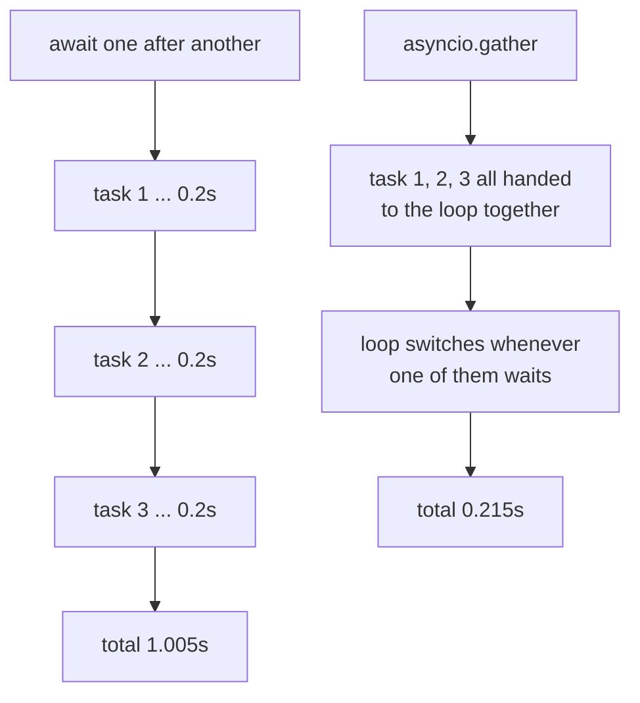

## What is asyncio?

`asyncio` is Python’s built-in library for **asynchronous I/O**.

It’s designed for workloads that spend lots of time waiting:

- network requests
- database calls
- file I/O (through async libraries)

## Async vs threading vs multiprocessing

- **asyncio**: single-threaded concurrency using an event loop (great for many I/O tasks)
- **threading**: multiple threads (good for I/O, simpler when using blocking libs)
- **multiprocessing**: multiple processes (good for CPU-bound)

## Mental model

- `async def` defines a **coroutine**.
- `await` pauses the coroutine so other tasks can run.
- The **event loop** schedules coroutines and resumes them when they’re ready.

## Your first coroutine

```python title="first_coroutine.py" showLineNumbers{1}
import asyncio


async def main():
    print("Hello")
    await asyncio.sleep(1)
    print("World")


asyncio.run(main())
```

## When asyncio helps

If you do 100 HTTP requests sequentially, you wait 100 times.

With asyncio you can:

- start many requests
- efficiently wait for them concurrently

## When asyncio won’t help

For CPU-heavy loops, asyncio won’t speed things up.

Use:

- multiprocessing
- numpy/vectorization
- compiled extensions


## `await` is not where concurrency comes from

This is the single most common misreading of asyncio. `await` means **wait here until
this finishes**. Written in a loop, it is exactly as sequential as ordinary code:



Measured, five coroutines each sleeping 0.2 s:

| | time | speedup |
|:--|--:|--:|
| `for i in range(5): await work(i)` | 1.005 s | 1.0× |
| `await asyncio.gather(*[work(i) for i in range(5)])` | **0.215 s** | **4.7×** |

Concurrency comes from handing the loop *several* things at once — `gather`,
`create_task`, or a `TaskGroup`. An `await` on its own just yields control until that
one operation is done.

### Calling a coroutine function does nothing

```python title="not_running.py" showLineNumbers{1}
import asyncio, inspect

async def work(name):
    await asyncio.sleep(0.1)
    return name

c = work("a")                     # no code has run yet
print(type(c).__name__)           # coroutine
print(inspect.iscoroutine(c))     # True
print(asyncio.run(c))             # 'a'   <- now it runs
```

A coroutine object is a *description* of work. Forgetting to await one is why
`RuntimeWarning: coroutine ... was never awaited` exists — the call looked like it did
something and did not.

### `create_task` schedules, a bare coroutine waits to be asked

```python title="task_vs_coro.py" showLineNumbers{1}
log = []

async def note(n):
    log.append(f"{n} started")
    await asyncio.sleep(0.05)

t1 = asyncio.create_task(note("task"))   # handed to the loop right away
co = note("coro")                        # just an object; nothing scheduled
await asyncio.sleep(0.01)
print(log)                               # ['task started']   <- only one of them began
```

## See it move

One thread, one loop. A coroutine runs until it hits an `await`, hands control back,
and the loop picks whoever is ready. Nothing here is parallel — it is *interleaved*,
and that is enough when the work is waiting.

```p5 title="How the event loop interleaves coroutines" desc="Each coroutine runs until it awaits, then yields to the loop. With gather, three coroutines overlap their waiting; awaited one by one they cannot." height="340"
let mode = 0;         // 0 = gather, 1 = sequential awaits
let t = 0;
let playing = true;
const N = 3;
const WAIT = 60;      // frames spent awaiting
const CPU = 8;        // frames of actual running

function setup() {
  createCanvas(600, 340);
  textFont("monospace");
}

// returns {state, frac} for coroutine i at time t
function stateOf(i, tt) {
  if (mode === 0) {
    const startRun = i * CPU;
    if (tt < startRun) return { s: "queued", f: 0 };
    if (tt < startRun + CPU) return { s: "running", f: 0 };
    const awaitEnd = startRun + CPU + WAIT;
    if (tt < awaitEnd) return { s: "awaiting", f: (tt - startRun - CPU) / WAIT };
    if (tt < awaitEnd + CPU) return { s: "running", f: 1 };
    return { s: "done", f: 1 };
  }
  const span = CPU + WAIT + CPU;
  const begin = i * span;
  if (tt < begin) return { s: "queued", f: 0 };
  if (tt < begin + CPU) return { s: "running", f: 0 };
  if (tt < begin + CPU + WAIT) return { s: "awaiting", f: (tt - begin - CPU) / WAIT };
  if (tt < begin + span) return { s: "running", f: 1 };
  return { s: "done", f: 1 };
}

function totalFrames() {
  return mode === 0 ? N * CPU + WAIT + CPU + 10 : N * (CPU + WAIT + CPU) + 10;
}

function draw() {
  background(13, 17, 23);
  if (playing) { t++; if (t > totalFrames()) t = 0; }

  noStroke();
  fill(230);
  textSize(13);
  textAlign(LEFT, TOP);
  text(mode === 0 ? "await asyncio.gather(a(), b(), c())" : "await a();  await b();  await c()", 24, 18);
  fill(mode === 0 ? color(120, 190, 130) : color(232, 110, 110));
  textSize(11);
  text(mode === 0 ? "all three handed to the loop, so their waits overlap"
                  : "each await blocks the next line, so the waits are consecutive", 24, 38);

  let anyRunning = -1;
  for (let i = 0; i < N; i++) {
    const st = stateOf(i, t);
    if (st.s === "running") anyRunning = i;
    const y = 72 + i * 52;

    fill(150);
    textSize(11);
    textAlign(LEFT, CENTER);
    noStroke();
    text("coro " + i, 24, y + 15);

    stroke(48, 56, 68);
    strokeWeight(1);
    fill(18, 23, 30);
    rect(96, y, 380, 30, 4);

    noStroke();
    if (st.s === "awaiting") {
      fill(75, 139, 190);
      rect(97, y + 1, st.f * 378, 28, 3);
    } else if (st.s === "done") {
      fill(38, 62, 44);
      rect(97, y + 1, 378, 28, 3);
    } else if (st.s === "running") {
      fill(255, 211, 67);
      rect(97, y + 1, 378, 28, 3);
    }

    textAlign(LEFT, CENTER);
    textSize(11);
    if (st.s === "running") { fill(20); text("running on the loop", 108, y + 15); }
    else if (st.s === "awaiting") { fill(200); text("awaiting  (loop is free)", 108, y + 15); }
    else if (st.s === "done") { fill(120, 190, 130); text("done", 108, y + 15); }
    else { fill(80); text("not started", 108, y + 15); }
  }

  stroke(60, 70, 84);
  strokeWeight(1);
  fill(20, 26, 34);
  rect(24, 240, 452, 34, 4);
  noStroke();
  textAlign(LEFT, CENTER);
  textSize(12);
  if (anyRunning >= 0) { fill(255, 211, 67); text("event loop: executing coro " + anyRunning, 38, 257); }
  else { fill(120); text("event loop: idle, every coroutine is awaiting", 38, 257); }

  fill(120);
  textSize(11);
  textAlign(LEFT, TOP);
  text("only ONE coroutine ever runs at a time - this is a single thread", 24, 282);

  drawBtn(24, 304, 220, mode === 0 ? "mode: gather" : "mode: sequential awaits");
  drawBtn(256, 304, 90, playing ? "pause" : "play");
}

function drawBtn(x, y, w, label) {
  const hot = mouseX > x && mouseX < x + w && mouseY > y && mouseY < y + 24;
  stroke(hot ? color(255, 211, 67) : color(60, 70, 84));
  strokeWeight(1);
  fill(hot ? color(34, 40, 50) : color(22, 28, 36));
  rect(x, y, w, 24, 4);
  noStroke();
  fill(hot ? color(255, 211, 67) : 200);
  textSize(11);
  textAlign(CENTER, CENTER);
  text(label, x + w / 2, y + 12);
}

function mousePressed() {
  if (mouseY < 304 || mouseY > 328) return;
  if (mouseX > 24 && mouseX < 244) { mode = 1 - mode; t = 0; }
  if (mouseX > 256 && mouseX < 346) { playing = !playing; }
}
```

## One blocking call freezes everything

Because there is only one thread, any function that blocks without awaiting stops the
whole loop — every other coroutine included:

```python title="blocking.py" showLineNumbers{1}
async def good():
    await asyncio.sleep(0.3)      # yields to the loop

async def blocker():
    time.sleep(0.3)               # WRONG inside async: nothing yields
```

| two coroutines running together | measured |
|:--|--:|
| both `await asyncio.sleep(0.3)` | **0.310 s** — overlapped |
| both `time.sleep(0.3)` | **0.602 s** — serialized |

:::danger[The rule that follows]
Inside `async def`, every slow call must be awaitable. A plain `requests.get`,
`time.sleep`, `open().read()` on a big file, or a heavy CPU loop will stall every other
task on the loop. Push unavoidable blocking work to
`await asyncio.to_thread(fn, ...)`.
:::

## `gather` returns in argument order

```python title="order.py" showLineNumbers{1}
res = await asyncio.gather(timed("slow", 0.3), timed("fast", 0.05), timed("mid", 0.15))
print(res)              # ['slow', 'fast', 'mid']   <- the order you passed them
# actual completion order was ['fast', 'mid', 'slow']
```

Results line up with your arguments, which makes `zip(urls, results)` safe. If you want
results as they arrive, use `asyncio.as_completed`.

### When one of them fails

```python title="errors.py" showLineNumbers{1}
await asyncio.gather(work("ok"), bad())
# ValueError: boom      <- the first exception propagates immediately

await asyncio.gather(work("ok"), bad(), return_exceptions=True)
# ['ok', ValueError('boom')]    <- collected instead of raised
```

With `return_exceptions=True` you always get one entry per input, and it is your job to
check which entries are exceptions.

## Check yourself

<Quiz
  questions={[
    {
      q: "Five coroutines each sleep 0.2 s. Awaiting them one per loop iteration took 1.005 s; gather took 0.215 s. What does that show?",
      options: [
        "gather runs the coroutines on separate threads",
        "await means 'wait here', so concurrency comes from handing several coroutines to the loop at once",
        "asyncio.sleep is faster inside gather",
        "the loop caches repeated coroutine calls",
      ],
      answer: 1,
      explain:
        "A loop of awaits is sequential by definition. gather submits all five, so their waiting overlaps. Everything still runs on one thread.",
    },
    {
      q: "You write c = work('a') where work is an async def, and never await c. What has happened?",
      options: [
        "work ran and its result was discarded",
        "work started in the background",
        "nothing ran; c is a coroutine object and Python warns it was never awaited",
        "a TypeError, since async functions cannot be called directly",
      ],
      answer: 2,
      explain:
        "Calling an async function builds a coroutine object describing the work. inspect.iscoroutine(c) is True and no body has executed until it is awaited or scheduled.",
    },
    {
      q: "Two coroutines that both call time.sleep(0.3) took 0.602 s, while two that await asyncio.sleep(0.3) took 0.310 s. Why?",
      options: [
        "time.sleep is less precise",
        "time.sleep blocks the single thread the loop runs on, so nothing else can proceed",
        "asyncio.sleep uses multiple cores",
        "the loop retries blocking calls",
      ],
      answer: 1,
      explain:
        "asyncio is single-threaded. A blocking call never yields control, so the loop cannot switch to the other coroutine. Use asyncio.to_thread for work you cannot make awaitable.",
    },
    {
      q: "gather is given slow (0.3 s), fast (0.05 s) and mid (0.15 s), in that order. What does it return?",
      options: [
        "results in completion order: fast, mid, slow",
        "results in argument order: slow, fast, mid",
        "an unordered set of results",
        "only the first result to arrive",
      ],
      answer: 1,
      explain:
        "gather preserves argument order regardless of when each finished, which is what makes zip(inputs, results) correct. Use asyncio.as_completed if you want them as they arrive.",
    },
  ]}
/>

## 🧪 Try It Yourself

### Exercise 1 – Your First Coroutine

<DataCampExercise
  lang="python"
  hint={`Define an \`async def\` function and run it with \`asyncio.run()\`.`}
  code={`# Task: Exercise 1 – Your First Coroutine
import asyncio

# Hint: use async def to define a coroutine
___ def hello():              # replace ___ with async
    print("Hello, asyncio!")

# Hint: run the coroutine with asyncio.run()
asyncio.___(hello())          # replace ___ with run

# ── Expected Output ───────────────────────────────────────────
# Hello, asyncio!
# ──────────────────────────────────────────────────────────────`}
  solution={`import asyncio

async def hello():
    print("Hello, asyncio!")

asyncio.run(hello())`}
  sct={`test_output_contains("Hello, asyncio!")
success_msg("First coroutine running!")`}
  height={130}
/>

### Exercise 2 – await asyncio.sleep

<DataCampExercise
  lang="python"
  hint={`Use \`await asyncio.sleep(seconds)\` to pause without blocking.`}
  code={`# Task: Exercise 2 – await asyncio.sleep
import asyncio

async def delayed():
    print("Before sleep")
    ___ asyncio.sleep(0)   # replace ___ with await
    print("After sleep")

asyncio.run(delayed())

# ── Expected Output ───────────────────────────────────────────
# Before sleep
# After sleep
# ──────────────────────────────────────────────────────────────`}
  solution={`import asyncio

async def delayed():
    print("Before sleep")
    await asyncio.sleep(0)
    print("After sleep")

asyncio.run(delayed())`}
  sct={`test_output_contains("Before sleep")
test_output_contains("After sleep")
success_msg("await pauses the coroutine!")`}
  height={135}
/>

### Exercise 3 – Gather Two Coroutines

<DataCampExercise
  lang="python"
  hint={`Use \`asyncio.gather(coro1(), coro2())\` to run two coroutines concurrently.`}
  code={`# Task: Exercise 3 – Gather Two Coroutines
import asyncio

async def task(name):
    await asyncio.sleep(0)
    print(f"Done: {name}")

async def main():
    # Hint: use asyncio.gather to run both tasks concurrently
    await asyncio.___(task("A"), task("B"))   # replace ___ with gather

asyncio.run(main())

# ── Expected Output ───────────────────────────────────────────
# Done: A
# Done: B
# ──────────────────────────────────────────────────────────────`}
  solution={`import asyncio

async def task(name):
    await asyncio.sleep(0)
    print(f"Done: {name}")

async def main():
    await asyncio.gather(task("A"), task("B"))

asyncio.run(main())`}
  sct={`test_output_contains("Done: A")
test_output_contains("Done: B")
success_msg("gather() runs coroutines concurrently!")`}
  height={150}
/>

