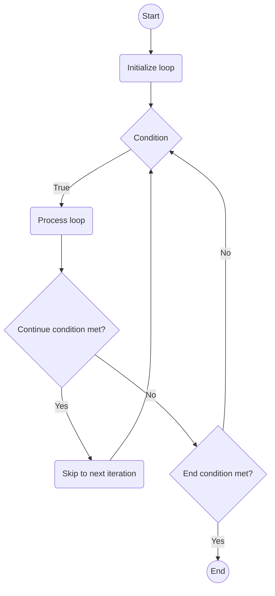

## Seamless Iteration: Demystifying the continue Statement in Python Loops
In the realm of Python loops, the continue statement stands as a powerful tool, allowing developers to gracefully skip the rest of the code within a loop for the current iteration and move on to the next iteration. Unlike the break statement, which exits the loop entirely, continue provides a means to bypass specific actions within the loop while allowing it to continue with subsequent iterations. In this comprehensive guide, we'll explore the syntax, functionality, and best practices associated with the continue statement in Python loops.

### What Is the continue Statement?
The continue statement is a control flow statement that allows you to skip the rest of the code inside a loop for the current iteration only. When a continue statement is encountered inside a loop, the program execution skips the statements inside the loop for the current iteration and returns to the top of the loop for the next iteration.

:::note
The continue statement can be used in both while and for loops.
:::

## Syntax of continue
The syntax of a continue statement in Python:

### continue Statement in while Loop
```python title="continue_while_loop.py" showLineNumbers{1} {1-5}
while test_expression:
    Body of while
    if test_expression:
        continue
```

### continue Statement in for Loop
```python title="continue_for_loop.py" showLineNumbers{1} {1-5}
for val in sequence:
    Body of for
    if test_expression:
        continue
```

Here, `val` is the variable that takes the value of the item inside the sequence on each iteration.

We generally use continue statement inside the loop when we want to skip the rest of the code inside the loop for the current iteration only. Loop does not terminate but continues on with the next iteration.

**Diagram for continue statement in loop**:



## Example of continue Statement in Python
Here is an example of a continue statement in python:

### continue Statement in while Loop
```python title="continue_while_loop.py" showLineNumbers{1} {5-6}
# continue in while loop
i = 0
while i < 10:
    i += 1
    if i == 5:
        continue
    print(i)
```

Output:

```cmd title="command" showLineNumbers{1} {2-12}
C:\Users\Your Name> python continue_while_loop.py
0
1
2
3
4
6
7
8
9
```

In the above example, the continue statement skips the rest of the code inside the loop for the current iteration when the value of `i` is 5. Hence, 5 is not printed in the output. The loop continues until its condition becomes false. Notice that the value of `i` is incremented before the continue statement is encountered.

### continue Statement in for Loop
```python title="continue_for_loop.py" showLineNumbers{1} {3-4}
# continue in for loop
for val in "string":
    if val == "i":
        continue
    print(val)
print("The end")
```

Output:

```cmd title="command" showLineNumbers{1} {2-7}
C:\Users\Your Name> python continue_for_loop.py
s
t
r
n
g
The end
```

In this program, we iterate through the `val` variable. We check if the value of the `val` variable is `i`. If it is, we continue with the next iteration. Otherwise, we print the value of `val`. We continue this until the end of the string is reached. Hence, we see in our output that the letter `i` is not printed. The loop continues until the end of the string is reached.


## Use Cases for the `continue` Statement

### 1. **Skipping Unnecessary Computations:**

The `continue` statement is beneficial when certain computations or operations can be skipped for specific conditions.

```python title="continue_odd_numbers.py" showLineNumbers{1} {4-5}
numbers = [1, 2, 3, 4, 5]

for number in numbers:
    if number % 2 == 0:
        continue
    print(f"{number} is an odd number.")
```

Output:

```cmd title="command" showLineNumbers{1} {2-7}
C:\Users\Your Name> python continue_odd_numbers.py
1 is an odd number.
3 is an odd number.
5 is an odd number.
```

In this example, the loop prints only the odd numbers in the list, skipping even numbers using `continue`.

### 2. **Avoiding Errors or Unwanted Actions:**

When processing data or elements in a loop, the `continue` statement can be used to avoid errors or unwanted actions based on specific conditions.

```python title="continue_invalid_grades.py" showLineNumbers{1} {4-6}
grades = [85, 92, "invalid", 78, 96]

for grade in grades:
    if not isinstance(grade, int):
        print(f"Invalid grade: {grade}")
        continue
    # Code to process valid grades
    print(f"Processed grade: {grade}")
```

Output:

```cmd title="command" showLineNumbers{1} {2-8}
C:\Users\Your Name> python continue_invalid_grades.py
Processed grade: 85
Processed grade: 92
Invalid grade: invalid
Processed grade: 78
Processed grade: 96
```

In this example, the loop processes only valid integer grades, skipping the processing of the invalid grade with `continue`.

### 3. **Handling Special Cases:**

When dealing with special cases or edge conditions, the `continue` statement can be applied to bypass certain iterations.

```python title="continue_skip_user_response.py" showLineNumbers{1} {4-6}
user_responses = ["yes", "no", "skip", "yes", "no"]

for response in user_responses:
    if response == "skip":
        print("Skipped user response.")
        continue
    # Code to process valid responses
    print(f"Processed response: {response}")
```

Output:

```cmd title="command" showLineNumbers{1} {2-9}
C:\Users\Your Name> python continue_skip_user_response.py
Processed response: yes
Processed response: no
Skipped user response.
Processed response: yes
Processed response: no
```

Here, the loop processes all user responses except for the one marked as "skip."

## Best Practices for Using the continue Statement

### 1. **Use `continue` Sparingly:**

While the `continue` statement is a valuable tool, its usage should be approached with care. Overusing `continue` can lead to code that is challenging to understand and maintain.

### 2. **Clear Documentation of Skipped Conditions:**

When utilizing `continue`, provide clear comments or documentation explaining the conditions under which the remaining code should be skipped. This aids in code readability and understanding.

```python title="continue_skip_negative_numbers.py" showLineNumbers{1} {4-5}
numbers = [1, 2, 3, -4, 5, -6]
# Skip processing for negative numbers
for number in numbers:
    if number < 0:
        continue
    print(f"Processed number: {number}")
```

Output:

```cmd title="command" showLineNumbers{1} {2-8}
C:\Users\Your Name> python continue_skip_negative_numbers.py
Processed number: 1
Processed number: 2
Processed number: 3
Processed number: 5
```

In this example, the loop processes only positive numbers, skipping negative numbers using `continue`.

### 3. **Consider Alternative Control Flow:**

In some scenarios, alternative control flow mechanisms might provide a more readable and maintainable solution than relying on `continue`.

### 4. **Keep Code Within the Loop Concise:**

When using `continue`, it's advisable to keep the code within the loop concise. Long and complex code structures can make it challenging to understand the flow of the loop.

## Conclusion

The `continue` statement in Python loops offers an elegant solution for skipping specific actions within an iteration while allowing the loop to continue with subsequent iterations. When used judiciously, it enhances code clarity and efficiency. As you explore Python programming, experiment with the `continue` statement in various scenarios to gain a deeper understanding of its applications.

Incorporate the `continue` statement where it makes sense, considering the readability and maintainability of your code. For more insights and practical examples, check out our tutorials on Python Central Hub!