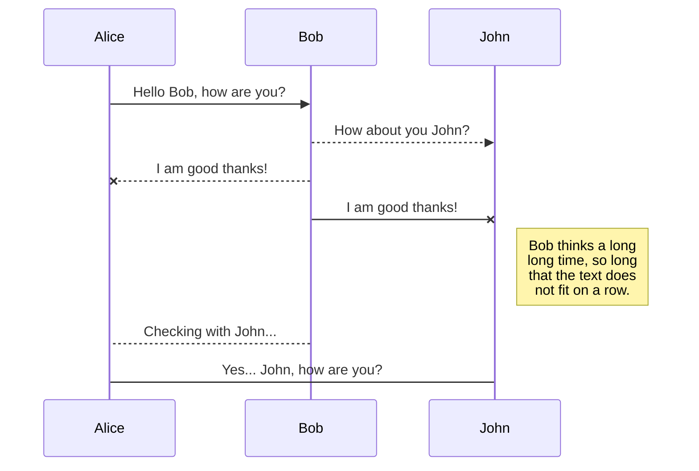

## Mastering Control Statements in Python: A Comprehensive Guide
Control statements in Python are essential tools for directing the flow of a program, enabling you to make decisions, iterate through sequences, and execute code conditionally. Understanding control statements is fundamental to writing flexible and dynamic Python programs. In this comprehensive guide, we'll explore the key types of control statements in Python, their syntax, and best practices for their effective use.

## What are Control Statements in Python?
Control statements are used to control the flow of execution of a program. They are also known as decision-making statements. Control statements enable you to make decisions, iterate through sequences, and execute code conditionally. They are essential tools for writing flexible and dynamic Python programs.

## Types of Control Statements in Python
There are three types of control statements in Python:

- Selection statements
- Iteration statements
- Jump statements

<!-- ## and Operator
#### `and` Operator
The `and` operator returns `True` if both operands are `True`. Otherwise, it returns `False`. The following example demonstrates how to use the `and` operator in Python:

```python title="operators.py" showLineNumbers{1} {4-5}
# and operator
x = 10
y = 5
z = x < 10 and y > 1
t = x < 10 and y < 1
print(z)
print(t)
```

Output:

```cmd title="command" showLineNumbers{1} {2-3}
C:\Users\Your Name> python operators.py
True
False
```

In the above example, we have used the `and` operator to combine two conditions. Since both conditions are `True`, the result of the `and` operator is `True`. The result of the `and` operator is then assigned to the variable `z`. The value of `z` is then printed to the console. -->

## Selection Statements
#### `if` & `if-else` & `if-elif-else` & `nested if-else` & `ternary operator` Statement
Selection statements in Python allow you to make decisions in your code based on certain conditions. The primary selection statement in Python is the if statement, which can be extended with elif (short for "else if") and else clauses for more complex decision-making. Let's explore the syntax and usage of selection statements in Python.



There are five types of selection statements in Python:
- `if` statement
- `if-else` statement
- `if-elif-else` statement
- `nested if-else` statement
- `ternary operator` statement

