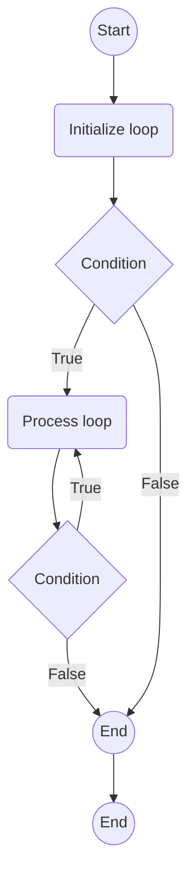

## Unveiling the Power of for Loops in Python
In Python, the for loop is a versatile and fundamental construct that facilitates the iteration over a sequence of elements. Whether you're working with lists, strings, or other iterable objects, the for loop simplifies the process of executing a set of statements for each item in the sequence. In this comprehensive guide, we'll explore the syntax, functionality, and best practices associated with for loops in Python.

### What Is a While Loop?
A while loop is a control flow statement that allows code to be executed repeatedly based on a given Boolean condition. The while loop can be thought of as a repeating if statement.

The while loop is used extensively in Python and alone with for and if-else loops, forms the basis of manipulating data in the language.

### Syntax of while Loop in Python
The syntax of a while loop in Python programming language is −

```python title="while_loop_syntax.py" showLineNumbers{1} {1-2}
while expression:
   statement(s)
```

Here, statement(s) may be a single statement or a block of statements. The condition may be any expression, and true is any non-zero value. The loop iterates while the condition is true.

When the condition becomes false, program control passes to the line immediately following the loop.

**Diagram for while loop in Python**:




:::note
In Python, all the statements indented by the same number of character spaces after a programming construct are considered to be part of a single block of code. Python uses indentation as its method of grouping statements.
:::

:::tip
A while loop is also known as condition-controlled loop.
:::

## Example of while Loop in Python
Here is an example of while loop in Python:

```python title="while_loop.py" showLineNumbers{1} {5-7}
# while loop
numbers = [6, 5, 3, 8, 4, 2, 5, 4, 11]
sum = 0
i = 0
while i < len(numbers):
    sum = sum + numbers[i]
    i = i+1
print("The sum is", sum)
```

Output:

```cmd title="command" showLineNumbers{1} {2}
C:\Users\Your Name> python while_loop.py
The sum is 48
```

In this program, we initialize the `sum` variable to zero and iterate over all the items of the `numbers` list using the while loop and add them to the `sum` variable. Finally, we print the `sum` variable which contains the sum of numbers in the given list.

## While loop with else
Same as with for loops, while loops can also have an optional else block.

The else part is executed if the condition in the while loop evaluates to False. The while loop can be terminated with a break statement. In such cases, the else part is ignored. Hence, a while loop's else part runs if no break occurs and the condition is false.

Here is an example to illustrate this.

```python title="while_loop_else.py" showLineNumbers{1} {4-9}
# while loop with else
numbers = [6, 5, 3, 8, 4, 2, 5, 4, 11]
sum = 0
i = 0
while i < len(numbers):
    sum = sum + numbers[i]
    i = i+1
else:
    print("No items left in the list.")
print("The sum is", sum)
```

Output:

```cmd title="command" showLineNumbers{1} {2-3}
C:\Users\Your Name> python while_loop_else.py
No items left in the list.
The sum is 48
```

In this program, we have used the else statement with the while loop. This is a unique feature of Python, not found in most other programming languages. When the condition in the while loop evaluates to False, the block of statements in the else clause is executed. This means, the else part will be executed only if the loop condition is False.

## Single Statement While Block
Similar to the if statement syntax, if your while block consists of only a single statement, you can place it on the same line as the while header.

```python title="single_statement_while_block.py" showLineNumbers{1} {3}
# single statement while block
flag = 1
while (flag): print('Given flag is really true!')
print("Good bye!")
```

Output:

```cmd title="command" showLineNumbers{1} {2-10}
C:\Users\Your Name> python single_statement_while_block.py
Given flag is really true!
Given flag is really true!
Given flag is really true!
...
```

In this program, we have used the single statement while block. Here, the `flag` variable is initialized to `1` and as long as `flag` is true, the `print` statement will be executed. This results in printing the string `Given flag is really true!` infinitely.

## Python Infinite While Loop
Infinite while loop is an indefinite iteration. It is called infinite because it does not have any end point which means it will be executed forever unless the program is terminated.

```python title="infinite_while_loop.py" {1}
# infinite while loop
var = 1
while var == 1:
    num = int(input("Enter a number  :"))
    print("You entered: ", num)
print("Good bye!")
```

Output:

```cmd title="command" showLineNumbers{1} {2-10}
C:\Users\Your Name> python infinite_while_loop.py
Enter a number  :5
You entered:  5
Enter a number  :6
You entered:  6
Enter a number  :7
You entered:  7
...
```

In this program, we have used an infinite while loop. The condition of the while loop is always true, so the loop will run indefinitely. We have used the `input()` function inside the loop body to read the user input. The `input()` function reads a line entered on a console by an input device such as a keyboard and convert it into a string and returns it.


## While Loop with String or List
In Python, while loops are used to iterate over a block of code as long as the test expression (condition) is true.

We generally use this loop when we don't know beforehand, the number of times to iterate.

```python title="while_loop_with_string_or_list.py" {1}
# while loop with string or list
name = "pynative"
while name != "":
    print("Current Letter :", name[0])
    name = name[1:]
```

Output:

```cmd title="command" showLineNumbers{1} {2-10}
C:\Users\Your Name> python while_loop_with_string_or_list.py
Current Letter : p
Current Letter : y
Current Letter : n
Current Letter : a
Current Letter : t
Current Letter : i
Current Letter : v
Current Letter : e
```

In this program, we have used the while loop to iterate over the characters in the string `pynative` and print each character. We have used the `name` variable to hold the string `pynative`. The `while` loop iterates over the string as long as the string is not empty. The `name` variable is updated in each iteration by removing the first character from it using the slice operation.

## Nested while Loop
A nested while loop is a while loop inside another while loop.

```python title="nested_while_loop.py" showLineNumbers{1} {3-8}
# nested while loop
i = 2
while(i < 100):
    j = 2
    while(j <= (i/j)):
        if not(i % j): break
        j = j + 1
    if (j > i/j) : print(i, " is prime")
    i = i + 1
print("Good bye!")
```

Output:

```cmd title="command" showLineNumbers{1} {2-10}
C:\Users\Your Name> python nested_while_loop.py
2 is prime
3 is prime
5 is prime
7 is prime
11 is prime
13 is prime
...
```

In this program, we have used a nested while loop to find the prime numbers between 2 and 100. The outer while loop iterates from 2 to 100 and the inner while loop iterates from 2 to `i/j`. If the remainder of `i/j` is 0, the control breaks out of the inner while loop and `i` is incremented by 1. If the remainder of `i/j` is not 0, the control breaks out of the inner while loop and prints the value of `i` which is a prime number. The value of `i` is incremented by 1 in each iteration of the outer while loop.

## Reverse while Loop
In Python, we can use reverse while loop to print numbers from n to 1.

```python title="reverse_while_loop.py" showLineNumbers{1} {3-6}
# reverse while loop
n = 10
while n > 0:
    print(n)
    n = n-1
print("Loop ended.")
```

Output:

```cmd title="command" showLineNumbers{1} {2-14}
C:\Users\Your Name> python reverse_while_loop.py
10
9
8
7
6
5
4
3
2
1
Loop ended.
```

In this program, we have used a reverse while loop to print numbers from 10 to 1. The value of `n` is initialized to 10 and the while loop iterates until `n` becomes 0. The value of `n` is decremented by 1 in each iteration of the while loop.

## While Loop with multiple conditions
In Python, we can use multiple conditions in a while loop.

```python title="while_loop_with_multiple_conditions.py" showLineNumbers{1} {3-6}
# while loop with multiple conditions
i = 1
while i <= 5 and i >= 0:
    print(i)
    i = i + 1
print("Loop ended.")
```

Output:

```cmd title="command" showLineNumbers{1} {2-10}
C:\Users\Your Name> python while_loop_with_multiple_conditions.py
1
2
3
4
5
Loop ended.
```

In this program, we have used multiple conditions in a while loop. The while loop iterates until `i` becomes 6. The value of `i` is incremented by 1 in each iteration of the while loop.

## Conclusion
The while loop is a powerful tool in Python, offering a flexible way to repeat a block of code based on a specified condition. It is particularly useful when the number of iterations is unknown beforehand or when executing code until a certain condition is met. By understanding the syntax, potential pitfalls, and best practices associated with while loops, you can leverage their capabilities effectively in your Python programs.

As you continue your Python programming journey, practice using while loops in various scenarios, and explore how they can enhance the responsiveness and efficiency of your code. For more insights and practical examples, check out our tutorials on Python Central Hub!