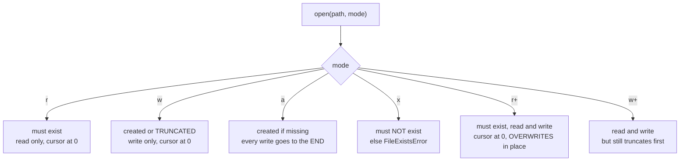

## Create a File
We are creating a file named `test.txt` using `os` module. The `os` module provides functions for interacting with the operating system. The `os` module comes under Python's standard utility modules. We are using the `os` module to create a file in the current directory.

```python title="create_file.py" showLineNumbers{1} {1}
open('test.txt', 'w').close()
```

Output:
```cmd title="command" showLineNumbers{1} {1}
C:\Users\username>python create_file.py
```

In the above example, we are using the `open()` function to create a file. The `open()` function takes two arguments. The first argument is the name of the file and the second argument is the mode. The mode is used to specify the purpose of opening the file. The `w` mode is used to open the file for writing. The `open()` function returns a file object. We are using the `close()` method to close the file object.

## Rename a File
We are renaming the file `test.txt` to `new_test.txt` using the `os` module. The `os` module provides functions for interacting with the operating system. The `os` module comes under Python's standard utility modules. We are using the `os` module to rename a file in the current directory.

**Syntax:**
```python title="rename_file.py" showLineNumbers{1} {1, 3-4}
os.rename(src, dst)
```

**Example:**

```python title="rename_file.py" showLineNumbers{1} {1, 3-4}
import os

os.rename('test.txt', 'new_test.txt')
```

Output:
```cmd title="command" showLineNumbers{1} {1}
C:\Users\username>python rename_file.py
```

In the above example, we are using the `rename()` function to rename a file. The `rename()` function takes two arguments. The first argument is the old name of the file and the second argument is the new name of the file.

## Delete a File
We are deleting the file `new_test.txt` using the `os` module. The `os` module provides functions for interacting with the operating system. The `os` module comes under Python's standard utility modules. We are using the `os` module to delete a file in the current directory.

**Syntax:**
```python title="delete_file.py" showLineNumbers{1} {1, 3-4}
os.remove(path)
```

**Example:**

```python title="delete_file.py" showLineNumbers{1} {1, 3-4}
import os

os.remove('new_test.txt')
```

Output:
```cmd title="command" showLineNumbers{1} {1}
C:\Users\username>python delete_file.py
```

In the above example, we are using the `remove()` function to delete a file. The `remove()` function takes one argument. The argument is the name of the file to be deleted.

## Create a Directory
We are creating a directory named `test` using the `os` module. The `os` module provides functions for interacting with the operating system. The `os` module comes under Python's standard utility modules. We are using the `os` module to create a directory in the current directory.

**Syntax:**
```python title="create_directory.py" showLineNumbers{1} {1, 3-4}
os.mkdir(path)
```

**Example:**

```python title="create_directory.py" showLineNumbers{1} {1, 3-4}
import os

os.mkdir('test')
```

Output:
```cmd title="command" showLineNumbers{1} {1}
C:\Users\username>python create_directory.py
```

In the above example, we are using the `mkdir()` function to create a directory. The `mkdir()` function takes one argument. The argument is the name of the directory to be created.

## Rename a Directory
We are renaming the directory `test` to `new_test` using the `os` module. The `os` module provides functions for interacting with the operating system. The `os` module comes under Python's standard utility modules. We are using the `os` module to rename a directory in the current directory.

**Syntax:**
```python title="rename_directory.py" showLineNumbers{1} {1, 3-4}
os.rename(src, dst)
```

**Example:**

```python title="rename_directory.py" showLineNumbers{1} {1, 3-4}
import os

os.rename('test', 'new_test')
```

Output:
```cmd title="command" showLineNumbers{1} {1}
C:\Users\username>python rename_directory.py
```

In the above example, we are using the `rename()` function to rename a directory. The `rename()` function takes two arguments. The first argument is the old name of the directory and the second argument is the new name of the directory.

## Delete a Directory
We are deleting the directory `new_test` using the `os` module. The `os` module provides functions for interacting with the operating system. The `os` module comes under Python's standard utility modules. We are using the `os` module to delete a directory in the current directory.

**Syntax:**
```python title="delete_directory.py" showLineNumbers{1} {1, 3-4}
os.rmdir(path)
```

**Example:**

```python title="delete_directory.py" showLineNumbers{1} {1, 3-4}
import os

os.rmdir('new_test')
```

Output:
```cmd title="command" showLineNumbers{1} {1}
C:\Users\username>python delete_directory.py
```

In the above example, we are using the `rmdir()` function to delete a directory. The `rmdir()` function takes one argument. The argument is the name of the directory to be deleted.

## Move a File
We are moving the file `test.txt` to the directory `test` using the `shutil` module. The `shutil` module provides functions for copying and moving files and directories. The `shutil` module comes under Python's standard utility modules. We are using the `shutil` module to move a file in the current directory.

**Syntax:**
```python title="move_file.py" showLineNumbers{1} {1, 3-4}
shutil.move(src, dst)
```

**Example:**

```python title="move_file.py" showLineNumbers{1} {1, 3-4}
import shutil

shutil.move('test.txt', 'test')
```

Output:
```cmd title="command" showLineNumbers{1} {1}
C:\Users\username>python move_file.py
```

In the above example, we are using the `move()` function to move a file. The `move()` function takes two arguments. The first argument is the name of the file to be moved and the second argument is the name of the directory to which the file is to be moved.

## Move a Directory
We are moving the directory `test` to the directory `new_test` using the `shutil` module. The `shutil` module provides functions for copying and moving files and directories. The `shutil` module comes under Python's standard utility modules. We are using the `shutil` module to move a directory in the current directory.

**Syntax:**
```python title="move_directory.py" showLineNumbers{1} {1, 3-4}
shutil.move(src, dst)
```

**Example:**

```python title="move_directory.py" showLineNumbers{1} {1, 3-4}
import shutil

shutil.move('test', 'new_test')
```

Output:
```cmd title="command" showLineNumbers{1} {1}
C:\Users\username>python move_directory.py
```

In the above example, we are using the `move()` function to move a directory. The `move()` function takes two arguments. The first argument is the name of the directory to be moved and the second argument is the name of the directory to which the directory is to be moved.

## Copy a File
We are copying the file `test.txt` to the directory `test` using the `shutil` module. The `shutil` module provides functions for copying and moving files and directories. The `shutil` module comes under Python's standard utility modules. We are using the `shutil` module to copy a file in the current directory.

**Syntax:**
```python title="copy_file.py" showLineNumbers{1} {1, 3-4}
shutil.copy(src, dst)
```

**Example:**

```python title="copy_file.py" showLineNumbers{1} {1, 3-4}
import shutil

shutil.copy('test.txt', 'test')
```

Output:
```cmd title="command" showLineNumbers{1} {1}
C:\Users\username>python copy_file.py
```

In the above example, we are using the `copy()` function to copy a file. The `copy()` function takes two arguments. The first argument is the name of the file to be copied and the second argument is the name of the directory to which the file is to be copied.

## Copy a Directory
We are copying the directory `test` to the directory `new_test` using the `shutil` module. The `shutil` module provides functions for copying and moving files and directories. The `shutil` module comes under Python's standard utility modules. We are using the `shutil` module to copy a directory in the current directory.

**Syntax:**
```python title="copy_directory.py" showLineNumbers{1} {1, 3-4}
shutil.copytree(src, dst)
```

**Example:**

```python title="copy_directory.py" showLineNumbers{1} {1, 3-4}
import shutil

shutil.copytree('test', 'new_test')
```

Output:
```cmd title="command" showLineNumbers{1} {1}
C:\Users\username>python copy_directory.py
```

In the above example, we are using the `copytree()` function to copy a directory. The `copytree()` function takes two arguments. The first argument is the name of the directory to be copied and the second argument is the name of the directory to which the directory is to be copied.

## List Files and Directories
We are listing the files and directories in the current directory using the `os` module. The `os` module provides functions for interacting with the operating system. The `os` module comes under Python's standard utility modules. We are using the `os` module to list the files and directories in the current directory.

**Syntax:**
```python title="list_files_and_directories.py" showLineNumbers{1} {1, 3-4}
os.listdir(path)
```

**Example:**

```python title="list_files_and_directories.py" showLineNumbers{1} {1, 3-4}
import os

print(os.listdir())
```

Output:
```cmd title="command" showLineNumbers{1} {1-2}
C:\Users\username>python list_files_and_directories.py
['append.py', 'create_directory.py', 'create_file.py', 'delete_directory.py', 'delete_file.py', 'File Operations.md', 'File%20Operations.md', 'move_directory.py', 'move_file.py', 'rename_directory.py', 'rename_file.py']
```

In the above example, we are using the `listdir()` function to list the files and directories in the current directory. The `listdir()` function takes one argument. The argument is the name of the directory whose files and directories are to be listed. If no argument is passed to the `listdir()` function, then it lists the files and directories in the current directory.

## Check if a File Exists
We are checking if the file `test.txt` exists in the current directory using the `os` module. The `os` module provides functions for interacting with the operating system. The `os` module comes under Python's standard utility modules. We are using the `os` module to check if a file exists in the current directory.

**Syntax:**
```python title="check_if_file_exists.py" showLineNumbers{1} {1, 3-4}
os.path.exists(path)
```

**Example:**

```python title="check_if_file_exists.py" showLineNumbers{1} {1, 3-4}
import os

print(os.path.exists('test.txt'))
```

Output:
```cmd title="command" showLineNumbers{1} {1-2}
C:\Users\username>python check_if_file_exists.py
True
```

In the above example, we are using the `exists()` function to check if a file exists. The `exists()` function takes one argument. The argument is the name of the file whose existence is to be checked.

## Check if a Directory Exists
We are checking if the directory `test` exists in the current directory using the `os` module. The `os` module provides functions for interacting with the operating system. The `os` module comes under Python's standard utility modules. We are using the `os` module to check if a directory exists in the current directory.

**Syntax:**
```python title="check_if_directory_exists.py" showLineNumbers{1} {1, 3-4}
os.path.exists(path)
```

**Example:**

```python title="check_if_directory_exists.py" showLineNumbers{1} {1, 3-4}
import os

print(os.path.exists('test'))
```

Output:
```cmd title="command" showLineNumbers{1} {1-2}
C:\Users\username>python check_if_directory_exists.py
True
```

In the above example, we are using the `exists()` function to check if a directory exists. The `exists()` function takes one argument. The argument is the name of the directory whose existence is to be checked.

## Get the Current Working Directory
We are getting the current working directory using the `os` module. The `os` module provides functions for interacting with the operating system. The `os` module comes under Python's standard utility modules. We are using the `os` module to get the current working directory.

**Syntax:**
```python title="get_current_working_directory.py" showLineNumbers{1} {1, 3-4}
os.getcwd()
```

**Example:**

```python title="get_current_working_directory.py" showLineNumbers{1} {1, 3-4}
import os

print(os.getcwd())
```

Output:
```cmd title="command" showLineNumbers{1} {1-2}
C:\Users\username>python get_current_working_directory.py
C:\Users\username
```

In the above example, we are using the `getcwd()` function to get the current working directory. The `getcwd()` function takes no argument.

## Change the Current Working Directory
We are changing the current working directory to the directory `test` using the `os` module. The `os` module provides functions for interacting with the operating system. The `os` module comes under Python's standard utility modules. We are using the `os` module to change the current working directory.

**Syntax:**
```python title="change_current_working_directory.py" showLineNumbers{1} {1, 3-4}
os.chdir(path)
```

**Example:**

```python title="change_current_working_directory.py" showLineNumbers{1} {1, 3-4}
import os

os.chdir('test')
```

Output:
```cmd title="command" showLineNumbers{1} {1}
C:\Users\username>python change_current_working_directory.py
```

In the above example, we are using the `chdir()` function to change the current working directory. The `chdir()` function takes one argument. The argument is the name of the directory to which the current working directory is to be changed.

## Get the Size of a File
We are getting the size of the file `test.txt` using the `os` module. The `os` module provides functions for interacting with the operating system. The `os` module comes under Python's standard utility modules. We are using the `os` module to get the size of a file.

**Syntax:**
```python title="get_file_size.py" showLineNumbers{1} {1, 3-4}
os.path.getsize(path)
```

**Example:**

```python title="get_file_size.py" showLineNumbers{1} {1, 3-4}
import os

print(os.path.getsize('test.txt'))
```

Output:
```cmd title="command" showLineNumbers{1} {1-2}
C:\Users\username>python get_file_size.py
0
```

In the above example, we are using the `getsize()` function to get the size of a file. The `getsize()` function takes one argument. The argument is the name of the file whose size is to be obtained.

## Get the Size of a Directory
We are getting the size of the directory `test` using the `shutil` module. The `shutil` module provides functions for copying and moving files and directories. The `shutil` module comes under Python's standard utility modules. We are using the `shutil` module to get the size of a directory.

**Syntax:**
```python title="get_directory_size.py" showLineNumbers{1} {1, 3-4}
shutil.disk_usage(path)
```

**Example:**

```python title="get_directory_size.py" showLineNumbers{1} {1, 3-4}
import shutil

print(shutil.disk_usage('test'))
```

Output:
```cmd title="command" showLineNumbers{1} {1-2}
C:\Users\username>python get_directory_size.py
usage(total=97676207104, used=97676207104, free=0)
```

In the above example, we are using the `disk_usage()` function to get the size of a directory. The `disk_usage()` function takes one argument. The argument is the name of the directory whose size is to be obtained.

## What the mode string actually decides

The mode you pass to `open()` settles three separate questions at once: may the file be
missing, is existing content destroyed, and where does the cursor start. Choosing the
wrong letter is how data disappears.



Measured, starting from a file containing `SEED` and writing a single `X`:

| mode | file afterwards | note |
|:--|:--|:--|
| `w` | `X` | old contents gone before you wrote anything |
| `a` | `SEEDX` | appended |
| `x` | `SEED` | `FileExistsError`, nothing written |
| `r+` | `XEED` | **overwrote one character in place** |
| `w+` | `X` | `+` does not prevent truncation |

:::danger[`r+` does not mean "edit safely"]
`r+` writes *over* bytes at the cursor rather than replacing the file. Writing `X` onto
`SEED` gives `XEED`, not `X`. There is no mode that inserts — to change the middle of a
text file, read it, change it in memory, and write it back.
:::

### Opening is not writing: the buffer

```python title="buffering.py" showLineNumbers{1}
import os

f = open("demo.txt", "w")
f.write("buffered, not yet on disk")
print(os.path.getsize("demo.txt"))    # 0    <- nothing on disk yet
f.close()
print(os.path.getsize("demo.txt"))    # 25   <- flushed on close
```

Writes land in a buffer and reach the disk when the buffer fills, when you call
`flush()`, or when the file is closed. A crash before that point loses the data — and a
script that never closes its files can leave them empty. `with` closes for you even if
an exception is raised, which is the entire reason to prefer it:

```python title="with_block.py" showLineNumbers{1}
with open("demo.txt", "w") as g:
    g.write("hello")
    print(os.path.getsize("demo.txt"))    # 0
print(os.path.getsize("demo.txt"))        # 5
print(g.closed)                           # True
```

## See it move

A file handle is a **cursor** over bytes. Every read moves it forward; nothing rewinds
it for you. Step through the operations and watch where the cursor lands — and why the
second `read()` comes back empty.

```p5 title="The file cursor" desc="Reads advance the cursor and never rewind it. A second read() returns an empty string because the cursor is already at EOF." height="330"
let data = "one\ntwo\n";
let pos = 0;
let log = [];
let buttons = [];

function setup() {
  createCanvas(600, 330);
  textFont("monospace");
  buttons = [
    { label: "read(3)", x: 24 },
    { label: "read()", x: 124 },
    { label: "seek(0)", x: 224 },
    { label: "reset", x: 324 },
  ];
  log = ["opened, tell() = 0"];
}

function charLabel(c) {
  if (c === "\n") return "\\n";
  return c;
}

function doRead(n) {
  const end = n < 0 ? data.length : min(data.length, pos + n);
  const got = data.slice(pos, end);
  pos = end;
  let shown = "";
  for (let i = 0; i < got.length; i++) shown += charLabel(got[i]);
  log.push((n < 0 ? "read()" : "read(" + n + ")") + " -> '" + shown + "', tell() = " + pos);
  if (got.length === 0) log[log.length - 1] += "   <- empty, at EOF";
  while (log.length > 5) log.shift();
}

function draw() {
  background(13, 17, 23);
  noStroke();
  fill(230);
  textSize(13);
  textAlign(LEFT, TOP);
  text("file contents, one box per byte", 24, 20);

  const bw = 46;
  for (let i = 0; i < data.length; i++) {
    const x = 24 + i * (bw + 6);
    const consumed = i < pos;
    stroke(consumed ? color(48, 56, 68) : color(75, 139, 190));
    strokeWeight(1);
    fill(consumed ? color(18, 23, 30) : color(20, 30, 42));
    rect(x, 52, bw, 46, 4);
    noStroke();
    fill(consumed ? 70 : 220);
    textSize(15);
    textAlign(CENTER, CENTER);
    text(charLabel(data[i]), x + bw / 2, 75);
    fill(consumed ? 55 : 110);
    textSize(10);
    textAlign(CENTER, TOP);
    text(i, x + bw / 2, 102);
  }

  const cx = 24 + pos * (bw + 6);
  stroke(255, 211, 67);
  strokeWeight(2);
  line(cx, 44, cx, 104);
  noStroke();
  fill(255, 211, 67);
  triangle(cx - 6, 36, cx + 6, 36, cx, 44);
  textAlign(LEFT, BOTTOM);
  textSize(11);
  text("cursor, tell() = " + pos, cx + 8, 36);

  for (const b of buttons) {
    const hot = mouseX > b.x && mouseX < b.x + 92 && mouseY > 128 && mouseY < 156;
    stroke(hot ? color(255, 211, 67) : color(60, 70, 84));
    strokeWeight(1);
    fill(hot ? color(34, 40, 50) : color(22, 28, 36));
    rect(b.x, 128, 92, 28, 4);
    noStroke();
    fill(hot ? color(255, 211, 67) : 200);
    textSize(12);
    textAlign(CENTER, CENTER);
    text(b.label, b.x + 46, 142);
  }

  fill(120);
  textSize(11);
  textAlign(LEFT, TOP);
  for (let i = 0; i < log.length; i++) {
    fill(i === log.length - 1 ? 210 : 95);
    text(log[i], 24, 178 + i * 20);
  }
  fill(80);
  text("the cursor only moves forward unless you seek", 24, 300);
}

function mousePressed() {
  if (mouseY < 128 || mouseY > 156) return;
  for (const b of buttons) {
    if (mouseX > b.x && mouseX < b.x + 92) {
      if (b.label === "read(3)") doRead(3);
      else if (b.label === "read()") doRead(-1);
      else if (b.label === "seek(0)") { pos = 0; log.push("seek(0), tell() = 0"); }
      else { pos = 0; log = ["reopened, tell() = 0"]; }
      while (log.length > 5) log.shift();
    }
  }
}
```

```python title="cursor.py" showLineNumbers{1}
with open("demo.txt") as f:          # contains "one\ntwo\nthree\n"
    print(f.tell())                  # 0
    print(f.read(3))                 # 'one'
    print(f.tell())                  # 3
    print(f.read())                  # '\ntwo\nthree\n'
    print(f.read())                  # ''      <- cursor is at EOF, file is NOT re-read
    f.seek(0)
    print(f.read(3))                 # 'one'
```

An empty string from `read()` means end of file, not an empty file. Code that reads a
handle twice and finds nothing the second time is almost always missing a `seek(0)`.

### Text mode rewrites your newlines

```python title="newlines.py" showLineNumbers{1}
with open("demo.txt", "w") as f:
    f.write("a\nb\n")
print(open("demo.txt", "rb").read())     # b'a\r\nb\r\n'  -> 6 bytes on Windows

with open("demo.txt", "wb") as f:
    f.write(b"a\nb\n")
print(open("demo.txt", "rb").read())     # b'a\nb\n'      -> 4 bytes

with open("demo.txt", "w", newline="") as f:
    f.write("a\nb\n")                    # translation off -> 4 bytes
```

Four characters became **six bytes**. In text mode on Windows, `\n` is translated to
`\r\n` on write and back on read, so you rarely notice — until a byte count, a hash,
or a file sent to another platform disagrees. For any non-text payload, open in binary.

## Check yourself

<Quiz
  questions={[
    {
      q: "A file contains SEED. You open it with mode 'r+' and write 'X'. What does it contain?",
      options: [
        "X",
        "XEED",
        "SEEDX",
        "SEED, since r+ cannot write",
      ],
      answer: 1,
      explain:
        "r+ positions the cursor at 0 and overwrites bytes in place rather than truncating. The X replaces the S and the rest survives, giving XEED.",
    },
    {
      q: "Which mode raises FileExistsError when the file is already there?",
      options: [
        "w",
        "a",
        "x",
        "r+",
      ],
      answer: 2,
      explain:
        "x is exclusive creation: it succeeds only if the file does not exist, which is how you avoid silently destroying data the way w would.",
    },
    {
      q: "On Windows you write the 4-character string a\\nb\\n in text mode. How many bytes land on disk?",
      options: [
        "4, since text mode does not change bytes",
        "6, because each newline escape is translated to carriage-return plus newline",
        "5, because only the final newline is translated",
        "8, because every character is stored as two bytes",
      ],
      answer: 1,
      explain:
        "Text mode translates a newline to the platform line ending on write. Both newlines become two bytes each, giving 6. Open in binary, or pass newline='', to stop it.",
    },
    {
      q: "You call f.read() on an open handle, then call f.read() again. What does the second call return?",
      options: [
        "the same contents again",
        "an empty string, because the cursor is at end of file",
        "None",
        "it raises, because the handle is exhausted",
      ],
      answer: 1,
      explain:
        "Reading advances the cursor and nothing rewinds it. The second read starts at EOF and returns ''. Call f.seek(0) first to read the file again.",
    },
  ]}
/>

## Conclusion
In this tutorial, we learned how to perform file operations in Python. We learned how to create, rename, delete, and move files and directories. We also learned how to list files and directories, check if a file or directory exists, get the current working directory, change the current working directory, and get the size of a file or directory. Now you can perform file operations in Python. For more information, visit the [official documentation](https://docs.python.org/3/library/os.html) of the `os` module and the [official documentation](https://docs.python.org/3/library/shutil.html) of the `shutil` module. For more tutorials, visit our Python Central Hub.

---

## Try it: File Operations Exercises

### Exercise 1 – Check File Exists

<DataCampExercise
  lang="python"
  hint={`Use os.path.exists() to check if a file exists.`}
  code={`# Task: Exercise 1 – Check File Exists
# Follow the steps below and fill in the blanks.
# Use the 'Show Solution' button only after you have tried!

# Hint: Add the import statement(s) at the very top of your code.
import os
# Above import is provided -- understand what it brings in.
# Hint: print(value) displays output; print(a, b) prints multiple values.
# Step: Write the required code here.
# with open("/tmp/sample.txt", "w") as f:
# replace the comment above with working code
    # Hint: Use os.path.exists() to check if a file exists.
    # Step: Write the required code here.
    # f.write("test")
    # replace the comment above with working code
# Hint: Run after every change -- small steps are easier to debug!
# Step: Call print() with the right argument(s).
# Example structure: print(os.path.exists("/tmp/sample.txt"))
print(___)  # replace ___ with the correct expression
# Hint: Read error messages carefully -- they point to the exact line.
# Step: Call print() with the right argument(s).
# Example structure: print(os.path.exists("/tmp/nofile.txt"))
print(___)  # replace ___ with the correct expression

# ── Expected Output ──────────────────────────────────────────
# (Run your completed code to check the output)
# ──────────────────────────────────────────────────────────────`}
  solution={`import os
with open("/tmp/sample.txt", "w") as f:
    f.write("test")
print(os.path.exists("/tmp/sample.txt"))
print(os.path.exists("/tmp/nofile.txt"))`}
  sct={`test_output_contains("True")
test_output_contains("False")
success_msg("File existence check works!")`}
  height={170}
/>

### Exercise 2 – Read Lines

<DataCampExercise
  lang="python"
  hint={`Use .readlines() to get a list of lines from a file.`}
  code={`# Task: Exercise 2 – Read Lines
# Follow the steps below and fill in the blanks.
# Use the 'Show Solution' button only after you have tried!

# Hint: print(value) displays output; print(a, b) prints multiple values.
# Step: Write the required code here.
# with open("/tmp/lines.txt", "w") as f:
# replace the comment above with working code
    # Hint: Use .readlines() to get a list of lines from a file.
    # Step: Write the required code here.
    # f.write("line1\\nline2\\nline3")
    # replace the comment above with working code
# Hint: Run after every change -- small steps are easier to debug!
# Step: Write the required code here.
# with open("/tmp/lines.txt", "r") as f:
# replace the comment above with working code
    # Hint: Read error messages carefully -- they point to the exact line.
    # Step: Assign the correct value to 'lines'.
    lines = ___  # replace ___ with the correct value
# Step: Call print() with the right argument(s).
# Example structure: print("Lines:", len(lines))
print(___)  # replace ___ with the correct expression

# ── Expected Output ──────────────────────────────────────────
# (Run your completed code to check the output)
# ──────────────────────────────────────────────────────────────`}
  solution={`with open("/tmp/lines.txt", "w") as f:
    f.write("line1\\nline2\\nline3")
with open("/tmp/lines.txt", "r") as f:
    lines = f.readlines()
print("Lines:", len(lines))`}
  sct={`test_output_contains("Lines: 3")
success_msg("readlines() works!")`}
  height={180}
/>

### Exercise 3 – Delete a File

<DataCampExercise
  lang="python"
  hint={`Use os.remove() to delete a file.`}
  code={`# Task: Exercise 3 – Delete a File
# Follow the steps below and fill in the blanks.
# Use the 'Show Solution' button only after you have tried!

# Hint: Add the import statement(s) at the very top of your code.
import os
# Above import is provided -- understand what it brings in.
# Hint: print(value) displays output; print(a, b) prints multiple values.
# Step: Write the required code here.
# with open("/tmp/temp.txt", "w") as f:
# replace the comment above with working code
    # Hint: Use os.remove() to delete a file.
    # Step: Write the required code here.
    # f.write("temporary")
    # replace the comment above with working code
# Hint: Run after every change -- small steps are easier to debug!
# Step: Write the required code here.
# os.remove("/tmp/temp.txt")
# replace the comment above with working code
# Hint: Read error messages carefully -- they point to the exact line.
# Step: Call print() with the right argument(s).
# Example structure: print("Deleted:", not os.path.exists("/tmp/temp.txt"))
print(___)  # replace ___ with the correct expression

# ── Expected Output ──────────────────────────────────────────
# (Run your completed code to check the output)
# ──────────────────────────────────────────────────────────────`}
  solution={`import os
with open("/tmp/temp.txt", "w") as f:
    f.write("temporary")
os.remove("/tmp/temp.txt")
print("Deleted:", not os.path.exists("/tmp/temp.txt"))`}
  sct={`test_output_contains("Deleted: True")
success_msg("File deletion works!")`}
  height={180}
/>

