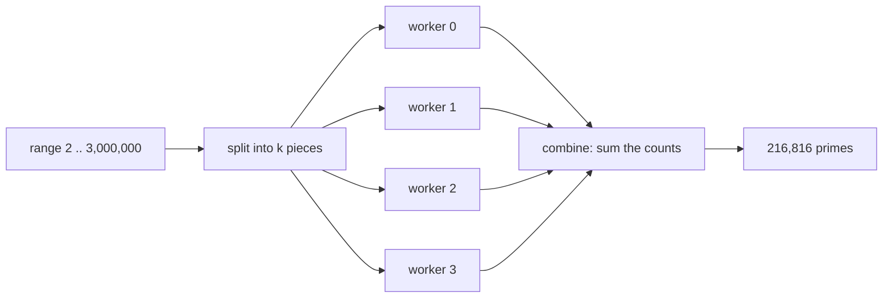

## Goal

Create a CPU-bound job and speed it up using a process pool.

Example job:

- compute something expensive for many items

## Step 1: Define an expensive function

```python title="expensive.py" showLineNumbers{1}
def expensive(x: int) -> int:
    # intentionally slow operation
    total = 0
    for i in range(1, 200_000):
        total += (x * i) % 97
    return total
```

## Step 2: Run sequential

```python title="sequential.py" showLineNumbers{1}
import time
from expensive import expensive

items = list(range(20))

start = time.time()
results = [expensive(x) for x in items]
print("sequential seconds:", round(time.time() - start, 2))
print(results[:5])
```

## Step 3: Run in parallel (Pool)

```python title="parallel.py" showLineNumbers{1}
import time
from multiprocessing import Pool
from expensive import expensive

items = list(range(20))

if __name__ == "__main__":
    start = time.time()

    with Pool() as pool:
        results = pool.map(expensive, items)

    print("parallel seconds:", round(time.time() - start, 2))
    print(results[:5])
```

## Deliverable

- Compare sequential vs parallel time.
- Try different pool sizes.
- Explain when multiprocessing helps (CPU-bound) vs not (I/O-bound).

import DataCampExercise from "../../../../components/DataCampExercise.astro";
import Quiz from "../../../../components/Quiz.astro";

## The shape of every parallel batch job

Split the input, hand each piece to a worker, combine what comes back. The interesting
decisions are all in the first box:



The correctness check comes first and is exact — however the work is split, the answer
must not move:

```python title="verify.py" showLineNumbers{1}
with mp.Pool(4) as pool:
    parts = pool.map(count_primes, chunks(2, 3_000_000, 4))
assert sum(parts) == 216_816        # holds for every split tried below
```

## Splitting badly is the whole difficulty

Two splits of the same range across four workers, counted rather than timed, so the
figures do not depend on the machine:

| split | primes found by each worker | spread |
|:--|:--|--:|
| four contiguous blocks | 60,238 / 53,917 / 51,926 / 50,735 | 1.2× |
| every 4th number (stride 4) | **1 / 108,532 / 0 / 108,283** | **108,532×** |

The stride split looks fair and is a catastrophe. With a stride of 4, two workers
receive only **even** numbers, and every even number above 2 is rejected immediately.
Those workers finish almost instantly having done nothing, while the other two do the
entire job.

Counting the trial divisions actually performed (for `n` below 60,000, so the numbers
stay readable) shows the same thing as a cost rather than a count:

| split | divisions per worker | spread |
|:--|:--|--:|
| contiguous | 106,939 / 164,962 / 200,344 / 226,698 | **2.1×** |
| stride 4 | 15,000 / 333,980 / 14,999 / 334,949 | **22×** |

Note that even the "good" split is not level: the last block does **2.1×** the work of
the first, because testing a larger `n` requires trying divisors up to $\sqrt{n}$. Equal
*width* is not equal *work* whenever the cost per item depends on the item.

:::note[A job is only as fast as its slowest worker]
Three workers finishing early does not help. Whatever the slowest one takes is the
wall-clock time, so the goal of splitting is to make the **maximum** piece small — not
to make the pieces equal in count.
:::

## See it move

Switch between the splits and watch how the work piles up. The bar that matters is the
tallest one.

```p5 title="Equal width is not equal work" desc="Contiguous blocks give a mild imbalance because larger numbers cost more to test. A stride of 4 gives two workers only even numbers, so they do almost nothing." height="340"
let mode = 0;   // 0 = contiguous, 1 = stride 4
const CONTIG = [106939, 164962, 200344, 226698];
const STRIDE = [15000, 333980, 14999, 334949];
const CPRIMES = [60238, 53917, 51926, 50735];
const SPRIMES = [1, 108532, 0, 108283];

function setup() {
  createCanvas(600, 340);
  textFont("monospace");
}

function draw() {
  background(13, 17, 23);
  const work = mode === 0 ? CONTIG : STRIDE;
  const primes = mode === 0 ? CPRIMES : SPRIMES;
  const mx = max(work);
  const mn = min(work);

  noStroke();
  fill(230);
  textSize(13);
  textAlign(LEFT, TOP);
  text(mode === 0 ? "four contiguous blocks" : "stride of 4: worker i takes n where n % 4 == i", 24, 18);
  fill(120);
  textSize(11);
  text("bar = trial divisions performed (deterministic, not timed)", 24, 38);

  const baseY = 250;
  for (let i = 0; i < 4; i++) {
    const x = 60 + i * 128;
    const h = (work[i] / mx) * 150;
    const slowest = work[i] === mx;
    stroke(slowest ? color(232, 110, 110) : color(60, 70, 84));
    strokeWeight(1);
    fill(slowest ? color(60, 28, 28) : color(24, 34, 46));
    rect(x, baseY - h, 84, h, 3);

    noStroke();
    fill(slowest ? color(232, 110, 110) : color(75, 139, 190));
    textSize(11);
    textAlign(CENTER, BOTTOM);
    text(nf(work[i] / 1000, 0, 1) + "k", x + 42, baseY - h - 6);

    fill(150);
    textAlign(CENTER, TOP);
    text("worker " + i, x + 42, baseY + 8);
    fill(100);
    textSize(10);
    text(primes[i].toLocaleString() + " primes", x + 42, baseY + 24);
  }

  stroke(232, 110, 110);
  strokeWeight(1);
  const topY = baseY - 150;
  line(50, topY, 560, topY);
  noStroke();
  fill(232, 110, 110);
  textSize(10);
  textAlign(LEFT, BOTTOM);
  text("the slowest worker sets the wall-clock time", 50, topY - 4);

  fill(210);
  textSize(12);
  textAlign(LEFT, CENTER);
  text("imbalance  " + nf(mx / mn, 0, 1) + "x  between busiest and idlest worker", 24, 292);

  drawBtn(24, 306, 250, mode === 0 ? "split: contiguous blocks" : "split: stride of 4");
}

function drawBtn(x, y, w, label) {
  const hot = mouseX > x && mouseX < x + w && mouseY > y && mouseY < y + 24;
  stroke(hot ? color(255, 211, 67) : color(60, 70, 84));
  strokeWeight(1);
  fill(hot ? color(34, 40, 50) : color(22, 28, 36));
  rect(x, y, w, 24, 4);
  noStroke();
  fill(hot ? color(255, 211, 67) : 200);
  textSize(11);
  textAlign(CENTER, CENTER);
  text(label, x + w / 2, y + 12);
}

function mousePressed() {
  if (mouseY > 306 && mouseY < 330 && mouseX > 24 && mouseX < 274) mode = 1 - mode;
}
```

## Let the pool balance it for you

Rather than hand-designing a fair split, cut the work into **more pieces than workers**
and let `Pool` hand out the next piece whenever a worker goes idle:

```python title="dynamic.py" showLineNumbers{1}
import multiprocessing as mp

if __name__ == "__main__":
    pieces = chunks(2, 3_000_000, 64)        # 64 pieces, 4 workers
    with mp.Pool(4) as pool:
        parts = pool.map(count_primes, pieces)
    print(sum(parts))                         # 216816
```

A worker that draws a cheap piece simply comes back for another. The finer the pieces,
the better the balance — until the per-task overhead takes over. Measured on the
smaller range, 64 pieces beat 4, and **2,000 pieces were slower than 4**, because each
task carries pickling and dispatch cost of its own.

:::caution[Measure before believing any of this]
On the machine these notes were written on, the same `Pool(4)` configuration timed
9.42 s and 6.98 s in one sitting, and for a workload of 0.42 s **every** parallel
version lost to the sequential loop — pool startup alone is roughly 0.5–1 s. Parallel
speedup is a property of your machine and your workload, not of the code. Time it, on
the hardware you will actually run it on, with the data you will actually use.
:::

### The deliverable

A complete, correct version to compare yours against:

```python title="parallel_primes.py" showLineNumbers{1}
import multiprocessing as mp
import math, time

def is_prime(n):
    if n < 2: return False
    if n % 2 == 0: return n == 2
    for i in range(3, math.isqrt(n) + 1, 2):
        if n % i == 0: return False
    return True

def count_primes(rng):
    lo, hi = rng
    return sum(1 for n in range(lo, hi) if is_prime(n))

def chunks(lo, hi, k):
    step = (hi - lo) // k
    return [(lo + i * step, lo + (i + 1) * step if i < k - 1 else hi)
            for i in range(k)]

if __name__ == "__main__":                     # required: spawn re-imports this file
    LO, HI = 2, 3_000_000
    t = time.perf_counter()
    with mp.Pool(4) as pool:
        parts = pool.map(count_primes, chunks(LO, HI, 64))
    print(f"{sum(parts):,} primes in {time.perf_counter() - t:.2f}s")
    assert sum(parts) == 216_816               # the answer must not depend on the split
```

## Check yourself

<Quiz
  questions={[
    {
      q: "Splitting 2..3,000,000 across four workers by stride of 4 gives prime counts of 1, 108532, 0 and 108283. Why?",
      options: [
        "primes cluster in the middle of the range",
        "two workers receive only even numbers, which are rejected immediately, so they do almost no work",
        "the stride split loses numbers at the boundaries",
        "Pool assigns pieces unevenly by default",
      ],
      answer: 1,
      explain:
        "With stride 4, workers take n where n % 4 is 0 or 2 — all even. Every even number above 2 fails the first test, so those two workers idle while the other two do the whole job.",
    },
    {
      q: "Even the contiguous split does 2.1x more divisions in the last block than the first. What causes that?",
      options: [
        "later blocks contain more primes",
        "testing a larger n needs trial divisors up to its square root, so cost grows with n",
        "the final block is wider than the others",
        "memory access slows down for larger integers",
      ],
      answer: 1,
      explain:
        "The last block actually holds the FEWEST primes (50,735 against 60,238). It is slower because each candidate is larger and requires more divisors to be tried. Equal width is not equal work.",
    },
    {
      q: "For the smaller range where the sequential run took 0.42 s, every Pool configuration was slower. Why?",
      options: [
        "the results were incorrect and had to be recomputed",
        "pool startup is roughly 0.5-1 s, which alone exceeds the whole sequential run",
        "Pool falls back to threads for short tasks",
        "the GIL prevents processes from running in parallel",
      ],
      answer: 1,
      explain:
        "Creating worker processes and pickling arguments costs about a second here. Work measured in fractions of a second cannot repay that, so parallelism is a net loss below some threshold.",
    },
    {
      q: "Why does cutting the range into 64 pieces for 4 workers usually beat cutting it into exactly 4?",
      options: [
        "64 pieces use 64 cores",
        "a worker that finishes a cheap piece immediately takes another, so idle time is absorbed",
        "smaller pieces are cached better by the operating system",
        "it reduces the total number of divisions performed",
      ],
      answer: 1,
      explain:
        "More pieces than workers lets Pool balance dynamically. The limit is per-task overhead: 2,000 pieces measured slower than 4, because dispatch and pickling began to dominate.",
    },
  ]}
/>

## 🧪 Try It Yourself

### Exercise 1 – Start a Process

<DataCampExercise
  lang="python"
  hint={`Use \`multiprocessing.Process(target=fn)\` and call \`.start()\`.`}
  code={`# Task: Exercise 1 – Start a Process
from multiprocessing import Process

def greet(name):
    print(f"Hello from {name}")

if __name__ == "__main__":
    # Hint: create a Process with target=greet and args=("worker",)
    p = Process(target=greet, args=(___, ))   # replace ___ with "worker"
    p.___()                                    # replace ___ with start
    p.___()                                    # replace ___ with join

# ── Expected Output ───────────────────────────────────────────
# Hello from worker
# ──────────────────────────────────────────────────────────────`}
  solution={`from multiprocessing import Process

def greet(name):
    print(f"Hello from {name}")

if __name__ == "__main__":
    p = Process(target=greet, args=("worker",))
    p.start()
    p.join()`}
  sct={`test_output_contains("Hello from worker")
success_msg("Process created and joined!")`}
  height={150}
/>

### Exercise 2 – Process Pool map()

<DataCampExercise
  lang="python"
  hint={`Use \`Pool.map(fn, iterable)\` to apply a function across multiple processes.`}
  code={`# Task: Exercise 2 – Process Pool map()
from multiprocessing import Pool

def square(n):
    return n * n

if __name__ == "__main__":
    # Hint: create a Pool with 2 workers
    with Pool(___) as p:            # replace ___ with 2
        results = p.___(square, [1, 2, 3, 4])  # replace ___ with map
        print(results)

# ── Expected Output ───────────────────────────────────────────
# [1, 4, 9, 16]
# ──────────────────────────────────────────────────────────────`}
  solution={`from multiprocessing import Pool

def square(n):
    return n * n

if __name__ == "__main__":
    with Pool(2) as p:
        results = p.map(square, [1, 2, 3, 4])
        print(results)`}
  sct={`test_output_contains("[1, 4, 9, 16]")
success_msg("Pool.map runs tasks in parallel!")`}
  height={145}
/>

### Exercise 3 – Multiprocessing Queue

<DataCampExercise
  lang="python"
  hint={`Use \`multiprocessing.Queue\` with \`.put()\` and \`.get()\` to share data.`}
  code={`# Task: Exercise 3 – Multiprocessing Queue
from multiprocessing import Process, Queue

def worker(q, value):
    q.___(value * 2)    # replace ___ with put

if __name__ == "__main__":
    q = Queue()
    p = Process(target=worker, args=(q, 21))
    p.start(); p.join()
    print("Result:", q.___())   # replace ___ with get

# ── Expected Output ───────────────────────────────────────────
# Result: 42
# ──────────────────────────────────────────────────────────────`}
  solution={`from multiprocessing import Process, Queue

def worker(q, value):
    q.put(value * 2)

if __name__ == "__main__":
    q = Queue()
    p = Process(target=worker, args=(q, 21))
    p.start(); p.join()
    print("Result:", q.get())`}
  sct={`test_output_contains("Result: 42")
success_msg("Queue passes data between processes!")`}
  height={148}
/>

