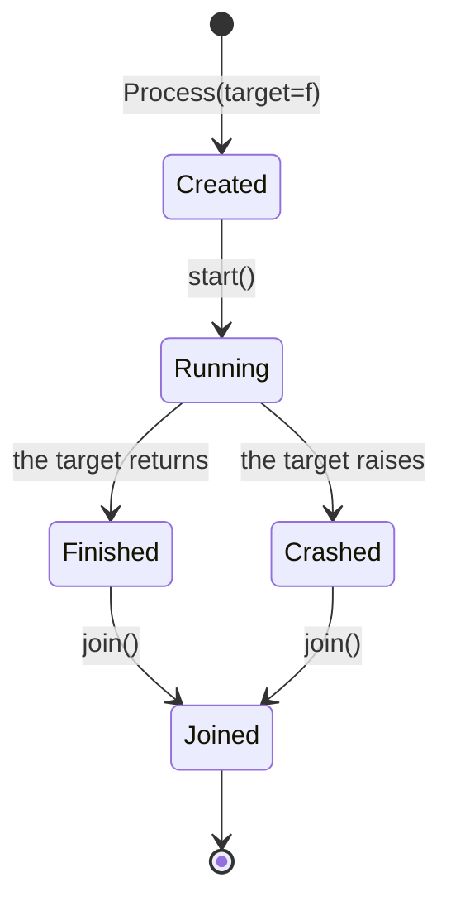

## Basic Process usage

```python title="basic_process.py" showLineNumbers{1}
from multiprocessing import Process


def work(name: str) -> None:
    print("Working in process:", name)


if __name__ == "__main__":
    p = Process(target=work, args=("p1",))
    p.start()
    p.join()
    print("Main process finished")
```

## Why join() matters

`join()` waits for the process to finish.

Without it:

- your program might exit early
- you might read results before they are ready

import DataCampExercise from "../../../../components/DataCampExercise.astro";
import Quiz from "../../../../components/Quiz.astro";

## The four states of a Process object

A `Process` object exists before the operating system process does, and outlives it.
Which attributes are readable depends on where you are in that lifecycle:



Measured on CPython 3.14.4, start method **spawn**, 8 logical CPUs:

| stage | `is_alive()` | `pid` | `exitcode` |
|:--|:--|:--|:--|
| after `Process(...)` | `False` | `None` | `None` |
| after `start()` | `True` | `1952` | `None` |
| after `join()` | `False` | `1952` | `0` |
| child raised | `False` | set | **`1`** |

Three things follow that catch people out:

- `pid` is `None` until `start()`. There is no operating system process to have an id.
- `exitcode` is `None` while the child runs. `None` means *still running*, not *fine*.
- A child that raises prints its traceback and exits with **1**. The parent carries on
  as if nothing happened — **you only find out by checking `exitcode`**.

```python title="lifecycle.py" showLineNumbers{1}
import multiprocessing as mp

def boom():
    raise ValueError("child failed")

if __name__ == "__main__":
    p = mp.Process(target=boom)
    p.start()
    p.join()
    print(p.exitcode)          # 1   <- the parent survived; nothing was raised here
    if p.exitcode != 0:
        raise RuntimeError("child failed, see traceback above")
```

:::danger[A failed child is silent unless you look]
`join()` does not re-raise the child's exception. A pipeline that starts ten workers and
joins them all finishes "successfully" even if every one of them died. Check `exitcode`
on each, or use `concurrent.futures`, whose `result()` does re-raise.
:::

## See it move

Start the workers one way or the other and watch the clock. This is the single most
common multiprocessing bug, and it is a bug of **ordering**, not of syntax.

```p5 title="start-then-join, or start-and-join" desc="Calling join() inside the same loop as start() waits for each child before launching the next, which runs them one at a time." height="330"
let mode = 0;          // 0 = start(); join()  in one loop   1 = start all, then join all
let t = 0;
let running = false;
const N = 4;
const DUR = 100;       // frames of work per child

function setup() {
  createCanvas(600, 330);
  textFont("monospace");
}

function childWindow(i) {
  // returns [startFrame, endFrame] for child i under the current mode
  if (mode === 0) return [i * DUR, (i + 1) * DUR];
  return [0, DUR];
}

function draw() {
  background(13, 17, 23);
  const total = mode === 0 ? N * DUR : DUR;
  if (running) {
    t++;
    if (t > total + 30) { t = 0; }
  }

  noStroke();
  fill(230);
  textSize(13);
  textAlign(LEFT, TOP);
  text(mode === 0 ? "for p in ps:  p.start(); p.join()" : "for p in ps: p.start()   then   for p in ps: p.join()", 24, 20);
  fill(mode === 0 ? color(232, 110, 110) : color(120, 190, 130));
  textSize(11);
  text(mode === 0 ? "join() inside the loop -> each child finishes before the next begins"
                  : "all children launched first -> they overlap", 24, 40);

  for (let i = 0; i < N; i++) {
    const y = 76 + i * 44;
    const w = childWindow(i);
    const active = t >= w[0] && t < w[1];
    const done = t >= w[1];
    const frac = constrain((t - w[0]) / DUR, 0, 1);

    fill(150);
    textSize(11);
    textAlign(LEFT, CENTER);
    noStroke();
    text("child " + i, 24, y + 13);

    stroke(48, 56, 68);
    strokeWeight(1);
    fill(18, 23, 30);
    rect(100, y, 380, 26, 4);
    noStroke();
    fill(done ? color(120, 190, 130) : (active ? color(75, 139, 190) : color(40, 48, 58)));
    rect(101, y + 1, frac * 378, 24, 3);

    textAlign(LEFT, CENTER);
    textSize(11);
    if (done) { fill(120, 190, 130); text("joined", 492, y + 13); }
    else if (active) { fill(75, 139, 190); text("running", 492, y + 13); }
    else { fill(90); text("not started", 492, y + 13); }
  }

  stroke(60, 70, 84);
  strokeWeight(1);
  line(100, 262, 480, 262);
  noStroke();
  fill(255, 211, 67);
  const tx = 100 + constrain(t / total, 0, 1) * 380;
  rect(tx - 1, 254, 2, 16);
  fill(120);
  textSize(10);
  textAlign(LEFT, TOP);
  text("elapsed", 100, 272);
  fill(210);
  textAlign(RIGHT, TOP);
  text(mode === 0 ? "measured 2.82 s" : "measured 0.74 s", 480, 272);

  drawBtn(24, 296, 210, mode === 0 ? "mode: join inside loop" : "mode: join after loop");
  drawBtn(246, 296, 110, running ? "pause" : "play");
}

function drawBtn(x, y, w, label) {
  const hot = mouseX > x && mouseX < x + w && mouseY > y && mouseY < y + 24;
  stroke(hot ? color(255, 211, 67) : color(60, 70, 84));
  strokeWeight(1);
  fill(hot ? color(34, 40, 50) : color(22, 28, 36));
  rect(x, y, w, 24, 4);
  noStroke();
  fill(hot ? color(255, 211, 67) : 200);
  textSize(11);
  textAlign(CENTER, CENTER);
  text(label, x + w / 2, y + 12);
}

function mousePressed() {
  if (mouseY < 296 || mouseY > 320) return;
  if (mouseX > 24 && mouseX < 234) { mode = 1 - mode; t = 0; }
  if (mouseX > 246 && mouseX < 356) { running = !running; }
}
```

Four children, each sleeping 0.5 s, measured on this machine:

```python title="join_order.py" showLineNumbers{1}
ps = [mp.Process(target=slow, args=(0.5,)) for _ in range(4)]
for p in ps:
    p.start()
    p.join()            # 2.82 s  <- waits for each child before starting the next

ps = [mp.Process(target=slow, args=(0.5,)) for _ in range(4)]
for p in ps: p.start()  # launch everything first
for p in ps: p.join()   # 0.74 s  <- then collect
```

The first loop is not parallel at all. It is a sequential program that pays the cost of
starting four processes for nothing.

## The child does not inherit your variables

Under **spawn** — the default on Windows and macOS — the child starts a fresh
interpreter and **re-imports your module**. It does not get a copy of the parent's
current state; it gets whatever the module defines at import time.

```python title="not_inherited.py" showLineNumbers{1}
import multiprocessing as mp

counter = 0                      # module level: the child WILL see this

def bump():
    global counter
    counter += 100
    print("child sees", counter)  # child sees 100   <- started from 0, not 5

if __name__ == "__main__":
    counter = 5                   # inside the guard: the child never runs this
    p = mp.Process(target=bump)
    p.start(); p.join()
    print("parent", counter)      # parent 5   <- untouched
```

The child printed **100**, not 105. It re-imported the module, saw `counter = 0`, and
added 100 to its own copy. The parent's `5` was never visible to it, and the child's
`100` was never visible back. Two separate memory spaces.

:::danger[`if __name__ == "__main__":` is not boilerplate]
Because spawn re-imports the module, any code that creates processes at import level
runs again in every child — which creates more children, which re-import again. Without
the guard you get a `RuntimeError` at best and a fork bomb at worst.
:::

## Check yourself

<Quiz
  questions={[
    {
      q: "You call p = mp.Process(target=f). Before p.start(), what are p.pid and p.exitcode?",
      options: [
        "both 0, since the process is created but idle",
        "both None, because no operating system process exists yet",
        "pid is set, exitcode is None",
        "it raises AttributeError until start() is called",
      ],
      answer: 1,
      explain:
        "The Process object is just a description until start() creates the real process. Measured: pid None and exitcode None before start, pid 1952 and exitcode None while running, exitcode 0 after join.",
    },
    {
      q: "A child process raises ValueError. What happens in the parent after p.join()?",
      options: [
        "the parent re-raises ValueError at the join() call",
        "the parent exits with the same error code automatically",
        "nothing is raised; the parent continues and p.exitcode is 1",
        "join() returns the exception object",
      ],
      answer: 2,
      explain:
        "The child prints its traceback and exits with code 1. join() does not re-raise, so a parent that never checks exitcode treats a dead worker as a successful one.",
    },
    {
      q: "Why does 'for p in ps: p.start(); p.join()' take 2.82 s for four 0.5 s children, while starting all then joining all takes 0.74 s?",
      options: [
        "join() is slow and adds fixed overhead per call",
        "calling join() inside the loop waits for each child to finish before the next is started, so nothing overlaps",
        "the first version creates four times as many processes",
        "the operating system throttles rapid process creation",
      ],
      answer: 1,
      explain:
        "join() blocks until that child exits. Putting it in the same loop as start() serializes the work while still paying process-creation cost — the worst of both approaches.",
    },
    {
      q: "counter = 0 at module level; inside the __main__ guard you set counter = 5; the child adds 100 and prints. Under spawn, what does the child print?",
      options: [
        "105",
        "100",
        "5",
        "0",
      ],
      answer: 1,
      explain:
        "Spawn starts a fresh interpreter that re-imports the module, so the child sees counter = 0 from module level. Code inside the __main__ guard never runs in the child, so the 5 is invisible to it.",
    },
  ]}
/>

## 🧪 Try It Yourself

### Exercise 1 – Start a Process

<DataCampExercise
  lang="python"
  hint={`Use \`multiprocessing.Process(target=fn)\` and call \`.start()\`.`}
  code={`# Task: Exercise 1 – Start a Process
from multiprocessing import Process

def greet(name):
    print(f"Hello from {name}")

if __name__ == "__main__":
    # Hint: create a Process with target=greet and args=("worker",)
    p = Process(target=greet, args=(___, ))   # replace ___ with "worker"
    p.___()                                    # replace ___ with start
    p.___()                                    # replace ___ with join

# ── Expected Output ───────────────────────────────────────────
# Hello from worker
# ──────────────────────────────────────────────────────────────`}
  solution={`from multiprocessing import Process

def greet(name):
    print(f"Hello from {name}")

if __name__ == "__main__":
    p = Process(target=greet, args=("worker",))
    p.start()
    p.join()`}
  sct={`test_output_contains("Hello from worker")
success_msg("Process created and joined!")`}
  height={150}
/>

### Exercise 2 – Process Pool map()

<DataCampExercise
  lang="python"
  hint={`Use \`Pool.map(fn, iterable)\` to apply a function across multiple processes.`}
  code={`# Task: Exercise 2 – Process Pool map()
from multiprocessing import Pool

def square(n):
    return n * n

if __name__ == "__main__":
    # Hint: create a Pool with 2 workers
    with Pool(___) as p:            # replace ___ with 2
        results = p.___(square, [1, 2, 3, 4])  # replace ___ with map
        print(results)

# ── Expected Output ───────────────────────────────────────────
# [1, 4, 9, 16]
# ──────────────────────────────────────────────────────────────`}
  solution={`from multiprocessing import Pool

def square(n):
    return n * n

if __name__ == "__main__":
    with Pool(2) as p:
        results = p.map(square, [1, 2, 3, 4])
        print(results)`}
  sct={`test_output_contains("[1, 4, 9, 16]")
success_msg("Pool.map runs tasks in parallel!")`}
  height={145}
/>

### Exercise 3 – Multiprocessing Queue

<DataCampExercise
  lang="python"
  hint={`Use \`multiprocessing.Queue\` with \`.put()\` and \`.get()\` to share data.`}
  code={`# Task: Exercise 3 – Multiprocessing Queue
from multiprocessing import Process, Queue

def worker(q, value):
    q.___(value * 2)    # replace ___ with put

if __name__ == "__main__":
    q = Queue()
    p = Process(target=worker, args=(q, 21))
    p.start(); p.join()
    print("Result:", q.___())   # replace ___ with get

# ── Expected Output ───────────────────────────────────────────
# Result: 42
# ──────────────────────────────────────────────────────────────`}
  solution={`from multiprocessing import Process, Queue

def worker(q, value):
    q.put(value * 2)

if __name__ == "__main__":
    q = Queue()
    p = Process(target=worker, args=(q, 21))
    p.start(); p.join()
    print("Result:", q.get())`}
  sct={`test_output_contains("Result: 42")
success_msg("Queue passes data between processes!")`}
  height={148}
/>

